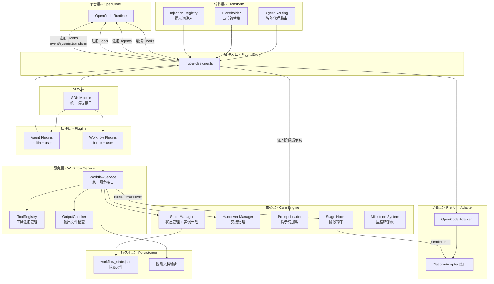
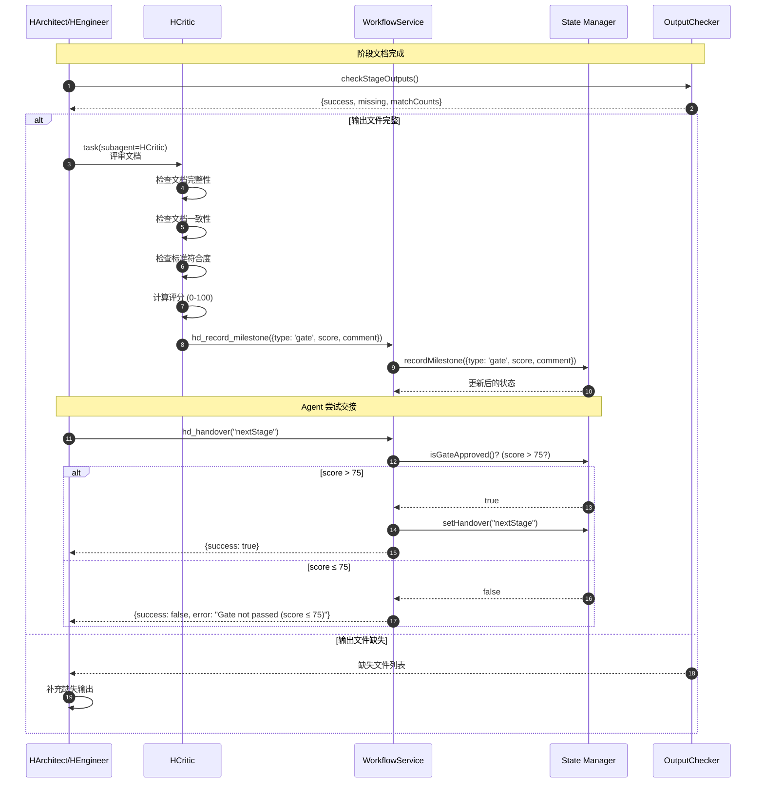
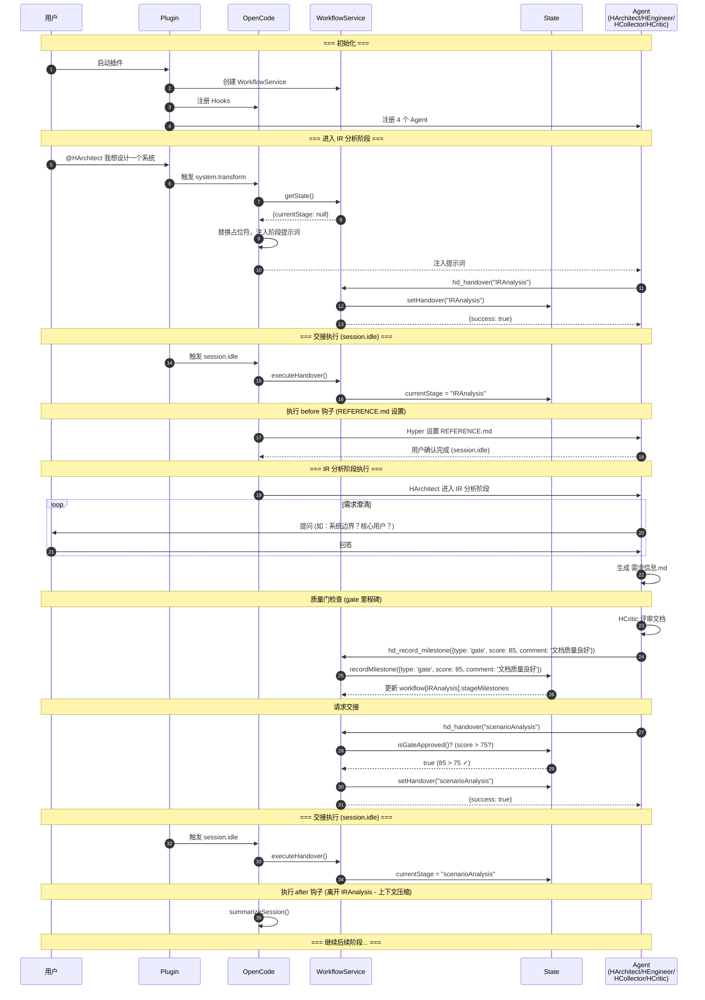
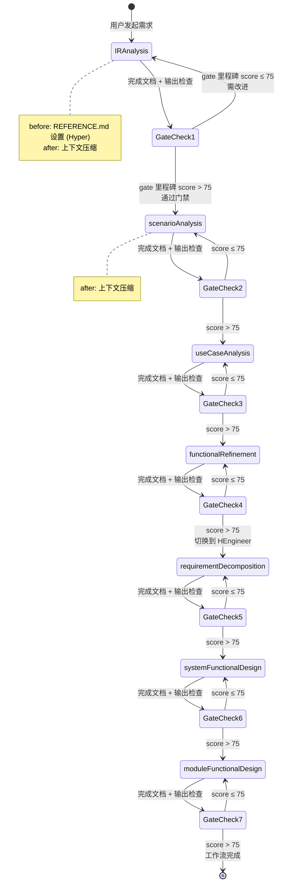

# Hyper Designer 技术实现方案

## 1. 插件概述

### 1.1 核心目标

Hyper Designer 是一个 OpenCode 插件，通过专业化 AI Agent 协作和标准化工作流，实现从需求工程到系统设计的全流程智能化。

**核心价值：**

- **插件化架构**：Agent 和工作流均支持插件扩展，用户可自定义
- **工作流标准化**：支持 Classic（8 阶段）、Lite Designer（3 阶段）、Project Analysis（3 阶段）三种工作流
- **AI 能力专业化**：每个阶段通过 Skill 注入专属方法论
- **输出件规范化**：每个阶段产出结构化设计文档
- **Agent 专业协作**：6 个专业化 Agent 各司其职、无缝协作
- **质量门禁**：Classic 和 Lite 工作流每个阶段完成后自动质量评审（score > 75）
- **智能路由**：Hyper 路由代理自动将用户请求路由到正确的专业代理

### 1.2 六大核心 Agent

| Agent | Mode | 角色 | 职责范围 | 协作方式 |
|-------|------|------|---------|---------|
| **Hyper** | primary | 路由代理 | 智能路由用户请求；工作流未初始化时直接处理简单请求 | 统一入口 |
| **HCollector** | all | 需求收集专家 | 数据收集、用户访谈、参考资料整理 | 接受 HArchitect 委派 |
| **HArchitect** | primary | 系统架构师 | IR分析 → 场景分析 → 用例分析 → 功能细化 | 主流程协调员 |
| **HEngineer** | primary | 系统工程师 | 需求分解 → 系统设计 → 模块设计 → SDD计划 | 接收 HArchitect 交接 |
| **HCritic** | subagent | 设计评审员 | 阶段文档质量审查、一致性检查 | 被动触发，只读审查 |
| **HAnalysis** | primary | 项目分析专家 | 系统分析 → 组件分析 → 缺漏检查 | projectAnalysis 工作流专用 |
### 1.3 工作流类型

#### Classic 工作流（8 阶段）

| 阶段 | Agent | 输入 | 输出 | 质量门 |
|------|-------|------|------|--------|
| 1. **初始需求分析** | HArchitect | 参考资料 | `.hyper-designer/IRAnalysis/需求信息.md` | ✅ (score > 75) |
| 2. **场景分析** | HArchitect | `需求信息.md` | `.hyper-designer/scenarioAnalysis/*场景.md` | ✅ (score > 75) |
| 3. **用例分析** | HArchitect | `*场景.md` | `.hyper-designer/useCaseAnalysis/*用例.md` | ✅ (score > 75) |
| 4. **功能细化** | HArchitect | `需求信息.md` + `*用例.md` | `.hyper-designer/functionalRefinement/*功能列表.md` + `*FMEA.md` | ✅ (score > 75) |
| 5. **需求分解** | HEngineer | `需求信息.md` + `*功能列表.md` | `.hyper-designer/requirementDecomposition/sr-ar-decomposition.md` | ✅ (score > 75) |
| 6. **系统功能设计** | HEngineer | `需求信息.md` + `sr-ar-decomposition.md` | `.hyper-designer/systemFunctionalDesign/system-design.md` | ✅ (score > 75) |
| 7. **模块功能设计** | HEngineer | `system-design.md` + `sr-ar-decomposition.md` | `.hyper-designer/moduleFunctionalDesign/*设计.md` | ✅ (score > 75) |
| 8. **SDD 开发计划生成** | HEngineer | `system-design.md` + `sr-ar-decomposition.md` | `./dev-plan/*-dev-plan.md` | ✅ (score > 75) |

#### Lite Designer 工作流（3 阶段）

| 阶段 | Agent | 输入 | 输出 | 质量门 |
|------|-------|------|------|--------|
| 1. **需求场景分析** | HArchitect | 参考资料 | `.hyper-designer/requirementAnalysis/需求分析说明书.md` | ✅ (score > 75) |
| 2. **需求设计** | HEngineer | `需求分析说明书.md` | `.hyper-designer/requirementDesign/需求设计说明书.md` | ✅ (score > 75) |
| 3. **开发计划** | HEngineer | `需求设计说明书.md` | `.hyper-designer/developmentPlan/开发计划.md` | ✅ (score > 75) |

**适用场景**：中小规模功能增强需求，快速产出结构化文档和开发计划。

#### Project Analysis 工作流（3 阶段）

| 阶段 | Agent | 输入 | 输出 | 质量门 |
|------|-------|------|------|--------|
| 1. **系统分析** | HAnalysis | 目标项目路径 | `architecture.md` + `_meta/*` | ❌ |
| 2. **组件分析** | HAnalysis | `_meta/component-manifest.json` | `component/*.md` + `_meta/components/*` | ❌ |
| 3. **缺漏检查** | HAnalysis | 所有分析产物 | `coverage-report.md` + `_meta/coverage-report.json` | ❌ |

**特点**：无质量门禁，纯诊断型工作流。
---

## 2. 核心概念模型

### 2.1 四大核心机制

Hyper Designer 的核心由四大机制构成，它们协同工作实现完整的工作流管理：

```
┌─────────────────────────────────────────────────────────────────┐
│                     Hyper Designer 核心架构                      │
├─────────────────────────────────────────────────────────────────┤
│                                                                 │
│  ┌──────────────┐    ┌──────────────┐    ┌──────────────┐     │
│  │   Plugin     │    │  Workflow    │    │    Gate      │     │
│  │   插件系统    │◄──►│   工作流引擎  │◄──►│   质量门禁    │     │
│  └──────────────┘    └──────────────┘    └──────────────┘     │
│         │                   │                   │              │
│         │                   │                   │              │
│         ▼                   ▼                   ▼              │
│  ┌──────────────────────────────────────────────────────┐     │
│  │              Stage Hooks (阶段钩子)                    │     │
│  │  before: 进入阶段前执行（如：资料收集、REFERENCE.md）   │     │
│  │  after:  离开阶段后执行（如：上下文压缩）               │     │
│  └──────────────────────────────────────────────────────┘     │
│                                                                 │
└─────────────────────────────────────────────────────────────────┘
```

**机制说明：**

1. **Plugin 插件系统**：Agent 和工作流均支持插件扩展，用户可自定义代理和工作流
2. **Workflow 工作流引擎**：管理阶段流转、状态持久化、交接验证、输出检查
3. **Gate 质量门禁**：确保 Classic 和 Lite 工作流每个阶段的输出质量达到标准（score > 75）
4. **Stage Hooks 阶段钩子**：在阶段边界执行自动化任务（资料收集、上下文压缩）

### 2.2 插件架构

Hyper Designer 采用插件化架构，分为两层：

```
┌─────────────────────────────────────────────────────────────────┐
│                       插件系统架构                                │
├─────────────────────────────────────────────────────────────────┤
│                                                                 │
│  ┌─────────────────────────────────────────────────────────┐   │
│  │                    SDK Layer                             │   │
│  │  agent.register()  workflow.register()  createAgent()   │   │
│  └─────────────────────────────────────────────────────────┘   │
│                              │                                  │
│                              ▼                                  │
│  ┌─────────────────────────────────────────────────────────┐   │
│  │                  Plugin Registry                         │   │
│  │  Agent Plugins: Map<name, AgentPluginFactory>            │   │
│  │  Workflow Plugins: Map<id, WorkflowPluginFactory>        │   │
│  └─────────────────────────────────────────────────────────┘   │
│                              │                                  │
│           ┌──────────────────┴──────────────────┐              │
│           ▼                                      ▼              │
│  ┌──────────────────┐                ┌──────────────────┐      │
│  │  Builtin Plugins │                │  User Plugins    │      │
│  │  - HArchitect    │                │  - UserAgent     │      │
│  │  - HEngineer     │                │  - UserWorkflow  │      │
│  │  - HCollector    │                │                  │      │
│  │  - HCritic       │                │                  │      │
│  │  - HAnalysis     │                │                  │      │
│  │  - Classic       │                │                  │      │
│  │  - Lite          │                │                  │      │
│  │  - ProjectAnalysis│               │                  │      │
│  └──────────────────┘                └──────────────────┘      │
│                                                                 │
└─────────────────────────────────────────────────────────────────┘
```

**注册流程：**
1. `bootstrap.ts` 在首次访问时注册所有内置插件
2. 用户插件通过 `sdk.agent.plugins.register()` 或 `sdk.workflow.plugins.register()` 注册
3. 插件注册表维护 `Map<string, Factory>` 结构

### 2.3 数据流向图

```
用户需求
    │
    ▼
┌─────────────────┐
│  Hyper          │ ◄─── 路由代理：识别意图，路由到正确代理
│  (Router)       │
└────────┬────────┘
         │ hd_workflow_select("classic")
         ▼
┌─────────────────┐
│  HArchitect     │ ◄─── before: REFERENCE.md 设置
│  (IR Analysis)  │
└────────┬────────┘
         │ hd_record_milestone({type: 'gate', score: 85, comment: '文档质量良好'})
         ▼
    [Gate Check: score > 75? ✓]
         │
         ▼ hd_handover("scenarioAnalysis")
┌─────────────────┐
│  HArchitect     │ ◄─── after: 上下文压缩
│  (Scenario)     │
└────────┬────────┘
         │
         ▼
    [Gate Check] ──► ... ──► [HArchitect 阶段完成]
         │
         ▼ hd_handover("requirementDecomposition")
┌─────────────────┐
│  HEngineer      │ ◄─── Agent 切换
│  (SR-AR)        │
└────────┬────────┘
         │
         ▼
    ... 继续后续阶段 ...
```

---

## 3. 技术架构

### 3.1 分层架构图



### 3.2 核心模块职责

| 模块 | 文件路径 | 职责 |
|------|---------|------|
| **WorkflowService** | `src/workflows/core/service/WorkflowService.ts` | 统一服务接口，封装状态操作，实例计划管理，交接执行 |
| **State Manager** | `src/workflows/core/state/` | 工作流状态管理、持久化、实例计划、运行时状态、历史记录 |
| **Handover Manager** | `src/workflows/core/runtime/handover.ts` | 交接代理获取、交接提示词生成、里程碑验证 |
| **Prompt Loader** | `src/workflows/core/runtime/promptLoader.ts` | 工作流/阶段提示词加载 |
| **Stage Hooks** | `src/workflows/core/stageHooks/` | before/after 钩子实现（summarizeHook, clearHook, hCollectorHook） |
| **Milestone System** | `src/workflows/core/stageMilestone/` | 里程碑类型定义、门禁阈值（score > 75）、里程碑记录 |
| **ToolRegistry** | `src/workflows/core/toolRegistry.ts` | 工具收集、过滤、转换、平台注册 |
| **OutputChecker** | `src/workflows/core/outputChecker.ts` | 阶段输出文件存在性检查（file/folder/pattern） |
| **Plugin Registry** | `src/plugins/` | Agent 和工作流插件注册、引导、检索 |
| **Transform** | `src/transform/` | Agent 路由、占位符替换、提示词注入、工具转换 |
| **SDK** | `src/sdk/index.ts` | 统一编程接口，封装 agent 和 workflow 插件操作 |
| **Platform Adapter** | `src/adapters/` | 平台无关接口，支持多平台扩展 |

---

## 4. 核心机制详解

### 4.1 Agent 代理系统

#### 4.1.1 Agent 插件架构

Agent 系统采用插件架构，分为两层：

1. **核心层** (`src/agents/`)：包含 Hyper 路由代理和共享类型/工厂
2. **插件层** (`src/plugins/agent/`)：包含 5 个内置专业代理和用户自定义代理

**注册流程：**
```typescript
// 1. 内置插件自动注册
BUILTIN_AGENT_PLUGINS = [
  { name: 'HCollector', factory: model => createHCollectorAgent(model) },
  { name: 'HArchitect', factory: model => createHArchitectAgent(model) },
  { name: 'HCritic', factory: model => createHCriticAgent(model) },
  { name: 'HEngineer', factory: model => createHEngineerAgent(model) },
  { name: 'HAnalysis', factory: model => createHAnalysisAgent(model) },
]

// 2. 用户插件注册
sdk.agent.plugins.register('MyAgent', model => createMyAgent(model))

// 3. 创建所有代理
const agents = await sdk.agent.createAll(model)
```

#### 4.1.2 Hyper 路由代理

Hyper 是系统的统一入口代理，负责：
- **智能路由**：根据用户意图路由到正确的专业代理
- **直接处理**：工作流未初始化时直接处理简单请求
- **工作流选择**：引导用户选择工作流类型

**配置特点：**
- Mode: `primary`
- Temperature: `0.2`（低温度，确保路由准确性）
- 权限：允许 `hd_workflow_state/list/select`，禁止 `bash/webfetch/websearch`

#### 4.1.3 Agent 定义结构

```typescript
interface AgentDefinition {
  name: string                    // 代理名称
  description: string             // 代理描述
  mode: AgentMode                 // 运行模式: primary | subagent | all
  color?: string                  // UI 显示颜色
  defaultTemperature: number      // 默认温度
  defaultMaxTokens?: number       // 默认最大 token
  defaultVariant?: string         // 默认模型变体
  promptGenerators: PromptGenerator[]  // 提示词生成器数组
  defaultPermission?: Record<string, string>  // 默认权限
}
```

#### 4.1.4 Agent 提示词动态组合

每个 Agent 的提示词由多个部分动态组合而成：

```typescript
// HArchitect 的提示词组合示例
promptGenerators: [
  filePrompt("identity.md"),                                    // 1. 身份定义
  stringPrompt("{HYPER_DESIGNER_WORKFLOW_OVERVIEW_PROMPT}"),    // 2. 工作流概览（占位符）
  filePrompt("step.md"),                                        // 3. 步骤指导
  filePrompt("file.md"),                                        // 4. 文件操作规范
  filePrompt("interview.md"),                                   // 5. 访谈技巧
  filePrompt("constraints.md"),                                 // 6. 约束条件
  stringPrompt("{HYPER_DESIGNER_WORKFLOW_STEP_PROMPT}"),        // 7. 当前阶段提示词（占位符）
]
```

**占位符替换机制：**

- `{HYPER_DESIGNER_WORKFLOW_OVERVIEW_PROMPT}` → 工作流整体概览提示词
- `{HYPER_DESIGNER_WORKFLOW_STEP_PROMPT}` → 当前阶段的专属提示词
- `{HYPER_DESIGNER_WORKFLOW_FALLBACK_PROMPT}` → Hyper 代理的回退提示词

替换发生在 `system.transform` Hook 中，确保每次对话都注入正确的阶段上下文。

#### 4.1.5 Agent 权限矩阵

| Agent | edit | skill | task | hd_handover | hd_record_milestone | hd_force_next_step | hd_workflow_* |
|-------|------|-------|------|-------------|---------------------|-------------------|---------------|
| **Hyper** | ✅ | ✅ | ✅ | ✅ | ✅ | ❌ | ✅ (state/list/select) |
| **HArchitect** | ✅ | ✅ | ✅ | ✅ | ❌ | ⚠️ (ask) | ✅ (state only) |
| **HEngineer** | ✅ | ✅ | ✅ | ✅ | ❌ | ⚠️ (ask) | ✅ (state only) |
| **HCritic** | ❌ | ✅ | ❌ | ❌ | ✅ | ❌ | ✅ (state only) |
| **HCollector** | ✅ | ✅ | ✅ | ❌ | ❌ | ❌ | ✅ (state only) |
| **HAnalysis** | ✅ | ✅ | ✅ | ❌ | ❌ | ❌ | ✅ (state only) |

**说明：**
- ✅：允许
- ❌：禁止
- ⚠️ (ask)：需要用户确认

### 4.2 Workflow 工作流引擎

#### 4.2.1 工作流插件架构

工作流系统采用插件架构：

1. **内置插件** (`src/plugins/workflow/`)：Classic、Lite Designer、Project Analysis
2. **用户插件** (`src/plugins/workflow/user/`)：用户自定义工作流

**注册流程：**
```typescript
// 1. 内置插件自动注册
BUILTIN_WORKFLOW_PLUGINS = [
  { factory: () => classicWorkflow },
  { factory: () => projectAnalysisWorkflow },
  { factory: () => liteWorkflow },
]

// 2. 用户插件注册
sdk.workflow.plugins.register(() => myCustomWorkflow)

// 3. 获取工作流定义
const workflow = sdk.workflow.get('classic')
```

#### 4.2.2 工作流定义结构

```typescript
interface WorkflowDefinition {
  id: string                      // 工作流唯一标识
  name: string                    // 工作流名称
  description: string             // 工作流描述
  version?: string                // 版本号
  promptFile?: string             // 工作流级别提示词文件
  promptBindings?: WorkflowPromptBindings  // 占位符绑定
  promptTransform?: WorkflowPromptTransformConfig  // 提示词转换配置
  entryStageId: string            // 入口阶段 ID
  stages: Record<string, WorkflowStageDefinition>  // 阶段定义映射
  tools?: ToolDefinition[]        // 工作流提供的工具列表
}

interface WorkflowStageDefinition {
  stageId?: string                // 阶段唯一标识
  name: string                    // 阶段显示名称
  description: string             // 阶段描述
  agent: string                   // 负责该阶段的 Agent
  promptFile?: string             // 阶段专属提示词文件
  promptBindings?: WorkflowPromptBindings  // 阶段级占位符绑定
  inject?: InjectionConfig[]      // 提示词注入配置
  injectContent?: string[]        // 直接注入内容
  before?: WorkflowHookDefinition[]  // 进入阶段前执行的钩子
  after?: WorkflowHookDefinition[]   // 离开阶段后执行的钩子
  requiredMilestones?: (string | MilestoneDefinition)[]  // 交接所需里程碑
  required?: boolean              // 是否为必需阶段
  inputs?: StageFileItem[]        // 输入文件规范
  outputs?: StageFileItem[]       // 输出文件规范
  transitions?: StageTransitionDefinition[]  // 阶段转换定义
  getHandoverPrompt: (currentStageName, thisStageName) => string  // 生成交接提示词
}
```

#### 4.2.3 输入/输出规范

每个阶段可以定义 `inputs` 和 `outputs`，系统会在交接时检查输出文件是否存在：

```typescript
interface StageFileItem {
  id: string                      // 唯一标识
  path: string                    // 文件路径（支持 glob 模式）
  type: 'file' | 'folder' | 'pattern'  // 类型
  description: string             // 描述
  content?: string                // 内容（可选）
}
```

**检查逻辑：**
- `file`：检查文件是否存在
- `folder`：检查目录是否存在及条目数
- `pattern`：使用 glob 匹配文件数量

#### 4.2.4 阶段转换定义

```typescript
interface StageTransitionDefinition {
  id: string                      // 转换唯一标识
  toStageId: string               // 目标阶段 ID
  mode: 'auto' | 'manual'        // 自动或手动转换
  priority: number                // 优先级（用于多转换时的排序）
  description?: string            // 描述
}
```

**转换规则：**
- `mode: 'auto'`：满足条件后自动转换
- `mode: 'manual'`：需要手动触发
- 按 `priority` 排序，低优先级数字先执行

#### 4.2.5 工作流状态结构

```typescript
interface WorkflowState {
  initialized: boolean            // 是否已完成工作流选择初始化
  typeId: string | null           // 工作流类型 ID
  workflow: Record<string, WorkflowStage>  // 各阶段状态
  current: CurrentStageState | null;      // 当前活动阶段
  instance?: WorkflowInstanceState | null;  // 实例计划
  runtime?: WorkflowRuntimeState | null;   // 运行时状态
  history?: WorkflowHistoryState;          // 历史记录
}

interface WorkflowInstanceState {
  instanceId: string              // 实例唯一标识
  workflowId: string              // 工作流 ID
  workflowVersion: string         // 工作流版本
  selectedStageIds: string[]      // 选中的阶段 ID
  skippedStageIds: string[]       // 跳过的阶段 ID
  entryNodeId: string             // 入口节点 ID
  nodePlan: Record<string, WorkflowInstanceNodePlan>  // 节点计划
}

interface WorkflowRuntimeState {
  status: 'running' | 'completed' | 'failed'  // 运行状态
  flow: WorkflowFlowState                    // 流转状态
  currentNodeContext: WorkflowCurrentNodeContext | null  // 当前节点上下文
}

interface WorkflowHistoryState {
  events: WorkflowHistoryEvent[]  // 历史事件列表
}
```

#### 4.2.6 交接验证规则

```typescript
// 交接验证逻辑
function validateHandover(currentStage, targetStep, stageOrder) {
  const currentIndex = currentStage ? stageOrder.indexOf(currentStage) : -1
  const targetIndex = stageOrder.indexOf(targetStep)

  // 规则 1: 无当前步骤时，只能交接给第一个阶段
  if (currentIndex === -1) {
    return targetIndex === 0
  }

  // 规则 2: 只允许下一阶段或回退到之前阶段
  const isNextStep = targetIndex === currentIndex + 1
  const isBackwardStep = targetIndex <= currentIndex

  return isNextStep || isBackwardStep
}
```

### 4.3 Gate 质量门禁

#### 4.3.1 质量门工作流程



#### 4.3.2 质量门工具定义

```typescript
// hd_record_milestone - HArchitect/HEngineer/HCritic 可调用
{
  description: "Record a milestone for the current workflow stage",
  args: {
    type: 'gate' | 'completion' | 'checkpoint',  // 里程碑类型
    score?: number,      // 质量评分 (0-100), 仅 gate 类型
    comment?: string,    // 评语
    detail?: Record<string, unknown>  // 额外详情
  }
}

// hd_force_next_step - HArchitect/HEngineer 可调用（需用户确认）
{
  description: "Force transition to next selected stage (only when failureCount >= 3)",
  args: {
    step_name: string   // 目标阶段名称（必须是下一选中阶段）
  }
}

// hd_handover - HArchitect/HEngineer 可调用
{
  description: "Set the handover workflow step. Requires latest gate score > 75",
  args: {
    step_name: string   // 目标阶段名称
  }
}
```

#### 4.3.3 质量门评分标准

| 分数范围 | 等级 | 说明 |
|---------|------|------|
| 90-100 | 优秀 | 文档完整、一致、符合所有标准 |
| 75-89 | 合格 | 文档基本完整，可通过门禁 |
| 60-74 | 待改进 | 文档存在明显缺陷，需补充 |
| 0-59 | 不合格 | 文档严重缺失，需重做 |

**门禁阈值**：`GATE_PASS_THRESHOLD = 75`（score > 75 才能通过）

#### 4.3.4 强制推进机制

当连续 3 次交接失败时（`failureCount >= 3`），可以使用 `hd_force_next_step` 强制进入下一阶段：
- 必须是下一选中阶段（不能跳过）
- 重置失败计数
- 需要用户确认（`hd_force_next_step` 权限为 `ask`）

### 4.4 Stage Hooks 阶段钩子

#### 4.4.1 钩子类型与执行时机

```typescript
interface WorkflowHookDefinition {
  id?: string                     // 钩子唯一标识
  description?: string            // 描述
  fn: StageHookFn                 // 钩子函数
  agent?: string                  // 执行钩子的代理（可选，默认使用阶段代理）
}

type StageHookFn = (ctx: {
  stageKey: string                // 阶段 key
  stageName: string               // 阶段显示名称
  workflow: WorkflowDefinition
  nodeId?: string                 // 节点 ID
  setMilestone?: (input: { key: string; isCompleted: boolean; detail: unknown }) => void
  setInfo?: (patch: Record<string, unknown>) => void
  sessionID?: string
  adapter?: PlatformAdapter       // 平台适配器
}) => Promise<void>
```

**执行时机：**

| 钩子类型 | 执行时机 | 典型用途 |
|---------|---------|---------|
| `before` | 进入新阶段后、Agent 开始工作前 | REFERENCE.md 设置、资料收集 |
| `after` | 离开阶段后、状态更新完成后 | 上下文压缩、清理工作 |

#### 4.4.2 内置钩子实现

**Reference Setup Hook (before)**

```typescript
// 在 IR Analysis 阶段开始前设置 REFERENCE.md
// 由 Hyper 代理执行，阻塞直到用户确认
const referenceSetupHook: StageHookFn = async ({ sessionID, adapter }) => {
  // 创建 REFERENCE.md 模板
  // 等待用户填写并确认
  // 仅在首次进入时执行
}
```

**Summarize Hook (after)**

```typescript
// 在阶段结束后压缩上下文
const summarizeHook: StageHookFn = async ({ sessionID, adapter }) => {
  await adapter.summarizeSession(sessionID)
}
```

**Clear Hook (after)**

```typescript
// 在阶段结束后清理上下文
const clearHook: StageHookFn = async ({ sessionID, adapter }) => {
  await adapter.clearSession(sessionID)
}
```

**HCollector Hook (before)**

```typescript
// 在阶段开始前自动收集资料
function createHCollectorHook(options: { domains: CollectionDomain[] }): StageHookFn {
  return async ({ stageKey, sessionID, adapter }) => {
    // 检查资料是否已收集完成
    const completed = domains.every(d => existsSync(`.hyper-designer/document/${d}/completed`))
    
    if (!completed) {
      // 委派 HCollector 收集资料（最多重试 5 次）
      for (let i = 0; i < 5; i++) {
        await adapter.sendPrompt({
          sessionId: sessionID,
          agent: 'HCollector',
          text: '收集资料指令...'
        })
        // 检查是否完成
        if (domains.every(d => existsSync(`.hyper-designer/document/${d}/completed`))) {
          break
        }
      }
    }
  }
}
```

#### 4.4.3 Classic 工作流钩子配置

```typescript
stages: {
  IRAnalysis: {
    before: [{ 
      id: 'reference-setup', 
      description: 'Setup REFERENCE.md and wait for user confirmation',
      agent: 'Hyper',
      fn: referenceSetupHook 
    }],
    after: [{ 
      id: 'summarize-ir', 
      description: 'Summarize IR context',
      fn: summarizeHook 
    }],
    // 进入 IR 阶段前由 Hyper 设置 REFERENCE.md，离开后压缩上下文
  },
  
  scenarioAnalysis: {
    after: [{ 
      id: 'summarize-scenario', 
      description: 'Summarize scenario context',
      fn: summarizeHook 
    }],
    // 离开场景分析后压缩上下文
  },
  
  systemFunctionalDesign: {
    after: [{ 
      id: 'summarize-system-design', 
      description: 'Summarize system-design context',
      fn: summarizeHook 
    }],
    // 离开系统设计后压缩上下文
  },
}
```

---

## 5. 完整工作流程

### 5.1 端到端时序图



### 5.2 阶段流转状态图



---

## 6. 平台适配器模式

### 6.1 适配器接口定义

```typescript
interface PlatformAdapter {
  // 创建新会话
  createSession(title: string): Promise<string>
  
  // 发送提示词给指定 Agent
  sendPrompt(params: {
    sessionId: string
    agent: string
    text: string
    schema?: Record<string, unknown>
  }): Promise<{
    structuredOutput?: unknown
    text?: string
  }>
  
  // 删除会话
  deleteSession(sessionId: string): Promise<void>
  
  // 压缩会话上下文
  summarizeSession(sessionId: string): Promise<void>
}
```

### 6.2 OpenCode 适配器实现

```typescript
function createOpenCodeAdapter(ctx: PluginInput, config: HDConfig): PlatformAdapter {
  return {
    createSession: async (title) => {
      const result = await ctx.client.session.create({
        body: { title },
        query: { directory: ctx.directory }
      })
      return result.data.id
    },

    sendPrompt: async ({ sessionId, agent, text, schema }) => {
      const response = await ctx.client.session.prompt({
        path: { id: sessionId },
        body: {
          agent,
          parts: [{ type: 'text', text }],
          ...(schema && { format: { type: 'json_schema', schema } })
        }
      })
      return { structuredOutput: response.data?.info?.structured_output }
    },

    summarizeSession: async (sessionId) => {
      const model = await resolveDefaultModel(ctx, config)
      await ctx.client.session.summarize({
        path: { id: sessionId },
        body: { providerID: model.providerID, modelID: model.modelID }
      })
    }
  }
}
```

### 6.3 扩展到其他平台

通过实现 `PlatformAdapter` 接口，可以将 Hyper Designer 移植到其他 AI 平台：

```
PlatformAdapter (接口)
    │
    ├── OpenCode Adapter (已实现)
    │
    ├── Claude Code Adapter (未来)
    │
    └── 其他平台 Adapter (未来)
```

---

## 7. 工具系统

### 7.1 工具定义

Hyper Designer 使用平台无关的工具定义系统：

```typescript
interface ToolDefinition {
  name: string                    // 工具名称（hd_<plugin>_<action>）
  description: string             // 工具描述
  params: ToolParamsSchema        // 参数 schema
  execute: (params, ctx) => Promise<string>  // 执行函数
  scope?: 'global' | 'workflow' | 'stage'  // 作用域
  stages?: string[]               // scope='stage' 时的可用阶段
}

interface ToolContext {
  workflowId: string              // 当前工作流 ID
  currentStage: string | null     // 当前阶段 key
  state: Record<string, unknown> | null  // 工作流状态快照
  adapter?: PlatformAdapter       // 平台适配器
}
```

### 7.2 工具注册管理

**ToolRegistry** 负责工具的收集、过滤、转换和平台注册：

```typescript
const registry = new ToolRegistry()

// 从工作流定义收集工具
registry.collectFromWorkflow(workflowDefinition)

// 获取当前可用工具（基于 scope 过滤）
const tools = registry.getAvailableTools(currentStage)

// 转换为平台注册格式
const registrations = registry.toRegistrations(tools, context)

// 注册到平台
registry.registerToPlatform(adapter, registrations)
```

**作用域规则：**
- `global`：始终可用（默认）
- `workflow`：工作流激活时可用
- `stage`：仅在指定阶段可用

### 7.3 内置工具

| 工具名称 | 权限 | 作用域 | 描述 |
|---------|------|--------|------|
| `hd_workflow_state` | 所有 Agent | global | 获取当前工作流状态 |
| `hd_workflow_list` | Hyper | global | 列出可用工作流 |
| `hd_workflow_select` | Hyper | global | 选择并初始化工作流 |
| `hd_handover` | HArchitect, HEngineer | workflow | 设置交接目标（需通过质量门） |
| `hd_record_milestone` | HArchitect, HEngineer, HCritic | workflow | 记录阶段里程碑 |
| `hd_force_next_step` | HArchitect, HEngineer (需确认) | workflow | 强制进入下一阶段（仅当 failureCount >= 3） |

### 7.4 工具调用流程

```typescript
// hd_handover 工具实现
async execute(params: { step_name: string }, ctx: ToolContext) {
  // 1. 检查 gate 里程碑是否通过（gate 是 requiredMilestones 中的里程碑标识）
  const isApproved = workflowService.isGateApproved()
  if (!isApproved) {
    // 增加失败计数
    workflowService.incrementFailureCount()
    return {
      success: false,
      error: "Gate milestone not passed. HCritic must approve with score > 75"
    }
  }
  
  // 2. 检查输出文件
  const outputCheck = await checkStageOutputs(currentStage.outputs)
  if (!outputCheck.success) {
    return {
      success: false,
      error: "Missing outputs: " + formatMissingOutputsMessage(outputCheck.missing, outputCheck.matchCounts)
    }
  }
  
  // 3. 设置交接目标
  const state = workflowService.setHandover(params.step_name)
  
  // 4. 返回结果
  return {
    success: true,
    handover_to: params.step_name,
    instruction: "STOP immediately. Handover will be processed on session.idle"
  }
}
```

---

## 8. 转换系统

### 8.1 Agent 路由

**AgentRouting** 负责将 Hyper 代理的请求路由到正确的专业代理：

```typescript
function resolveNodeConfig(inputAgent: string | undefined, state: WorkflowState | null): NodeRuntimeConfig | null {
  if (inputAgent !== 'Hyper') {
    return null  // 非 Hyper 代理，不进行路由
  }

  const currentNodeId = state?.runtime?.flow?.currentNodeId
  const nodePlan = state?.instance?.nodePlan

  // 从 nodePlan 获取当前节点配置
  if (currentNodeId && nodePlan) {
    const currentNode = nodePlan[currentNodeId]
    if (currentNode?.agent) {
      return {
        agent: currentNode.agent,
        model: currentNode.model,
        variant: currentNode.variant,
      }
    }
  }

  // 回退到 current.agent
  const fallbackAgent = state?.current?.agent
  if (fallbackAgent) {
    return { agent: fallbackAgent }
  }

  return null
}
```

### 8.2 占位符替换

**Placeholder** 系统负责在提示词中替换占位符：

```typescript
function replacePlaceholders(
  template: string,
  bindings: Record<string, string>
): string {
  let result = template
  for (const [placeholder, value] of Object.entries(bindings)) {
    result = result.replaceAll(placeholder, value)
  }
  return result
}
```

**工作流级别绑定：**
- `{HYPER_DESIGNER_WORKFLOW_OVERVIEW_PROMPT}` → 工作流整体概览

**阶段级别绑定：**
- `{HYPER_DESIGNER_WORKFLOW_STEP_PROMPT}` → 当前阶段专属提示词

### 8.3 提示词注入

**InjectionRegistry** 管理提示词注入提供者：

```typescript
interface PromptInjectionProvider {
  id: string
  inject(input: PromptInjectionRequest): string | null | Promise<string | null>
}

class PromptInjectionRegistry {
  private providers = new Map<string, PromptInjectionProvider>()

  register(provider: PromptInjectionProvider): void {
    this.providers.set(provider.id, provider)
  }

  async run(injectionConfigs: InjectionConfig[], input: PromptInjectionRequest): Promise<InjectionResult[]> {
    const results: InjectionResult[] = []
    for (const config of injectionConfigs) {
      const provider = this.providers.get(config.provider)
      if (!provider) continue
      const content = await provider.inject({ ...input, config })
      if (content && content.trim()) {
        results.push({ providerId: config.provider, content })
      }
    }
    return results
  }
}
```

**内置注入提供者：**
- `stage-milestones`：注入阶段里程碑状态
- `stage-inputs`：注入阶段输入文件列表
- `stage-outputs`：注入阶段输出文件列表
- `file-content`：注入指定文件内容（如 REFERENCE.md）

### 8.4 工具转换

**ToolTransform** 负责将 Hyper Designer 工具转换为平台特定格式：

```typescript
const HD_TOOL_PLACEHOLDERS = {
  hd_workflow_state: 'HD_WORKFLOW_STATE_TOOL',
  hd_workflow_list: 'HD_WORKFLOW_LIST_TOOL',
  hd_workflow_select: 'HD_WORKFLOW_SELECT_TOOL',
  hd_handover: 'HD_HANDOVER_TOOL',
  hd_record_milestone: 'HD_RECORD_MILESTONE_TOOL',
  hd_force_next_step: 'HD_FORCE_NEXT_STEP_TOOL',
}

function replaceToolPlaceholders(
  prompt: string,
  toolMapping: ToolNameMapping
): string {
  let result = prompt
  for (const [placeholder, toolDef] of Object.entries(toolMapping)) {
    result = result.replaceAll(placeholder, formatToolDefinition(toolDef))
  }
  return result
}
```

## 9. SDK 模块

### 9.1 SDK 接口

**SDK** 提供统一的编程接口，封装 agent 和 workflow 插件操作：

```typescript
interface SDK {
  agent: {
    createBuiltin: (model?: string) => Promise<Record<string, AgentConfig>>
    createAll: (model?: string) => Promise<Record<string, AgentConfig>>
    isBuiltin: (agentName: string | undefined) => boolean
    isPlugin: (agentName: string | undefined) => boolean
    isKnown: (agentName: string | undefined) => boolean
    plugins: {
      register: (name: string, factory: AgentPluginFactory) => void
      registerMany: (registrations: AgentPluginRegistration[]) => void
      list: () => string[]
      create: (model?: string) => Promise<Record<string, AgentConfig>>
      clear: () => void
    }
  }
  workflow: {
    get: (typeId: string) => WorkflowDefinition | null
    list: () => string[]
    plugins: {
      register: (factory: () => WorkflowDefinition) => void
      registerMany: (registrations: WorkflowPluginRegistration[]) => void
      list: () => string[]
      get: (typeId: string) => WorkflowDefinition | null
      clear: () => void
    }
  }
}
```

### 9.2 使用示例

```typescript
import { sdk } from './sdk'

// 列出可用工作流
const workflows = sdk.workflow.list()  // ['classic', 'lite-designer', 'projectAnalysis']

// 获取工作流定义
const classic = sdk.workflow.get('classic')

// 注册用户自定义 Agent
sdk.agent.plugins.register('MyAgent', model => ({
  name: 'MyAgent',
  description: 'Custom agent',
  mode: 'subagent',
  prompt: 'You are a custom agent.',
}))

// 注册用户自定义工作流
sdk.workflow.plugins.register(() => ({
  id: 'myWorkflow',
  name: 'My Workflow',
  description: 'Custom workflow',
  entryStageId: 'stage1',
  stages: { /* ... */ },
}))

// 创建所有代理
const agents = await sdk.agent.createAll('my-model')
```

### 8.1 配置层级

```
配置优先级（高 → 低）：
1. 代码中的 AgentDefinition 默认值
2. ~/.config/opencode/hyper-designer/hd-config.json (全局配置)
3. ./.hyper-designer/hd-config.json (项目配置)
4. 环境变量 (HD_PROJECT_CONFIG_PATH, HD_GLOBAL_CONFIG_PATH)
```

### 8.2 配置文件格式

```json
{
  "$schema": "https://raw.atomgit.com/u011501137/hyper-designer/raw/master/schemas/hd-config.schema.json",
  "workflow": "classic",
  "defaultModel": "provider/model-id",
  "agents": {
    "Hyper": {
      "temperature": 0.2
    },
    "HArchitect": {
      "temperature": 0.8,
      "maxTokens": 16000,
      "model": "provider/gpt-4",
      "variant": "gpt-4-turbo",
      "prompt_append": "额外提示词内容"
    },
    "HEngineer": {
      "temperature": 0.3
    }
  }
}
```

### 8.3 默认温度配置

| Agent | 默认温度 | 理由 |
|-------|---------|------|
| Hyper | 0.2 | 极低温度，确保路由准确性 |
| HCollector | 0.3 | 较低温度，确保需求收集的准确性和一致性 |
| HArchitect | 0.6 | 较高温度，鼓励架构设计的创造性和多样性 |
| HCritic | 0.1 | 极低温度，确保评审的严格性和一致性 |
| HEngineer | 0.4 | 中等温度，平衡技术设计的严谨性和创造性 |
| HAnalysis | 0.4 | 中等温度，平衡分析的严谨性和洞察力 |

---

## 9. 扩展指南

### 9.1 添加新工作流（推荐方式）

使用 SDK 注册用户自定义工作流：

```typescript
import { sdk } from './sdk'

sdk.workflow.plugins.register(() => ({
  id: 'myCustomWorkflow',
  name: 'My Custom Workflow',
  description: 'Custom workflow for specific needs',
  entryStageId: 'stage1',
  stages: {
    stage1: {
      stageId: 'stage1',
      name: 'Stage 1',
      description: 'First stage',
      agent: 'HArchitect',
      getHandoverPrompt: (currentName, thisName) => `Switch to ${thisName}`,
      transitions: [{ id: 'to-stage2', toStageId: 'stage2', mode: 'auto', priority: 0 }],
    },
    stage2: {
      stageId: 'stage2',
      name: 'Stage 2',
      description: 'Second stage',
      agent: 'HEngineer',
      getHandoverPrompt: (currentName, thisName) => `Switch to ${thisName}`,
      transitions: [],
    },
  },
}))
```

### 9.2 添加新 Agent（推荐方式）

使用 SDK 注册用户自定义 Agent：

```typescript
import { sdk } from './sdk'

sdk.agent.plugins.register('MyCustomAgent', model => ({
  name: 'MyCustomAgent',
  description: 'Custom agent for specific tasks',
  mode: 'subagent',
  temperature: 0.3,
  prompt: 'You are a custom agent specialized in...',
}))
```

### 9.3 添加新阶段钩子

1. 在 `src/workflows/core/stageHooks/` 创建新钩子文件
2. 实现 `StageHookFn` 接口
3. 在 `src/workflows/core/stageHooks/index.ts` 中导出
4. 在工作流定义中配置 `before` 或 `after`

```typescript
import type { StageHookFn } from '../types'

export const myCustomHook: StageHookFn = async ({ stageKey, sessionID, adapter }) => {
  // 自定义钩子逻辑
}

// 在工作流定义中使用
stages: {
  myStage: {
    before: [{ id: 'my-hook', fn: myCustomHook }],
    // ...
  },
}
```

### 9.4 添加新的提示词注入提供者

1. 在 `src/transform/injections/` 创建新提供者
2. 实现 `PromptInjectionProvider` 接口
3. 在 `src/transform/injections/factory.ts` 中注册

```typescript
import type { PromptInjectionProvider } from '../types'

export const myInjectionProvider: PromptInjectionProvider = {
  id: 'my-injection',
  inject: async (input) => {
    // 返回要注入的内容
    return 'Injected content'
  },
}
```

---

## 10. 关键技术亮点

### 10.1 插件化架构

Agent 和工作流均支持插件扩展，用户可通过 SDK 自定义代理和工作流，无需修改核心代码。

### 10.2 智能路由

Hyper 路由代理自动识别用户意图，将请求路由到正确的专业代理，提供统一的入口体验。

### 10.3 框架无关设计

核心业务逻辑与 AI 平台解耦，通过 `PlatformAdapter` 接口支持多平台扩展。

### 10.4 动态提示组合

Agent 提示词由多个部分动态组合，支持运行时占位符替换和提示词注入，实现阶段上下文注入。

### 10.5 事件驱动交接

通过 `session.idle` 事件触发交接，确保 Agent 完成当前工作后再切换。

### 10.6 质量门禁机制

Classic 和 Lite 工作流的每个阶段必须通过质量评审（score > 75）才能进入下一阶段，确保输出质量。支持输出文件检查和强制推进机制。

### 10.7 平台无关工具系统

工具定义使用 JSON Schema 描述参数，执行函数接收统一的 `ToolContext`，支持作用域控制（global/workflow/stage）。

### 10.8 提示词注入系统

通过 `PromptInjectionRegistry` 实现动态内容注入，支持阶段里程碑、输入/输出文件列表、文件内容等多种注入类型。

---

## 11. 文件结构总览

```
src/
├── adapters/                    # 平台适配器
│   ├── types.ts                 # PlatformAdapter 接口定义
│   └── opencode/                # OpenCode 平台实现
│       ├── adapter.ts           # 适配器实现
│       ├── modelResolver.ts     # 模型解析
│       └── index.ts
│
├── agents/                      # 核心 Agent 系统
│   ├── types.ts                 # Agent 类型定义
│   ├── factory.ts               # Agent 工厂
│   ├── utils.ts                 # Agent 工具函数
│   └── Hyper/                   # 路由代理（统一入口）
│       ├── index.ts
│       └── prompt.md
│
├── plugins/                     # 插件系统
│   ├── agent/                   # Agent 插件
│   │   ├── types.ts             # 插件类型定义
│   │   ├── registry.ts          # 插件注册表
│   │   ├── bootstrap.ts         # 插件引导
│   │   ├── builtin/             # 内置 Agent 定义
│   │   │   ├── index.ts
│   │   │   ├── HArchitect/
│   │   │   ├── HEngineer/
│   │   │   ├── HCollector/
│   │   │   ├── HCritic/
│   │   │   └── HAnalysis/
│   │   └── user/                # 用户自定义 Agent
│   │       └── index.ts
│   │
│   └── workflow/                # 工作流插件
│       ├── types.ts             # 插件类型定义
│       ├── registry.ts          # 插件注册表
│       ├── bootstrap.ts         # 插件引导
│       ├── builtin/             # 内置工作流定义
│       │   ├── index.ts
│       │   ├── classic/         # 经典工作流（8 阶段）
│       │   ├── lite/            # 轻量级工作流（3 阶段）
│       │   └── projectAnalysis/ # 项目分析工作流（3 阶段）
│       └── user/                # 用户自定义工作流
│           └── index.ts
│
├── workflows/                   # 工作流引擎核心
│   ├── core/                    # 核心逻辑
│   │   ├── types.ts             # 类型定义
│   │   ├── toolTypes.ts         # 工具类型定义
│   │   ├── toolRegistry.ts      # 工具注册管理
│   │   ├── outputChecker.ts     # 输出文件检查
│   │   ├── registry.ts          # 工作流注册表
│   │   ├── utils.ts             # 工具函数
│   │   ├── state/               # 状态管理
│   │   │   ├── types.ts         # 状态类型
│   │   │   ├── operations.ts    # 状态操作
│   │   │   └── persistence.ts   # 状态持久化
│   │   ├── runtime/             # 运行时
│   │   │   ├── handover.ts      # 交接处理
│   │   │   └── promptLoader.ts  # 提示词加载
│   │   ├── service/             # 服务层
│   │   │   └── WorkflowService.ts
│   │   ├── stageHooks/          # 阶段钩子
│   │   │   ├── index.ts
│   │   │   ├── hCollectorHook.ts
│   │   │   ├── summarizeHook.ts
│   │   │   └── clearHook.ts
│   │   ├── stageMilestone/      # 里程碑系统
│   │   │   └── types.ts
│   │   └── artifacts/           # 产物管理
│   │
│   └── integrations/            # 平台集成
│       └── opencode/            # OpenCode 集成
│           ├── event-handler.ts # 事件处理
│           ├── system-transform.ts # 系统消息转换
│           └── index.ts
│
├── transform/                   # 转换系统
│   ├── types.ts                 # 类型定义
│   ├── index.ts                 # 导出
│   ├── agentRouting.ts          # Agent 路由
│   ├── placeholder.ts           # 占位符替换
│   ├── injectionRegistry.ts     # 提示词注入注册
│   ├── toolTransform.ts         # 工具转换
│   ├── injections/              # 内置注入提供者
│   │   ├── factory.ts
│   │   ├── stageConfigInjection.ts
│   │   └── stageMilestonesInjection.ts
│   └── opencode/                # OpenCode 平台转换器
│       ├── agent-transform.ts
│       ├── system-transform.ts
│       ├── using-hyperdesigner-transform.ts
│       └── hooks.ts
│
├── sdk/                         # SDK 模块
│   └── index.ts                 # 统一 SDK 接口
│
├── skills/                      # Skill 文件
│   └── hyper-designer/
│       ├── ir-analysis/
│       ├── scenario-analysis/
│       ├── use-case-analysis/
│       ├── functional-refinement/
│       ├── sr-ar-decomposition/
│       ├── functional-design/
│       ├── lite-designer/
│       ├── sdd-plan-generator/
│       ├── project-analysis-concepts/
│       ├── system-analysis/
│       ├── component-analysis/
│       └── missing-coverage-check/
│
├── tools/                       # 工具定义
│   └── index.ts
│
├── config/                      # 配置加载
│   └── loader.ts
│
└── utils/                       # 工具函数
    └── logger.ts

opencode/
└── .plugins/
    └── hyper-designer.ts        # OpenCode 插件入口
```
