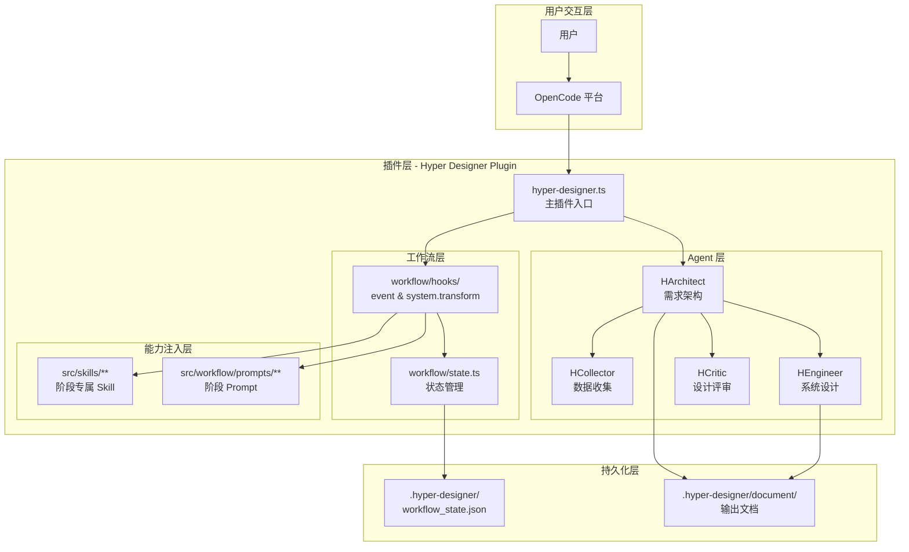
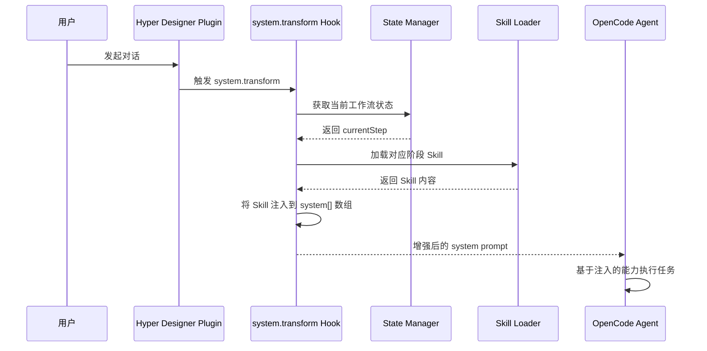
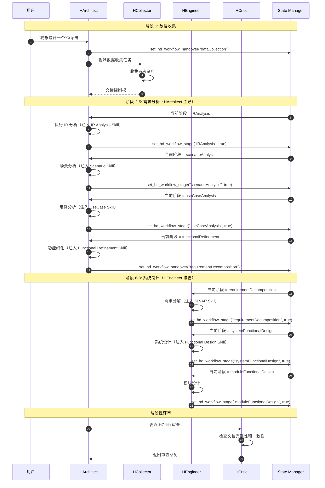
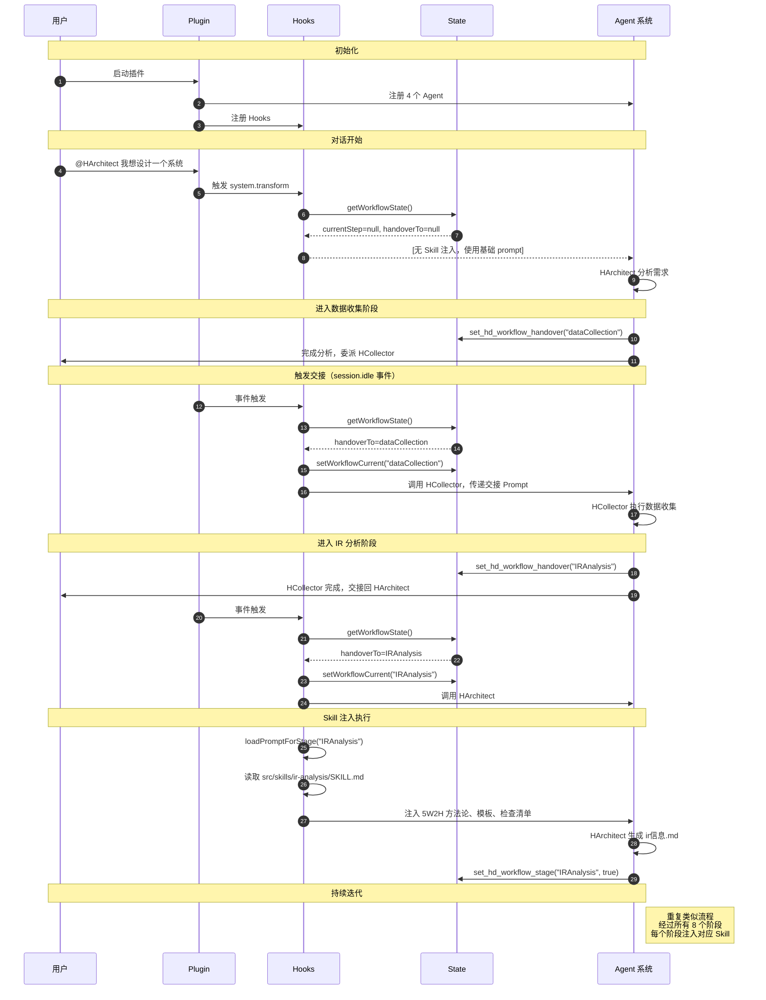

# Hyper Designer 插件技术实现方案

## 1. 插件概述

### 1.1 核心目标

Hyper Designer 是一个 OpenCode 插件，旨在通过专业化 AI Agent 协作和标准化工作流，实现需求工程到系统设计的全流程智能化。

**核心价值：**
- ✅ **工作流标准化**：将复杂的设计过程固化为 8 阶段标准化流程
- ✅ **AI 能力赋能**：为每个阶段注入专属的 AI 能力（Skill）
- ✅ **输出件规范化**：每个阶段产出结构化设计文档
- ✅ **Agent 专业协作**：多个专业化 Agent 各司其职、无缝协作

### 1.2 四大核心 Agent

| Agent | 角色 | 职责范围 | 协作方式 |
|-------|------|---------|---------|
| **HCollector** | 需求工程师 | 数据收集、参考资料整理 | 接受 HArchitect 委派 |
| **HArchitect** | 系统架构师 | 需求分析 → 用例分析 → 功能细化 | 主流程协调，中期主导 |
| **HEngineer** | 系统工程师 | 需求分解 → 系统设计 → 模块设计 | 接收 HArchitect 交接 |
| **HCritic** | 设计评审员 | 文档质量审查、一致性检查 | 被动触发，阶段性评审 |

---

## 2. 技术架构

### 2.1 整体架构图



### 2.2 核心模块说明

#### 2.2.1 插件主入口 (`opencode/.plugins/hyper-designer.ts`)

**职责：**
1. 注册四大 Agent 到 OpenCode 框架
2. 暴露工作流状态管理工具
3. 建立 Hook 监听器

**关键代码结构：**

```typescript
export const HyperDesignerPlugin: Plugin = async (ctx) => {
  const agents = await createBuiltinAgents();           // 创建 Agent 配置
  const workflowHooks = await createWorkflowHooks(ctx); // 建立 Hook

  return {
    config: agentHandler,  // 注入 Agent 配置
    tool: hdWorkflowStateTool,  // 暴露状态管理工具
    event: workflowHooks.event,  // 事件监听（交接触发）
    "experimental.chat.system.transform":  // System Prompt 注入
      workflowHooks["experimental.chat.system.transform"],
  };
};
```

#### 2.2.2 工作流状态管理 (`src/workflow/state.ts`)

**职责：**

- 维护 8 阶段工作流状态
- 支持阶段完成标记
- 支持当前阶段和交接阶段设置

**数据结构：**

```typescript
interface WorkflowStage {
  isCompleted: boolean;
}

interface Workflow {
  dataCollection: WorkflowStage;          // 数据收集
  IRAnalysis: WorkflowStage;              // 初始需求分析
  scenarioAnalysis: WorkflowStage;        // 场景分析
  useCaseAnalysis: WorkflowStage;         // 用例分析
  functionalRefinement: WorkflowStage;    // 功能细化
  requirementDecomposition: WorkflowStage;// 需求分解
  systemFunctionalDesign: WorkflowStage;  // 系统功能设计
  moduleFunctionalDesign: WorkflowStage;  // 模块功能设计
}

interface WorkflowState {
  workflow: Workflow;
  currentStep: keyof Workflow | null;     // 当前活动阶段
  handoverTo: keyof Workflow | null;      // 待交接阶段
}
```

**持久化位置：** `.hyper-designer/workflow_state.json`

---

## 3. 工作流固定机制

### 3.1 工作流阶段定义

工作流分为 **8 个标准化阶段**，每个阶段有明确的输入和输出：

| 阶段 | 主要 Agent | 输入 | 输出 |
|------|-----------|------|------|
| 1. **数据收集** | HCollector | 用户需求描述 | 参考资料清单 |
| 2. **初始需求分析** | HArchitect | 参考资料 | `ir信息.md`（5W2H 分析） |
| 3. **场景分析** | HArchitect | `ir信息.md` | `功能场景.md`（场景库） |
| 4. **用例分析** | HArchitect | `功能场景.md` | `用例.md`（用例规格） |
| 5. **功能细化** | HArchitect | `用例.md` | `{系统名}功能列表.md` |
| 6. **需求分解** | HEngineer | `{系统名}功能列表.md` | SR-AR 分解文档 |
| 7. **系统功能设计** | HEngineer | SR-AR 文档 | 系统架构设计文档 |
| 8. **模块功能设计** | HEngineer | 系统架构文档 | 模块技术规格文档 |

### 3.2 工作流推进机制

#### Agent 交接配置 (`src/workflow/hooks/opencode/workflow.ts`)

每个阶段定义了：
- **负责 Agent**：谁来执行这个阶段
- **交接 Prompt**：如何引导 Agent 进入下一阶段

```typescript
const HANDOVER_CONFIG: Record<keyof Workflow, HandoverConfig> = {
  dataCollection: {
    agent: "HCollector",
    getPrompt: (current, next) => {
      const prefix = current ? `步骤${current}结束，` : "";
      return `${prefix}进入${next}阶段。请收集系统设计所需的参考资料...`;
    }
  },
  IRAnalysis: {
    agent: "HArchitect",
    getPrompt: (current, next) => {
      const prefix = current ? `步骤${current}结束，` : "";
      return `${prefix}进入${next}阶段。请基于已收集的资料，进行初始需求分析...`;
    }
  },
  // ... 其他阶段配置
};
```

---

## 4. Skill 提示词注入机制

### 4.1 Skill 的作用

Skill 是每个阶段的**专业能力注入器**，为 Agent 提供该阶段所需的：
- 方法论指导（如 5W2H 框架）
- 输出模板（如用例模板）
- 质量检查清单
- 最佳实践

### 4.2 Skill 加载流程



### 4.3 实现代码

**Hook 实现：**

```typescript
"experimental.chat.system.transform": async (_input: unknown, output: { system: string[] }) => {
  const workflowState = getWorkflowState();
  const currentStep = workflowState.currentStep;

  if (currentStep) {
    const promptContent = loadPromptForStage(currentStep);
    if (promptContent) {
      output.system.push(promptContent);  // 注入到 Agent 的 system prompt
    }
  }
};
```

**Skill 文件示例：**

```markdown
---
name: IR Analysis
description: Conduct Initial Requirement (IR) analysis using 5W2H framework...
---

# IR Analysis Skill

## Core Workflow
1. Establish Identity
2. Conduct Socratic Dialogue
3. Gather Context
4. Generate Output

## Output Format
The `ir信息.md` must follow this structure:
- 一句话总结
- 5W2H 结构化分析（Who, What, When, Why, Where, How Much, How）

## Quality Checklist
- [ ] 一句话总结清晰传达核心价值
- [ ] Who 涵盖所有关键利益相关者
- ...
```

### 4.4 Skill 文件结构

```
src/skills/
├── ir-analysis/
│   ├── SKILL.md                    # 核心技能定义
│   └── references/
│       ├── ir-5w2h-template.md    # 5W2H 模板
│       └── socratic-guide.md      # 苏格拉底对话指南
├── scenario-analysis/
│   └── SKILL.md
├── use-case-analysis/
│   ├── SKILL.md
│   └── references/
│       ├── use-case-template.md
│       └── dfx-guidelines.md
├── functional-refinement/
│   └── SKILL.md
├── sr-ar-decomposition/
│   └── SKILL.md
└── functional-design/
    └── SKILL.md
```

---

## 5. Agent 协作机制

### 5.1 Agent 能力矩阵

| Agent | Mode | Tool 权限 | 核心能力 |
|-------|------|-----------|---------|
| **HCollector** | Primary | Read, Write, Question, delegate | 资料收集、文档整理 |
| **HArchitect** | Primary | Read, Write, Question, delegate, WorkflowTools | 需求分析、流程协调 |
| **HEngineer** | Primary | Read, Write, Question, delegate, WorkflowTools | 技术设计、需求分解 |
| **HCritic** | Subagent | Read only（纯审查） | 文档质量检查、一致性验证 |

### 5.2 Agent 协作流程



### 5.3 事件驱动交接

通过 OpenCode 的 `session.idle` 事件实现 Agent 交接：

```typescript
event: async ({ event }) => {
  const workflowState = getWorkflowState();

  if (event.type === "session.idle") {
    // 检查是否有待交接的阶段
    if (workflowState.handoverTo !== null) {
      const handoverPhase = workflowState.handoverTo;
      const config = HANDOVER_CONFIG[handoverPhase];

      if (config) {
        // 设置当前阶段
        setWorkflowCurrent(handoverPhase);

        // 构建交接 Prompt
        const handoverContent = config.getPrompt(
          workflowState.currentStep,
          handoverPhase
        );

        // 向目标 Agent 发送交接消息
        await prompt(sessionID, config.agent, handoverContent);

        // 清空交接标记
        setWorkflowHandover(null);
      }
    }
  }
};
```

---

## 6. 核心技术亮点

### 6.1 框架无关设计

**核心逻辑与框架解耦：**

```
src/
├── agents/           # Agent 定义（框架无关）
├── workflow/         # 工作流逻辑（框架无关）
└── skills/           # Skill 文件（框架无关）

opencode/
└── .plugins/
    └── hyper-designer.ts  # OpenCode 框架适配层
```

**优势：**
- 核心业务逻辑可复用到其他 AI 框架
- 易于测试和维护
- 降低框架升级风险

### 6.2 动态提示组合

每个 Agent 支持多阶段提示动态加载：

```typescript
function buildHArchitectPrompt(phases: HArchitectPhase[]): string {
  const identityConstraints = readIdentityConstraints();
  const interviewMode = readInterviewMode();

  if (phases.includes("full")) {
    return `${identityConstraints}\n\n${interviewMode}`;
  }

  // 按需组合
  let prompt = identityConstraints;
  if (phases.includes("interview")) {
    prompt += "\n\n" + interviewMode;
  }
  return prompt;
}
```

### 6.3 状态持久化

工作流状态持久化到 JSON 文件，支持：
- 进度恢复：中断后可继续
- 多用户隔离：每个工作目录独立状态
- 历史追溯：可查看设计过程

### 6.4 质量保证机制

通过 HCritic Agent 实现自动审查：
- **完整性检查**：确保输出文档包含所有必需章节
- **一致性验证**：确保阶段间文档逻辑一致
- **标准符合度**：对照 Skill 中的质量清单验证

---

## 7. 完整工作流程时序图



---

## 8. 输出件规范

### 8.1 文档目录结构

```
.hyper-designer/
├── workflow_state.json           # 工作流状态
└── document/
    ├── manifest.md              # 文档清单
    ├── ir信息.md                # 初始需求（5W2H）
    ├── 功能场景.md              # 场景库
    ├── 用例.md                  # 用例规格
    ├── {系统名}功能列表.md       # 功能清单
    ├── sr-ar-decomposition.md    # SR-AR 分解
    ├── system-design.md         # 系统架构设计
    └── module-specs.md          # 模块技术规格
```

### 8.2 各阶段输出规范

| 阶段 | 输出文件 | 核心内容 |
|------|---------|---------|
| 数据收集 | `参考资料清单.md` | 领域资料、代码库分析、FMEA 库 |
| IR 分析 | `ir信息.md` | 5W2H 分析、一句话总结 |
| 场景分析 | `功能场景.md` | 主场景、备选场景、异常场景 |
| 用例分析 | `用例.md` | 用例规格、触发事件、验收标准 |
| 功能细化 | `{系统名}功能列表.md` | 前后端功能划分、复杂度评估 |
| 需求分解 | `sr-ar-decomposition.md` | SR-AR 分解、DDD 映射 |
| 系统设计 | `system-design.md` | 架构图、技术栈、数据模型 |
| 模块设计 | `module-specs.md` | 接口定义、算法、数据结构 |

---

## 9. 关键技术决策

### 9.1 为什么使用 Hook 机制？

**问题：** 如何在不修改 Agent 源码的情况下，动态增强其能力？

**解决方案：**
- OpenCode 提供了 `experimental.chat.system.transform` Hook
- 在 Agent 执行前拦截，动态向 `system[]` 数组注入内容
- 根据当前工作流状态加载对应的 Skill

**优势：**
- Agent 专注于自身职责（SOLID 原则）
- Skill 可独立迭代和更新
- 支持阶段能力的热插拔

### 9.2 为什么使用事件驱动交接？

**问题：** Agent A 如何将控制权交给 Agent B？

**解决方案：**
- Agent A 设置 `handoverTo` 字段
- 框架触发 `session.idle` 事件时检测到交接标记
- Hook 自动向目标 Agent 发送交接 Prompt
- 目标 Agent 接管工作

**优势：**
- 解耦 Agent 间的直接依赖
- 支持异步交接
- 可记录交接历史

### 9.3 为什么使用状态持久化？

**问题：** 如何保证工作流的连续性和可追溯性？

**解决方案：**
- 每次状态变更立即写入 JSON 文件
- 支持 `getWorkflowState()` 读取当前状态
- 历史状态可用于审计和回溯

**优势：**
- 进度可恢复
- 多用户隔离
- 便于调试和问题排查

---

## 10. 扩展性设计

### 10.1 新增 Agent 步骤

1. 在 `src/agents/` 创建新 Agent 目录
2. 实现 `createXAgent()` 工厂函数
3. 在 `utils.ts` 中注册
4. 在 `HANDOVER_CONFIG` 中配置交接

### 10.2 新增工作流阶段

1. 在 `Workflow` 接口中添加新阶段
2. 创建对应的 Skill 文件
3. 在 `HANDOVER_CONFIG` 中配置
4. 更新工作流状态管理工具

### 10.3 新增 Skill

1. 在 `src/skills/` 创建新目录
2. 编写 `SKILL.md`（包含方法论、模板、检查清单）
3. 在 Hook 中添加加载逻辑

---

## 11. 总结

### 11.1 核心成果

✅ **标准化工作流**：8 阶段从需求到设计的完整流程
✅ **AI 能力赋能**：每个阶段通过 Skill 注入专属方法论
✅ **专业化协作**：4 个 Agent 各司其职、无缝协作
✅ **输出件规范**：每个阶段产出结构化设计文档
✅ **质量保证**：HCritic 自动审查文档质量

### 11.2 技术价值

- **可复用**：框架无关设计，核心逻辑可移植
- **可扩展**：Agent、阶段、Skill 均可独立扩展
- **可维护**：清晰的模块划分和代码结构
- **可追溯**：状态持久化支持过程审计

### 11.3 业务价值

- **提升效率**：AI 自动化重复性工作
- **保证质量**：标准化流程和 Skill 指导
- **降低门槛**：新手也能产出专业设计文档
- **沉淀知识**：Skill 文件是企业方法论的最佳载体