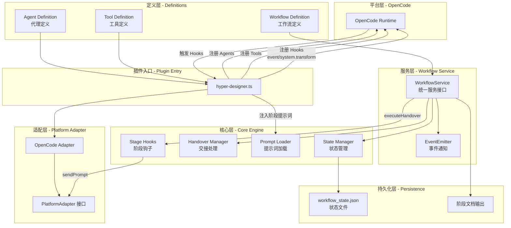
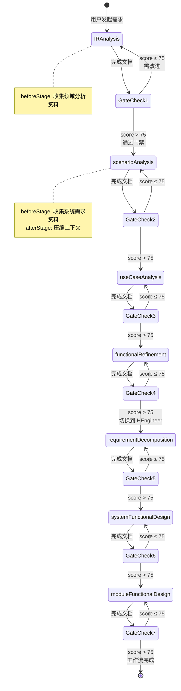

# Hyper Designer 技术实现方案

## 1. 插件概述

### 1.1 核心目标

Hyper Designer 是一个 OpenCode 插件，通过专业化 AI Agent 协作和标准化工作流，实现从需求工程到系统设计的全流程智能化。

**核心价值：**

- **工作流标准化**：8 阶段标准化设计流程
- **AI 能力专业化**：每个阶段通过 Skill 注入专属方法论
- **输出件规范化**：每个阶段产出结构化设计文档
- **Agent 专业协作**：4 个专业化 Agent 各司其职、无缝协作
- **质量门禁**：每个阶段完成后自动质量评审

### 1.2 四大核心 Agent

| Agent | Mode | 角色 | 职责范围 | 协作方式 |
|-------|------|------|---------|---------|
| **HCollector** | all | 需求收集专家 | 数据收集、用户访谈、参考资料整理 | 接受 HArchitect 委派 |
| **HArchitect** | primary | 系统架构师 | IR分析 → 场景分析 → 用例分析 → 功能细化 | 主流程协调员 |
| **HEngineer** | primary | 系统工程师 | 需求分解 → 系统设计 → 模块设计 | 接收 HArchitect 交接 |
| **HCritic** | subagent | 设计评审员 | 阶段文档质量审查、一致性检查 | 被动触发，只读审查 |

### 1.3 8 阶段工作流

| 阶段 | Agent | 输入 | 输出 | 质量门 |
|------|-------|------|------|--------|
| 1. **初始需求分析** | HArchitect | 参考资料 | `ir信息.md` | ✅ |
| 2. **场景分析** | HArchitect | `ir信息.md` | `功能场景.md` | ✅ |
| 3. **用例分析** | HArchitect | `功能场景.md` | `用例.md` | ✅ |
| 4. **功能细化** | HArchitect | `用例.md` | `{系统名}功能列表.md` | ✅ |
| 5. **需求分解** | HEngineer | 功能列表 | `sr-ar-decomposition.md` | ✅ |
| 6. **系统功能设计** | HEngineer | SR-AR文档 | `system-design.md` | ✅ |
| 7. **模块功能设计** | HEngineer | 系统架构 | `module-specs.md` | ✅ |
| 8. **SDD 开发计划生成** | HEngineer | MFD文档 | `dev-plan/{模块名}-dev-plan.md` | ✅ |

---

## 2. 核心概念模型

### 2.1 三大核心机制

Hyper Designer 的核心由三大机制构成，它们协同工作实现完整的工作流管理：

```
┌─────────────────────────────────────────────────────────────────┐
│                     Hyper Designer 核心架构                      │
├─────────────────────────────────────────────────────────────────┤
│                                                                 │
│  ┌──────────────┐    ┌──────────────┐    ┌──────────────┐     │
│  │   Agent      │    │  Workflow    │    │    Gate      │     │
│  │   代理系统    │◄──►│   工作流引擎  │◄──►│   质量门禁    │     │
│  └──────────────┘    └──────────────┘    └──────────────┘     │
│         │                   │                   │              │
│         │                   │                   │              │
│         ▼                   ▼                   ▼              │
│  ┌──────────────────────────────────────────────────────┐     │
│  │              Stage Hooks (阶段钩子)                    │     │
│  │  beforeStage: 进入阶段前执行（如：资料收集）            │     │
│  │  afterStage:  离开阶段后执行（如：上下文压缩）          │     │
│  └──────────────────────────────────────────────────────┘     │
│                                                                 │
└─────────────────────────────────────────────────────────────────┘
```

**机制说明：**

1. **Agent 代理系统**：定义专业化 AI 代理，每个代理有独特的角色、权限和能力
2. **Workflow 工作流引擎**：管理阶段流转、状态持久化、交接验证
3. **Gate 质量门禁**：确保每个阶段的输出质量达到标准才能进入下一阶段
4. **Stage Hooks 阶段钩子**：在阶段边界执行自动化任务（资料收集、上下文压缩）

### 2.2 数据流向图

```
用户需求
    │
    ▼
┌─────────────────┐
│  HArchitect     │ ◄─── beforeStage: 收集领域分析资料
│  (IR Analysis)  │
└────────┬────────┘
         │ hd_record_milestone({type: 'gate', score: 85, comment: '文档质量良好'})
         ▼
    [Gate Check: score > 75? ✓]
         │
         ▼ hd_handover("scenarioAnalysis")
┌─────────────────┐
│  HArchitect     │ ◄─── beforeStage: 收集系统需求分析资料
│  (Scenario)     │
└────────┬────────┘
         │ afterStage: 压缩上下文
         ▼
    [Gate Check] ──► ... ──► [HArchitect 阶段完成]
         │
         ▼ hd_handover("requirementDecomposition")
┌─────────────────┐
│  HEngineer      │ ◄─── Agent 切换
│  (SR-AR)        │
└────────┬────────┘
         │
         ▼
    ... 继续后续阶段 ...
```

---

## 3. 技术架构

### 3.1 分层架构图



### 3.2 核心模块职责

| 模块 | 文件路径 | 职责 |
|------|---------|------|
| **WorkflowService** | `src/workflows/core/service/WorkflowService.ts` | 统一服务接口，封装状态操作，提供事件通知 |
| **State Manager** | `src/workflows/core/state/` | 工作流状态管理、持久化、验证 |
| **Handover Manager** | `src/workflows/core/runtime/handover.ts` | 交接代理获取、交接提示词生成 |
| **Prompt Loader** | `src/workflows/core/runtime/promptLoader.ts` | 工作流/阶段提示词加载 |
| **Stage Hooks** | `src/workflows/core/stageHooks/` | beforeStage/afterStage 钩子实现 |
| **Platform Adapter** | `src/adapters/` | 平台无关接口，支持多平台扩展 |

---

## 4. 核心机制详解

### 4.1 Agent 代理系统

#### 4.1.1 Agent 定义结构

```typescript
interface AgentDefinition {
  name: string                    // 代理名称
  description: string             // 代理描述
  mode: AgentMode                 // 运行模式: primary | subagent | all
  color?: string                  // UI 显示颜色
  defaultTemperature: number      // 默认温度
  defaultMaxTokens?: number       // 默认最大 token
  promptGenerators: PromptGenerator[]  // 提示词生成器数组
  defaultPermission?: Record<string, string>  // 默认权限
  defaultTools?: Record<string, boolean>       // 默认工具配置
}
```

#### 4.1.2 Agent 提示词动态组合

每个 Agent 的提示词由多个部分动态组合而成：

```typescript
// HArchitect 的提示词组合示例
promptGenerators: [
  filePrompt("prompts/identity.md"),                              // 1. 身份定义
  stringPrompt("{HYPER_DESIGNER_WORKFLOW_OVERVIEW_PROMPT}"),      // 2. 工作流概览（占位符）
  filePrompt("prompts/step.md"),                                  // 3. 步骤指导
  filePrompt("prompts/file.md"),                                  // 4. 文件操作规范
  filePrompt("prompts/interview.md"),                             // 5. 访谈技巧
  filePrompt("prompts/constraints.md"),                           // 6. 约束条件
  stringPrompt("{HYPER_DESIGNER_WORKFLOW_STEP_PROMPT}"),          // 7. 当前阶段提示词（占位符）
]
```

**占位符替换机制：**

- `{HYPER_DESIGNER_WORKFLOW_OVERVIEW_PROMPT}` → 工作流整体概览提示词
- `{HYPER_DESIGNER_WORKFLOW_STEP_PROMPT}` → 当前阶段的专属提示词

替换发生在 `system.transform` Hook 中，确保每次对话都注入正确的阶段上下文。

#### 4.1.3 Agent 权限矩阵

| Agent | edit | skill | task | hd_handover | hd_record_milestone | hd_force_next_step |
|-------|------|-------|------|-------------|---------------------|-------------------|
| **HArchitect** | ✅ | ✅ | ✅ | ✅ | ✅ | ✅ |
| **HEngineer** | ✅ | ✅ | ✅ | ✅ | ✅ | ✅ |
| **HCritic** | ❌ (只读) | ✅ | ❌ | ❌ | ✅ | ❌ |
| **HCollector** | ✅ | ✅ | ✅ | ❌ | ❌ | ❌ |

### 4.2 Workflow 工作流引擎

#### 4.2.1 工作流定义结构

```typescript
interface WorkflowDefinition {
  id: string                      // 工作流唯一标识
  name: string                    // 工作流名称
  description: string             // 工作流描述
  promptFile?: string             // 工作流级别提示词文件
  stageFallbackPromptFile?: string // 阶段回退提示词文件
  stageOrder: string[]            // 阶段执行顺序
  stages: Record<string, WorkflowStageDefinition>  // 阶段定义映射
}

interface WorkflowStageDefinition {
  name: string                    // 阶段显示名称
  description: string             // 阶段描述
  agent: string                   // 负责该阶段的 Agent
  promptFile?: string             // 阶段专属提示词文件
  gate?: boolean                  // 是否启用质量门禁
  beforeStage?: StageHookFn[]     // 进入阶段前执行的钩子
  afterStage?: StageHookFn[]      // 离开阶段后执行的钩子
  getHandoverPrompt: (currentStageName, thisStageName) => string  // 生成交接提示词
}
```

#### 4.2.2 工作流状态结构

```typescript
interface WorkflowState {
  typeId: string                  // 工作流类型 ID
  workflow: Record<string, WorkflowStage>  // 各阶段状态
  current: CurrentStageState | null;      // 当前活动阶段
}

interface CurrentStageState {
  name: string | null                 // 当前阶段 key，如 "IRAnalysis"
  handoverTo: string | null           // 交接目标阶段
  previousStage: string | null        // 上一阶段
  nextStage: string | null            // 下一阶段（仅用于 hd_force_next_step）
  failureCount: number                // 连续交接失败次数
}

interface WorkflowStage {
  isCompleted: boolean            // 阶段是否完成
  stageMilestones: StageMilestone[]  // 阶段里程碑记录
}

interface StageMilestone {
  type: 'gate' | 'completion' | 'checkpoint'  // 里程碑类型
  timestamp: string                // ISO 8601 时间戳
  detail?: {
    score?: number                 // 质量评分 (0-100), 仅 gate 类型
    comment?: string               // 评语
    [key: string]: unknown         // 额外详情
  }
}
```

#### 4.2.3 交接验证规则

```typescript
// 交接验证逻辑
function validateHandover(currentStage, targetStep, stageOrder) {
  const currentIndex = currentStage ? stageOrder.indexOf(currentStage) : -1
  const targetIndex = stageOrder.indexOf(targetStep)

  // 规则 1: 无当前步骤时，只能交接给第一个阶段
  if (currentIndex === -1) {
    return targetIndex === 0
  }

  // 规则 2: 只允许下一阶段或回退到之前阶段
  const isNextStep = targetIndex === currentIndex + 1
  const isBackwardStep = targetIndex <= currentIndex

  return isNextStep || isBackwardStep
}
```

### 4.3 Gate 质量门禁

#### 4.3.1 质量门工作流程

```mermaid
sequenceDiagram
    autonumber
    participant Agent as HArchitect/HEngineer
    participant Critic as HCritic
    participant Service as WorkflowService
    participant State as State Manager

    Note over Agent,State: 阶段文档完成
    Agent->>Critic: task(subagent=HCritic)<br/>评审文档
    
    Critic->>Critic: 检查文档完整性
    Critic->>Critic: 检查文档一致性
    Critic->>Critic: 检查标准符合度
    Critic->>Critic: 计算评分 (0-100)
    
    Critic->>Service: hd_record_milestone({type: 'gate', score, comment})
    Service->>State: recordMilestone({type: 'gate', score, comment})
    QH|    State-->>Service: 更新后的状态 (workflow[currentStage].stageMilestones.gate)
    SQ|    
    VY|    Note over Agent,State: Agent 尝试交接
    NH|    Agent->>Service: hd_handover("nextStage")
    XB|    Service->>State: getLatestGateScore()?
    BY|    
    NT|    alt score > 75
    PV|        State-->>Service: true
    XX|        Service->>State: setHandover("nextStage")
    SK|        Service-->>Agent: {success: true}
    TP|    else score ≤ 75
    JT|        State-->>Service: false
    PV|        Service-->>Agent: {success: false, error: "Gate not passed (score ≤ 75)"}
    PT|    end

#### 4.3.2 质量门工具定义

```typescript
// hd_record_milestone - HArchitect/HEngineer/HCritic 可调用
{
  description: "Record a milestone for the current workflow stage",
  args: {
    type: 'gate' | 'completion' | 'checkpoint',  // 里程碑类型
    score?: number,      // 质量评分 (0-100), 仅 gate 类型
    comment?: string,    // 评语
    detail?: Record<string, unknown>  // 额外详情
  }
}

// hd_force_next_step - HArchitect/HEngineer 可调用
{
  description: "Force transition to next selected stage (only when failureCount >= 3)",
  args: {
    step_name: string   // 目标阶段名称（必须是下一选中阶段）
  }
}

// hd_handover - HArchitect/HEngineer 可调用
{
  description: "Set the handover workflow step. Requires latest gate score > 75",
  args: {
    step_name: string   // 目标阶段名称
  }
}
```

#### 4.3.3 质量门评分标准

| 分数范围 | 等级 | 说明 |
|---------|------|------|
| 90-100 | 优秀 | 文档完整、一致、符合所有标准 |
| 75-89 | 合格 | 文档基本完整，可通过门禁 |
| 60-74 | 待改进 | 文档存在明显缺陷，需补充 |
| 0-59 | 不合格 | 文档严重缺失，需重做 |

### 4.4 Stage Hooks 阶段钩子

#### 4.4.1 钩子类型与执行时机

```typescript
interface StageHookFn {
  (ctx: {
    stageKey: string           // 阶段 key
    stageName: string          // 阶段显示名称
    workflow: WorkflowDefinition
    sessionID?: string
    adapter?: PlatformAdapter  // 平台适配器
  }): Promise<void>
}
```

**执行时机：**

| 钩子类型 | 执行时机 | 典型用途 |
|---------|---------|---------|
| `beforeStage` | 进入新阶段后、Agent 开始工作前 | 资料收集、环境准备 |
| `afterStage` | 离开阶段后、状态更新完成后 | 上下文压缩、清理工作 |

#### 4.4.2 内置钩子实现

**HCollector Hook (beforeStage)**

```typescript
// 在阶段开始前自动收集资料
function createHCollectorHook(options: { domains: CollectionDomain[] }): StageHookFn {
  return async ({ stageKey, sessionID, adapter }) => {
    // 检查资料是否已收集完成
    const completed = domains.every(d => existsSync(`.hyper-designer/document/${d}/completed`))
    
    if (!completed) {
      // 委派 HCollector 收集资料
      await adapter.sendPrompt({
        sessionId: sessionID,
        agent: 'HCollector',
        text: '收集资料指令...'
      })
    }
  }
}
```

**Summarize Hook (afterStage)**

```typescript
// 在阶段结束后压缩上下文
const summarizeHook: StageHookFn = async ({ sessionID, adapter }) => {
  await adapter.summarizeSession(sessionID)
}
```

#### 4.4.3 Classic 工作流钩子配置

```typescript
stages: {
  IRAnalysis: {
    beforeStage: [createHCollectorHook({ domains: ['domainAnalysis'] })],
    // 进入 IR 阶段前收集领域分析资料
  },
  
  scenarioAnalysis: {
    beforeStage: [createHCollectorHook({ domains: ['systemRequirementAnalysis'] })],
    afterStage: [summarizeHook],
    // 进入场景分析前收集系统需求资料，离开后压缩上下文
  },
  
  systemFunctionalDesign: {
    beforeStage: [createHCollectorHook({ domains: ['systemDesign', 'codebase'] })],
    afterStage: [summarizeHook],
    // 进入系统设计前收集系统设计和代码库资料
  },
}
```

---

## 5. 完整工作流程

### 5.1 端到端时序图

```mermaid
sequenceDiagram
    autonumber
    participant U as 用户
    participant P as Plugin
    participant OC as OpenCode
    participant WS as WorkflowService
    participant S as State
    participant A as Agent<br/>(HArchitect/HEngineer/<br/>HCollector/HCritic)

    Note over U,A: === 初始化 ===
    U->>P: 启动插件
    P->>WS: 创建 WorkflowService
    P->>OC: 注册 Hooks
    P->>A: 注册 4 个 Agent

    Note over U,A: === 进入 IR 分析阶段 ===
    U->>P: @HArchitect 我想设计一个系统
    P->>OC: 触发 system.transform
    OC->>WS: getState()
    WS-->>OC: {currentStage: null}
    OC->>OC: 替换占位符，注入阶段提示词
    OC-->>A: 注入提示词
    
    A->>WS: hd_handover("IRAnalysis")
    WS->>S: setHandover("IRAnalysis")
    WS-->>A: {success: true}

    Note over U,A: === 交接执行 (session.idle) ===
    P->>OC: 触发 session.idle
    OC->>WS: executeHandover()
    WS->>S: currentStage = "IRAnalysis"
    
    Note over U,A: 执行 beforeStage 钩子
    OC->>A: HCollector 收集领域分析资料
    A-->>OC: 完成 (session.idle)

    Note over U,A: === IR 分析阶段执行 ===
    OC->>A: HArchitect 进入 IR 分析阶段
    
    loop 需求澄清
        A->>U: 提问 (如：系统边界？核心用户？)
        U->>A: 回答
    end
    
    A->>A: 生成 ir信息.md
    
    Note over U,A: 质量门检查
    A->>A: HCritic 评审文档
    A->>WS: hd_record_milestone({type: 'gate', score: 85, comment: '文档质量良好'})
    QZ|    WS->>S: recordMilestone({type: 'gate', score: 85, comment: '文档质量良好'})
    BR|    S-->>WS: 更新 workflow[IRAnalysis].stageMilestones
    
    BB|    Note over U,A: 请求交接
    VT|    A->>WS: hd_handover("scenarioAnalysis")
    SM|    WS->>S: getLatestGateScore()? (85 > 75 ✓)
    WJ|    WS->>S: setHandover("scenarioAnalysis")
    MP|    WS-->>A: {success: true}

    Note over U,A: === 交接执行 (session.idle) ===
    P->>OC: 触发 session.idle
    OC->>WS: executeHandover()
    WS->>S: currentStage = "scenarioAnalysis"
    
    Note over U,A: 执行 afterStage 钩子 (离开 IRAnalysis)
    OC->>OC: summarizeSession()
    
    Note over U,A: 执行 beforeStage 钩子 (进入 scenarioAnalysis)
    OC->>A: HCollector 收集系统需求资料
    A-->>OC: 完成 (session.idle)
    
    Note over U,A: === 继续后续阶段... ===
```

### 5.2 阶段流转状态图



---

## 6. 平台适配器模式

### 6.1 适配器接口定义

```typescript
interface PlatformAdapter {
  // 创建新会话
  createSession(title: string): Promise<string>
  
  // 发送提示词给指定 Agent
  sendPrompt(params: {
    sessionId: string
    agent: string
    text: string
    schema?: Record<string, unknown>
  }): Promise<{
    structuredOutput?: unknown
    text?: string
  }>
  
  // 删除会话
  deleteSession(sessionId: string): Promise<void>
  
  // 压缩会话上下文
  summarizeSession(sessionId: string): Promise<void>
}
```

### 6.2 OpenCode 适配器实现

```typescript
function createOpenCodeAdapter(ctx: PluginInput, config: HDConfig): PlatformAdapter {
  return {
    createSession: async (title) => {
      const result = await ctx.client.session.create({
        body: { title },
        query: { directory: ctx.directory }
      })
      return result.data.id
    },

    sendPrompt: async ({ sessionId, agent, text, schema }) => {
      const response = await ctx.client.session.prompt({
        path: { id: sessionId },
        body: {
          agent,
          parts: [{ type: 'text', text }],
          ...(schema && { format: { type: 'json_schema', schema } })
        }
      })
      return { structuredOutput: response.data?.info?.structured_output }
    },

    summarizeSession: async (sessionId) => {
      const model = await resolveDefaultModel(ctx, config)
      await ctx.client.session.summarize({
        path: { id: sessionId },
        body: { providerID: model.providerID, modelID: model.modelID }
      })
    }
  }
}
```

### 6.3 扩展到其他平台

通过实现 `PlatformAdapter` 接口，可以将 Hyper Designer 移植到其他 AI 平台：

```
PlatformAdapter (接口)
    │
    ├── OpenCode Adapter (已实现)
    │
    ├── Claude Code Adapter (未来)
    │
    └── 其他平台 Adapter (未来)
```

---

## 7. 工具系统

### 7.1 工具定义

Hyper Designer 提供四个核心工具：

| 工具名称 | 权限 | 描述 |
|---------|------|------|
| `hd_workflow_state` | 所有 Agent | 获取当前工作流状态 |
| `hd_handover` | HArchitect, HEngineer | 设置交接目标（需通过质量门） |
| `hd_record_milestone` | HArchitect, HEngineer, HCritic | 记录阶段里程碑 |
| `hd_force_next_step` | HArchitect, HEngineer | 强制进入下一阶段（仅当 failureCount >= 3） |
### 7.2 工具调用流程

```typescript
// hd_handover 工具实现
async execute(params: { step_name: string }) {
  // 1. 检查质量门
  const latestGateScore = workflowService.getLatestGateScore()
  if (!latestGateScore || latestGateScore <= 75) {
    // 增加失败计数
    workflowService.incrementFailureCount()
    return {
      success: false,
      error: "Gate not passed. Latest gate score must be > 75"
    }
  }
  
  // 2. 设置交接目标
  const state = workflowService.setHandover(params.step_name)
  
  // 3. 返回结果
  return {
    success: true,
    handover_to: params.step_name,
    instruction: "STOP immediately. Handover will be processed on session.idle"
  }
}

// hd_record_milestone 工具实现
async execute(params: { type: 'gate' | 'completion' | 'checkpoint', score?: number, comment?: string, detail?: Record<string, unknown> }) {
  // 1. 验证里程碑类型
  if (params.type === 'gate' && params.score === undefined) {
    return { success: false, error: "Gate milestone requires score" }
  }
  
  // 2. 记录里程碑
  const milestone = {
    type: params.type,
    timestamp: new Date().toISOString(),
    detail: {
      score: params.score,
      comment: params.comment,
      ...params.detail
    }
  }
  
  workflowService.recordMilestone(milestone)
  
  return { success: true }
}

// hd_force_next_step 工具实现
async execute(params: { step_name: string }) {
  // 1. 检查失败计数
  const failureCount = workflowService.getFailureCount()
  if (failureCount < 3) {
    return {
      success: false,
      error: `Cannot force next step. Failure count (${failureCount}) < 3`
    }
  }
  
  // 2. 验证目标阶段是否为下一选中阶段
  const nextStage = workflowService.getNextSelectedStage()
  if (params.step_name !== nextStage) {
    return {
      success: false,
      error: `Can only force transition to next selected stage (${nextStage})`
    }
  }
  
  // 3. 设置交接目标
  const state = workflowService.setHandover(params.step_name)
  
  // 4. 重置失败计数
  workflowService.resetFailureCount()
  
  return {
    success: true,
    handover_to: params.step_name,
    instruction: "STOP immediately. Handover will be processed on session.idle"
  }
}
```

---

## 8. 配置系统

### 8.1 配置层级

```
配置优先级（高 → 低）：
1. 代码中的 AgentDefinition 默认值
2. ~/.config/opencode/hyper-designer/hd-config.json (全局配置)
3. ./.hyper-designer/hd-config.json (项目配置)
4. 环境变量 (HD_PROJECT_CONFIG_PATH, HD_GLOBAL_CONFIG_PATH)
```

### 8.2 配置文件格式

```json
{
  "$schema": "https://raw.atomgit.com/u011501137/hyper-designer/raw/master/schemas/hd-config.schema.json",
  "workflow": "classic",
  "agents": {
    "HArchitect": {
      "temperature": 0.8,
      "maxTokens": 16000,
      "model": "gpt-4",
      "prompt_append": "额外提示词内容"
    },
    "HEngineer": {
      "temperature": 0.3
    }
  }
}
```

### 8.3 默认温度配置

| Agent | 默认温度 | 理由 |
|-------|---------|------|
| HCollector | 0.3 | 较低温度，确保需求收集的准确性和一致性 |
| HArchitect | 0.6 | 较高温度，鼓励架构设计的创造性和多样性 |
| HCritic | 0.1 | 极低温度，确保评审的严格性和一致性 |
| HEngineer | 0.4 | 中等温度，平衡技术设计的严谨性和创造性 |

---

## 9. 扩展指南

### 9.1 添加新工作流

1. 在 `src/workflows/plugins/` 创建新目录
2. 实现 `WorkflowDefinition` 接口
3. 创建阶段提示词文件
4. 在 `src/workflows/core/registry.ts` 中注册

### 9.2 添加新阶段钩子

1. 在 `src/workflows/core/stageHooks/` 创建新钩子
2. 实现 `StageHookFn` 接口
3. 在工作流定义中配置 `beforeStage` 或 `afterStage`

### 9.3 添加新 Agent

1. 在 `src/agents/` 创建新目录
2. 定义 `AgentDefinition`
3. 创建提示词文件
4. 在 `src/agents/utils.ts` 中注册

---

## 10. 关键技术亮点

### 10.1 框架无关设计

核心业务逻辑与 AI 平台解耦，通过 `PlatformAdapter` 接口支持多平台扩展。

### 10.2 动态提示组合

Agent 提示词由多个部分动态组合，支持运行时占位符替换，实现阶段上下文注入。

### 10.3 事件驱动交接

通过 `session.idle` 事件触发交接，确保 Agent 完成当前工作后再切换。

### 10.4 质量门禁机制

每个阶段完成后必须通过质量评审（score > 75）才能进入下一阶段，确保输出质量。

### 10.5 阶段钩子系统

通过 `beforeStage` 和 `afterStage` 钩子实现自动化任务（资料收集、上下文压缩），降低 Agent 负担。

---

## 11. 文件结构总览

```
src/
├── adapters/                    # 平台适配器
│   ├── types.ts                 # PlatformAdapter 接口定义
│   └── opencode/                # OpenCode 平台实现
│       ├── adapter.ts           # 适配器实现
│       ├── modelResolver.ts     # 模型解析
│       └── index.ts
│
├── agents/                      # Agent 定义
│   ├── types.ts                 # Agent 类型定义
│   ├── factory.ts               # Agent 工厂
│   ├── utils.ts                 # Agent 工具函数
│   ├── HArchitect/              # 系统架构师
│   ├── HCollector/              # 需求收集专家
│   ├── HEngineer/               # 系统工程师
│   └── HCritic/                 # 设计评审员
│
├── workflows/
│   ├── core/                    # 工作流核心引擎
│   │   ├── types.ts             # 类型定义
│   │   ├── state/               # 状态管理
│   │   │   ├── types.ts         # 状态类型
│   │   │   ├── operations.ts    # 状态操作
│   │   │   └── persistence.ts   # 状态持久化
│   │   ├── runtime/             # 运行时
│   │   │   ├── handover.ts      # 交接处理
│   │   │   └── promptLoader.ts  # 提示词加载
│   │   ├── service/             # 服务层
│   │   │   └── WorkflowService.ts
│   │   ├── stageHooks/          # 阶段钩子
│   │   │   ├── hCollectorHook.ts
│   │   │   └── summarizeHook.ts
│   │   └── registry.ts          # 工作流注册表
│   │
│   ├── integrations/            # 平台集成
│   │   └── opencode/            # OpenCode 集成
│   │       ├── event-handler.ts # 事件处理
│   │       ├── system-transform.ts # 系统消息转换
│   │       └── index.ts
│   │
│   └── plugins/                 # 工作流插件
│       └── classic/             # 经典工作流
│           ├── index.ts         # 工作流定义
│           └── prompts/         # 阶段提示词
│
├── skills/                      # Skill 文件
│   └── hyper-designer/
│       ├── ir-analysis/
│       ├── scenario-analysis/
│       ├── use-case-analysis/
│       ├── functional-refinement/
│       ├── sr-ar-decomposition/
│       └── functional-design/
│
├── tools/                       # 工具定义
│   ├── index.ts                 # 工具类型定义
│   └── opencode.ts              # OpenCode 工具语法
│
├── config/                      # 配置加载
│   └── loader.ts
│
└── utils/                       # 工具函数
    └── logger.ts

opencode/
└── .plugins/
    └── hyper-designer.ts        # OpenCode 插件入口
```
