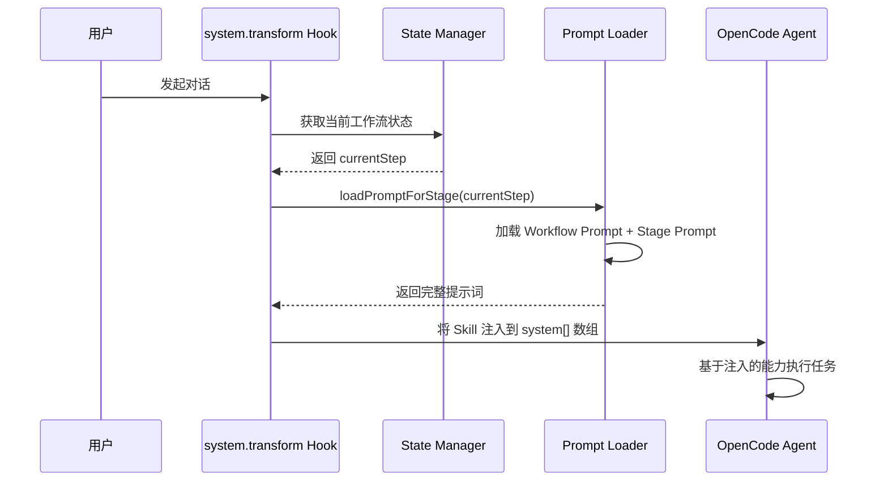
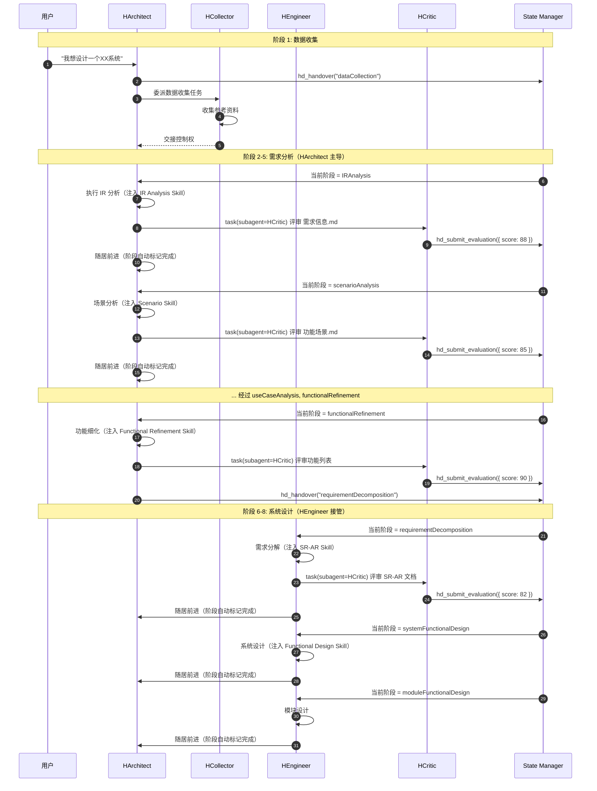
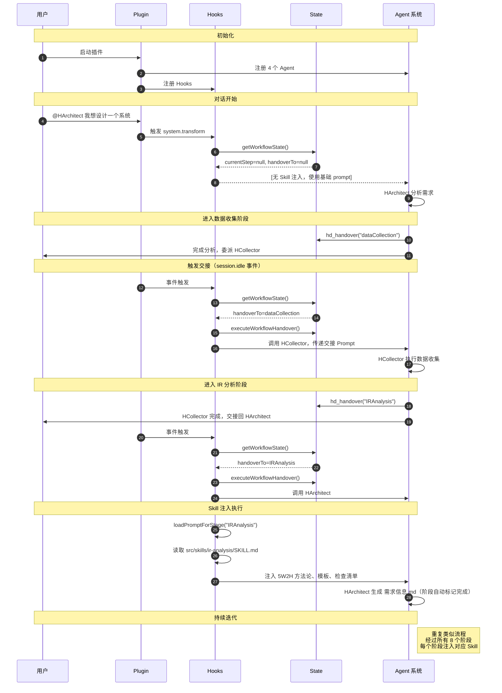

# Hyper Designer 技术实现方案

## 1. 插件概述

### 1.1 核心目标

Hyper Designer 是一个 OpenCode 插件，通过专业化 AI Agent 协作和标准化工作流，实现从需求工程到系统设计的全流程智能化。

**核心价值：**

- **工作流标准化**：8 阶段标准化设计流程
- **AI 能力专业化**：每个阶段通过 Skill 注入专属方法论
- **输出件规范化**：每个阶段产出结构化设计文档
- **Agent 专业协作**：4 个专业化 Agent 各司其职、无缝协作

### 1.2 四大核心 Agent

| Agent | Mode | 角色 | 职责范围 | 协作方式 |
|-------|------|------|---------|---------|
| **HCollector** | all | 需求收集专家 | 数据收集、用户访谈、参考资料整理 | 接受 HArchitect 委派 |
| **HArchitect** | primary | 系统架构师 | IR分析 → 场景分析 → 用例分析 → 功能细化 | 主流程协调员 |
| **HEngineer** | primary | 系统工程师 | 需求分解 → 系统设计 → 模块设计 | 接收 HArchitect 交接 |
| **HCritic** | subagent | 设计评审员 | 阶段文档质量审查、一致性检查 | 被动触发，只读审查 |

### 1.3 8 阶段工作流

| 阶段 | Agent | 输入 | 输出 | Skill |
|------|-------|------|------|-------|
| 1. **数据收集** | HCollector | 用户需求描述 | 参考资料清单 | - |
| 2. **初始需求分析** | HArchitect | 参考资料 | `需求信息.md` | ir-analysis |
| 3. **场景分析** | HArchitect | `需求信息.md` | `功能场景.md` | scenario-analysis |
| 4. **用例分析** | HArchitect | `功能场景.md` | `用例.md` | use-case-analysis |
| 5. **功能细化** | HArchitect | `用例.md` | `{系统名}功能列表.md` | functional-refinement |
| 6. **需求分解** | HEngineer | 功能列表 | `sr-ar-decomposition.md` | sr-ar-decomposition |
| 7. **系统功能设计** | HEngineer | SR-AR文档 | `system-design.md` | functional-design |
| 8. **模块功能设计** | HEngineer | 系统架构 | `module-specs.md` | functional-design |

---

## 2. 技术架构

### 2.1 整体架构图

```mermaid
graph TB
    subgraph "用户交互层"
        User[用户]
        OpenCode[OpenCode 平台]
    end

    subgraph "插件层 - Hyper Designer"
        Plugin[hyper-designer.ts<br/>框架适配层]

        subgraph "Agent 层"
            HCollector[HCollector<br/>数据收集]
            HArchitect[HArchitect<br/>需求架构]
            HEngineer[HEngineer<br/>系统设计]
            HCritic[HCritic<br/>设计评审]
        end

        subgraph "工作流引擎层"
            State[core/state.ts<br/>状态管理]
            Handover[core/handover.ts<br/>交接处理]
            Prompts[core/prompts.ts<br/>提示词加载]
            Registry[core/registry.ts<br/>工作流注册表]
        end

        subgraph "工作流插件层"
            Classic[plugins/classic<br/>经典工作流]
            OpenSource[plugins/open-source<br/>开源工作流]
        end

        subgraph "技能注入层"
            Skills[src/skills/**<br/>阶段专属 Skill]
        end
    end

    subgraph "持久化层"
        StateFile[.hyper-designer/<br/>workflow_state.json]
        OutputDoc[.hyper-designer/{stage}/document/<br/>阶段文档输出]
    end

    User --> OpenCode
    OpenCode --> Plugin
    Plugin --> HArchitect
    HArchitect --> HCollector
    HArchitect --> HEngineer
    HArchitect --> HCritic

    Plugin --> State
    State --> Handover
    State --> Prompts
    Registry --> Classic
    Registry --> OpenSource
    
    Skills --> Prompts
    Prompts --> HArchitect
    Prompts --> HEngineer

    State --> StateFile
    HArchitect --> OutputDoc
    HEngineer --> OutputDoc
```

### 2.2 核心模块说明

#### 2.2.1 Agent 工厂 (`src/agents/factory.ts`)

**职责：**

1. 根据 `AgentDefinition` 创建完整的 Agent 配置
2. 支持多种提示词生成器（filePrompt, toolsPrompt, stringPrompt）
3. 合并默认配置和用户覆盖配置
4. 从 `hd-config.json` 读取 Agent 覆盖配置

**关键代码结构：**

```typescript
export interface AgentDefinition {
  name: string
  description: string
  mode: AgentMode
  color?: string
  defaultTemperature: number
  defaultMaxTokens?: number
  promptGenerators: PromptGenerator[]
  defaultPermission?: Record<string, string>
  defaultTools?: Record<string, boolean>
}

export function createAgent(
  definition: AgentDefinition,
  model?: string,
  runtime?: RuntimeType
): AgentConfig
```

#### 2.2.2 工作流定义 (`src/workflows/core/types.ts`)

**职责：**

定义标准化的工作流结构，支持插件化扩展。

```typescript
export interface WorkflowStageDefinition {
  name: string
  description: string
  agent: string
  skill?: string
  promptFile?: string
  getHandoverPrompt: (currentStep: string | null) => string
}

export interface WorkflowDefinition {
  id: string
  name: string
  description: string
  promptFile?: string
  stageFallbackPromptFile?: string
  stageOrder: string[]
  stages: Record<string, WorkflowStageDefinition>
}
```

#### 2.2.3 工作流状态管理 (`src/workflows/core/state.ts`)

**职责：**

- 维护工作流状态（阶段完成状态、当前步骤、交接目标）
- 支持阶段完成标记
- 支持阶段交接验证（防止跳过关键步骤）
- 状态持久化到 JSON 文件

**数据结构：**

```typescript
export interface WorkflowStage {
  isCompleted: boolean
}

export interface WorkflowState {
  typeId: string
  workflow: Record<string, WorkflowStage>
  currentStep: string | null
  handoverTo: string | null
}
```

**关键函数：**

```typescript
// 获取当前工作流状态
export function getWorkflowState(): WorkflowState | null

// 设置阶段完成状态
export function setWorkflowStage(stageName: string, isCompleted: boolean): WorkflowState

// 设置当前活动步骤
export function setWorkflowCurrent(stepName: string | null): WorkflowState

// 设置交接目标（带验证）
export function setWorkflowHandover(stepName: string | null, definition: WorkflowDefinition): WorkflowState

// 执行交接（更新状态并标记完成）
export function executeWorkflowHandover(definition: WorkflowDefinition): WorkflowState
```

#### 2.2.4 提示词加载 (`src/workflows/core/prompts.ts`)

**职责：**

- 加载工作流级别通用提示词
- 加载阶段特定提示词
- 提供回退机制

```typescript
export function loadWorkflowPrompt(definition: WorkflowDefinition): string
export function loadStagePrompt(stage: string | null, definition: WorkflowDefinition): string
export function loadPromptForStage(stage: string | null, definition: WorkflowDefinition): string
```

---

## 3. 技能注入机制

### 3.1 Skill 的作用

Skill 是每个阶段的专业能力注入器，为 Agent 提供：

- 方法论指导（如 5W2H 框架）
- 输出模板（如用例模板）
- 质量检查清单
- 最佳实践

### 3.2 Skill 加载流程



### 3.3 实现代码

**Hook 实现：**

```typescript
// src/workflows/hooks/opencode/index.ts
"experimental.chat.system.transform": async (_input: unknown, output: { system: string[] }) => {
  const workflowState = getWorkflowState()
  
  const placeholderResolvers: PlaceholderResolver[] = [
    {
      token: "{HYPER_DESIGNER_WORKFLOW_OVERVIEW_PROMPT}",
      resolve: () => loadWorkflowPrompt(workflow!)
    },
    {
      token: "{HYPER_DESIGNER_WORKFLOW_STEP_PROMPT}",
      resolve: () => {
        const currentStep = workflowState?.currentStep || null
        return loadStagePrompt(currentStep, workflow!)
      }
    }
  ]

  replacePlaceholders(output.system, placeholderResolvers)
}
```

**Skill 文件结构：**

```
src/skills/
├── ir-analysis/
│   ├── SKILL.md                    # 核心技能定义
│   └── references/
│       ├── ir-5w2h-template.md    # 5W2H 模板
│       └── socratic-guide.md      # 苏格拉底对话指南
├── scenario-analysis/
│   └── SKILL.md
├── use-case-analysis/
│   ├── SKILL.md
│   └── references/
│       ├── use-case-template.md
│       └── dfx-guidelines.md
├── functional-refinement/
│   └── SKILL.md
├── sr-ar-decomposition/
│   ├── SKILL.md
│   ├── references/
│   │   ├── ddd-patterns.md
│   │   └── ar-estimation.md
│   └── templates/
│       └── sr-ar-template.md
└── functional-design/
    ├── SKILL.md
    └── references/
        ├── system-design.md
        └── module-design.md
```

**Skill 文件示例：**

```markdown
---
name: IR Analysis
description: Conduct Initial Requirement (IR) analysis using 5W2H framework...
---

# IR Analysis Skill

## Core Workflow
1. Establish Identity
2. Conduct Socratic Dialogue
3. Gather Context
4. Generate Output

## Output Format
The `需求信息.md` must follow this structure:
- 一句话总结
- 5W2H 结构化分析（Who, What, When, Why, Where, How Much, How）

## Quality Checklist
- [ ] 一句话总结清晰传达核心价值
- [ ] Who 涵盖所有关键利益相关者
- ...
```

---

## 4. Agent 协作机制

### 4.1 Agent 能力矩阵

| Agent | Mode | Tool 权限 | 核心能力 | Temperature |
|-------|------|-----------|---------|-------------|
| **HCollector** | all | websearch, webfetch, task, edit | 资料收集、文档整理 | 0.3 |
| **HArchitect** | primary | edit, skill, task, question | 需求分析、流程协调 | 0.6 |
| **HEngineer** | primary | edit, skill, task, question | 技术设计、需求分解 | 0.4 |
| **HCritic** | subagent | read, grep, glob | 文档质量检查、一致性验证 | 0.1 |

### 4.2 Agent 协作流程



### 4.3 事件驱动交接

通过 OpenCode 的 `session.idle` 事件实现 Agent 交接：

```typescript
// src/workflows/hooks/opencode/index.ts
event: async ({ event }: { event: any }) => {
  const sessionID = event.properties?.sessionID
  if (!sessionID) return

  if (event.type === "session.idle") {
    const workflowState = getWorkflowState()

    if (workflowState && workflowState.handoverTo !== null) {
      const handoverPhase = workflowState.handoverTo
      const currentPhase = workflowState.currentStep

      const nextAgent = getHandoverAgent(workflow!, handoverPhase)
      const handoverContent = getHandoverPrompt(workflow!, currentPhase, handoverPhase)

      // 执行交接（更新状态）
      executeWorkflowHandover(workflow!)
      
      // 向目标 Agent 发送交接消息
      await prompt(sessionID, nextAgent, handoverContent)
    }
  }
}
```

---

## 5. 工作流插件系统

### 5.1 插件架构

```
src/workflows/plugins/
├── classic/              # 经典需求工程工作流
│   ├── index.ts          # 工作流定义与导出
│   └── prompts/          # 阶段提示词
│       ├── workflow.md
│       ├── dataCollection.md
│       ├── IRAnalysis.md
│       └── ...
│
└── open-source/          # 开源项目工作流
    ├── index.ts          # 工作流定义与导出
    └── prompts/
```

### 5.2 工作流定义示例

```typescript
// src/workflows/plugins/classic/index.ts
export const classicWorkflow: WorkflowDefinition = {
  id: 'classic',
  name: 'Classic Requirements Engineering',
  description: '8-stage workflow from data collection to module design',
  
  promptFile: 'prompts/workflow.md',
  stageFallbackPromptFile: 'prompts/fallback.md',
  
  stageOrder: [
    'dataCollection',
    'IRAnalysis',
    'scenarioAnalysis',
    'useCaseAnalysis',
    'functionalRefinement',
    'requirementDecomposition',
    'systemFunctionalDesign',
    'moduleFunctionalDesign',
  ],

  stages: {
    dataCollection: {
      name: 'Data Collection',
      description: 'Collect reference materials and domain knowledge',
      agent: 'HCollector',
      promptFile: 'prompts/dataCollection.md',
      getHandoverPrompt: (current) => {
        const prefix = current ? `步骤${current}结束，` : ''
        return `${prefix}进入Data Collection阶段...`
      },
    },
    
    IRAnalysis: {
      name: 'Initial Requirement Analysis',
      description: 'Conduct IR analysis using 5W2H framework',
      agent: 'HArchitect',
      skill: 'ir-analysis',  // 关联 Skill
      promptFile: 'prompts/IRAnalysis.md',
      getHandoverPrompt: (current) => {
        const prefix = current ? `步骤${current}结束，` : ''
        return `${prefix}进入Initial Requirement Analysis阶段...`
      },
    },
    // ... 其他阶段
  },
}
```

### 5.3 添加新工作流

1. 在 `src/workflows/plugins/` 创建新目录
2. 实现 `WorkflowDefinition` 接口
3. 创建阶段提示词文件
4. 在 `src/workflows/core/registry.ts` 中注册：

```typescript
const workflowRegistry: Record<string, WorkflowDefinition> = {
  classic: classicWorkflow,
  "open-source": openSourceWorkflow,
  "custom": customWorkflow,  // 新工作流
}
```

---

## 6. 核心技术亮点

### 6.1 框架无关设计

**核心逻辑与框架解耦：**

```
src/
├── agents/           # Agent 定义（框架无关）
├── workflows/        # 工作流逻辑（框架无关）
├── skills/           # Skill 文件（框架无关）
└── tools/            # 工具定义（多运行时支持）

opencode/
└── .plugins/
    └── hyper-designer.ts  # OpenCode 框架适配层
```

**优势：**

- 核心业务逻辑可复用到其他 AI 框架（Claude Code 等）
- 通过 `RuntimeType` 支持多运行时
- 降低框架升级风险

### 6.2 动态提示组合

每个 Agent 支持多阶段提示动态加载：

```typescript
const DEFINITION: AgentDefinition = {
  promptGenerators: [
    filePrompt(join(__dirname, "prompts", "identity.md")),
    filePrompt(join(__dirname, "prompts", "constraints.md")),
    toolsPrompt(["ask_user", "task"]),
    filePrompt(join(__dirname, "prompts", "step.md")),
    stringPrompt("{HYPER_DESIGNER_WORKFLOW_OVERVIEW_PROMPT}"),  // 占位符
    stringPrompt("{HYPER_DESIGNER_WORKFLOW_STEP_PROMPT}"),      // 运行时替换
  ],
}
```

### 6.3 状态持久化与验证

工作流状态持久化到 JSON 文件，支持：

- **进度恢复**：中断后可继续
- **多用户隔离**：每个工作目录独立状态
- **交接验证**：防止跳过关键步骤

```typescript
// 交接验证逻辑
export function setWorkflowHandover(stepName: string | null, definition: WorkflowDefinition): WorkflowState {
  // ...
  const stageOrder = definition.stageOrder
  const currentIndex = currentStep ? stageOrder.indexOf(currentStep) : -1
  const targetIndex = stageOrder.indexOf(stepName)

  // 如果没有当前步骤，只能交接给第一个步骤
  if (currentIndex === -1) {
    if (targetIndex !== 0) {
      // 拒绝交接
      return state
    }
  } else {
    // 只允许下一个步骤或向后步骤
    const isNextStep = targetIndex === currentIndex + 1
    const isBackwardStep = targetIndex <= currentIndex

    if (!isNextStep && !isBackwardStep) {
      // 拒绝交接（不允许跳过）
      return state
    }
  }
  // ...
}
```

### 6.4 质量保证机制

通过 HCritic Agent 实现自动审查：

- **完整性检查**：确保输出文档包含所有必需章节
- **一致性验证**：确保阶段间文档逻辑一致
- **标准符合度**：对照 Skill 中的质量清单验证

HCritic 配置为只读模式，确保评审的客观性：

```typescript
defaultPermission: {
  bash: "deny",
  edit: "deny",      // 只读
  skill: "allow",    // 可使用 skill 进行检查
  // ...
}
```

---

## 7. 配置系统

### 7.1 配置层级

```
配置优先级（高 -> 低）：
1. 代码中的 AgentDefinition 默认值
2. ~/.config/opencode/hyper-designer/hd-config.json (全局配置)
3. ./.hyper-designer/hd-config.json (项目配置)
4. 环境变量 (HD_PROJECT_CONFIG_PATH, HD_GLOBAL_CONFIG_PATH)
```

### 7.2 配置文件格式

```json
{
  "$schema": "https://raw.githubusercontent.com/aiimoyu/hyper-designer/main/schemas/hd-config.schema.json",
  "workflow": "classic",
  "agents": {
    "HArchitect": {
      "temperature": 0.8,
      "maxTokens": 16000,
      "model": "gpt-4",
      "prompt_append": "额外提示词内容"
    },
    "HEngineer": {
      "temperature": 0.3
    }
  }
}
```

### 7.3 默认温度配置

| Agent | 默认温度 | 理由 |
|-------|---------|------|
| HCollector | 0.3 | 较低温度，确保需求收集的准确性和一致性 |
| HArchitect | 0.6 | 较高温度，鼓励架构设计的创造性和多样性 |
| HCritic | 0.1 | 极低温度，确保评审的严格性和一致性 |
| HEngineer | 0.4 | 中等温度，平衡技术设计的严谨性和创造性 |

---

## 8. 完整工作流程时序图



---

## 9. 输出件规范

### 9.1 文档目录结构

```
.hyper-designer/
├── workflow_state.json           # 工作流状态
└── document/
    ├── manifest.md              # 文档清单
    ├── 需求信息.md                # 初始需求（5W2H）
    ├── 功能场景.md              # 场景库
    ├── 用例.md                  # 用例规格
    ├── {系统名}功能列表.md       # 功能清单
    ├── sr-ar-decomposition.md    # SR-AR 分解
    ├── system-design.md         # 系统架构设计
    └── module-specs.md          # 模块技术规格
```

### 9.2 各阶段输出规范

| 阶段 | 输出文件 | 核心内容 | Skill 检查清单 |
|------|---------|---------|---------------|
| 数据收集 | `参考资料清单.md` | 领域资料、代码库分析、FMEA 库 | - |
| IR 分析 | `需求信息.md` | 5W2H 分析、一句话总结 | 9 项检查 |
| 场景分析 | `功能场景.md` | 业务/操作/维护/制造/其他场景分类 | 7 项检查 |
| 用例分析 | `用例.md` | 用例规格、触发事件、验收标准 | 10 项检查 |
| 功能细化 | `{系统名}功能列表.md` | 简化功能细化表（功能、描述、优先级、估算） | 8 项检查 |
| 需求分解 | `sr-ar-decomposition.md` | SR-AR 分解、DDD 映射 | 6 项检查 |
| 系统设计 | `system-design.md` | 架构图、技术栈、数据模型 | 5 项检查 |
| 模块设计 | `module-specs.md` | 接口定义、算法、数据结构 | 4 项检查 |

---

## 10. 关键技术决策

### 10.1 为什么使用 Hook 机制？

**问题：** 如何在不修改 Agent 源码的情况下，动态增强其能力？

**解决方案：**

- OpenCode 提供了 `experimental.chat.system.transform` Hook
- 在 Agent 执行前拦截，动态向 `system[]` 数组注入内容
- 根据当前工作流状态加载对应的 Skill

**优势：**

- Agent 专注于自身职责（SOLID 原则）
- Skill 可独立迭代和更新
- 支持阶段能力的热插拔

### 10.2 为什么使用事件驱动交接？

**问题：** Agent A 如何将控制权交给 Agent B？

**解决方案：**

- Agent A 设置 `handoverTo` 字段
- 框架触发 `session.idle` 事件时检测到交接标记
- Hook 自动向目标 Agent 发送交接 Prompt
- 目标 Agent 接管工作

**优势：**

- 解耦 Agent 间的直接依赖
- 支持异步交接
- 可记录交接历史

### 10.3 为什么使用状态持久化？

**问题：** 如何保证工作流的连续性和可追溯性？

**解决方案：**

- 每次状态变更立即写入 JSON 文件
- 支持 `getWorkflowState()` 读取当前状态
- 历史状态可用于审计和回溯

**优势：**

- 进度可恢复
- 多用户隔离
- 便于调试和问题排查

### 10.4 为什么区分 Agent Mode？

| Mode | 说明 | 使用场景 |
|------|------|---------|
| **primary** | 主要 Agent，遵循 UI 选择的模型 | HArchitect, HEngineer（工作流主导者） |
| **subagent** | 子代理，用于特定任务 | HCritic（被动触发的评审员） |
| **all** | 所有模式，具有最大灵活性 | HCollector（可被委派也可独立使用） |

---

## 11. 扩展性设计

### 11.1 新增 Agent 步骤

1. 在 `src/agents/` 创建新 Agent 目录
2. 实现 `createXAgent()` 工厂函数
3. 在 `src/agents/utils.ts` 中注册到 `BUILTIN_AGENT_FACTORIES`
4. 在工作流定义的 `stages` 中配置交接
5. 在 `hd-config.json` 中添加默认配置（可选）

### 11.2 新增工作流阶段

1. 在 `WorkflowDefinition.stageOrder` 中添加新阶段
2. 在 `stages` 中定义阶段配置（agent, skill, getHandoverPrompt）
3. 创建阶段提示词文件 `prompts/{stage}.md`
4. 创建对应的 Skill 文件（如果需要）

### 11.3 新增 Skill

1. 在 `src/skills/` 创建新目录
2. 编写 `SKILL.md`（包含 Frontmatter、方法论、模板、检查清单）
3. 在 `references/` 中添加参考文档（可选）
4. 在工作流阶段定义中通过 `skill` 字段引用

---

## 12. 测试策略

### 12.1 测试结构

```
src/__tests__/
├── framework/           # 单元测试
│   ├── agents/          # Agent 相关测试
│   ├── config/          # 配置加载测试
│   ├── workflow/        # 工作流核心测试
│   └── plugin/          # 插件集成测试
│
└── instances/           # 集成测试
    ├── integration/     # 端到端集成测试
    └── workflows/       # 工作流场景测试
```

### 12.2 核心测试场景

- **Agent 工厂测试**：验证 `createAgent` 正确合并配置
- **状态管理测试**：验证工作流状态转换和持久化
- **交接逻辑测试**：验证阶段交接验证规则
- **提示词加载测试**：验证 Skill 注入逻辑
- **配置加载测试**：验证配置合并优先级

---

## 13. 总结

### 13.1 核心成果

- **标准化工作流**：8 阶段从需求到设计的完整流程
- **AI 能力专业化**：每个阶段通过 Skill 注入专属方法论
- **专业化协作**：4 个 Agent 各司其职、无缝协作
- **输出件规范**：每个阶段产出结构化设计文档
- **质量保证**：HCritic 自动审查文档质量

### 13.2 技术价值

- **可复用**：框架无关设计，核心逻辑可移植
- **可扩展**：Agent、阶段、Skill 均可独立扩展
- **可维护**：清晰的模块划分和代码结构
- **可追溯**：状态持久化支持过程审计

### 13.3 业务价值

- **提升效率**：AI 自动化重复性工作
- **保证质量**：标准化流程和 Skill 指导
- **降低门槛**：新手也能产出专业设计文档
- **沉淀知识**：Skill 文件是企业方法论的最佳载体
