# 图表设计规范

## 1. 图表类型总览

### 1.1 支持的图表类型
| 图表类型 | Mermaid语法 | 用途 | 适用场景 |
|----------|-------------|------|----------|
| 目录结构图 | `graph TD` | 展示目录层次结构 | 阶段1：项目概览 |
| 功能树图 | `graph TD` | 展示功能层次结构 | 阶段2：功能树 |
| 模块依赖图 | `graph LR` | 展示模块依赖关系 | 阶段2：模块关系 |
| 数据流图 | `graph LR` | 展示数据流动过程 | 阶段3：数据流 |
| 调用链图 | `sequenceDiagram` | 展示函数调用序列 | 阶段3：接口契约 |
| 接口图 | `classDiagram` | 展示接口结构 | 阶段3：接口契约 |
| 状态图 | `stateDiagram` | 展示状态转换 | 可选 |
| 实体关系图 | `erDiagram` | 展示数据模型 | 可选 |
| 完整架构图 | `graph TD` | 展示完整系统架构 | 阶段4：最终报告 |

## 2. 各阶段图表设计

### 2.1 阶段1：项目概览
#### 目录结构图
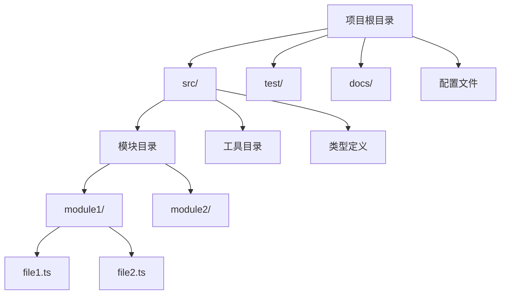

#### 技术栈图
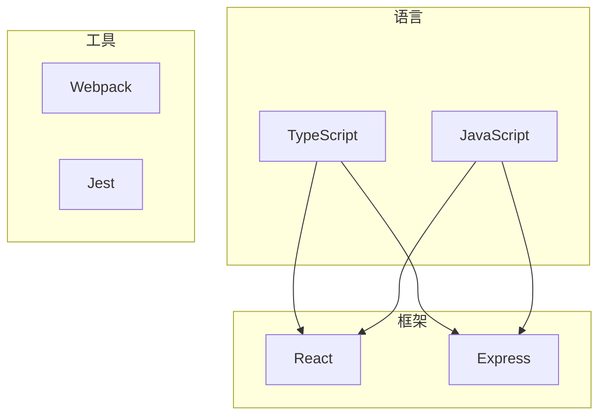

### 2.2 阶段2：功能树
#### 功能层次图
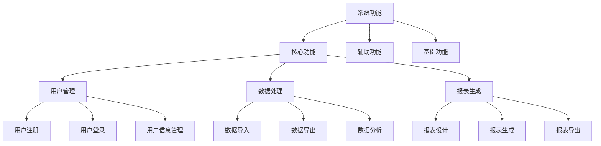

#### 功能依赖图
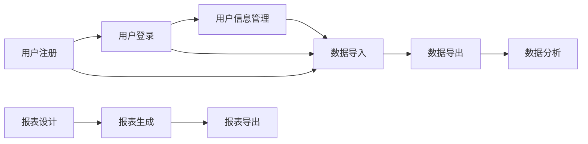

### 2.3 阶段2：模块关系
#### 模块依赖图
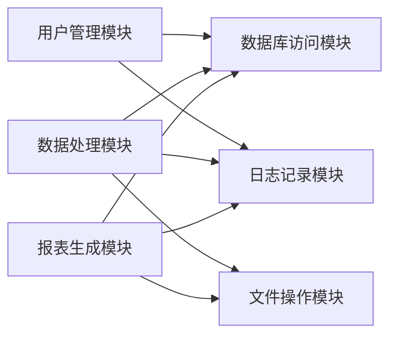

#### 功能到模块映射图
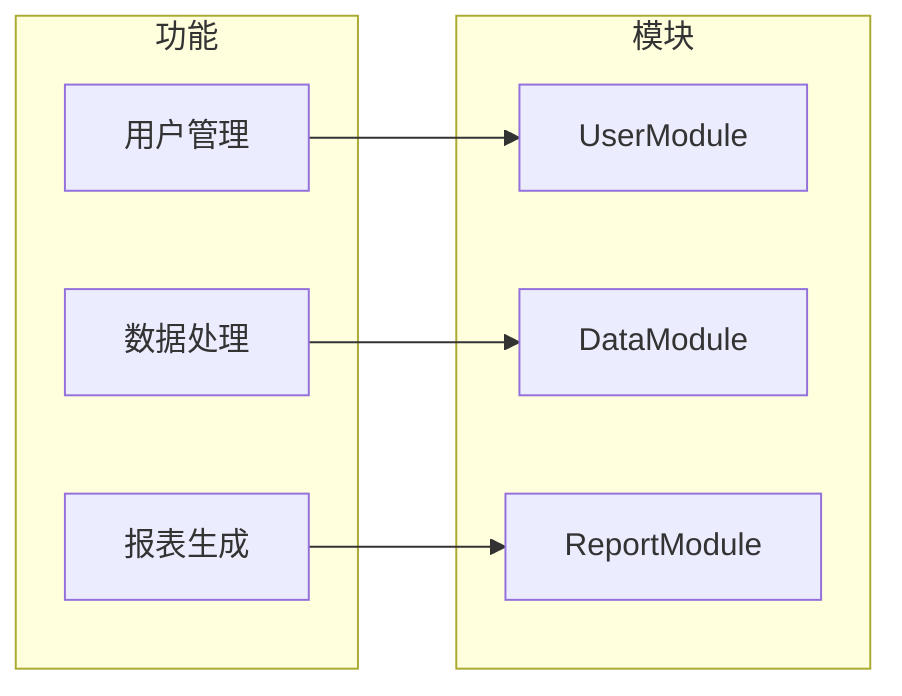

### 2.4 阶段3：数据流
#### 数据流图
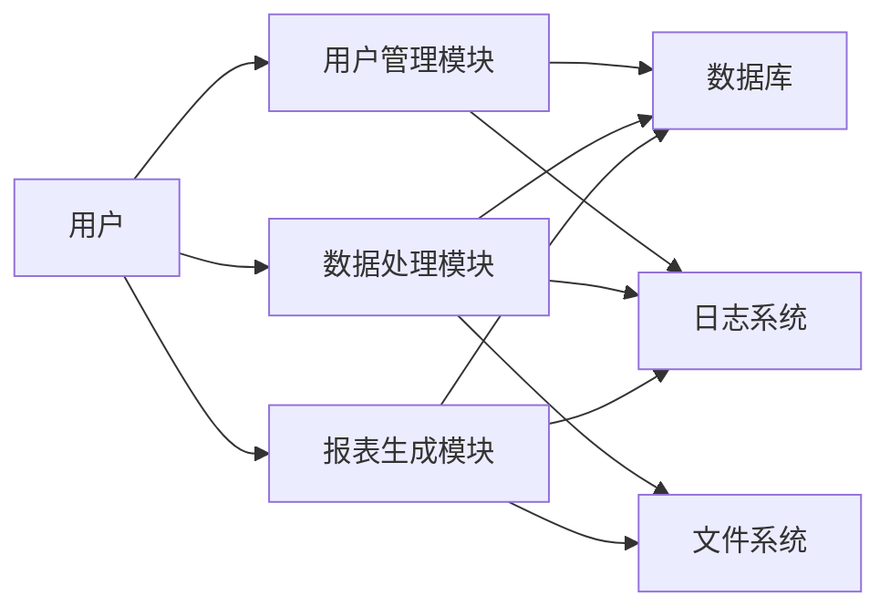

#### 数据转换图
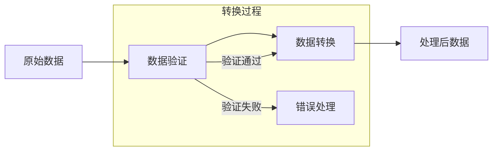

### 2.5 阶段3：接口契约
#### 调用链图
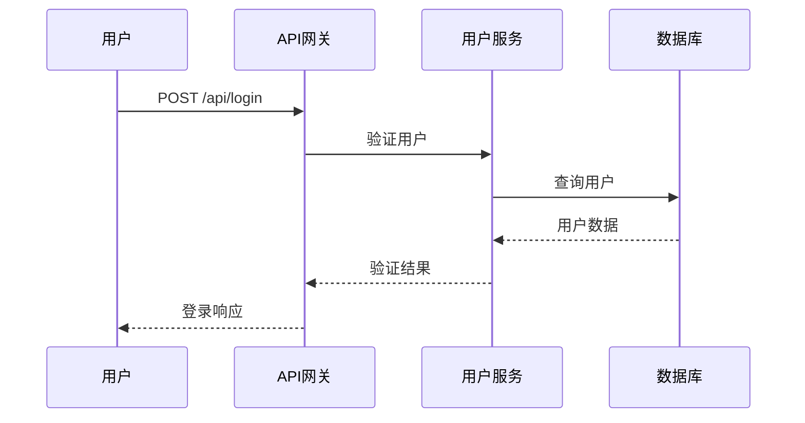

#### 接口图
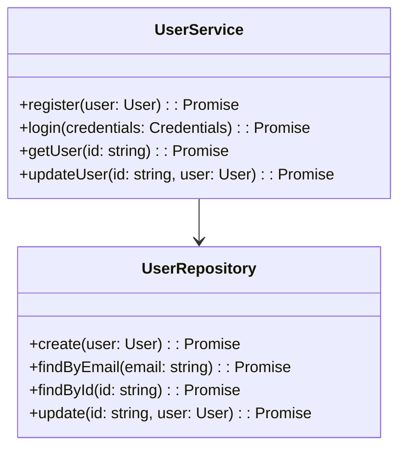

### 2.6 阶段4：最终报告
#### 完整架构图
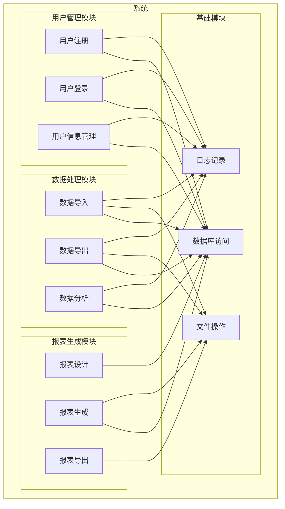

## 3. 图表规范

### 3.1 命名规范
1. **节点命名**：使用中文，简洁明了
2. **边命名**：使用中文，描述关系
3. **子图命名**：使用中文，描述模块或功能组

### 3.2 样式规范
1. **颜色**：使用默认Mermaid颜色
2. **形状**：使用标准形状
3. **布局**：根据图表类型选择合适的布局

### 3.3 大小限制
1. **最大节点数**：50
2. **最大边数**：100
3. **最大嵌套深度**：5层

### 3.4 格式要求
1. **标题**：每个图表必须有描述性标题
2. **说明**：复杂图表需要添加说明
3. **引用**：图表中的节点应该与文档中的内容对应

## 4. 图表生成规则

### 4.1 自动生成规则
1. **目录结构图**：从目录结构自动生成
2. **功能树图**：从功能分析自动生成
3. **模块依赖图**：从模块分析自动生成
4. **数据流图**：从数据流分析自动生成

### 4.2 手动生成规则
1. **调用链图**：从代码分析手动生成
2. **接口图**：从接口定义手动生成
3. **完整架构图**：从所有分析结果手动生成

### 4.3 验证规则
1. **语法验证**：验证Mermaid语法是否正确
2. **逻辑验证**：验证图表逻辑是否正确
3. **一致性验证**：验证图表与文档是否一致

## 5. AI开发时的使用方式

### 5.1 理解系统
1. **查看目录结构图**：快速了解项目组织
2. **查看完整架构图**：了解系统整体架构
3. **查看模块依赖图**：了解模块间依赖关系

### 5.2 开发功能
1. **查看功能树图**：确定功能位置
2. **查看功能到模块映射图**：确定实现模块
3. **查看数据流图**：了解数据处理方式

### 5.3 调试问题
1. **查看调用链图**：追踪函数调用过程
2. **查看数据流图**：追踪数据处理过程
3. **查看模块依赖图**：确定影响范围
