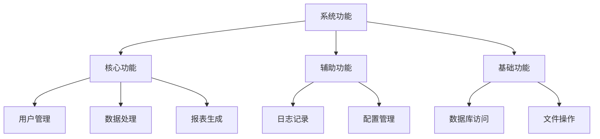
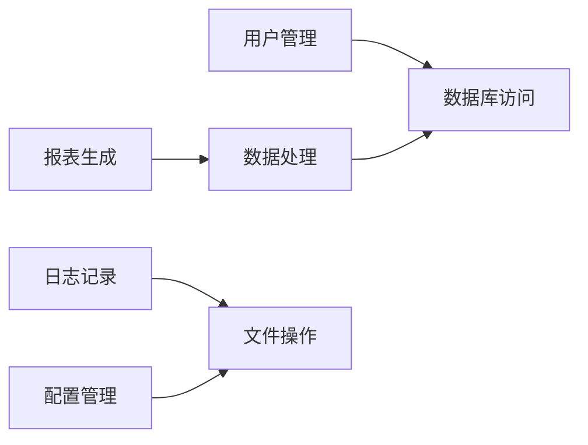
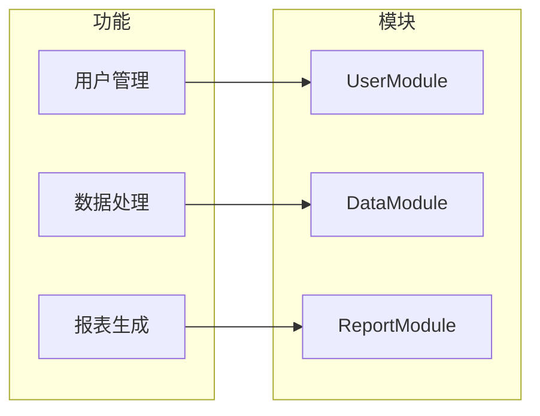

# 功能树设计

## 1. 功能树的概念

功能树是一种层次化的功能分解结构，用于展示系统功能的组织方式和相互关系。

### 1.1 功能树的作用
1. **功能分解**：将复杂的系统功能分解为更小的、可管理的子功能
2. **功能分类**：将功能按照一定的标准进行分类
3. **功能依赖**：展示功能之间的依赖关系
4. **功能到模块映射**：展示功能如何映射到具体的模块

### 1.2 功能树与模块关系图的区别
- **功能树**：从功能角度描述系统，关注"系统做什么"
- **模块关系图**：从实现角度描述系统，关注"系统怎么实现"

## 2. 功能树的结构

### 2.1 层次结构
```
系统功能
├── 核心功能
│   ├── 功能1
│   ├── 功能2
│   └── 功能3
├── 辅助功能
│   ├── 功能4
│   └── 功能5
└── 基础功能
    ├── 功能6
    └── 功能7
```

### 2.2 功能分类
1. **核心功能**：系统的主要业务功能
2. **辅助功能**：支持核心功能的辅助功能
3. **基础功能**：系统运行所需的基础功能

### 2.3 功能属性
每个功能应该包含以下属性：
- **功能ID**：唯一标识符
- **功能名称**：功能的名称
- **功能描述**：功能的详细描述
- **功能类型**：核心/辅助/基础
- **父功能**：上级功能
- **子功能**：下级功能
- **依赖功能**：依赖的其他功能
- **实现模块**：实现该功能的模块

## 3. 功能树的生成方法

### 3.1 功能识别
1. **从入口点开始**：从系统的入口点开始，识别主要的功能流程
2. **从配置文件分析**：从配置文件中识别功能开关和配置项
3. **从API分析**：从API定义中识别对外提供的功能
4. **从测试用例分析**：从测试用例中识别系统功能

### 3.2 功能分类
1. **按业务领域分类**：将功能按照业务领域进行分类
2. **按技术层次分类**：将功能按照技术层次进行分类
3. **按重要性分类**：将功能按照重要性进行分类

### 3.3 功能依赖分析
1. **调用依赖**：一个功能调用另一个功能
2. **数据依赖**：一个功能的输出是另一个功能的输入
3. **时序依赖**：一个功能必须在另一个功能之后执行

## 4. 功能树的Mermaid表示

### 4.1 功能层次图


### 4.2 功能依赖图


### 4.3 功能到模块映射图


## 5. 功能树在AI开发中的作用

### 5.1 帮助AI理解系统
- **快速了解系统功能**：通过功能树可以快速了解系统的主要功能
- **理解功能关系**：通过功能依赖图可以理解功能之间的关系
- **定位实现模块**：通过功能到模块映射可以快速定位实现模块

### 5.2 辅助AI开发
- **新功能开发**：在开发新功能时，可以参考功能树确定功能位置
- **功能修改**：在修改功能时，可以参考功能树了解影响范围
- **功能测试**：在测试功能时，可以参考功能树确定测试范围

### 5.3 支持增量分析
- **增量更新**：当新增功能时，只需要更新功能树的相应部分
- **版本管理**：功能树支持版本管理，可以追踪功能的变化

## 6. 功能树的输出格式

### 6.1 YAML Front Matter
```yaml
---
title: 功能树
version: 1.0
last_updated: YYYY-MM-DD
type: function-tree
metadata:
  total_functions: 10
  core_functions: 5
  auxiliary_functions: 3
  basic_functions: 2
---
```

### 6.2 功能树表格
| 功能ID | 功能名称 | 功能类型 | 描述 | 父功能 | 子功能 | 依赖功能 | 实现模块 |
|--------|----------|----------|------|--------|--------|----------|----------|
| F001 | 用户管理 | 核心 | 管理用户信息 | - | F001.1, F001.2 | - | UserModule |
| F001.1 | 用户注册 | 核心 | 注册新用户 | F001 | - | F006 | UserModule |
| F001.2 | 用户登录 | 核心 | 用户登录验证 | F001 | - | F006 | UserModule |

### 6.3 功能依赖表格
| 功能 | 依赖功能 | 依赖类型 | 描述 |
|------|----------|----------|------|
| F001.1 | F006 | 数据依赖 | 用户注册需要数据库访问 |
| F001.2 | F006 | 数据依赖 | 用户登录需要数据库访问 |

### 6.4 功能到模块映射表格
| 功能ID | 功能名称 | 模块ID | 模块名称 | 文件路径 |
|--------|----------|--------|----------|----------|
| F001 | 用户管理 | M001 | UserModule | src/modules/user/ |
| F002 | 数据处理 | M002 | DataModule | src/modules/data/ |
