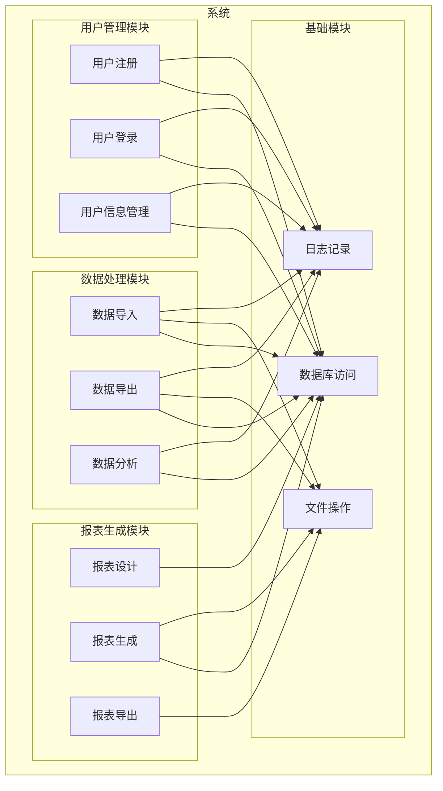
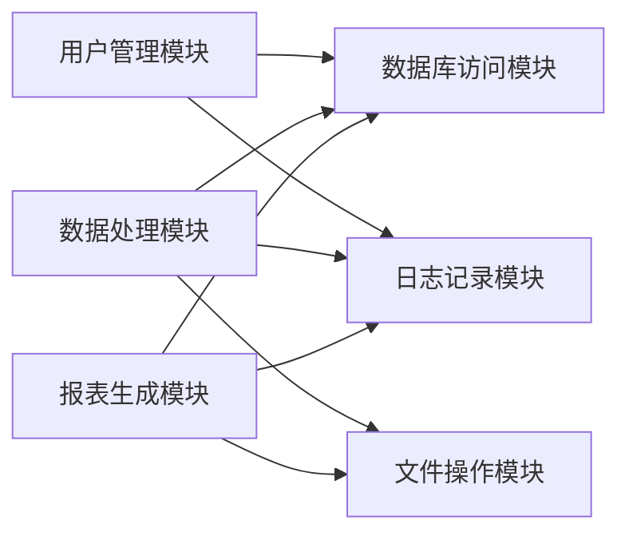
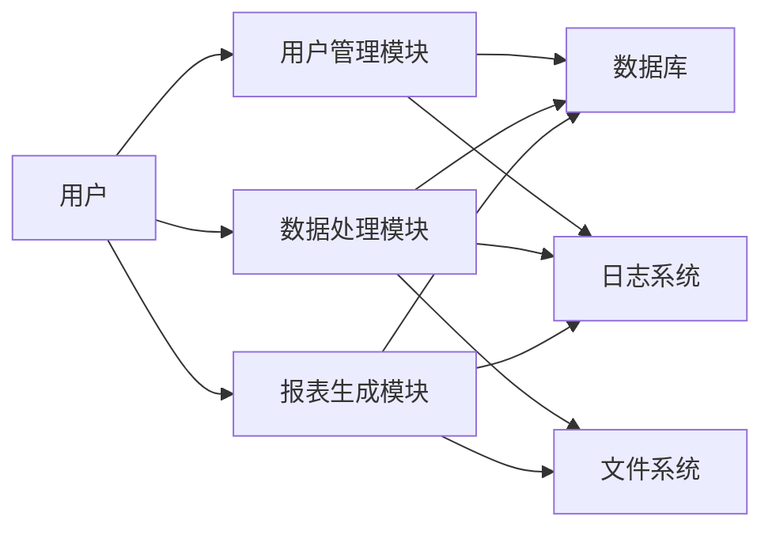

# 修补机制和最终报告设计

## 1. 修补机制的概念

修补机制是项目分析工作流的最后一个阶段，用于检查分析完整性，修补前几个阶段的输出，最终生成一个完整的分析报告。

### 1.1 修补机制的作用
1. **完整性检查**：检查前几个阶段的输出是否完整
2. **一致性检查**：检查前几个阶段的输出是否一致
3. **缺陷识别**：识别分析中的缺陷和问题
4. **修补输出**：修补前几个阶段的输出文件
5. **生成报告**：生成最终的分析报告

### 1.2 修补机制与覆盖率检查的区别
- **覆盖率检查**：只检查覆盖率，不修补输出
- **修补机制**：检查覆盖率，并修补输出

## 2. 检查维度

### 2.1 完整性检查
1. **项目概览完整性**：检查项目概览是否包含所有必要信息
2. **功能树完整性**：检查功能树是否包含所有功能
3. **模块关系完整性**：检查模块关系是否包含所有模块
4. **接口契约完整性**：检查接口契约是否包含所有接口
5. **数据流完整性**：检查数据流是否包含所有数据流

### 2.2 一致性检查
1. **功能-模块映射一致性**：检查功能到模块的映射是否一致
2. **接口-实现对应一致性**：检查接口定义与实现是否一致
3. **数据流-接口对应一致性**：检查数据流与接口定义是否一致
4. **依赖关系一致性**：检查依赖关系是否一致

### 2.3 质量检查
1. **图表质量**：检查Mermaid图表是否正确
2. **代码引用质量**：检查代码引用是否有效
3. **文档格式质量**：检查文档格式是否正确

## 3. 缺陷类型

### 3.1 缺失类缺陷
1. **缺失组件**：清单中的组件没有对应的分析文件
2. **缺失文件**：引用的文件在代码库中不存在
3. **缺失API**：代码中存在的API没有在接口契约中记录
4. **缺失图表**：缺少必要的Mermaid图表

### 3.2 不一致类缺陷
1. **名称不一致**：组件名称在不同文件中不一致
2. **依赖不一致**：依赖关系在不同文件中不一致
3. **接口不一致**：接口定义在不同文件中不一致

### 3.3 质量类缺陷
1. **图表错误**：Mermaid图表语法错误
2. **引用无效**：代码引用指向不存在的文件
3. **格式错误**：文档格式错误

## 4. 修补流程

### 4.1 修补流程图
```mermaid
graph TD
  start[开始修补] --> check[检查前3阶段输出]
  check --> completeness[完整性检查]
  check --> consistency[一致性检查]
  check --> quality[质量检查]
  
  completeness --> defects1[识别缺失缺陷]
  consistency --> defects2[识别不一致缺陷]
  quality --> defects3[识别质量缺陷]
  
  defects1 --> patch1[修补缺失]
  defects2 --> patch2[修补不一致]
  defects3 --> patch3[修补质量]
  
  patch1 --> verify[验证修补]
  patch2 --> verify
  patch3 --> verify
  
  verify --> report[生成最终报告]
  report --> end[结束]
```

### 4.2 修补步骤
1. **读取前3阶段输出**：读取所有前3阶段的输出文件
2. **执行检查**：执行完整性、一致性和质量检查
3. **识别缺陷**：识别所有缺陷
4. **修补文件**：修补前3阶段的输出文件
5. **验证修补**：验证修补是否正确
6. **生成报告**：生成最终的分析报告

## 5. 最终报告设计

### 5.1 报告结构
```yaml
---
title: 最终分析报告
version: 1.0
last_updated: YYYY-MM-DD
type: analysis-report
metadata:
  project_name: string
  analysis_time: string
  analysis_stages: 4
  overall_status: string
  total_defects: number
  fixed_defects: number
  remaining_defects: number
---

# 最终分析报告

## 分析摘要
...

## 完整性检查
...

## 一致性检查
...

## 发现的缺陷
...

## 修补说明
...

## 最终状态
...

## 完整的项目架构图
...
```

### 5.2 报告内容
1. **分析摘要**：项目基本信息和分析概况
2. **完整性检查**：检查前3阶段输出的完整性
3. **一致性检查**：检查前3阶段输出的一致性
4. **发现的缺陷**：列出所有发现的缺陷
5. **修补说明**：说明如何修补这些缺陷
6. **最终状态**：修补后的最终状态
7. **完整的项目架构图**：包含所有组件、模块、系统的完整架构图

## 6. 修补的实现

### 6.1 修补项目概览
```markdown
# 项目概览

## 基本信息
- 项目名称: {name}
- 项目描述: {description}  # 修补：补充缺失的描述
- 主要语言: {language}
- 项目类型: {type}

## 技术栈
### 语言
- {language1}: {version}
- {language2}: {version}

### 框架
- {framework1}: {version}  # 修补：补充缺失的框架
- {framework2}: {version}

### 依赖
| 名称 | 版本 | 用途 |
|------|------|------|
| {dep1} | {version} | {purpose} |
| {dep2} | {version} | {purpose} |  # 修补：补充缺失的依赖
```

### 6.2 修补功能树
```markdown
# 功能树

## 功能层次结构
```mermaid
graph TD
  root[系统功能] --> f1[功能1]
  root --> f2[功能2]
  f1 --> f11[子功能1.1]
  f1 --> f12[子功能1.2]
  f2 --> f21[子功能2.1]  # 修补：补充缺失的功能
```

## 功能说明
| 功能ID | 功能名称 | 描述 | 父功能 | 子功能 |
|--------|----------|------|--------|--------|
| F001 | {name} | {description} | {parent} | {children} |
| F002 | {name} | {description} | {parent} | {children} |  # 修补：补充缺失的功能
```

### 6.3 修补模块关系
```markdown
# 模块关系

## 模块清单
| 模块ID | 模块名称 | 描述 | 路径 | 类型 |
|--------|----------|------|------|------|
| M001 | {name} | {description} | {path} | {type} |
| M002 | {name} | {description} | {path} | {type} |  # 修补：补充缺失的模块

## 模块依赖关系
```mermaid
graph LR
  m1[模块1] --> m2[模块2]
  m2 --> m3[模块3]  # 修补：补充缺失的依赖关系
```
```

### 6.4 修补接口契约
```markdown
# 接口契约

## API 清单
| API ID | API 名称 | 类型 | 模块 | 路径 | 签名 |
|--------|----------|------|------|------|------|
| A001 | {name} | {type} | {module} | {path} | {signature} |
| A002 | {name} | {type} | {module} | {path} | {signature} |  # 修补：补充缺失的API

## 函数签名
### 模块: {module_name}
| 函数名 | 参数 | 返回值 | 异常 | 描述 |
|--------|------|--------|------|------|
| {function} | {params} | {return} | {exceptions} | {description} |
| {function2} | {params} | {return} | {exceptions} | {description} |  # 修补：补充缺失的函数
```

### 6.5 修补数据流
```markdown
# 数据流

## 数据模型
| 模型ID | 模型名称 | 字段 | 描述 |
|--------|----------|------|------|
| D001 | {name} | {fields} | {description} |
| D002 | {name} | {fields} | {description} |  # 修补：补充缺失的数据模型

## 数据流图
```mermaid
graph LR
  input[输入] --> process[处理]
  process --> output[输出]
  process --> storage[存储]  # 修补：补充缺失的数据流
```
```

## 7. 最终报告中的架构图

### 7.1 完整的项目架构图


### 7.2 模块依赖图


### 7.3 数据流图


## 8. AI开发时的使用方式

### 8.1 新功能开发
当AI需要开发新功能时：
1. 查看功能树，确定新功能的位置
2. 查看模块关系，确定实现模块
3. 查看接口契约，确定接口设计
4. 查看数据流，确定数据处理方式

### 8.2 功能修改
当AI需要修改功能时：
1. 查看功能树，了解功能依赖关系
2. 查看模块关系，了解模块依赖关系
3. 查看接口契约，了解接口定义
4. 查看数据流，了解数据处理方式
5. 确定修改影响范围

### 8.3 问题调试
当AI需要调试问题时：
1. 查看数据流，追踪数据处理过程
2. 查看接口契约，了解接口定义
3. 查看模块关系，了解模块依赖关系
4. 定位问题所在模块
