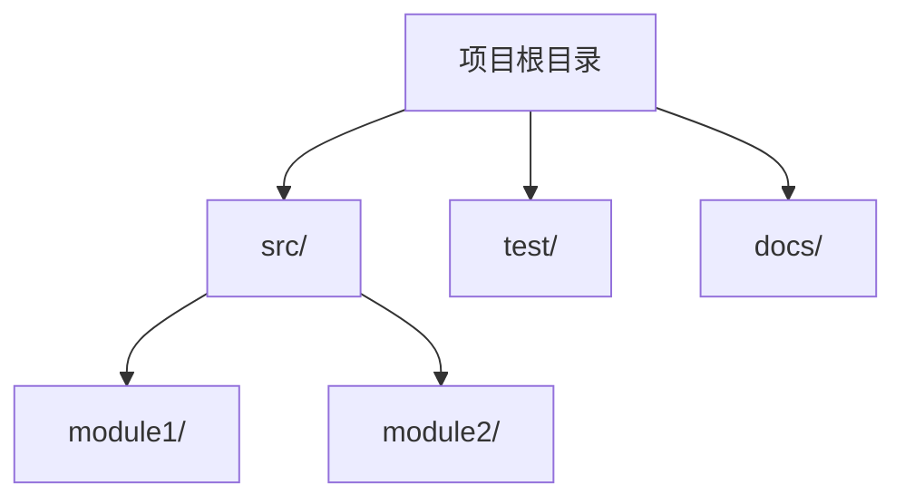
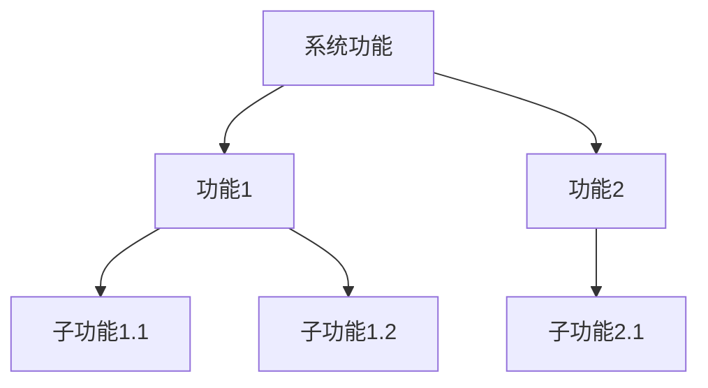
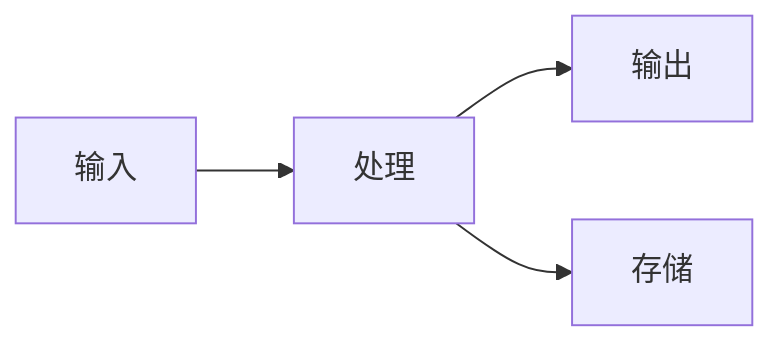
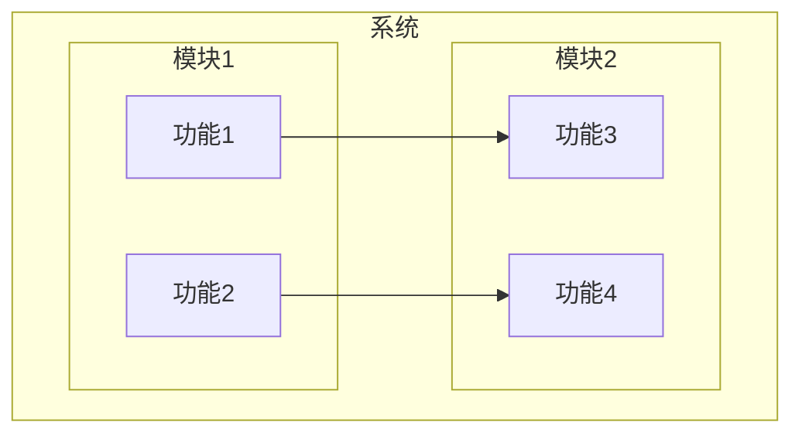

# Project Analysis Workflow 重构设计

## 1. 当前问题分析

### 1.1 文件过多
当前输出文件：
- `architecture.md` - 系统架构分析
- `components-manifest.md` - 组件清单
- `api-catalog.md` - API目录
- `source-overview.md` - 源码概览
- `components/{componentSlug}.md` - 每个组件的分析文件
- `component-analysis-summary.md` - 组件分析汇总
- `coverage-report.md` - 覆盖率报告

**问题**：AI需要读取多个文件才能获得完整信息，效率低下。

### 1.2 缺少功能树
当前第二阶段是逐个组件分析，但没有建立功能树来展示功能之间的关系。

### 1.3 第三阶段只输出报告，没有修补
当前第三阶段是诊断检查，只输出覆盖率报告，没有对前两个阶段的输出进行修补。

### 1.4 图表不够多
目前要求有Mermaid图表，但可能不够多来展示组件、模块、系统之间的关系。

### 1.5 没有考虑AI开发时的探索需求
AI在开发时通常需要了解：
- 模块之间的关系
- 模块的接口
- 数据流
- 调用链
- 依赖关系

### 1.6 文档格式可扩展性不足
目前是Markdown格式，但可能需要更好的结构来支持扩展。

## 2. AI开发时的探索需求分析

### 2.1 AI探索代码的典型模式
1. **从入口开始**：找到main函数或主要入口点
2. **追踪调用链**：了解函数调用关系
3. **理解模块关系**：了解模块之间的依赖关系
4. **查看接口定义**：了解模块的对外接口
5. **分析数据流**：了解数据如何在系统中流动

### 2.2 AI需要的信息
- **目录结构**：快速了解项目组织
- **模块关系图**：了解模块之间的依赖关系
- **接口清单**：了解每个模块的对外接口
- **数据流图**：了解数据如何在系统中流动
- **调用链**：了解函数调用关系
- **功能树**：了解功能之间的关系

### 2.3 持久化需求
- 分析结果需要持久化，避免重复分析
- 需要考虑增量更新
- 需要考虑版本管理

## 3. 新的分析流程设计

### 3.1 阶段1：项目概览分析
**目标**：建立项目的基础认知，生成项目概览和目录结构

**输入**：
- 项目路径（用户提供）

**输出**：
- `project-overview.md` - 项目概览

**分析维度**：
1. 项目基本信息
2. 技术栈识别
3. 目录结构分析
4. 入口点定位
5. 配置文件分析

**输出规格**：
```yaml
---
title: 项目概览
version: 1.0
last_updated: YYYY-MM-DD
type: project-overview
sections:
  - basic_info
  - tech_stack
  - directory_structure
  - entry_points
  - configuration
---

# 项目概览

## 基本信息
- 项目名称: {name}
- 项目描述: {description}
- 主要语言: {language}
- 项目类型: {type}

## 技术栈
### 语言
- {language1}: {version}
- {language2}: {version}

### 框架
- {framework1}: {version}
- {framework2}: {version}

### 依赖
| 名称 | 版本 | 用途 |
|------|------|------|
| {dep1} | {version} | {purpose} |

## 目录结构


### 目录说明
| 目录 | 用途 |
|------|------|
| src/ | 源代码目录 |
| test/ | 测试代码目录 |
| docs/ | 文档目录 |

## 入口点
### 主入口
- 文件: {entry_file}
- 函数: {entry_function}
- 描述: {description}

### 其他入口
| 文件 | 函数 | 描述 |
|------|------|------|
| {file} | {function} | {description} |

## 配置文件
| 文件 | 用途 |
|------|------|
| {config_file} | {purpose} |
```

### 3.2 阶段2：功能树和模块分析
**目标**：建立功能树，分析模块关系

**输入**：
- `project-overview.md` - 阶段1输出

**输出**：
- `function-tree.md` - 功能树
- `module-relationships.md` - 模块关系

**分析维度**：
1. 功能识别
2. 功能分类
3. 功能依赖分析
4. 模块识别
5. 模块依赖分析
6. 模块接口分析

**输出规格 - function-tree.md**：
```yaml
---
title: 功能树
version: 1.0
last_updated: YYYY-MM-DD
type: function-tree
sections:
  - function_hierarchy
  - function_dependencies
  - function_to_module_mapping
---

# 功能树

## 功能层次结构


### 功能说明
| 功能ID | 功能名称 | 描述 | 父功能 | 子功能 |
|--------|----------|------|--------|--------|
| F001 | {name} | {description} | {parent} | {children} |

## 功能依赖关系


### 依赖说明
| 功能 | 依赖功能 | 依赖类型 | 描述 |
|------|----------|----------|------|
| {function} | {dependency} | {type} | {description} |

## 功能到模块映射
| 功能ID | 功能名称 | 模块ID | 模块名称 | 文件路径 |
|--------|----------|--------|----------|----------|
| F001 | {function} | M001 | {module} | {path} |
```

**输出规格 - module-relationships.md**：
```yaml
---
title: 模块关系
version: 1.0
last_updated: YYYY-MM-DD
type: module-relationships
sections:
  - module_list
  - module_dependencies
  - module_interfaces
  - data_flow
---

# 模块关系

## 模块清单
| 模块ID | 模块名称 | 描述 | 路径 | 类型 |
|--------|----------|------|------|------|
| M001 | {name} | {description} | {path} | {type} |

## 模块依赖关系


### 依赖说明
| 模块 | 依赖模块 | 依赖类型 | 描述 |
|------|----------|----------|------|
| {module} | {dependency} | {type} | {description} |

## 模块接口清单
| 模块ID | 接口名称 | 接口类型 | 描述 |
|--------|----------|----------|------|
| M001 | {interface} | {type} | {description} |

## 模块间数据流

```

### 3.3 阶段3：接口和数据流分析
**目标**：分析接口契约和数据流

**输入**：
- `function-tree.md` - 阶段2输出
- `module-relationships.md` - 阶段2输出

**输出**：
- `interface-contracts.md` - 接口契约
- `data-flow.md` - 数据流

**分析维度**：
1. API识别
2. 函数签名分析
3. 参数和返回值分析
4. 数据流追踪
5. 数据转换分析
6. 数据存储分析

**输出规格 - interface-contracts.md**：
```yaml
---
title: 接口契约
version: 1.0
last_updated: YYYY-MM-DD
type: interface-contracts
sections:
  - api_catalog
  - function_signatures
  - error_contracts
---

# 接口契约

## API 清单
| API ID | API 名称 | 类型 | 模块 | 路径 | 签名 |
|--------|----------|------|------|------|------|
| A001 | {name} | {type} | {module} | {path} | {signature} |

## 函数签名
### 模块: {module_name}
| 函数名 | 参数 | 返回值 | 异常 | 描述 |
|--------|------|--------|------|------|
| {function} | {params} | {return} | {exceptions} | {description} |

### 参数说明
| 函数 | 参数名 | 类型 | 必需 | 默认值 | 描述 |
|------|--------|------|------|--------|------|
| {function} | {param} | {type} | {required} | {default} | {description} |

## 错误契约
| 错误码 | 错误名称 | 描述 | 处理建议 |
|--------|----------|------|----------|
| E001 | {name} | {description} | {suggestion} |
```

**输出规格 - data-flow.md**：
```yaml
---
title: 数据流
version: 1.0
last_updated: YYYY-MM-DD
type: data-flow
sections:
  - data_models
  - data_flow_diagrams
  - data_transformations
  - data_storage
---

# 数据流

## 数据模型
| 模型ID | 模型名称 | 字段 | 描述 |
|--------|----------|------|------|
| D001 | {name} | {fields} | {description} |

## 数据流图


### 数据流说明
| 来源 | 目标 | 数据 | 描述 |
|------|------|------|------|
| {source} | {target} | {data} | {description} |

## 数据转换
| 转换ID | 输入 | 输出 | 描述 |
|--------|------|------|------|
| T001 | {input} | {output} | {description} |

## 数据存储
| 存储ID | 类型 | 位置 | 描述 |
|--------|------|------|------|
| S001 | {type} | {location} | {description} |
```

### 3.4 阶段4：缺陷检查和修补
**目标**：检查分析完整性，修补前几个阶段的输出

**输入**：
- `project-overview.md` - 阶段1输出
- `function-tree.md` - 阶段2输出
- `module-relationships.md` - 阶段2输出
- `interface-contracts.md` - 阶段3输出
- `data-flow.md` - 阶段3输出

**输出**：
- `analysis-report.md` - 最终分析报告

**分析维度**：
1. 完整性检查
2. 一致性检查
3. 缺陷识别
4. 修补建议
5. 最终报告生成

**输出规格 - analysis-report.md**：
```yaml
---
title: 最终分析报告
version: 1.0
last_updated: YYYY-MM-DD
type: analysis-report
sections:
  - summary
  - completeness_check
  - consistency_check
  - defects_found
  - patches_applied
  - final_status
---

# 最终分析报告

## 分析摘要
- 项目名称: {name}
- 分析时间: {time}
- 分析阶段: 4
- 总体状态: {status}

## 完整性检查
### 检查结果
| 检查项 | 状态 | 描述 |
|--------|------|------|
| 项目概览 | ✅/❌ | {description} |
| 功能树 | ✅/❌ | {description} |
| 模块关系 | ✅/❌ | {description} |
| 接口契约 | ✅/❌ | {description} |
| 数据流 | ✅/❌ | {description} |

### 缺失项
| 缺失项 | 严重性 | 描述 |
|--------|--------|------|
| {item} | {severity} | {description} |

## 一致性检查
### 检查结果
| 检查项 | 状态 | 描述 |
|--------|------|------|
| 功能-模块映射 | ✅/❌ | {description} |
| 接口-实现对应 | ✅/❌ | {description} |
| 数据流-接口对应 | ✅/❌ | {description} |

### 不一致项
| 不一致项 | 严重性 | 描述 |
|----------|--------|------|
| {item} | {severity} | {description} |

## 发现的缺陷
| 缺陷ID | 缺陷类型 | 严重性 | 描述 | 影响范围 |
|--------|----------|--------|------|----------|
| D001 | {type} | {severity} | {description} | {scope} |

## 修补说明
### 修补的文件
| 文件 | 修补内容 | 修补原因 |
|------|----------|----------|
| {file} | {content} | {reason} |

### 修补详情
#### 缺陷: {defect_id}
- **问题**: {problem}
- **修补**: {patch}
- **验证**: {verification}

## 最终状态
- 修补完成: {completed}
- 剩余缺陷: {remaining}
- 建议: {suggestion}

## 完整的项目架构图

```

## 4. 文档格式设计

### 4.1 可扩展性设计
1. **使用YAML Front Matter**：在Markdown文件中使用YAML Front Matter存储元数据
2. **模块化章节**：每个章节独立，便于扩展
3. **版本标记**：在文档中标记版本信息
4. **增量更新支持**：支持部分更新，避免全量重写

### 4.2 文档结构
```markdown
---
title: 项目概览
version: 1.0
last_updated: 2026-03-22
sections:
  - basic_info
  - tech_stack
  - directory_structure
  - entry_points
---

# 项目概览

## 基本信息
...

## 技术栈
...

## 目录结构
...

## 入口点
...
```

## 5. 图表设计

### 5.1 需要的图表类型
1. **目录结构图** - `graph TD`
2. **模块依赖图** - `graph LR`
3. **功能树图** - `graph TD`
4. **数据流图** - `graph LR`
5. **调用链图** - `sequenceDiagram`
6. **接口图** - `classDiagram`

### 5.2 图表规范
1. 每个图表必须有描述性标题
2. 节点使用相对路径
3. 边类型要明确标注
4. 图表大小限制：最大50个节点，100条边

## 6. 输出文件结构

### 6.1 新的输出文件结构
```
.hyper-designer/projectAnalysis/
├── project-overview.md          # 项目概览（阶段1输出）
├── function-tree.md             # 功能树（阶段2输出）
├── module-relationships.md      # 模块关系（阶段2输出）
├── interface-contracts.md       # 接口契约（阶段3输出）
├── data-flow.md                 # 数据流（阶段3输出）
└── analysis-report.md           # 最终分析报告（阶段4输出）
```

### 6.2 文件数量对比
- **原来**：7个文件 + 1个文件夹
- **现在**：6个文件

## 7. 阶段间关系

### 7.1 输入输出关系
```
阶段1: 项目概览分析
  输入: 项目路径
  输出: project-overview.md
  ↓
阶段2: 功能树和模块分析
  输入: project-overview.md
  输出: function-tree.md, module-relationships.md
  ↓
阶段3: 接口和数据流分析
  输入: function-tree.md, module-relationships.md
  输出: interface-contracts.md, data-flow.md
  ↓
阶段4: 缺陷检查和修补
  输入: 所有前3个阶段的输出
  输出: analysis-report.md（包含修补说明）
```

## 8. 修补机制设计

### 8.1 修补流程
1. 检查前3个阶段的输出
2. 识别缺失或不一致的地方
3. 修补前3个阶段的输出文件
4. 生成最终报告，说明修补内容

### 8.2 修补内容
1. **缺失组件**：补充缺失的组件分析
2. **缺失文件**：补充缺失的文件引用
3. **缺失API**：补充缺失的API分析
4. **不一致**：修复不一致的地方
5. **图表缺失**：补充缺失的图表

## 9. 参考OpenDeepWiki

### 9.1 可借鉴的点
1. **智能目录过滤**：使用AI进行智能过滤
2. **分层分析**：从目录结构到文件内容
3. **知识库生成**：生成可查询的知识库
4. **MCP支持**：支持Model Context Protocol

### 9.2 改进点
1. **更智能的组件发现**：使用AI进行智能组件发现
2. **更完整的分析**：覆盖更多的分析维度
3. **更好的图表**：生成更多的Mermaid图表
4. **更好的可扩展性**：支持增量更新和扩展
