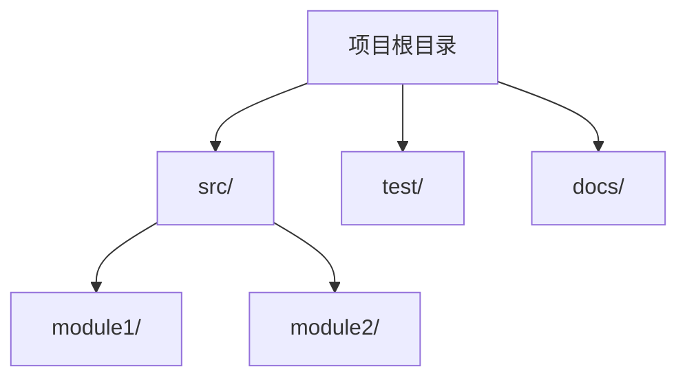
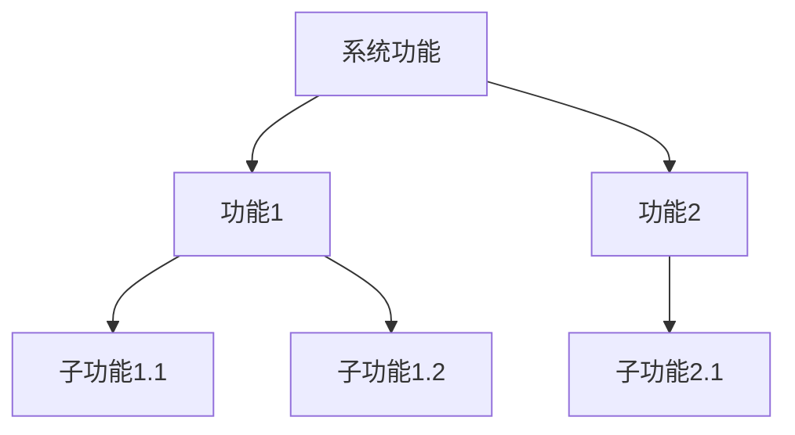
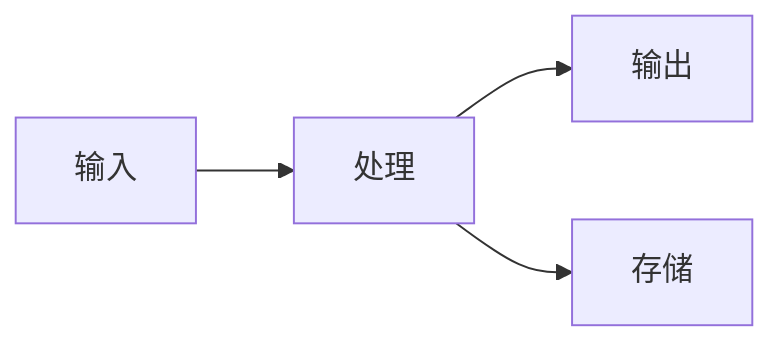
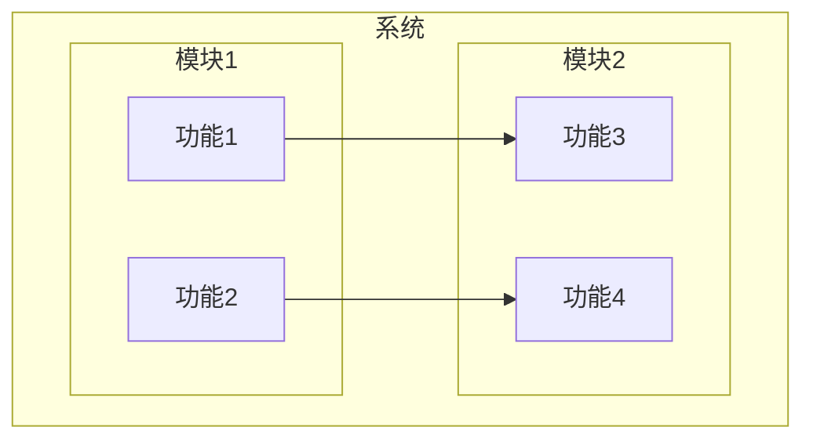

# Skill方法论和输出模板重构设计

## 1. 当前Skill分析

### 1.1 当前SKILL.md
```markdown
---
name: projectAnalysis
description: Execute the 3-stage project analysis workflow with reusable method guidance and standardized Markdown outputs.
---

# Project Analysis Skill

Use this skill as the single methodology source for the `projectAnalysis` workflow.

## Progressive Disclosure
- Keep workflow prompts minimal (only stage routing and execution intent).
- Put all detailed methodology, checklists, and output templates in `references/*.md`.
- Load only the current-stage reference to control context size.

## Stage Routing
Before reading stage-specific reference, always read shared reference:
- `references/workflowShared.md`
- If current stage is `systemAnalysis`, read `references/systemAnalysis.md`.
- If current stage is `componentAnalysis`, read `references/componentAnalysis.md`.
- If current stage is `missingCoverageCheck`, read `references/missingCoverageCheck.md`.

## Shared Output Contract
- Output root: `./.hyper-designer/projectAnalysis/`
- Output format: Markdown only (`.md`)
- Use relative paths in all code/file references.
- Keep stage boundaries strict: only produce outputs required by current stage.
```

### 1.2 当前问题
1. **阶段定义过时**：当前阶段是systemAnalysis、componentAnalysis、missingCoverageCheck
2. **参考文档不完整**：缺少新的4阶段流程的参考文档
3. **方法论不够详细**：需要更详细的方法论指导

## 2. 新的Skill设计

### 2.1 新的SKILL.md
```markdown
---
name: projectAnalysis
description: Execute the 4-stage project analysis workflow with reusable method guidance and standardized Markdown outputs. Use when working on hyper-designer projectAnalysis stages (projectOverview, functionTreeAndModule, interfaceAndDataFlow, defectCheckAndPatch), when the workflow asks to read references/*.md, or when generating architecture/function/module/interface/flow analysis artifacts under .hyper-designer/projectAnalysis/.
---

# Project Analysis Skill

Use this skill as the single methodology source for the `projectAnalysis` workflow.

## Progressive Disclosure
- Keep workflow prompts minimal (only stage routing and execution intent).
- Put all detailed methodology, checklists, and output templates in `references/*.md`.
- Load only the current-stage reference to control context size.

## Stage Routing
Before reading stage-specific reference, always read shared reference:
- `references/workflowShared.md`
- If current stage is `projectOverview`, read `references/projectOverview.md`.
- If current stage is `functionTreeAndModule`, read `references/functionTreeAndModule.md`.
- If current stage is `interfaceAndDataFlow`, read `references/interfaceAndDataFlow.md`.
- If current stage is `defectCheckAndPatch`, read `references/defectCheckAndPatch.md`.

Do not skip shared/stage reference files.

## Stage-to-Reference Mapping
- shared → `references/workflowShared.md`
- `projectOverview` → `references/projectOverview.md`
- `functionTreeAndModule` → `references/functionTreeAndModule.md`
- `interfaceAndDataFlow` → `references/interfaceAndDataFlow.md`
- `defectCheckAndPatch` → `references/defectCheckAndPatch.md`

## Shared Output Contract
- Output root: `./.hyper-designer/projectAnalysis/`
- Output format: Markdown with YAML Front Matter (`.md`)
- Use relative paths in all code/file references.
- Keep stage boundaries strict: only produce outputs required by current stage.

## Execution Discipline
1. Read only the current stage reference.
2. Produce all required outputs listed in that reference.
3. Ensure outputs are deterministic and directly reusable by the next stage.
4. Keep all paths relative (no machine-specific absolute paths).
5. Generate Mermaid diagrams for all relationships.
6. Use YAML Front Matter for all documents.
7. Support extensibility for future additions.
```

## 3. 参考文档设计

### 3.1 workflowShared.md
```markdown
# Project Analysis Workflow Shared Reference

## 术语表
| 术语 | 定义 |
|------|------|
| **目标项目 (Target Project)** | 被分析的外部项目 |
| **分析根目录 (Analysis Root)** | 目标项目中的 `./.hyper-designer/projectAnalysis/` 目录 |
| **功能 (Function)** | 系统提供的业务功能 |
| **模块 (Module)** | 具有清晰职责边界的代码逻辑单元 |
| **接口 (Interface)** | 模块对外提供的API或函数 |
| **数据流 (Data Flow)** | 数据在系统中的流动过程 |

## 输出文件约定
所有分析工件以纯 Markdown 格式输出，使用 YAML Front Matter 存储元数据。

### 输出目录结构
```
.hyper-designer/projectAnalysis/
├── project-overview.md          # 项目概览
├── function-tree.md             # 功能树
├── module-relationships.md      # 模块关系
├── interface-contracts.md       # 接口契约
├── data-flow.md                 # 数据流
└── analysis-report.md           # 最终分析报告
```

### Markdown 驱动的交接
所有阶段通过 `.md` 文件交换数据。下游阶段不得重新扫描源代码，必须使用上游阶段生成的 Markdown 文件作为唯一事实来源。

## Mermaid 图表约定
### 支持的图表类型
| 类型 | 用途 | 适用阶段 |
|------|------|----------|
| `graph TD` | 层次结构、目录结构、功能树 | 全部 |
| `graph LR` | 流程、依赖、数据流 | 全部 |
| `sequenceDiagram` | 调用序列 | 阶段3 |
| `classDiagram` | 接口结构 | 阶段3 |

### 图表命名规则
每个图表必须有描述性标题。

### 节点命名约定
- 文件和模块：使用相对于目标项目根目录的完整路径
- 功能：使用功能ID
- 模块：使用模块ID

### 边类型
| 边类型 | 样式 | 含义 |
|--------|------|------|
| 直接依赖 | `-->` | 标准依赖 |
| 弱依赖 | `-.->` | 可选或间接 |
| 双向 | `<-->` | 循环依赖（警告） |
| 数据流 | `==>` | 数据移动 |

### 图表大小限制
- 最大节点数：50
- 最大边数：100
- 最大嵌套深度：5层

## 代码引用规则
所有分析工件必须使用标准化引用格式引用源代码。

### 引用格式
- 行内引用：`[File: 相对路径/文件.ts:行范围]`
- 函数引用：`[Function: 函数名 in File: 相对路径/文件.ts:行范围]`
- 类引用：`[Class: 类名 in File: 相对路径/文件.ts:行范围]`

### 引用规则
1. 使用相对路径，禁止机器绝对路径
2. 行内引用必须包含行范围
3. 引用最小相关单元，避免过宽引用
4. 所有引用必须指向实际存在的文件

## 工作流行为说明
### 非阻塞验证模式
阶段4的缺陷检查是诊断工具，不会阻止工作流推进。

### 增量分析支持
工件支持恢复/重新运行。若现有 Markdown 文件有效，可复用并进行增量补全。

### 可扩展性支持
所有文档格式支持后续扩展，新增功能时只需要更新相应文档。
```

### 3.2 projectOverview.md
```markdown
# projectOverview Reference

## Current Phase: Project Overview

### 阶段定义
**执行者：** HAnalysis  
**核心目标：** 建立项目的基础认知，生成项目概览和目录结构。

**输入依赖：**
- 用户提供的目标项目绝对路径

### 1. 执行流程
#### 1.1 建立分析上下文
采用系统架构师身份，向用户收集目标项目信息：
- **目标项目路径**：项目的绝对路径
- **项目领域**：项目的业务领域和用途
- **分析范围**：分析整个代码库还是特定模块

#### 1.2 扫描分析边界
在深入分析之前，确定分析范围：
**排除目录：**
- `node_modules/`, `.git/`, `dist/`, `build/`, `coverage/`

**排除文件模式：**
- `*.min.js`, `*.min.css`, `*.map`, `*.lock`

#### 1.3 分析项目维度
1. 项目基本信息
2. 技术栈识别
3. 目录结构分析
4. 入口点定位
5. 配置文件分析

#### 1.4 生成输出文件

### 2. 输出文件规格
#### 2.1 project-overview.md — 项目概览
**路径**：`./.hyper-designer/projectAnalysis/project-overview.md`

**必需章节结构：**
```markdown
---
title: 项目概览
version: 1.0
last_updated: YYYY-MM-DD
type: project-overview
sections:
  - basic_info
  - tech_stack
  - directory_structure
  - entry_points
  - configuration
---

# 项目概览

## 基本信息
- 项目名称: {name}
- 项目描述: {description}
- 主要语言: {language}
- 项目类型: {type}

## 技术栈
### 语言
- {language1}: {version}
- {language2}: {version}

### 框架
- {framework1}: {version}
- {framework2}: {version}

### 依赖
| 名称 | 版本 | 用途 |
|------|------|------|
| {dep1} | {version} | {purpose} |

## 目录结构


### 目录说明
| 目录 | 用途 |
|------|------|
| src/ | 源代码目录 |
| test/ | 测试代码目录 |
| docs/ | 文档目录 |

## 入口点
### 主入口
- 文件: {entry_file}
- 函数: {entry_function}
- 描述: {description}

### 其他入口
| 文件 | 函数 | 描述 |
|------|------|------|
| {file} | {function} | {description} |

## 配置文件
| 文件 | 用途 |
|------|------|
| {config_file} | {purpose} |
```

### 3. 完成检查清单
在完成阶段1之前，验证：
- [ ] 目标项目路径已确认且可访问
- [ ] 分析边界已明确定义
- [ ] 所有项目维度已分析并记录
- [ ] project-overview.md 已生成
- [ ] Mermaid 图表已包含且有效
- [ ] 代码引用使用相对路径
- [ ] YAML Front Matter 已包含
```

### 3.3 functionTreeAndModule.md
```markdown
# functionTreeAndModule Reference

## Current Phase: Function Tree and Module

### 阶段定义
**执行者：** HAnalysis  
**核心目标：** 建立功能树，分析模块关系。

**输入依赖：**
- `./.hyper-designer/projectAnalysis/project-overview.md`

### 1. 执行流程
#### 1.1 加载项目概览
从 project-overview.md 读取项目信息。

#### 1.2 建立功能树
1. 识别功能
2. 分类功能
3. 分析功能依赖
4. 建立功能层次结构

#### 1.3 分析模块关系
1. 识别模块
2. 分析模块依赖
3. 分析模块接口
4. 建立模块关系图

#### 1.4 生成输出文件

### 2. 输出文件规格
#### 2.1 function-tree.md — 功能树
**路径**：`./.hyper-designer/projectAnalysis/function-tree.md`

**必需章节结构：**
```markdown
---
title: 功能树
version: 1.0
last_updated: YYYY-MM-DD
type: function-tree
sections:
  - function_hierarchy
  - function_dependencies
  - function_to_module_mapping
---

# 功能树

## 功能层次结构


### 功能说明
| 功能ID | 功能名称 | 描述 | 父功能 | 子功能 |
|--------|----------|------|--------|--------|
| F001 | {name} | {description} | {parent} | {children} |

## 功能依赖关系


### 依赖说明
| 功能 | 依赖功能 | 依赖类型 | 描述 |
|------|----------|----------|------|
| {function} | {dependency} | {type} | {description} |

## 功能到模块映射
| 功能ID | 功能名称 | 模块ID | 模块名称 | 文件路径 |
|--------|----------|--------|----------|----------|
| F001 | {function} | M001 | {module} | {path} |
```

#### 2.2 module-relationships.md — 模块关系
**路径**：`./.hyper-designer/projectAnalysis/module-relationships.md`

**必需章节结构：**
```markdown
---
title: 模块关系
version: 1.0
last_updated: YYYY-MM-DD
type: module-relationships
sections:
  - module_list
  - module_dependencies
  - module_interfaces
  - data_flow
---

# 模块关系

## 模块清单
| 模块ID | 模块名称 | 描述 | 路径 | 类型 |
|--------|----------|------|------|------|
| M001 | {name} | {description} | {path} | {type} |

## 模块依赖关系


### 依赖说明
| 模块 | 依赖模块 | 依赖类型 | 描述 |
|------|----------|----------|------|
| {module} | {dependency} | {type} | {description} |

## 模块接口清单
| 模块ID | 接口名称 | 接口类型 | 描述 |
|--------|----------|----------|------|
| M001 | {interface} | {type} | {description} |

## 模块间数据流

```

### 3. 完成检查清单
在完成阶段2之前，验证：
- [ ] project-overview.md 已读取
- [ ] 功能树已建立
- [ ] 模块关系已分析
- [ ] function-tree.md 已生成
- [ ] module-relationships.md 已生成
- [ ] Mermaid 图表已包含且有效
- [ ] 功能到模块映射已建立
```

### 3.4 interfaceAndDataFlow.md
```markdown
# interfaceAndDataFlow Reference

## Current Phase: Interface and Data Flow

### 阶段定义
**执行者：** HAnalysis  
**核心目标：** 分析接口契约和数据流。

**输入依赖：**
- `./.hyper-designer/projectAnalysis/function-tree.md`
- `./.hyper-designer/projectAnalysis/module-relationships.md`

### 1. 执行流程
#### 1.1 加载功能树和模块关系
从 function-tree.md 和 module-relationships.md 读取信息。

#### 1.2 分析接口契约
1. 识别API
2. 分析函数签名
3. 分析参数和返回值
4. 建立接口图

#### 1.3 分析数据流
1. 追踪数据流
2. 分析数据转换
3. 分析数据存储
4. 建立数据流图

#### 1.4 生成输出文件

### 2. 输出文件规格
#### 2.1 interface-contracts.md — 接口契约
**路径**：`./.hyper-designer/projectAnalysis/interface-contracts.md`

**必需章节结构：**
```markdown
---
title: 接口契约
version: 1.0
last_updated: YYYY-MM-DD
type: interface-contracts
sections:
  - api_catalog
  - function_signatures
  - error_contracts
---

# 接口契约

## API 清单
| API ID | API 名称 | 类型 | 模块 | 路径 | 签名 |
|--------|----------|------|------|------|------|
| A001 | {name} | {type} | {module} | {path} | {signature} |

## 函数签名
### 模块: {module_name}
| 函数名 | 参数 | 返回值 | 异常 | 描述 |
|--------|------|--------|------|------|
| {function} | {params} | {return} | {exceptions} | {description} |

### 参数说明
| 函数 | 参数名 | 类型 | 必需 | 默认值 | 描述 |
|------|--------|------|------|--------|------|
| {function} | {param} | {type} | {required} | {default} | {description} |

## 错误契约
| 错误码 | 错误名称 | 描述 | 处理建议 |
|--------|----------|------|----------|
| E001 | {name} | {description} | {suggestion} |
```

#### 2.2 data-flow.md — 数据流
**路径**：`./.hyper-designer/projectAnalysis/data-flow.md`

**必需章节结构：**
```markdown
---
title: 数据流
version: 1.0
last_updated: YYYY-MM-DD
type: data-flow
sections:
  - data_models
  - data_flow_diagrams
  - data_transformations
  - data_storage
---

# 数据流

## 数据模型
| 模型ID | 模型名称 | 字段 | 描述 |
|--------|----------|------|------|
| D001 | {name} | {fields} | {description} |

## 数据流图


### 数据流说明
| 来源 | 目标 | 数据 | 描述 |
|------|------|------|------|
| {source} | {target} | {data} | {description} |

## 数据转换
| 转换ID | 输入 | 输出 | 描述 |
|--------|------|------|------|
| T001 | {input} | {output} | {description} |

## 数据存储
| 存储ID | 类型 | 位置 | 描述 |
|--------|------|------|------|
| S001 | {type} | {location} | {description} |
```

### 3. 完成检查清单
在完成阶段3之前，验证：
- [ ] function-tree.md 和 module-relationships.md 已读取
- [ ] 接口契约已分析
- [ ] 数据流已分析
- [ ] interface-contracts.md 已生成
- [ ] data-flow.md 已生成
- [ ] Mermaid 图表已包含且有效
- [ ] 接口到模块映射已建立
```

### 3.5 defectCheckAndPatch.md
```markdown
# defectCheckAndPatch Reference

## Current Phase: Defect Check and Patch

### 阶段定义
**执行者：** HAnalysis  
**核心目标：** 检查分析完整性，修补前几个阶段的输出，生成最终报告。

**输入依赖：**
- `./.hyper-designer/projectAnalysis/project-overview.md`
- `./.hyper-designer/projectAnalysis/function-tree.md`
- `./.hyper-designer/projectAnalysis/module-relationships.md`
- `./.hyper-designer/projectAnalysis/interface-contracts.md`
- `./.hyper-designer/projectAnalysis/data-flow.md`

### 1. 执行流程
#### 1.1 加载所有前3阶段输出
读取所有前3阶段的输出文件。

#### 1.2 执行完整性检查
1. 检查项目概览完整性
2. 检查功能树完整性
3. 检查模块关系完整性
4. 检查接口契约完整性
5. 检查数据流完整性

#### 1.3 执行一致性检查
1. 检查功能-模块映射一致性
2. 检查接口-实现对应一致性
3. 检查数据流-接口对应一致性
4. 检查依赖关系一致性

#### 1.4 识别缺陷
1. 缺失类缺陷
2. 不一致类缺陷
3. 质量类缺陷

#### 1.5 修补输出
1. 修补项目概览
2. 修补功能树
3. 修补模块关系
4. 修补接口契约
5. 修补数据流

#### 1.6 生成最终报告

### 2. 输出文件规格
#### 2.1 analysis-report.md — 最终分析报告
**路径**：`./.hyper-designer/projectAnalysis/analysis-report.md`

**必需章节结构：**
```markdown
---
title: 最终分析报告
version: 1.0
last_updated: YYYY-MM-DD
type: analysis-report
sections:
  - summary
  - completeness_check
  - consistency_check
  - defects_found
  - patches_applied
  - final_status
---

# 最终分析报告

## 分析摘要
- 项目名称: {name}
- 分析时间: {time}
- 分析阶段: 4
- 总体状态: {status}

## 完整性检查
### 检查结果
| 检查项 | 状态 | 描述 |
|--------|------|------|
| 项目概览 | ✅/❌ | {description} |
| 功能树 | ✅/❌ | {description} |
| 模块关系 | ✅/❌ | {description} |
| 接口契约 | ✅/❌ | {description} |
| 数据流 | ✅/❌ | {description} |

### 缺失项
| 缺失项 | 严重性 | 描述 |
|--------|--------|------|
| {item} | {severity} | {description} |

## 一致性检查
### 检查结果
| 检查项 | 状态 | 描述 |
|--------|------|------|
| 功能-模块映射 | ✅/❌ | {description} |
| 接口-实现对应 | ✅/❌ | {description} |
| 数据流-接口对应 | ✅/❌ | {description} |

### 不一致项
| 不一致项 | 严重性 | 描述 |
|----------|--------|------|
| {item} | {severity} | {description} |

## 发现的缺陷
| 缺陷ID | 缺陷类型 | 严重性 | 描述 | 影响范围 |
|--------|----------|--------|------|----------|
| D001 | {type} | {severity} | {description} | {scope} |

## 修补说明
### 修补的文件
| 文件 | 修补内容 | 修补原因 |
|------|----------|----------|
| {file} | {content} | {reason} |

### 修补详情
#### 缺陷: {defect_id}
- **问题**: {problem}
- **修补**: {patch}
- **验证**: {verification}

## 最终状态
- 修补完成: {completed}
- 剩余缺陷: {remaining}
- 建议: {suggestion}

## 完整的项目架构图

```

### 3. 完成检查清单
在完成阶段4之前，验证：
- [ ] 所有前3阶段输出已读取
- [ ] 完整性检查已执行
- [ ] 一致性检查已执行
- [ ] 缺陷已识别
- [ ] 输出已修补
- [ ] analysis-report.md 已生成
- [ ] 最终状态已记录
- [ ] 完整的项目架构图已生成
```

## 4. 文件结构

### 4.1 新的文件结构
```
src/builtin/skills/projectAnalysis/
├── SKILL.md
└── references/
    ├── workflowShared.md
    ├── projectOverview.md
    ├── functionTreeAndModule.md
    ├── interfaceAndDataFlow.md
    └── defectCheckAndPatch.md
```

### 4.2 文件数量对比
- **原来**：4个参考文档
- **现在**：5个参考文档
