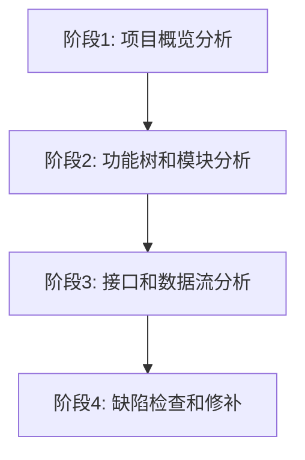

# Workflow定义重构设计

## 1. 当前Workflow分析

### 1.1 当前阶段
1. **systemAnalysis** - 系统分析
2. **componentAnalysis** - 组件分析
3. **missingCoverageCheck** - 缺失覆盖率检查

### 1.2 当前问题
1. **阶段划分不合理**：当前阶段划分过于简单，没有覆盖完整的分析流程
2. **缺少功能树**：没有建立功能树来展示功能之间的关系
3. **缺少修补机制**：第三阶段只输出报告，没有修补前两个阶段的输出
4. **文件过多**：当前输出文件过多，不利于AI使用

## 2. 新的Workflow设计

### 2.1 新的阶段划分
1. **projectOverview** - 项目概览分析
2. **functionTreeAndModule** - 功能树和模块分析
3. **interfaceAndDataFlow** - 接口和数据流分析
4. **defectCheckAndPatch** - 缺陷检查和修补

### 2.2 阶段关系


### 2.3 输入输出关系
```
阶段1: 项目概览分析
  输入: 项目路径
  输出: project-overview.md
  ↓
阶段2: 功能树和模块分析
  输入: project-overview.md
  输出: function-tree.md, module-relationships.md
  ↓
阶段3: 接口和数据流分析
  输入: function-tree.md, module-relationships.md
  输出: interface-contracts.md, data-flow.md
  ↓
阶段4: 缺陷检查和修补
  输入: 所有前3个阶段的输出
  输出: analysis-report.md（包含修补说明）
```

## 3. Workflow定义

### 3.1 Workflow元数据
```typescript
export const projectAnalysisWorkflow: WorkflowDefinition = {
  id: 'projectAnalysis',
  name: 'Project Analysis',
  description: '4-stage prompt-driven workflow: project overview → function tree and module → interface and data flow → defect check and patch. All outputs are pure Markdown with YAML Front Matter.',
  entryStageId: 'projectOverview',

  promptBindings: {
    '{HYPER_DESIGNER_WORKFLOW_OVERVIEW_PROMPT}': workflowFilePrompt(join(__dirname, 'prompts', 'workflow.md')),
  },

  stages: {
    // 阶段定义
  },
}
```

### 3.2 阶段1：项目概览分析
```typescript
projectOverview: {
  stageId: 'projectOverview',
  name: 'Project Overview',
  description: 'Analyze the target project and generate project overview and directory structure',
  agent: 'HAnalysis',
  inject: [{ provider: 'stage-inputs' }, { provider: 'stage-outputs' }],
  promptBindings: {
    '{HYPER_DESIGNER_WORKFLOW_STEP_PROMPT}': workflowFilePrompt(join(__dirname, 'prompts', 'projectOverview.md')),
  },
  requiredMilestones: [],
  required: true,
  inputs: [],
  outputs: [
    {
      id: '项目概览',
      path: './.hyper-designer/projectAnalysis/project-overview.md',
      type: 'file',
      description: 'Project overview with basic info, tech stack, directory structure, and entry points',
    },
  ],
  transitions: [{ id: 'to-function-tree', toStageId: 'functionTreeAndModule', mode: 'auto', priority: 0 }],
  getHandoverPrompt: (currentName, thisName) =>
    buildHandoverPrompt(thisName, '执行项目概览分析', currentName),
},
```

### 3.3 阶段2：功能树和模块分析
```typescript
functionTreeAndModule: {
  stageId: 'functionTreeAndModule',
  name: 'Function Tree and Module',
  description: 'Build function tree and analyze module relationships',
  agent: 'HAnalysis',
  inject: [{ provider: 'stage-inputs' }, { provider: 'stage-outputs' }],
  promptBindings: {
    '{HYPER_DESIGNER_WORKFLOW_STEP_PROMPT}': workflowFilePrompt(join(__dirname, 'prompts', 'functionTreeAndModule.md')),
  },
  requiredMilestones: [],
  required: true,
  inputs: [
    {
      id: '项目概览',
      path: './.hyper-designer/projectAnalysis/project-overview.md',
      type: 'file',
      description: 'Project overview from stage 1',
    },
  ],
  outputs: [
    {
      id: '功能树',
      path: './.hyper-designer/projectAnalysis/function-tree.md',
      type: 'file',
      description: 'Function tree with hierarchy, dependencies, and module mapping',
    },
    {
      id: '模块关系',
      path: './.hyper-designer/projectAnalysis/module-relationships.md',
      type: 'file',
      description: 'Module relationships with dependencies, interfaces, and data flow',
    },
  ],
  transitions: [{ id: 'to-interface', toStageId: 'interfaceAndDataFlow', mode: 'auto', priority: 0 }],
  getHandoverPrompt: (currentName, thisName) =>
    buildHandoverPrompt(thisName, '建立功能树并分析模块关系', currentName),
},
```

### 3.4 阶段3：接口和数据流分析
```typescript
interfaceAndDataFlow: {
  stageId: 'interfaceAndDataFlow',
  name: 'Interface and Data Flow',
  description: 'Analyze interface contracts and data flow',
  agent: 'HAnalysis',
  inject: [{ provider: 'stage-inputs' }, { provider: 'stage-outputs' }],
  promptBindings: {
    '{HYPER_DESIGNER_WORKFLOW_STEP_PROMPT}': workflowFilePrompt(join(__dirname, 'prompts', 'interfaceAndDataFlow.md')),
  },
  requiredMilestones: [],
  required: true,
  inputs: [
    {
      id: '功能树',
      path: './.hyper-designer/projectAnalysis/function-tree.md',
      type: 'file',
      description: 'Function tree from stage 2',
    },
    {
      id: '模块关系',
      path: './.hyper-designer/projectAnalysis/module-relationships.md',
      type: 'file',
      description: 'Module relationships from stage 2',
    },
  ],
  outputs: [
    {
      id: '接口契约',
      path: './.hyper-designer/projectAnalysis/interface-contracts.md',
      type: 'file',
      description: 'Interface contracts with API catalog, function signatures, and error contracts',
    },
    {
      id: '数据流',
      path: './.hyper-designer/projectAnalysis/data-flow.md',
      type: 'file',
      description: 'Data flow with models, flow diagrams, transformations, and storage',
    },
  ],
  transitions: [{ id: 'to-defect-check', toStageId: 'defectCheckAndPatch', mode: 'auto', priority: 0 }],
  getHandoverPrompt: (currentName, thisName) =>
    buildHandoverPrompt(thisName, '分析接口契约和数据流', currentName),
},
```

### 3.5 阶段4：缺陷检查和修补
```typescript
defectCheckAndPatch: {
  stageId: 'defectCheckAndPatch',
  name: 'Defect Check and Patch',
  description: 'Check analysis completeness, patch previous outputs, and generate final report',
  agent: 'HAnalysis',
  inject: [{ provider: 'stage-inputs' }, { provider: 'stage-outputs' }],
  promptBindings: {
    '{HYPER_DESIGNER_WORKFLOW_STEP_PROMPT}': workflowFilePrompt(join(__dirname, 'prompts', 'defectCheckAndPatch.md')),
  },
  requiredMilestones: [],
  required: true,
  inputs: [
    {
      id: '项目概览',
      path: './.hyper-designer/projectAnalysis/project-overview.md',
      type: 'file',
      description: 'Project overview from stage 1',
    },
    {
      id: '功能树',
      path: './.hyper-designer/projectAnalysis/function-tree.md',
      type: 'file',
      description: 'Function tree from stage 2',
    },
    {
      id: '模块关系',
      path: './.hyper-designer/projectAnalysis/module-relationships.md',
      type: 'file',
      description: 'Module relationships from stage 2',
    },
    {
      id: '接口契约',
      path: './.hyper-designer/projectAnalysis/interface-contracts.md',
      type: 'file',
      description: 'Interface contracts from stage 3',
    },
    {
      id: '数据流',
      path: './.hyper-designer/projectAnalysis/data-flow.md',
      type: 'file',
      description: 'Data flow from stage 3',
    },
  ],
  outputs: [
    {
      id: '最终分析报告',
      path: './.hyper-designer/projectAnalysis/analysis-report.md',
      type: 'file',
      description: 'Final analysis report with completeness check, consistency check, defects found, and patches applied',
    },
  ],
  transitions: [],
  getHandoverPrompt: (currentName, thisName) =>
    buildHandoverPrompt(thisName, '检查分析完整性，修补输出，生成最终报告', currentName),
},
```

## 4. 输出文件结构

### 4.1 新的输出文件结构
```
.hyper-designer/projectAnalysis/
├── project-overview.md          # 阶段1输出：项目概览
├── function-tree.md             # 阶段2输出：功能树
├── module-relationships.md      # 阶段2输出：模块关系
├── interface-contracts.md       # 阶段3输出：接口契约
├── data-flow.md                 # 阶段3输出：数据流
└── analysis-report.md           # 阶段4输出：最终分析报告
```

### 4.2 文件数量对比
- **原来**：7个文件 + 1个文件夹
- **现在**：6个文件

## 5. 阶段间依赖

### 5.1 阶段1→阶段2
- **输入**：项目路径
- **输出**：project-overview.md
- **依赖**：无

### 5.2 阶段2→阶段3
- **输入**：project-overview.md
- **输出**：function-tree.md, module-relationships.md
- **依赖**：阶段1完成

### 5.3 阶段3→阶段4
- **输入**：function-tree.md, module-relationships.md
- **输出**：interface-contracts.md, data-flow.md
- **依赖**：阶段2完成

### 5.4 阶段4→结束
- **输入**：所有前3个阶段的输出
- **输出**：analysis-report.md
- **依赖**：阶段3完成

## 6. 质量保证

### 6.1 输出验证
1. **格式验证**：验证输出文件格式是否正确
2. **内容验证**：验证输出内容是否完整
3. **一致性验证**：验证不同阶段输出是否一致
4. **图表验证**：验证Mermaid图表是否正确

### 6.2 阶段验证
1. **输入验证**：验证阶段输入是否完整
2. **输出验证**：验证阶段输出是否完整
3. **依赖验证**：验证阶段依赖是否满足

## 7. 配置要求

### 7.1 Agent配置
- **Agent**：HAnalysis
- **模式**：primary
- **颜色**：#7C3AED

### 7.2 阶段配置
- **模式**：auto（自动推进）
- **优先级**：0（默认优先级）
- **必需**：true（所有阶段都是必需的）
