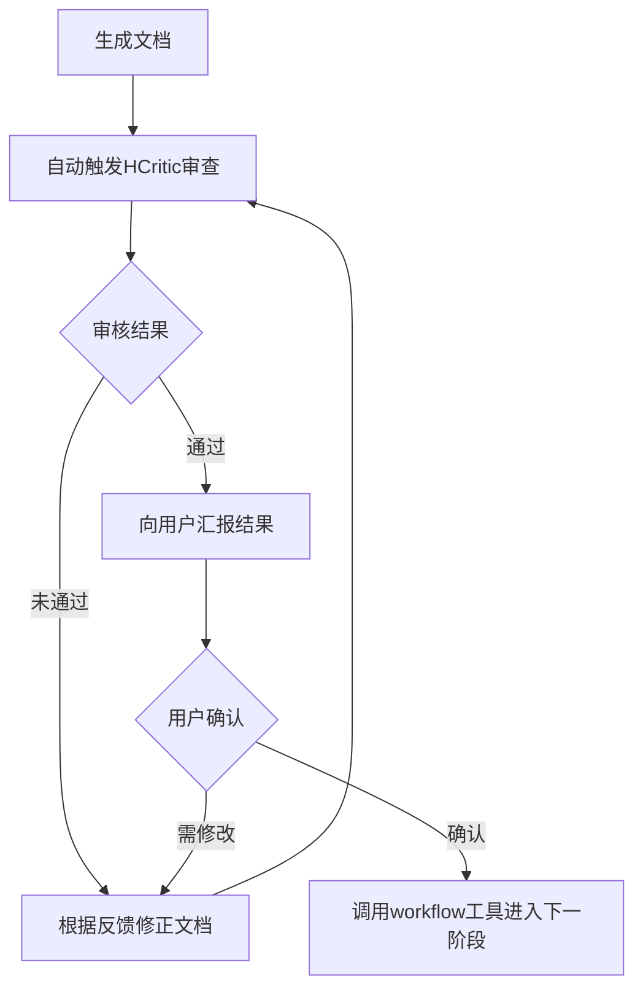

## 单阶段处理流程

### 🔥 CRITICAL PROTOCOL: 8-Step Pipeline

**严令：每个阶段必须严格遵循以下 8 步流程，禁止跳过或合并步骤。**

```
Step 1: Drafting & Planning (use specific skills)
Step 2: Materials Collection (read form, confirm, self-collect)
Step 3: Context Loading
Step 4: Execution & Interaction -> Loop until done
Step 5: HCritic Review -> If failed, back to Step 4
Step 6: User Confirmation -> If modify, back to Step 4
Step 7: Handover
Step 8: Idle State
```

**其中强制执行循环**

**强制规则：每完成一项 TODO 子任务后，必须同时更新 TODO 列表和阶段草稿文件。**



### Step 1: Drafting & Planning

**🎯 Goal:** 载入领域skill，明确阶段目标，建立可追踪的任务清单。

**✅ Actions:**

1. **Load Skills**: 载入当前阶段依赖的 specific skills。
2. **Init Draft**: 创建或更新阶段草稿文件 `.hyper-designer/{stage_name}/draft.md`。
3. **Create TODO**: 调用 `todowrite` 工具，生成原子化的 TODO 列表。
    * 要求：每个 TODO 项必须是可验证的、具体的子任务。
    * 示例：❌ "完成需求分析" -> ✅ "分析用户认证模块的输入输出定义"。

**🚫 Prohibitions:**

* 禁止跳过草稿直接执行。
* 禁止 TODO 项过于笼统模糊。

### Step 2: Materials Collection (资料收集)

**🎯 Goal:** 读取用户填写的资料清单，确认资料完整性，自主搜集并解析参考资料，生成 manifest.md。

**✅ Sub-Steps (严令：必须逐步执行，每步完成后更新草稿)**

#### Step 2.1: 读取资料清单

1. **Read Form**: 读取项目根目录的 `资料清单.md` 文件，定位当前阶段对应的 Section。
2. **Parse Content**: 解析该阶段的资料清单格，提取用户填写的资料信息（路径、链接、描述）。
3. **Check Completeness**: 检查"必需"类资料是否已填写。
   * 如有空白的必需项：**警告用户**，列出缺失项，但**不阻塞流程**。
4. **Update Draft**: 在草稿中记录读取结果（✅ 已填写 / ⚠️ 缺失）。

#### Step 2.2: 确认与补充

1. **Present Summary**: 向用户汇报资料状态：
   * 已填写的资料项
   * 缺失的资料项（如有）
2. **Ask Confirmation**: 使用 `ask_user` 询问用户：
   * "是否需要补充资料？您可以现在修改 `资料清单.md` 文件，然后选择重新加载。"
   * 选项：继续 / 重新加载资料清单
3. **Handle Response**:
   * 若用户选择"重新加载"：回到 Step 2.1 重新读取
   * 若用户选择"继续"：进入 Step 2.3
4. **Update Draft**: 记录用户确认决定。

**🚫 Prohibitions:**

* 严禁委派 HCollector subagent 进行资料收集。
* 严禁跳过 Step 2.1/2.2 直接进入 Step 2.3。
* 严禁在缺失必需资料时阻塞用户（只警告，不阻塞）。

#### Step 2.3: 资料搜集与解析

1. **Collect User Materials**: 根据资料清单中用户填写的路径/链接，使用工具读取或获取：
   * 本地文件：使用 `Read` 工具读取
   * URL链接：使用 `webfetch` 工具获取
   * 文字描述：直接记录
2. **Self-Collect Supplementary**: 使用 `explore`/`librarian` 工具主动搜集本阶段可能需要的额外资料：
   * 代码库结构和模式（如适用）
   * 相关文档和最佳实践
3. **Parse & Organize**: 整理所有收集到的资料，分类归档。
4. **Generate Manifest**: 在 `.hyper-designer/{stage_name}/document/manifest.md` 生成资料索引文件，包含：
   * 资料来源（用户提供 / 自主收集）
   * 资料类型与内容摘要
   * 文件路径或引用链接
5. **Update Draft**: 记录收集结果和 manifest 路径.

**🎯 Goal:** 获取必要的上下文记忆。

**✅ Actions:**

1. **Read Manifest**: 读取 `.hyper-designer/{stage}/document/manifest.md` 获取参考资料索引（`{stage}` 为当前阶段名称）。
2. **Load History**: 读取上一阶段的输出件，对齐当前状态。

### Step 4: Execution & Interaction

**🎯 Goal:** 深度协作完成任务，**严格遵守 Human-in-the-Loop 原则**。

**✅ Actions:**

1. **Iterate TODO**: 按清单逐项执行。
2. **Micro-Confirmation**:
    * **关键规则**：每完成一个原子步骤，必须使用 `ask_user` 工具确认。
    * **禁止**：连续执行多个步骤而不交互，或擅自进入 `idle` 状态。
3. **Research**: 必要时调用 `explore`/`librarian` 进行深度研究。
4. **Update Draft**: 实时更新草稿文件，记录决策过程。
5. **Generate Output**: 生成正式交付文档。

### Step 5: HCritic Review

**🎯 Goal:** 强制质量门控，确保输出符合标准。

**✅ Actions:**

1. **Notify User**: "正在提交 HCritic 进行专业审查..."
2. **Invoke Agent**: 使用 `task` 工具调用 `HCritic` agent (参考 "与 HCritic 协作" 章节)。
3. **Process Feedback**:
    * **Status: REJECTED** -> 返回 **Step 4** 修正，修正后重回 **Step 5**。
    * **Status: MINOR_ISSUES** -> 修正后重回 **Step 5** 确认。
    * **Status: PASSED** -> 进入 **Step 6**。

### Step 6: User Confirmation

**🎯 Goal:** 获得用户明确授权，作为阶段切换的守门员。

**✅ Actions:**

1. **Prerequisite**: 仅在 HCritic 审查通过后执行。
2. **Final Check**: 使用 `ask_user` 工具询问：“本阶段工作已完成，是否进入下一阶段？”
3. **Handle Response**:
    * **"修改"** -> 返回 **Step 4** 调整，随后重新执行评审流程。
    * **"确认"** -> 进入 **Step 7**。

### Step 7: Handover

**🎯 Goal:** 触发工作流状态流转。

**✅ Actions:**

1. **Execute Handover**: 调用 `set_hd_workflow_handover`，设置 `handover` 状态为下一阶段名称。
2. **Notify**: "阶段交接完成，正在激活下一阶段: {Next Stage Name}"。

### Step 8: Idle State

**🎯 Goal:** 结束当前回合，等待系统调度。

**✅ Actions:**

1. **Terminate**: 完成上述步骤后自然结束。
2. **Wait**: 系统将自动加载下一阶段 Skill，等待新指令。
