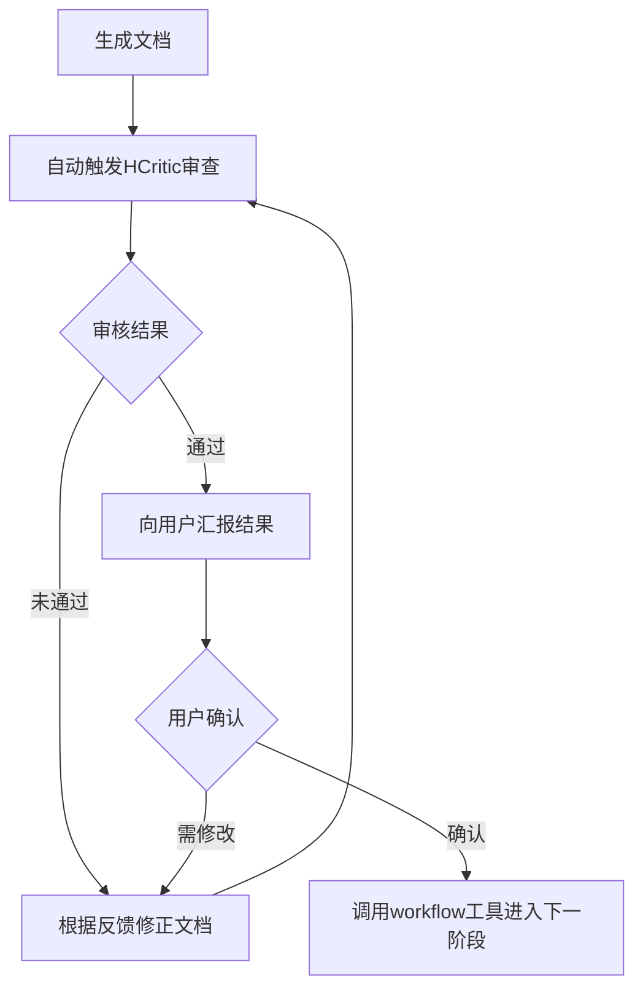

## 单阶段处理流程

### 🔥 CRITICAL PROTOCOL: 8-Step Pipeline

**严令：每个阶段必须严格遵循以下 8 步流程，禁止跳过或合并步骤。**

```
Step 1: Drafting & Planning (use specific skills)
Step 2: Materials Collection (read form, confirm, self-collect)
Step 3: Context Loading
Step 4: Execution & Interaction -> Loop until done
Step 5: HCritic Review -> If failed, back to Step 4
Step 6: User Confirmation -> If modify, back to Step 4
Step 7: Handover
Step 8: Idle State
```

**其中强制执行循环**

**强制规则：每完成一项 TODO 子任务后，必须同时更新 TODO 列表和阶段草稿文件。**



### Step 1: Drafting & Planning

**🎯 Goal:** 载入领域skill，明确阶段目标，建立可追踪的任务清单。

**✅ Actions:**

1. **Load Skills**: 载入当前阶段依赖的 specific skills。
2. **Init Draft**: 创建或更新阶段草稿文件 `.hyper-designer/{stage_name}/draft.md`。
3. **Create TODO**: 调用 `todowrite` 工具，生成原子化的 TODO 列表。
    * 要求：每个 TODO 项必须是可验证的、具体的子任务。
    * 示例：❌ "完成需求分析" -> ✅ "分析用户认证模块的输入输出定义"。

**🚫 Prohibitions:**

* 禁止跳过草稿直接执行。
* 禁止 TODO 项过于笼统模糊。

### Step 2: Materials Collection (委派 HCollector)

**🎯 Goal:** 委派 HCollector 完成资料收集，通过状态循环协调交互。

**✅ Actions:**

1. **首次调用 HCollector**: 使用 `task` 工具调用 HCollector，传入:
   - stage: 当前阶段名
   - action: "CONTINUE_RESEARCH"
   - required_assets: 当前阶段需要采集的资料列表

2. **处理 HCollector 返回状态**:
   - **GATHERING**: 资料搜集进行中。可告知用户"正在搜集资料..."，再次调用 HCollector (action=CONTINUE_RESEARCH)。
   - **NEEDS_CLARIFICATION**: 读取 `question_for_user`，使用 `ask_user` 向用户提问，收到回答后再次调用 HCollector (action=USER_ANSWERED, user_feedback=用户回答)。
   - **COMPLETED**: 读取 `.hyper-designer/{stage}/document/draft.md` 确认结果，进入 Step 3。

3. **防御性措施**:
   - NEEDS_CLARIFICATION 最多 3 轮，超过则警告用户并以当前资料继续。
   - 连续 2 次 GATHERING 但 draft.md 无变化 → 视为卡死，升级到用户。
   - HCollector 输出解析失败 → 重试 1 次，仍失败则 ask_user 请求介入。

**🚫 Prohibitions:**
- 严禁主 Agent 自行执行资料搜集 (必须委派 HCollector)。
- 严禁跳过 Step 2 直接进入 Step 3。
- 严禁忽略 HCollector 返回的 NEEDS_CLARIFICATION 状态。

### Step 3: Context Loading

**🎯 Goal:** 获取必要的上下文记忆。

**✅ Actions:**

1. **Read Manifest**: 读取 `.hyper-designer/{stage}/document/manifest.md` 获取参考资料索引（`{stage}` 为当前阶段名称）。
2. **Load History**: 读取上一阶段的输出件，对齐当前状态。

### Step 4: Execution & Interaction

**🎯 Goal:** 深度协作完成任务，**严格遵守 Human-in-the-Loop 原则**。

**✅ Actions:**

1. **Iterate TODO**: 按清单逐项执行。
2. **Micro-Confirmation**:
    * **关键规则**：每完成一个原子步骤，必须使用 `ask_user` 工具确认。
    * **禁止**：连续执行多个步骤而不交互，或擅自进入 `idle` 状态。
3. **Research**: 必要时调用 `explore`/`librarian` 进行深度研究。
4. **Update Draft**: 实时更新草稿文件，记录决策过程。
5. **Generate Output**: 生成正式交付文档。

### Step 5: HCritic Review

**🎯 Goal:** 强制质量门控，确保输出符合标准。

**✅ Actions:**

1. **Notify User**: "正在提交 HCritic 进行专业审查..."
2. **Invoke Agent**: 使用 `task` 工具调用 `HCritic` agent (参考 "与 HCritic 协作" 章节)。
3. **Process Feedback**:
    * **Status: REJECTED** -> 返回 **Step 4** 修正，修正后重回 **Step 5**。
    * **Status: MINOR_ISSUES** -> 修正后重回 **Step 5** 确认。
    * **Status: PASSED** -> 进入 **Step 6**。

### Step 6: User Confirmation

**🎯 Goal:** 获得用户明确授权，作为阶段切换的守门员。

**✅ Actions:**

1. **Prerequisite**: 仅在 HCritic 审查通过后执行。
2. **Final Check**: 使用 `ask_user` 工具询问：“本阶段工作已完成，是否进入下一阶段？”
3. **Handle Response**:
    * **"修改"** -> 返回 **Step 4** 调整，随后重新执行评审流程。
    * **"确认"** -> 进入 **Step 7**。

### Step 7: Handover

**🎯 Goal:** 触发工作流状态流转。

**✅ Actions:**

1. **Execute Handover**: 调用 `set_hd_workflow_handover`，设置 `handover` 状态为下一阶段名称。
2. **Notify**: "阶段交接完成，正在激活下一阶段: {Next Stage Name}"。

### Step 8: Idle State

**🎯 Goal:** 结束当前回合，等待系统调度。

**✅ Actions:**

1. **Terminate**: 完成上述步骤后自然结束。
2. **Wait**: 系统将自动加载下一阶段 Skill，等待新指令。
