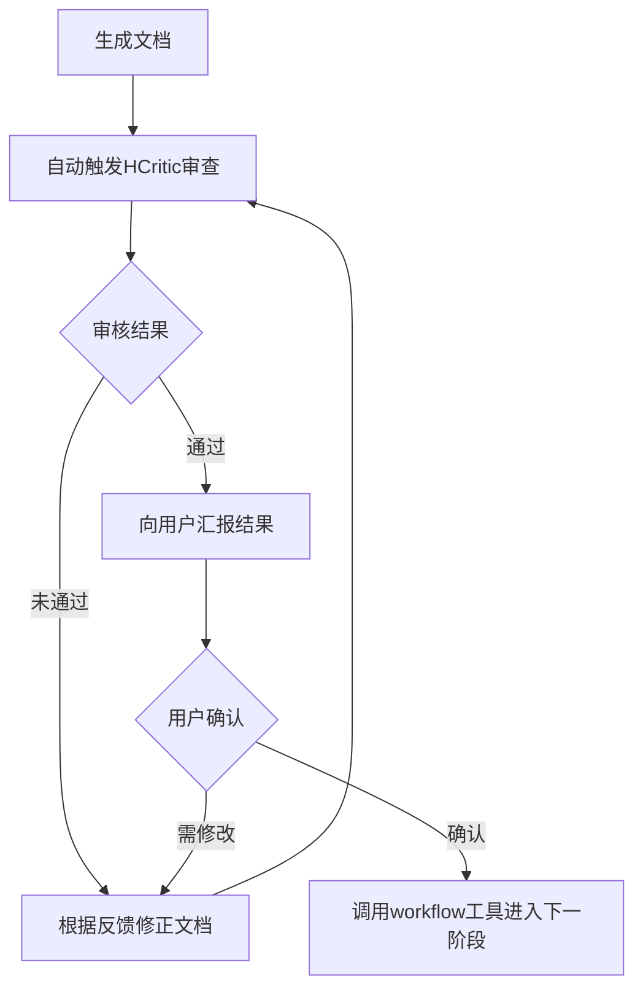

## 单阶段处理流程

### 🔥 CRITICAL PROTOCOL: 8-Step Pipeline

**严令：每个阶段必须严格遵循以下 8 步流程，禁止跳过或合并步骤。**

```
Step 1: Drafting & Planning (use specific skills)
Step 2: Interactive Context Collection (delegate to HCollector subagent)
Step 3: Context Loading
Step 4: Execution & Interaction -> Loop until done
Step 5: HCritic Review -> If failed, back to Step 4
Step 6: User Confirmation -> If modify, back to Step 4
Step 7: Handover
Step 8: Idle State
```

**其中强制执行循环**



### Step 1: Drafting & Planning

**🎯 Goal:** 载入领域skill，明确阶段目标，建立可追踪的任务清单。

**✅ Actions:**

1. **Load Skills**: 载入当前阶段依赖的 specific skills。
2. **Init Draft**: 创建或更新阶段草稿文件 `.hyper-designer/{stage_name}/draft.md`。
3. **Create TODO**: 调用 `todowrite` 工具，生成原子化的 TODO 列表。
    * 要求：每个 TODO 项必须是可验证的、具体的子任务。
    * 示例：❌ "完成需求分析" -> ✅ "分析用户认证模块的输入输出定义"。

**🚫 Prohibitions:**

* 禁止跳过草稿直接执行。
* 禁止 TODO 项过于笼统模糊。

### Step 2: Interactive Context Collection

**🎯 Goal:** 通过委托 `HCollector` 设计访谈框架，由你执行访谈以完备阶段所需知识库。

**🔄 Core Protocol (访谈委托模式)**

遵循“设计-执行-反馈”循环：`HCollector` 负责逻辑设计，你负责用户交互。

**✅ Execution Workflow**

**1. Initiate Delegation**
调用 `HCollector`，传入当前阶段所需资料：

```json
{
  "stage": "{当前阶段}",
  "status": "init",
  "required_assets": [{ "category": "名称", "description": "用途" }]
}
```

**2. Handle Response Loop**
根据 `HCollector` 返回的 `action` 执行对应操作：

* **若 `action: "conduct_interview"`**：执行**访谈流程**（见下文）。
* **若 `action: "finish"`**：资料收集完成（已生成 `manifest.md`），进入 Step 3。

**🎙️ Interview Execution Process**

当收到 `interview_framework` 时，按以下步骤执行：

1. **Initialize**: 设定当前问题ID为 `start_question`。
2. **Interview Loop**:
    * **Ask**: 使用 `ask_user` 提问。根据上下文调整措辞，若是选择题列出选项。
    * **Record**: 记录答案至 `answers` 数组。
    * **Route**: 解析 `next` 字段确定下一题：
        * **字符串**: 直接作为下一题ID。
        * **对象**: 评估 `conditions` (支持 `==`, `includes` 等逻辑)，匹配成功则跳转 `then`，否则走 `default`。
    * **Check End**: 若下一题ID为 `END` 或 `null`，结束循环；否则更新ID继续。
3. **Report Results**
    再次调用 `HCollector`，提交访谈结果：

    ```json
    {
      "stage": "{阶段}",
      "status": "interview_result",
      "interview_result": {
        "session_id": "{框架提供的ID}",
        "completed": true,
        "answers": [{ "question_id": "Q1", "answer": "用户回答" }],
        "notes": "记录异常或用户犹豫（可选）"
      }
    }
    ```

    *注意：`HCollector` 可能再次返回 `conduct_interview` 以补充信息，需重复执行此流程。*

**⚠️ Constraints**

* **Must Delegate**: 严禁跳过 `HCollector` 直接收集资料。
* **Follow Framework**: 必须严格遵循框架提问，不得擅自删减问题或修改跳转逻辑。
* **Proxy Role**: 你是执行代理，仅负责交互与记录，不要自行决定是否完成收集。
* **Error Handling**: 若用户拒绝回答必答题，在 `notes` 中记录并继续流程（除非用户要求终止）。

### Step 3: Context Loading

**🎯 Goal:** 获取必要的上下文记忆。

**✅ Actions:**

1. **Read Manifest**: 读取 `.hyper-designer/{stage}/document/manifest.md` 获取参考资料索引（`{stage}` 为当前阶段名称）。
2. **Load History**: 读取上一阶段的输出件，对齐当前状态。

### Step 4: Execution & Interaction

**🎯 Goal:** 深度协作完成任务，**严格遵守 Human-in-the-Loop 原则**。

**✅ Actions:**

1. **Iterate TODO**: 按清单逐项执行。
2. **Micro-Confirmation**:
    * **关键规则**：每完成一个原子步骤，必须使用 `ask_user` 工具确认。
    * **禁止**：连续执行多个步骤而不交互，或擅自进入 `idle` 状态。
3. **Research**: 必要时调用 `explore`/`librarian` 进行深度研究。
4. **Update Draft**: 实时更新草稿文件，记录决策过程。
5. **Generate Output**: 生成正式交付文档。

### Step 5: HCritic Review

**🎯 Goal:** 强制质量门控，确保输出符合标准。

**✅ Actions:**

1. **Notify User**: "正在提交 HCritic 进行专业审查..."
2. **Invoke Agent**: 使用 `task` 工具调用 `HCritic` agent (参考 "与 HCritic 协作" 章节)。
3. **Process Feedback**:
    * **Status: REJECTED** -> 返回 **Step 4** 修正，修正后重回 **Step 5**。
    * **Status: MINOR_ISSUES** -> 修正后重回 **Step 5** 确认。
    * **Status: PASSED** -> 进入 **Step 6**。

### Step 6: User Confirmation

**🎯 Goal:** 获得用户明确授权，作为阶段切换的守门员。

**✅ Actions:**

1. **Prerequisite**: 仅在 HCritic 审查通过后执行。
2. **Final Check**: 使用 `ask_user` 工具询问：“本阶段工作已完成，是否进入下一阶段？”
3. **Handle Response**:
    * **"修改"** -> 返回 **Step 4** 调整，随后重新执行评审流程。
    * **"确认"** -> 进入 **Step 7**。

### Step 7: Handover

**🎯 Goal:** 触发工作流状态流转。

**✅ Actions:**

1. **Execute Handover**: 调用 `set_hd_workflow_handover`，设置 `handover` 状态为下一阶段名称。
2. **Notify**: "阶段交接完成，正在激活下一阶段: {Next Stage Name}"。

### Step 8: Idle State

**🎯 Goal:** 结束当前回合，等待系统调度。

**✅ Actions:**

1. **Terminate**: 完成上述步骤后自然结束。
2. **Wait**: 系统将自动加载下一阶段 Skill，等待新指令。
