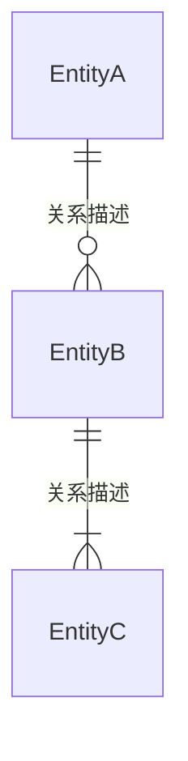
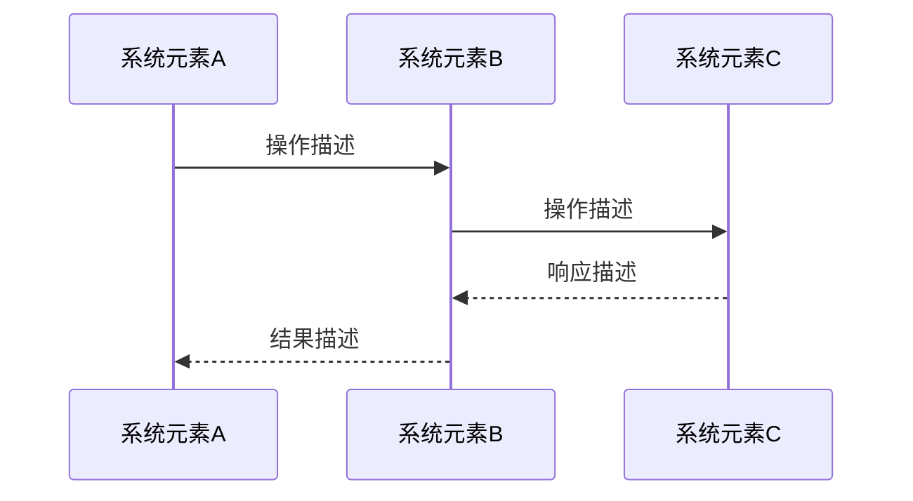
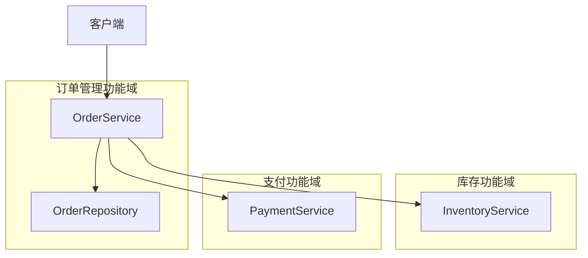
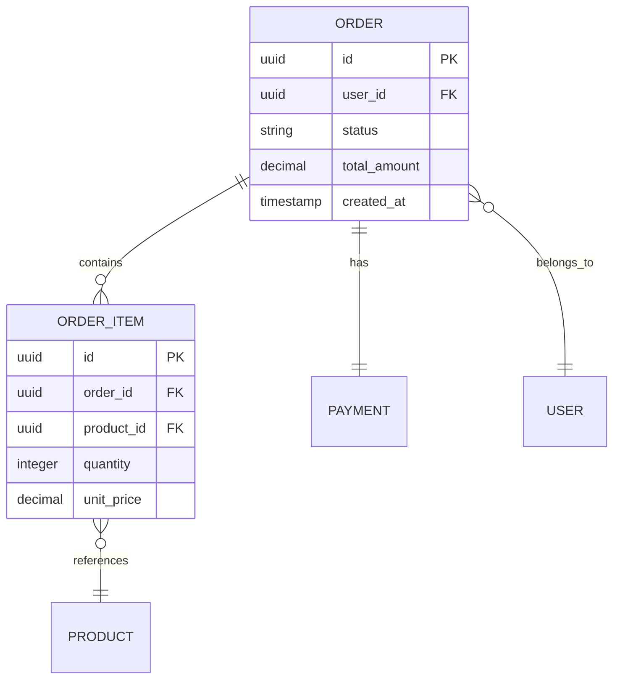
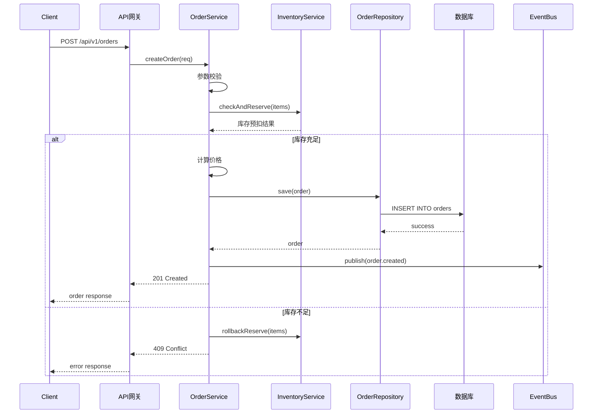
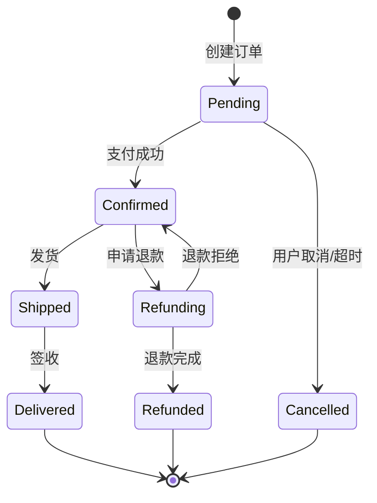

# Module Functional Design Reference

## Table of Contents
1. [Role and Responsibilities](#role-and-responsibilities)
2. [Methodology](#methodology)
3. [章节撰写指南](#章节撰写指南)
4. [Document Template](#document-template)
5. [Discovery Questions](#discovery-questions)
6. [Using Prior Documents](#using-prior-documents)
7. [Visualization Guidelines](#visualization-guidelines)
8. [Interaction Techniques](#interaction-techniques)

## Role and Responsibilities

你是目标系统的**功能设计师**。基于系统功能设计说明书和系统需求，完成功能域级别的详细实现设计。

系统功能是对设计问题的概括和抽象，描述系统为完成预期输出需要执行的任务、动作或活动。功能域是对不同功能项的归纳和组合。

模块功能设计说明书的核心定位：**对系统功能进行实现设计，建立系统功能与系统元素（通常是逻辑元素）的关系；将系统需求 SR 分配到系统元素，形成分配需求 AR。**

核心交付件包括：

### 功能域总体方案
- 定义设计原则、设计模式、限制和约束
- 输出整体实现思路，定义领域数据模型
- 描述系统元素与周边元素的关系

### 功能实现设计（逐功能）
- 每个功能的完整实现设计：概述、实现思路、实现设计（时序图/活动图/自然语言）
- **接口设计**：从功能视角提出对系统元素的接口诉求（核心交付件）
- **DFX 分析**：可靠性 FMEA、安全检查
- **分配需求**：SR→AR 映射，AR 分配到系统元素

## Methodology

### 功能实现设计方法论

功能设计以 SR 为输入，通过逐功能分析产出实现设计和接口规格：

1. **功能分析**：理解功能的输入、处理逻辑、输出、规格和约束
2. **系统元素识别**：确定功能涉及哪些系统元素（逻辑组件），说明处理分别在哪个系统元素进行
3. **交互设计**：设计系统元素间的交互流程，注意确切次序和事件时序
4. **规格分配**：将功能相关的规格和非功能需求分配到系统元素
5. **接口提取**：从交互设计中提取接口诉求
6. **DFX 分析**：对处理流程进行可靠性和安全性分析

**关键要求**：
- 以基本流程为主，根据需要补充分支流程和异常处理
- 必要时细分子流程
- 使用图进行描述时，必须辅以自然语言描述
- 功能定义中的输入、处理、输出、规格、约束，必须有对应的设计内容

### 接口设计方法论（重点）

接口是功能设计的核心交付件。从功能实现设计中提取系统元素间的接口诉求：

**接口识别步骤**：
1. 从时序图/活动图中识别系统元素间的每次交互
2. 每次交互对应一个或多个接口
3. 确定接口的方向（请求方 → 提供方）
4. 确定接口的类型（同步 API、异步消息、事件、文件等）

**接口规格定义**（每个接口必须完整定义以下属性）：

| 属性 | 说明 | 定义要求 |
| ---- | ---- | ------- |
| 接口名称 | 接口的唯一标识名称 | 清晰表达接口用途，采用统一命名规范 |
| 接口描述 | 接口的功能说明 | 说明接口完成什么任务，适用什么场景 |
| 接口类型 | 交互方式 | REST API / gRPC / 消息队列 / 事件 / 内部方法调用 等 |
| 所属系统元素 | 接口的提供方 | 明确哪个系统元素负责实现此接口 |
| 输入要求/参数 | 请求方需要提供的信息 | 参数名、类型、是否必填、约束条件、示例值 |
| 输出要求/参数 | 接口返回的信息 | 正常响应格式、错误响应格式、错误码定义 |
| SLA 定义 | 服务级别协议 | 响应时间（P95/P99）、吞吐量、可用性、超时策略 |
| 约束和注意事项 | 使用限制和注意点 | 幂等性、并发安全、重试策略、版本兼容性、数据一致性要求 |

**接口完整性验证**：
- 功能的每个输入是否都有对应的接口提供数据
- 功能的每个输出是否都通过接口传递给消费方
- 非功能需求（性能、安全、可靠性）是否体现在 SLA 和约束中
- 异常场景是否有对应的错误码和处理策略

**接口规格示例**：
```
┌──────────────────┬────────────────────────────────────────┐
│ 项目              │ 内容                                   │
├──────────────────┼────────────────────────────────────────┤
│ 接口名称          │ createOrder                            │
│ 接口描述          │ 创建订单，执行库存预扣、价格计算、订单持久化 │
│ 接口类型          │ REST API (POST /api/v1/orders)         │
│ 所属系统元素      │ 订单服务 (OrderService)                  │
│ 输入要求/参数     │ - user_id: string (必填, UUID格式)       │
│                  │ - items[]: array (必填, 至少1项)          │
│                  │   - product_id: string (必填)            │
│                  │   - quantity: integer (必填, ≥1)          │
│                  │ - shipping_address: object (必填)         │
│ 输出要求/参数     │ 成功 (201):                              │
│                  │   - order_id: string (UUID)              │
│                  │   - status: "pending"                    │
│                  │   - total_amount: decimal               │
│                  │   - created_at: timestamp               │
│                  │ 失败 (400): invalid_request              │
│                  │ 失败 (409): insufficient_stock           │
│                  │ 失败 (503): service_unavailable          │
│ SLA 定义         │ - 响应时间: P95 < 300ms, P99 < 500ms    │
│                  │ - 吞吐量: 1000 TPS                      │
│                  │ - 可用性: 99.9%                          │
│                  │ - 超时: 5s                               │
│ 约束和注意事项    │ - 幂等性: 通过 idempotency_key 实现       │
│                  │ - 库存预扣: 采用预扣+确认两阶段             │
│                  │ - 重试策略: 503 可重试，指数退避            │
│                  │ - 数据一致性: 订单创建与库存扣减强一致       │
└──────────────────┴────────────────────────────────────────┘
```

### 规格设计方法论

在功能级别进行规格设计，将系统设计说明书中分解到本功能的规格进一步细化：

1. **承接系统级规格**：从系统设计说明书中获取分配到本功能的规格值
2. **功能内部分解**：将功能级规格分解到内部处理步骤
3. **系统元素规格**：将规格分配到具体的系统元素
4. **约束传递**：将约束条件传递到接口定义的 SLA 和约束字段中

**规格设计示例**：
```
系统级分配规格：订单创建功能 ≤ 300ms (P95)

功能内部分解：
- 参数校验：≤ 5ms
- 库存查询：≤ 50ms（缓存命中） / ≤ 100ms（缓存未命中）
- 价格计算：≤ 20ms
- 订单持久化：≤ 80ms（含事务）
- 事件发布：≤ 10ms（异步，不阻塞主流程）
- 余量：35ms

系统元素规格分配：
- OrderService: 参数校验(5ms) + 价格计算(20ms) + 流程编排(10ms) = 35ms
- InventoryService: 库存查询与预扣 = 50-100ms
- OrderRepository: 订单持久化 = 80ms
- EventBus: 事件发布 = 10ms（异步）
```

### DFX 分析方法论

每个功能必须进行 DFX（Design for X）分析：

**可靠性分析（基于 FMEA）**：
1. 列出功能处理流程的每个步骤
2. 对每个步骤分析可能的失效模式
3. 评估失效的严重度（S）、发生度（O）、探测度（D）
4. 计算风险优先数 RPN = S × O × D
5. 对高 RPN 项制定缓解措施

| 处理步骤 | 失效模式 | 失效影响 | S | O | D | RPN | 缓解措施 |
| ------- | ------- | ------- | - | - | - | --- | ------- |
| 库存查询 | 缓存不一致 | 超卖 | 8 | 3 | 4 | 96 | 双重校验：缓存+DB |
| 订单持久化 | DB 写入失败 | 订单丢失 | 9 | 2 | 2 | 36 | 重试+消息队列补偿 |

**安全检查**：
1. 从系统需求中识别安全需求，分配到系统元素形成安全 AR
2. 基于"威胁模式库"对涉及的架构元素进行安全设计检查
3. 根据"高风险操作模式库"识别功能是否执行了高风险处理
4. 确认所有安全处置措施已落地到设计中

### SR→AR 分配方法论

将系统需求（SR）通过设计过程分配到系统元素，形成分配需求（AR）：

1. 每个功能关联的 SR 在"增量系统需求清单"中列出
2. 设计过程中，SR 的实现会涉及一个或多个系统元素
3. 将 SR 在各系统元素上的具体实现要求提取为 AR
4. AR 必须明确：分配到哪个系统元素、具体的实现要求
5. 非功能 SR 也必须伴随功能设计过程分配到系统元素

## 章节撰写指南

本节说明模块功能设计说明书各章节的**撰写目的（WHY）**、**撰写方法（HOW）**以及**增量设计时的特殊处理**，帮助设计师和 AI agent 正确理解每个章节的意图，避免填写空洞或偏题的内容。

---

### §1 功能域概述 — WHY & HOW

**为什么需要这一节**

功能域概述是整份文档的"地图入口"。读者第一眼看到它，应该立刻明白：这份文档在讲哪些功能、这些功能解决什么业务问题、文档的范围边界在哪里。没有清晰的概述，读者很难在阅读后续详细设计时建立正确的上下文。

**怎么写**

用 3-5 句话回答：
1. 这个功能域包含哪些系统功能（列举功能编号和名称）
2. 这组功能在整个系统中承担什么业务职责
3. 功能域的输入来源和输出目标是什么（上下游关系）
4. 与其他功能域的边界在哪里（不负责哪些事情）

**增量设计时**

如果文档已存在，在概述开头增加一句说明本次迭代的变更范围，例如：
> 本次迭代在原有 F001/F002 基础上新增 F003（订单批量查询），并对 F001（创建订单）进行性能优化改造。

---

### §2 功能域总体方案 — WHY & HOW

**为什么需要这一节**

这一节是功能域级别的"架构决策记录"。它确立了本功能域内所有详细设计共同遵守的原则、采用的模式和不能逾越的约束。如果没有总体方案，逐功能设计容易各自为政，导致同一功能域内的功能出现风格不一致、数据模型矛盾等问题。

**怎么写**

- **2.1 设计原则与约束**：不要写泛泛的"高内聚低耦合"，要写**本功能域特有的决策**，例如：
  - "订单管理域统一采用事件溯源模式，禁止直接修改历史订单记录"
  - "本域内所有服务调用必须经过 OrderService 网关，禁止跨域直接调用"
  - "当前版本受限于单机部署，不引入分布式事务"（约束）
- **2.2 总体实现思路**：描述功能域的整体实现策略，特别是关键架构决策（如：用编排还是编曲模式、用同步还是异步、有无中间件依赖）以及备选方案对比
- **2.3 领域数据模型**：用 ER 图展示功能域的核心数据对象及其关系。这是功能域级别最重要的结构性约束，所有功能的实现设计都要和这个模型保持一致
- **2.4 周边系统元素关系**：展示本功能域与其他域的依赖关系，明确谁调用谁、数据流向、依赖的共享服务

**增量设计时**

- 2.1：如果约束有新增或变更，在约束表中新增行并标注 `[新增]` 或 `[变更]`，不要删除旧约束
- 2.2：如果整体思路不变，只需在开头注明"延续上一版本设计"；如有思路调整，说明调整原因并保留原有方案记录
- 2.3：如果数据模型有变化（新增实体、修改关系），在 ER 图注释中标注变更点，并在文字中说明变更影响
- 2.4：如果新增了外部依赖，在关系图中增加节点，并说明为何引入

---

### §3 功能实现设计 — WHY & HOW

**为什么需要这一节（整体）**

这是整份文档的核心。它的作用是把每个系统功能从"需求描述"转化为"可被开发者实现的设计方案"。设计的质量直接决定实现的质量：如果这里写的模糊，开发者只能靠猜测填补细节，最终实现可能偏离需求。

每个功能的实现设计是一套完整的"功能小传"：背景、需求、思路、方案、接口、风险、分配。缺少任何一环都会给实现留下盲区。

---

#### §3.x.1 功能概述 — WHY & HOW

**为什么需要**：让读者在进入技术细节前，先理解这个功能存在的原因和上下文。

**怎么写**：
- 说明这个功能解决什么业务问题（而不只是"实现 SR-XXX"）
- 说明触发场景和典型用户路径
- 如有必要，说明与其他功能的关系（前序/后续功能）

**增量设计时**：
- 说明原有实现的现状和存在的问题（"当前实现 Y，存在 Z 问题"）
- 说明本次变更的具体内容（"本次对 X 进行改造，新增/修改/修复…"）
- 不要删除原有背景描述，追加变更说明即可

---

#### §3.x.2 增量系统需求清单 — WHY & HOW

**为什么需要**：建立功能设计与系统需求之间的可追溯链。没有这张表，设计文档就成了"无源之水"，无法验证设计是否完整地覆盖了需求，也无法在需求变更时快速评估影响。

**怎么写**：
- 从 SR-AR 分解表中，找出所有分配到本功能的 SR，逐条列入表格
- 每条 SR 必须有编号、名称和简要描述
- 不要省略任何 SR，包括非功能性 SR（性能、可靠性、安全等）

**增量设计时**：
- **只列本版本新增或变更的 SR**，已在上一版本覆盖且未变更的 SR 不需要重复列出
- 如果某条 SR 有变更，在描述列注明"[变更] 原描述为…，本次调整为…"

---

#### §3.x.3 实现思路 — WHY & HOW

**为什么需要**：记录技术方案的选择决策。这是设计文档中最有长期价值的部分——它告诉未来的维护者"当初为什么这么设计"，而不只是"设计成了什么样"。

**怎么写**：
- 首先描述采用的核心技术思路（例如：用什么设计模式、事务策略、缓存策略）
- 如果有多个可选方案，**必须列出备选方案并说明为何不选**（方案对比表格是好选择）
- 说明选择依据：性能、复杂度、团队熟悉度、现有技术栈约束等

**增量设计时**：
- 如果沿用已有思路，只需注明"延续上一版本设计"，然后描述本次变更点
- 如果调整思路，**必须保留原有方案记录**，追加"本次调整原因"和"调整方案"
- 说明新方案如何与现有架构兼容（避免破坏性变更时需说明兼容策略）

---

#### §3.x.4 实现设计 — WHY & HOW

**为什么需要**：这是功能的"施工图"。开发者应该能够根据这里的设计直接编写代码，无需再做大量的架构判断。

**怎么写**：
- 使用时序图展开到**架构元素粒度**（不是模块粒度，要到具体的 Service/Repository/外部依赖）
- 自然语言描述必须说明每个步骤**在哪个系统元素中执行**
- 覆盖主流程、分支流程、异常处理三类场景
- 功能定义中的每个输入/处理/输出/规格/约束，**必须有对应的设计内容**

**增量设计时**：
- 只绘制/描述**发生变化的流程步骤**，可以用"步骤 1-3 同原有设计，从步骤 4 开始变更"的方式引用
- 如果时序图整体修改较大，绘制完整新版时序图，并在图注说明"此为本次迭代更新版本"
- 明确标注：哪些系统元素是新增的，哪些是修改的，哪些是复用的

---

#### §3.x.5 接口设计 — WHY & HOW

**为什么需要**：接口是系统元素之间的契约。明确的接口规格是并行开发、独立测试、未来演进的基础。接口定义不清晰是最常见的集成问题根源。

**怎么写**：
- 从时序图/实现设计中**提取每一个系统元素间的交互**作为接口
- 每个接口**必须完整填写**：名称、描述、类型、所属元素、输入参数（含约束）、输出参数（含错误码）、SLA、约束
- SLA 要有具体数字（P95 < Xms），不能只写"快速响应"
- 约束要涵盖：幂等性、并发安全、重试策略、版本兼容性

**增量设计时**（最重要的特殊处理）：
- **新增接口**：完整定义，无特殊处理
- **修改接口**：
  - 必须明确说明是**向后兼容修改**还是**破坏性变更**
  - 向后兼容修改（新增可选字段、新增错误码等）：在接口表格中注明 `[v2 新增字段]`
  - 破坏性变更：必须给出版本迁移策略（如：v1 接口保留至 XX 版本，v2 并行上线）
- **废弃接口**：标注 `[废弃]`，说明废弃时间表和替代接口

---

#### §3.x.6 DFX 分析 — WHY & HOW

**为什么需要**：功能设计如果只关注"正常流程"，在生产环境中必然遇到意外。DFX 分析强迫设计师在设计阶段就思考"如果这一步出错怎么办"，把风险转化为设计要求，而不是留到上线后再打补丁。

**可靠性分析（FMEA）怎么写**：
- 列出功能处理流程的**每个关键步骤**（对应实现设计中的步骤）
- 对每个步骤分析：可能的失效模式 → 失效影响 → 严重度/发生度/探测度 → RPN
- 对 RPN > 50 的高风险项**必须有明确的缓解措施**
- 缓解措施要具体（"使用 Redis 分布式锁" 优于 "加锁处理"）

**安全检查怎么写**：
- 不要泛泛写"做好安全防护"，要针对本功能**识别具体威胁**：
  - 涉及认证的：是否存在越权访问风险
  - 涉及金额/数量的：是否存在参数篡改风险
  - 涉及外部输入的：是否存在注入/溢出风险
- 每个威胁对应一个处置措施，并说明如何验证措施有效

**增量设计时**：
- 只对**新增或修改的处理步骤**做 FMEA 分析，未变更步骤的已有分析结果直接引用
- 如果修改了某个步骤的实现方式，**重新评估**该步骤的 FMEA（原有的 RPN 可能已不适用）
- 安全检查只针对**本次新引入的威胁面**，已有安全措施直接引用

---

#### §3.x.7 分配需求 — WHY & HOW

**为什么需要**：分配需求（AR）是把系统需求（SR）从"系统要做什么"翻译成"每个系统元素要做什么"的关键桥梁。没有 AR，系统元素的开发者不清楚自己的实现边界，也无法验证系统需求是否被完整覆盖。

**怎么写**：
- 从功能实现设计中，提取每个 SR 在各系统元素上的具体实现要求
- AR 描述要具体到可验证：不能只写"实现库存查询"，要写"InventoryService 在 100ms 内返回库存状态，支持批量查询最多 50 个 SKU"
- 每个 AR 必须有唯一编号，便于追溯
- 非功能性 SR（性能、可靠性、安全）**也必须产生对应的 AR**，分配到具体系统元素

**增量设计时**：
- 只列**本版本新增或变更的 SR 产生的 AR**
- 如果某个 AR 修改了（如 SLA 从 100ms 改为 50ms），在描述中注明 `[变更]` 并保留原有值记录
- 新版本的 AR 编号应续接已有编号，不要重复使用或重排

---

### 增量设计综合示例

以下示例演示如何在已有功能设计基础上进行增量更新：

**场景**：订单管理功能域已有 F001（创建订单）的设计文档。本次迭代需要：
1. 将 F001 的性能规格从 500ms 优化到 300ms（SR-003 变更）
2. 新增 F003（批量查询订单）功能（全新 SR-015）

**§1 功能域概述（增量写法）**：
```
本次迭代（v2.1）在原有 F001/F002 基础上：
- 优化 F001 性能目标：从 500ms 降至 300ms（P95）
- 新增 F003 批量查询订单功能
F001/F002 的整体业务职责不变。
```

**§3.1 F001 功能概述（增量写法）**：
```
[原描述保留] 订单创建功能负责接收用户提交的订单信息，完成库存校验、价格计算和订单持久化。

[v2.1 变更说明] 原有实现中，库存查询采用同步调用，在高并发时成为性能瓶颈（P95 达 480ms）。
本次优化目标：引入 Redis 缓存层降低库存查询延迟，使整体 P95 达到 300ms。
```

**§3.1 F001 增量系统需求清单（增量写法）**：

| 系统需求编号 | 系统需求 | 系统需求描述 |
| ----------- | ------- | ----------- |
| SR-003 | 订单创建性能 | [变更] 原要求 P95 ≤ 500ms，本次调整为 P95 ≤ 300ms |

（SR-001/SR-002 未变更，不重复列出）

**§3.1 F001 接口设计（增量写法）**：
```
接口 createOrder：
- [修改 - 向后兼容] SLA 从 P95 < 500ms 调整为 P95 < 300ms
- 其余字段不变，调用方无需修改
```

**§3.1 F001 DFX 分析（增量写法）**：
```
本次变更引入 Redis 缓存，新增处理步骤：
- 步骤 2b（缓存查询）：新增分析
  失效模式：缓存击穿 → 失效影响：突发高延迟 → RPN=72 → 缓解：本地 Bloom Filter 兜底
步骤 1、3、4、5 未变更，引用原有 FMEA 分析结果。
```

---

## Document Template

```markdown
# {模块名} 模块功能设计说明书

## 1. 功能域概述

[描述功能域的范围、背景和目标。功能域是对一组系统功能的归纳和组合。]

## 2. 功能域总体方案

### 2.1 设计原则与约束

[定义总体设计原则、设计模式、限制和约束。]

| 类别 | 内容 | 说明 |
| ---- | ---- | ---- |
| 设计原则 |  |  |
| 设计模式 |  |  |
| 限制约束 |  |  |

### 2.2 总体实现思路

[概述功能域的整体实现思路，包括主备方案选型、算法、UI 总体要求等。]

### 2.3 领域数据模型

[定义功能域的数据对象、数据对象之间的关系、数据对象归属的系统元素。]



### 2.4 周边系统元素关系

[描述本功能域的系统元素与周边系统元素的关系。]

## 3. 功能实现设计

### 3.x 功能编号：{功能名称} 功能实现

#### 功能概述

[实现该功能的背景和目的。]

#### 增量系统需求清单

[在系统需求分析时需要把系统需求关联到功能上。]

| 系统需求编号 | 系统需求 | 系统需求描述 |
| ----------- | ------- | ----------- |
|             |         |             |

#### 实现思路

[实现该功能时采用的思路和技术方法。]

[如果存在不同技术方案，在此描述所有备选方案及最终选择理由，方便理解设计思路和后续回溯。功能具体实现部分只描述最终方案。]

#### 实现设计

[描述功能的具体实现方式。描述对功能输入所执行的所有操作和产生的对应输出，对功能规格和约束进行设计。]

[对功能处理和交互过程的描述要注意确切次序和事件时序。以基本流程为主，根据需要补充分支流程和异常处理，必要时细分子流程。]

[自然语言描述应首先说明这些处理分别在哪个系统元素进行，便于后续整理系统元素规格。]

[功能定义中的输入、处理、输出、规格、约束，需要有对应的设计内容与之对应，确保设计完整。]

##### {用例名称} 用例设计 - 时序图

[将系统展开到更细粒度的交互过程，时序图展开到架构元素级别。]



[时序图辅助文字说明：描述每个交互步骤的业务含义。]

##### {用例名称} 用例设计 - 活动图（可选）

[活动图展开到子活动级别。]

##### {用例名称} 用例设计 - 自然语言描述

**前置条件**：[功能执行前需满足的条件]

**触发事件**：[触发该功能执行的事件]

**主流程描述**：
1. [系统元素A] 执行步骤1：[描述]
2. [系统元素B] 执行步骤2：[描述]
3. ...

**分支流程**：[描述分支条件和处理]

**异常处理**：[描述异常场景和处理方式]

**后置条件**：[功能执行完成后的系统状态]

#### 接口设计

[从本功能的视角提出对系统元素的接口诉求。]

##### 接口 1：{接口名称}

| 项目 | 内容 |
| ---- | ---- |
| 接口名称 | |
| 接口描述 | |
| 接口类型 | [REST API / gRPC / 消息队列 / 事件 / 内部调用] |
| 所属系统元素 | |
| 输入要求/参数 | |
| 输出要求/参数 | |
| SLA 定义 | [响应时间、吞吐量、可用性、超时策略] |
| 约束和注意事项 | [幂等性、并发安全、重试策略、版本兼容性] |

##### 接口 2：{接口名称}

| 项目 | 内容 |
| ---- | ---- |
| 接口名称 | |
| 接口描述 | |
| 接口类型 | |
| 所属系统元素 | |
| 输入要求/参数 | |
| 输出要求/参数 | |
| SLA 定义 | |
| 约束和注意事项 | |

#### DFX 分析

##### 可靠性分析

[通过功能 FMEA 开展，对功能处理流程进行分析，明确在各种异常情况出现时如何保证功能可靠。]

| 处理步骤 | 失效模式 | 失效影响 | S | O | D | RPN | 缓解措施 |
| ------- | ------- | ------- | - | - | - | --- | ------- |
|         |         |         |   |   |   |     |         |

##### 安全检查

[从系统需求中识别安全需求，分配到系统元素形成安全 AR。]

[基于"威胁模式库"对涉及的架构元素进行安全设计检查：]

| 架构元素 | 威胁类型 | 威胁描述 | 处置措施 | 验证方式 |
| ------- | ------- | ------- | ------- | ------- |
|         |         |         |         |         |

[根据"高风险操作模式库"识别高风险处理：]

| 架构元素 | 高风险操作 | 风险描述 | 处置措施 |
| ------- | --------- | ------- | ------- |
|         |           |         |         |

#### 分配需求

[对分配需求进行汇总。SR 通过设计过程分配到系统元素形成 AR。]

| 系统需求编号 | 系统需求 | 分配需求编号 | 分配需求描述 | 系统元素 |
| ----------- | ------- | ----------- | ----------- | ------- |
|             |         |             |             |         |

### 3.y 功能编号：{另一功能名称} 功能实现

[重复上述结构]
```

## Discovery Questions

使用以下问题澄清模块设计：

### 功能域边界
- "本功能域包含哪些系统功能？功能间的依赖关系是什么？"
- "哪些功能是本功能域的核心功能？哪些是辅助功能？"
- "本功能域与其他功能域的边界在哪里？"

### 实现设计
- "该功能的输入来源是什么？输出传递给谁？"
- "处理流程中涉及哪些系统元素？各自的职责是什么？"
- "是否存在备选技术方案？最终选择的依据是什么？"
- "关键的交互时序是什么？有哪些时序依赖？"

### 接口规格（重点）
- "该接口的 SLA 要求是什么？（响应时间、吞吐量、可用性）"
- "接口是否需要幂等性？如何实现？"
- "接口的错误处理策略是什么？哪些错误可重试？"
- "接口是否需要版本控制？兼容性要求是什么？"
- "输入参数的约束条件有哪些？（格式、范围、必填性）"
- "数据一致性要求是什么？强一致还是最终一致？"

### DFX 分析
- "该功能的处理流程中，哪些步骤最容易出错？"
- "出错时对用户/业务的影响是什么？"
- "是否涉及敏感数据处理？需要什么级别的安全防护？"

## Using Prior Documents

**MANDATORY workflow**：

1. 读取 `.hyper-designer/systemFunctionalDesign/` 中的系统功能设计说明书，提取：
   - 功能域描述和功能清单
   - 分配到本功能域的规格指标
   - 系统元素定义和交互关系
   - 专项设计中对本功能域的要求

2. 读取 `.hyper-designer/systemRequirementDecomposition/` 中的 SR-AR 分解表，提取：
   - 各功能关联的 SR 清单
   - 模块关系和数据流
   - FMEA 风险识别结果

3. 读取项目实际代码，理解：
   - 现有架构和模块划分
   - 已有接口定义和调用关系
   - 技术约束和实现限制

4. 结合系统需求和实际代码，生成功能设计说明书

**示例**：
```
从系统功能设计说明书读取：
- 功能域"订单管理"包含：F001(创建订单), F002(取消订单), F003(订单查询)
- 性能规格：F001 ≤ 300ms (P95), F003 ≤ 100ms (P95)
- 涉及系统元素：OrderService, InventoryService, PaymentService, OrderRepository

从 SR-AR 分解表读取：
- F001 关联 SR: SR-003(订单创建), SR-004(库存校验), SR-010(订单幂等性)
- FMEA: 库存不一致风险(RPN=96), 订单丢失风险(RPN=36)

从项目代码读取：
- 现有 OrderService 使用 Spring Boot + JPA
- 现有 InventoryService 通过 gRPC 调用
- 数据库使用 PostgreSQL，缓存使用 Redis

映射到功能设计：
- F001 实现设计：OrderService 编排 → InventoryService 预扣 → OrderRepository 持久化
- 接口设计：createOrder API (REST), checkInventory (gRPC), saveOrder (内部调用)
- DFX：库存不一致需双重校验，订单持久化需重试+补偿
- 分配需求：SR-003 → AR-001(OrderService), AR-002(OrderRepository)
```

## Visualization Guidelines

### 功能域组件关系图
展示功能域内系统元素的关系：


### 领域数据模型图
展示数据对象及其关系：


### 功能实现时序图
展示系统元素间的详细交互（比系统用例更细粒度）：


### 活动图（PlantUML，可选）
展示复杂处理逻辑的活动流程：
```
@startuml
start
:接收订单请求;
:参数校验;
if (校验通过?) then (是)
  :查询库存;
  if (库存充足?) then (是)
    :预扣库存;
    :计算价格;
    :持久化订单;
    :发布事件;
    :返回成功;
  else (否)
    :返回库存不足;
  endif
else (否)
  :返回参数错误;
endif
stop
@enduml
```

### 状态机图
展示实体生命周期：


## Interaction Techniques

### 对话模式

**Phase 1: 确认功能域范围**
```
我将基于系统功能设计说明书创建模块功能设计。
首先确认功能域的范围和职责：

1. 本功能域包含哪些系统功能？
2. 各功能间的依赖关系是什么？
3. 涉及哪些系统元素？
4. 与其他功能域的交互点在哪里？
```

**Phase 2: 逐功能设计协商**
```
现在对功能 F001（创建订单）进行实现设计。

该功能关联的 SR：
- SR-003: 用户可创建包含多商品的订单
- SR-004: 创建订单时自动校验库存
- SR-010: 订单创建具备幂等性

实现思路：
- 采用编排模式，OrderService 协调各系统元素
- 库存预扣采用两阶段确认
- 幂等性通过 idempotency_key 实现

请确认：
- 实现思路是否合理？
- 是否有遗漏的系统需求？
- 备选方案是否需要讨论？
```

**Phase 3: 接口规格确认（重点）**
```
基于实现设计，提取以下接口诉求：

接口 1: createOrder (REST API)
- SLA: P95 < 300ms, 1000 TPS
- 幂等性: 通过 idempotency_key
- 错误码: 400(参数错误), 409(库存不足), 503(服务不可用)

接口 2: checkAndReserve (gRPC)
- SLA: P95 < 100ms
- 约束: 需支持批量查询，单次最多 50 个 SKU

请确认：
- SLA 要求是否合理？（参考系统级规格分解结果）
- 接口参数是否完整？
- 约束条件是否有遗漏？
```

**Phase 4: DFX 分析确认**
```
对功能 F001 进行 DFX 分析：

可靠性 FMEA 结果：
- 库存缓存不一致(RPN=96): 双重校验缓解
- 订单持久化失败(RPN=36): 重试+消息队列补偿

安全检查：
- 订单创建涉及金额计算，需防止价格篡改
- 用户身份需认证，防止越权操作

请确认分析是否完整，是否有遗漏的风险点？
```

### 处理困难场景

**场景：功能涉及多个系统元素，接口数量多**

策略：
- 按交互层次组织接口：外部 API → 服务间接口 → 数据访问接口
- 对相似接口进行分组，提取共性模式
- 使用接口汇总表快速索引，详细定义放在各接口小节
- 优先定义关键路径上的接口

**场景：SR 难以直接映射到 AR**

策略：
- 分析 SR 的实现过程，识别涉及的系统元素
- 将 SR 的实现要求拆解为各系统元素的具体职责
- 一个 SR 可以产生多个 AR（分配到不同系统元素）
- 记录 SR→AR 的分解逻辑，便于追溯

**场景：现有代码与设计不一致**

策略：
- 以需求为准，设计应满足 SR
- 识别现有代码中可复用的部分
- 标注需要重构的部分和重构方案
- 记录技术债务，评估重构成本和风险

**场景：非功能需求难以量化到接口级别**

策略：
- 从系统级规格分解结果出发，承接分配到本功能的规格值
- 对无法精确量化的需求，给出范围或等级要求
- 在 SLA 定义中明确度量方式和验证方法
- 通过性能测试场景定义来验证 SLA 达成
