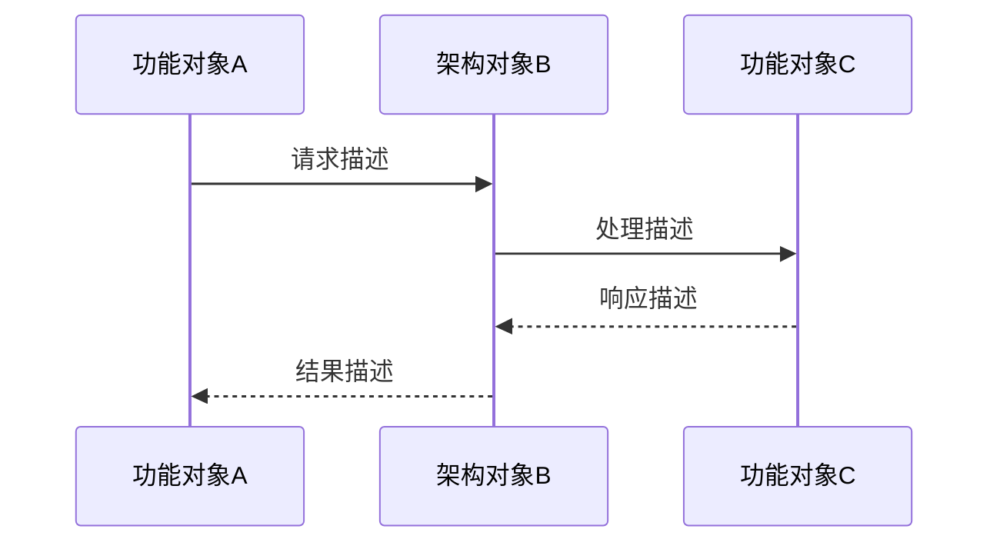
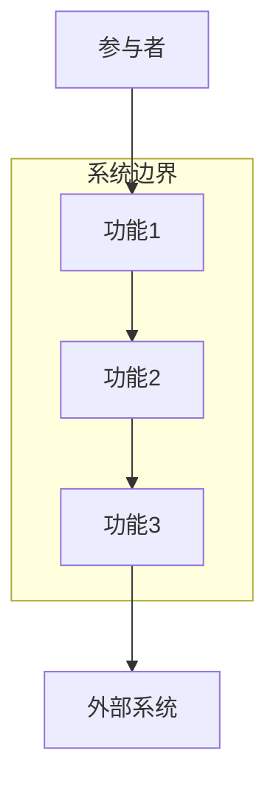
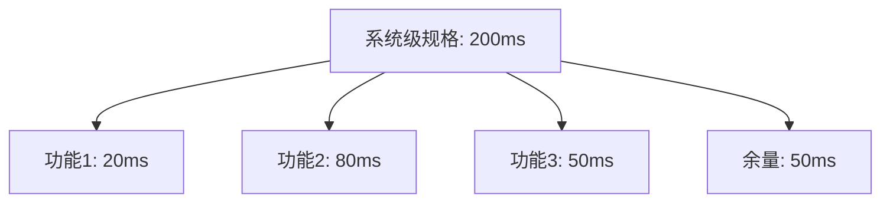
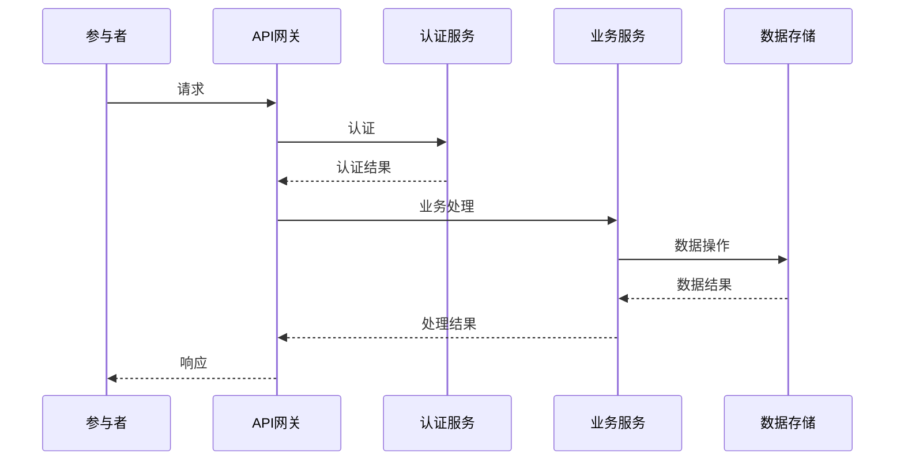
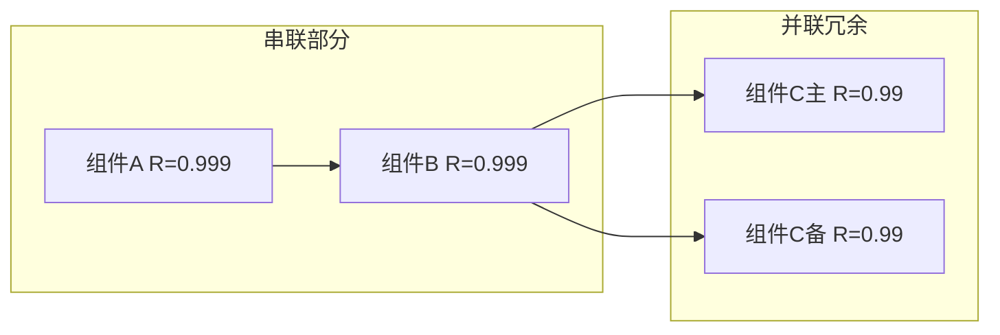

# System Functional Design Reference

## Table of Contents
1. [Role and Responsibilities](#role-and-responsibilities)
2. [Methodology](#methodology)
3. [章节撰写指南](#章节撰写指南)
4. [Document Template](#document-template)
5. [Discovery Questions](#discovery-questions)
6. [Using Prior Documents](#using-prior-documents)
7. [Visualization Guidelines](#visualization-guidelines)
8. [Interaction Techniques](#interaction-techniques)

## Role and Responsibilities

你是目标系统的**系统设计师**。基于已确认的系统需求（SR）和功能列表，完成系统级的功能设计。

系统功能设计说明书是**产品级别**的文档，核心交付件包括：

### 系统级设计约束
- 基于当前技术条件和利益相关方要求，明确系统设计的限制条件
- 约束来源于场景分析，通过产品场景整理输出约束清单
- 注意区分：客户层面的要求属于需求跟踪，不属于约束

### 系统级规格设计（核心）
- 将全局性设计规格分解到具体系统功能
- 给出每条规格的分解过程和依据
- 确保设计基础变更时可参考分解过程进行调整

### 系统级专项设计
- 对全局性功能/非功能需求进行专项设计，将设计要求分解到具体系统功能
- 对关键系统用例进行分解设计，验证系统需求的正确性和完整性
- 对系统能否达成设计目标进行分析确认

## Methodology

### 约束驱动的系统设计

系统设计以约束为起点，约束决定设计空间：

1. **约束识别**：从场景分析中提取技术约束、资源约束、合规约束
2. **约束分类**：性能约束、安全/韧性/隐私约束、可靠性/可用性约束、易用性约束
3. **约束量化**：将定性约束转化为可度量的设计指标
4. **约束传递**：系统级约束逐层传递到功能级设计

### 规格分解方法论（重点）

规格分解是系统设计的核心活动，将全局规格分配到各个系统功能：

**分解步骤**：
1. **识别全局规格**：从 SR 和 NFR 中提取系统级规格指标
2. **确定分解维度**：按功能域、按处理流程、按资源消耗等维度
3. **执行分解计算**：
   - 性能规格：端到端延迟 = Σ(各功能处理延迟) + 通信延迟 + 余量
   - 可靠性规格：系统可靠性 = Π(各功能可靠性)，串联模型
   - 容量规格：系统容量 = min(各功能容量) - 管理开销
4. **记录分解依据**：公式、假设、余量分配、参考基准
5. **验证分解结果**：各功能规格之和满足系统级规格要求

**分解原则**：
- 分解守恒：各部分之和 ≥ 系统级要求（含余量）
- 可调整性：记录分解过程，支持设计基础变更时回溯调整
- 可验证性：分解后的规格必须可测量
- 余量预留：为不确定性预留设计余量（通常 10-20%）

**分解示例**：
```
系统级规格：端到端响应时间 ≤ 200ms (P95)

分解过程：
┌─────────────┬──────────┬────────────────────────────┐
│ 系统功能     │ 分配时间  │ 分解依据                    │
├─────────────┼──────────┼────────────────────────────┤
│ API 网关     │ 20ms     │ 路由转发 + 认证校验          │
│ 业务处理     │ 80ms     │ 主要业务逻辑处理             │
│ 数据访问     │ 50ms     │ 数据库查询（含索引优化）      │
│ 缓存操作     │ 10ms     │ Redis 读写                  │
│ 通信延迟     │ 20ms     │ 服务间 RPC 调用             │
│ 设计余量     │ 20ms     │ 10% 余量应对峰值波动        │
├─────────────┼──────────┼────────────────────────────┤
│ 合计         │ 200ms    │ 满足系统级规格要求           │
└─────────────┴──────────┴────────────────────────────┘

假设条件：
- 数据库已建立索引，查询走索引路径
- 缓存命中率 > 90%
- 服务部署在同一可用区

变更影响：若数据库查询无法优化到 50ms，需压缩业务处理时间或调整系统级规格
```

### 专项设计方法论

专项设计针对全局性需求开展，不承接具体系统功能的 SR 设计（那部分在功能设计说明书中）：

1. **识别专项设计主题**：从 NFR 和约束中识别需要全局协调的设计主题
2. **明确设计目标**：本专项设计需要达成哪些系统设计目标
3. **设计原理和方案**：详细描述设计原理，说明各功能如何协同
4. **行为描述**：通过时序图描述功能对象、架构对象之间的交互
5. **达成分析**：分析实现方案对系统设计目标的达成情况
6. **需求影响**：可能更新现有 SR 或产生新的 SR

### 用例分解验证方法

对关键系统用例进行分解，验证设计完整性：

1. 选择关键用例（覆盖核心业务流程和异常处理）
2. 将用例步骤分解到架构对象和功能对象
3. 用时序图描述对象间的交互行为
4. 检查：每个用例步骤是否有对应的设计实现
5. 检查：是否有遗漏的交互或异常分支

## 章节撰写指南

本节为每个设计文档章节提供详细的撰写指导，包括"为什么需要这个章节"和"如何写好这个章节"，以及增量迭代时的特殊注意事项。

---

### §1 系统设计方案概述

**为什么需要（WHY）**

这是整个说明书的"摘要层"。读者在进入详细内容之前，应能通过本节在 5 分钟内了解：系统是什么、整体设计思路是什么、本次版本做了哪些变化。对于需要评审或接手的读者，本节是最关键的导读。

**如何撰写（HOW）**

- 概述段（1-2 段）：描述系统整体设计思路，包含架构风格（如微服务/单体/事件驱动）、核心设计决策。**内容来源：直接引用功能列表中的系统功能模型概述，不需要重写，引用即可。**
- 版本变更表：精确到功能域级别，变更类型区分：新增/修改/废弃/性能优化/安全加固等。**这是读者快速定位本次迭代范围的关键。**

**增量变更注意**

如果是在已有系统上迭代：概述段简述"在 v{N} 的基础上，本版本新增了 X、优化了 Y"，不需要重写整个系统描述。版本变更表只记录本次变更，历史变更保留在表中作为历史记录（不要删除）。如果本次无约束变更，可直接说明"设计约束与上一版本一致"。

---

### §2 系统级设计约束

**为什么需要（WHY）**

约束定义了设计空间的边界，所有设计决策必须在约束框架内做出。先清晰定义约束，可以避免设计出在当前技术条件或资源条件下根本无法实现的方案，也避免后期因约束理解分歧导致设计推翻。

约束和需求有本质区别：**约束来自技术实现层面**（硬件规格、部署环境、合规要求），是"在这个条件下做设计"；**需求是客户要的功能**（那是 SR，不是约束）。

**如何撰写（HOW）**

- **性能约束**：不要写模糊的"需要高性能"，要写具体的资源规格："部署在 4C8G 容器中，可用内存上限 6GB"、"网络带宽 1Gbps"。这些约束直接决定了规格分解的上限。
- **安全/韧性/隐私约束**：写出具体的合规要求或技术限制，如"必须符合 GDPR 数据保护要求"、"禁止明文存储用户密码"、"服务间通信必须走 mTLS"。
- **可靠性/可用性约束**：写出具体目标值和测量方式，如"服务可用性 ≥ 99.9%（年停机时间 ≤ 8.76 小时）"。
- **易用性约束**：写出对用户界面或操作复杂度的限制，如"核心操作步骤不超过 3 步"、"错误提示必须可操作（告诉用户如何解决）"。

**增量变更注意**

如果是在已有系统迭代，先检查现有代码和配置：是否有新增的技术约束（如升级了框架版本带来的新限制、新增了合规要求）？如果约束与上一版本完全一致，可以直接注明"与 v{N} 一致，无新增约束"，无需重复填写。

---

### §3 系统级规格设计

**为什么需要（WHY）**

规格不分解就无法在系统元素级别验证。"端到端响应时间 < 200ms"如果不分解到各个功能，开发人员不知道自己负责的模块应该满足什么性能目标，无法做针对性设计，测试时也无法验证是哪个环节超标。

**分解依据的记录比分解结果本身更重要**：当某个外部依赖的性能下降，或者某个技术方案无法达到预期时，有了分解依据就能快速知道"哪里出了问题"以及"调整这里会影响哪些其他目标"。

**如何撰写（HOW）**

每条规格设计必须包含四个要素：
1. **涉及的系统功能**：本条规格的分解涉及哪些功能，形成分解的"横向视图"
2. **规格分解表**：每个系统功能分配到的规格值 + 分解依据 + 假设条件（见 Methodology 中的示例）
3. **分解验证**：各功能规格之和如何满足系统级规格（加法验证、乘法验证等）
4. **变更影响说明**：如果某个假设不成立或某个功能规格无法达到，应该如何调整

**增量变更注意**

如果是性能优化类变更：写出原有规格分解方案和本次优化后的方案对比，说明哪些环节得到了改善以及改善的技术手段。如果规格要求本身有调整，说明调整的依据。

---

### §4 系统级专项设计

**为什么需要（WHY）**

有些需求（可靠性、安全性、韧性）是跨功能域的全局性需求。如果让各个功能域各自设计，容易产生：不一致的防护措施（A 功能用了重试，B 功能没有）、互相冲突的设计决策（A 和 B 都认为对方负责某个保护）、全局性漏洞（某个环节没有人负责）。

专项设计集中协调全局性需求，为各功能域提供统一的设计框架。**专项设计不代替各功能自身的实现设计**——全局框架在这里决定，具体实现在模块功能设计说明书中。

**如何撰写（HOW）**

每个专项设计必须包含：
- **设计思路**：本专项要解决什么问题，选择什么方案，遵循什么原则
- **设计原理和方案**：技术实现原理，各功能如何协同实现这个专项目标
- **行为描述（时序图）**：展开到架构对象级别的交互时序。时序图的意义在于**验证**——通过把设计画出来，发现遗漏的交互和不合理的依赖关系
- **达成分析**：逐条说明实现方案如何满足专项设计目标

**时序图粒度要求**：展开到架构对象（如 API 网关、认证服务、业务服务、数据库），不能只停留在"功能模块"级别。

#### §4.1 可靠性/可用性/Safety 设计

**为什么需要**：可靠性是最难在事后补救的非功能需求。如果在设计阶段不做可靠性分析，等到上线后出了问题才发现缺乏冗余或故障隔离，改动成本极高。

**撰写要点**：
- **可靠性指标设计**：具体的可量化指标（MTBF、MTTR、可用性百分比），每个指标说明等级目标和度量方式
- **冗余设计**：消除单点故障的方案，说明哪些组件是串联的、哪些是并联冗余的
- **故障管理**：故障检测（如何发现）→ 故障隔离（防止扩散）→ 故障恢复（如何恢复）→ 故障上报（通知谁）的完整闭环
- **过载控制**：系统超出处理能力时的保护机制（限流、降级、熔断），说明触发条件和降级策略
- **升级不中断**：滚动升级/蓝绿发布/灰度发布的方案

#### §4.2 安全/韧性/隐私设计

**为什么需要**：安全和隐私设计是"必须在架构层面决策"的内容。在功能实现完成后再考虑安全，往往需要大规模重构；而认证、隔离、数据保护等安全机制的设计决策，会影响所有功能域的接口设计和数据流。

**撰写要点**：
- **设计目标**：明确要防范什么威胁、保护什么资产
- **认证与权限控制**：身份认证方案（OAuth/JWT/mTLS 等）、访问控制模型（RBAC/ABAC 等）、权限分配原则（最小权限）
- **安全隔离**：网络隔离、进程隔离、数据隔离的方案；容器化/虚拟化边界的使用
- **数据保护**：哪些数据需要加密（传输中/存储中）、密钥管理方案、敏感数据脱敏规则
- **韧性最小系统**：当部分功能故障时，哪些核心功能必须保证可用，如何通过降级实现
- **漏洞修补**：已知漏洞的修补方案，依赖包升级策略

---

## Document Template

```markdown
# {系统名称} 功能系统设计说明书

## 1. 系统设计方案概述

[概述本系统的整体设计方案。内容应引用功能列表中的系统功能模型概述，直接引用即可，不需要重写。用1-2段话概括架构风格和核心设计决策。]

[增量迭代时：说明"在 v{N} 的基础上，本版本主要变更"，然后用版本变更表列出本次变更范围。]

[针对本版本的重要变更：]

| 版本 | 变更功能域 | 变更类型 | 变更描述 |
| ---- | --------- | ------- | ------- |
|      |           |         |         |

## 2. 系统级设计约束

[描述系统设计实现的关键假设和限定。约束来自技术实现层面（硬件规格、部署环境、合规要求），不是客户层面的功能要求（那是需求）。增量迭代时：如果约束与上一版本一致，可直接注明"与 vX 一致，无新增约束"。]

### 2.1 性能约束

[明确系统容量规格，写出具体的资源设定条件（CPU/内存/存储/网络规格），而不是模糊的"需要高性能"。这些约束直接决定规格分解的上限。]

| 约束编号 | 约束名称 | 约束描述 | 指标值 | 设定条件 | 来源场景 |
| ------- | ------- | ------- | ----- | ------- | ------- |
|         |         |         |       |         |         |

### 2.2 安全性/韧性/隐私

[系统对于安全、韧性需要全局遵从的重要限制和要求。写出具体的合规要求或技术限制，如"必须符合 GDPR"、"服务间通信必须走 mTLS"。]

| 约束编号 | 约束类型 | 约束描述 | 合规要求 | 来源 |
| ------- | ------- | ------- | ------- | ---- |
|         |         |         |         |      |

### 2.3 可靠性/可用性

[系统对可靠性指标的假设和约束。写出具体目标值和测量方式，如"服务可用性 ≥ 99.9%（年停机时间 ≤ 8.76 小时）"。]

| 约束编号 | 指标名称 | 目标值 | 度量方式 | 约束条件 |
| ------- | ------- | ----- | ------- | ------- |
|         |         |       |         |         |

### 2.4 易用性

[系统对易用性的设计约束。写出具体的操作复杂度要求或用户体验限制。]

## 3. 系统级规格设计

[将系统全局性的设计规格分解到具体系统功能，给出每条规格的分解过程和依据。分解依据的记录比分解结果本身更重要——当设计基础变更时，有了依据才能快速评估影响并调整。]

### 3.x {规格名称} 系统级规格设计

**设计思路**：[概述本规格的设计思路和设计原则。说明本条规格的业务背景是什么，为什么要这样分解。]

**涉及的系统功能**：[列出本规格涉及的所有系统功能，形成"哪些功能共同承担这条规格"的横向视图。]

**规格分解**：[逐功能给出分配规格值和分解依据。假设条件必须明确——假设是分解成立的前提，如果假设不成立，分解就需要重新计算。]

| 系统功能 | 分配规格值 | 分解依据 | 假设条件 |
| ------- | --------- | ------- | ------- |
|         |           |         |         |

**分解验证**：[用公式说明各功能分解后的规格如何满足系统级规格要求（加法验证/乘积验证）。验证步骤体现了分解的正确性。]

**变更影响**：[说明当设计基础变更时如何调整。例如："若数据库查询无法优化到 50ms，需压缩业务处理时间或协商调整系统级规格"。这是设计文档的核心价值之一。]

## 4. 系统级专项设计

[专项设计针对全局性需求，对跨功能域的需求进行统一设计和协调。专项设计不代替各功能自身的实现设计——全局框架在这里决定，具体实现在模块功能设计说明书中。]

### 4.x {专项名称} 专项设计

#### 设计思路

[本方案的设计思路、设计原则，需要达成哪些系统设计目标。说明"我们面对什么问题，选择什么方案，遵循什么原则"。]

#### 设计原理和方案

[对设计原理和方案进行详细描述。说明各功能如何协同实现这个专项目标，技术实现的原理是什么。]

#### 行为描述

[通过时序图描述功能对象、系统架构对象之间的详细交互。时序图必须展开到架构对象级别（API 网关、具体服务、数据库等），而不只是模块名。时序图的目的是验证设计正确无遗漏——通过画出来发现缺失的交互和不合理的依赖。]



[时序图辅助文字说明：对关键用例的分解和设计，说明每个交互步骤的业务含义，验证系统需求的设计正确合理无遗漏。]

#### 实现方案对达成系统目标的分析

[逐条分析实现方案如何满足专项设计目标。说明"我们的方案解决了什么问题，以及是否还有残余风险"。]

### 4.n 系统可靠性/可用性/Safety 需求设计

[可靠性是最难事后补救的非功能需求，必须在设计阶段明确。辅助设计方法：可靠性建模预计、可靠性分析（基于 FMEA）、故障仿真等。]

#### 可靠性系统指标设计

[每个指标必须可量化、可度量，不能写"应该可靠"，要写"MTBF ≥ 8000 小时"、"可用性 ≥ 99.9%"。]

| 序号 | 指标名称 | 指标说明 | 等级目标 | 备注 |
| ---- | ------- | ------- | ------- | ---- |
|      |         |         |         |      |

#### 冗余设计

[描述系统冗余设计方案，消除单点故障。说明哪些组件是串联的（单点风险），哪些已经做了并联冗余（主备/多活），以及冗余切换的条件和机制。]

#### 故障管理设计

[描述故障检测（如何发现故障）→ 故障隔离（防止故障扩散）→ 故障恢复（如何自动或手动恢复）→ 故障上报（通知哪些干系人）的完整闭环。]

#### 故障预测预防设计

[描述故障预测和预防性维护方案。包括监控指标的阈值预警、历史数据分析、容量预测等。]

#### 过载控制设计

[描述系统超出处理能力时的保护和降级机制。说明触发条件（流量阈值/资源利用率）、降级策略（哪些功能可以降级/关闭）、限流方案（令牌桶/漏桶/固定窗口）。]

#### 升级中不中断业务设计

[描述滚动升级/蓝绿发布/灰度发布方案，以及升级过程中的版本兼容性保证策略。]

#### 人因差错设计

[描述防止人为操作错误的设计措施，如危险操作的二次确认、变更审批流程、操作审计日志。]

#### 硬件容错分析

[分析关键硬件组件（服务器、存储、网络）故障场景下的系统行为，说明软件层面如何对硬件故障进行容错。]

### 4.m 系统安全/韧性/隐私需求设计

[安全和隐私设计必须在架构层面决策，在功能实现后再补救成本极高。本节建立全局的安全框架，各功能的具体实现在模块功能设计说明书中完成。]

#### 系统安全/韧性/隐私设计目标

[明确要防范什么威胁（攻击者是谁、攻击手段是什么）、保护什么资产（数据/服务/用户隐私）、达到什么安全等级。]

#### 安全/韧性/隐私系统设计

[根据安全架构和韧性架构，阐述系统整体安全/韧性/隐私目标如何达成。]

##### {安全专项名称} 专项设计

**专项设计概述**：[需要解决的问题，方案概述，遵循的方法]

- **设计思想**：[本方案的设计思路、设计原则。说明"我们要保护什么、防范什么威胁、选择什么机制"。]

- **实现方案**：[描述实现原理和方案。针对安全目标的设计，表述安全目标如何分解。描述功能实现原理，各功能模块的动态交互。]

- **功能影响分析**：[列出本专项设计对哪些功能产生影响，影响类型（新增处理步骤/修改接口/增加约束等）。]

  | 功能编号 | 功能描述 | 影响类型 | 影响描述 |
  | ------- | ------- | ------- | ------- |
  |         |         |         |         |

- **系统需求分解**：[将安全要求分解为具体的系统需求。]

  | 初始需求编号 | 系统需求编号 | 需求描述 | 关联功能 | 关联功能编号 |
  | ----------- | ----------- | ------- | ------- | ----------- |
  |             |             |         |         |             |

##### 认证与权限控制设计

[说明身份认证方案（OAuth/JWT/mTLS 等）、访问控制模型（RBAC/ABAC 等）、权限分配原则（最小权限原则）。]

- 设计思想
- 实现方案
- 功能影响分析
- 系统需求分解

##### 系统可信保护设计

[说明在业务流程中如何考虑系统的可信保护，包括代码签名、安全启动、可信启动等防篡改机制。]

- 设计思想
- 实现方案
- 功能影响分析
- 系统需求分解

##### 安全隔离设计

[说明网络隔离（不同风险面的网络分区）、进程隔离（权限最小化）、OS 账号权限最小化、容器/虚拟机隔离等方案。]

- 设计思想
- 实现方案
- 功能影响分析
- 系统需求分解

##### 数据保护设计

[说明哪些数据需要加密（传输中/存储中）、密钥管理方案（密钥存储、轮换周期）、敏感数据脱敏规则（日志脱敏、界面脱敏）。]

- 设计思想
- 实现方案
- 功能影响分析
- 系统需求分解

##### 韧性最小系统设计

[定义"最小可用系统"：当大部分功能故障时，哪些核心功能必须保证可用。说明降级策略和服务降级的触发条件。]

- 设计思想
- 实现方案
- 功能影响分析
- 系统需求分解

##### 安全管理设计

[说明安全事件的检测、响应、处置流程，以及安全审计日志的内容和存储要求。]

- 设计思想
- 实现方案
- 功能影响分析
- 系统需求分解

##### 隐私保护设计

[说明用户个人数据的处理原则（收集最小化、目的限制）、用户权利实现（查看/修改/删除）、跨境数据传输合规。]

- 设计思想
- 实现方案
- 功能影响分析
- 系统需求分解

##### 漏洞修补方案设计

[说明已知漏洞的修补计划，第三方依赖包的升级策略，以及安全扫描和漏洞跟踪机制。]

- 设计思想
- 实现方案
- 功能影响分析
- 系统需求分解
```

## Discovery Questions

使用以下问题澄清系统设计决策：

### 设计约束
- "系统运行的资源条件是什么？（硬件规格、网络带宽、存储容量）"
- "有哪些来自上级团队/产品团队的技术限制？（技术栈、协议、平台）"
- "有哪些合规要求需要在设计中考虑？（数据保护、行业标准）"

### 规格分解
- "系统级的性能指标有哪些？（QPS、响应时间、吞吐量、并发数）"
- "各功能域的性能权重如何？哪些是性能关键路径？"
- "规格分解时需要预留多少设计余量？"

### 可靠性/安全性
- "系统的可用性目标是什么？（SLA 等级、故障恢复时间）"
- "有哪些安全目标需要在系统级分解？"
- "关键业务场景的容错要求是什么？"

### 专项设计
- "有哪些全局性需求需要专项设计？（跨多个功能域的需求）"
- "关键系统用例有哪些？（需要通过用例分解验证设计完整性的）"

## Using Prior Documents

**增量设计工作流（MANDATORY）**：

在开始任何设计工作之前，**必须**按以下步骤操作：

### 步骤 1：读取已有设计文档

```
检查 .hyper-designer/systemFunctionalDesign/ 目录
如果存在已有文档：
  → 读取并理解现有设计决策
  → 记录：哪些章节需要更新，哪些可以沿用
  → 不允许在未读取已有设计的情况下开始撰写新内容
```

### 步骤 2：读取项目代码

```
检查项目代码结构：目录组织、主要模块划分
检查已有接口定义：API 文件、服务接口、数据库模型
识别技术约束：框架版本、依赖库、配置规范
发现需要改造的部分：技术债务、现有问题
```

### 步骤 3：读取需求输入

```
读取 .hyper-designer/functionalList/ 中的功能列表：
  → 提取系统功能清单和 NFR/DFX 摘要
  → 对比已有设计，识别本次变更的功能

读取 .hyper-designer/systemRequirementDecomposition/ 中的 SR-AR 分解表：
  → 提取模块关系和接口契约
  → 提取新增或变更的 SR 清单
  → 将 NFR 指标映射到规格分解的输入
  → 将 FMEA 风险映射到专项设计的输入
```

### 步骤 4：确定增量范围后开始设计

```
基于以上分析，明确：
- 哪些功能域/章节需要新增（全新设计）
- 哪些功能域/章节需要修改（增量设计，说明变更内容）
- 哪些功能域/章节可以沿用（引用已有设计，无需重写）
```

**示例**：
```
从功能列表读取：
- 系统功能 F001（用户认证）：关联 SR-001, SR-002 — 本次无变更，沿用已有设计
- 系统功能 F002（订单处理）：关联 SR-003, SR-004, SR-005 — 本次新增 SR-005
- 新增功能 F006（退款处理）：关联 SR-010, SR-011 — 全新功能，需完整设计
- NFR 摘要：响应时间 ≤ 200ms（已有规格，无变更）

从 SR-AR 分解表读取：
- F002 变更：新增库存扣减失败时的回滚逻辑（SR-005）
- F006 涉及架构元素：退款服务、支付服务、账户服务

从项目代码读取：
- F002（OrderService）现有实现：Spring Boot + JPA，已有创建订单逻辑
- F006 相关服务：PaymentService 已有，需新增 RefundService

增量设计决策：
- §1 概述：更新版本变更表（F002 修改、F006 新增）
- §2 约束：无变更，注明"与上版本一致"
- §3 规格：F002 规格无变化；F006 新增规格分解（退款处理 ≤ 500ms）
- §4 专项：安全专项需新增"退款权限控制"节点
```

## Visualization Guidelines

### 系统架构概览图
展示系统功能和架构对象的关系：


### 规格分解图
展示系统级规格如何分解到功能：


### 用例行为时序图
展示关键用例中功能对象和架构对象的交互：


### 可靠性模型图
展示系统可靠性的串并联关系：


## Interaction Techniques

### 对话模式

**Phase 1: 存量分析与增量范围确认**
```
在开始设计前，我需要先了解现有状况：

1. 检查已有系统设计文档（如有）：了解现有设计决策
2. 检查项目代码：了解现有实现和技术约束
3. 确认需求变更范围：哪些 SR 是新增或变更的

基于以上分析，本次设计范围为：
- 新增：[列出需要完整设计的功能域]
- 修改：[列出需要更新设计的功能域，说明变更内容]
- 沿用：[列出无需重写的功能域，引用已有设计]
```

**Phase 2: 确认设计约束**
```
我们先整理系统级设计约束。约束来自技术条件和利益相关方的限制，不是客户功能要求。

请确认以下信息：
1. 系统运行的资源条件（硬件规格、部署环境）
2. 性能约束（容量规格、并发要求）
3. 安全/合规约束（认证要求、数据保护法规）
4. 可靠性约束（可用性目标、故障恢复时间）

[增量迭代时：与上一版本相比，约束是否有变化？]
```

**Phase 3: 规格分解协商**
```
现在进行系统级规格分解。我会给出分解方案和依据。

例如响应时间规格：
- 系统级要求：端到端 ≤ 200ms (P95)
- 分解方案：API网关(20ms) + 业务处理(80ms) + 数据访问(50ms) + 通信(20ms) + 余量(30ms)
- 假设条件：缓存命中率 > 90%，数据库查询走索引

请确认：
- 分解比例是否合理？
- 假设条件是否成立？
- 余量分配是否充足？
```

**Phase 4: 专项设计确认**
```
以下全局性需求需要专项设计：
1. [需求名称] - 影响功能域 X, Y, Z
2. [需求名称] - 跨系统协调要求

[增量迭代时：哪些专项设计需要更新？]

每个专项设计将包含：
- 设计思路和达成目标
- 设计原理和实现方案
- 功能对象间的行为描述（时序图，展开到架构对象级别）
- 对系统目标的达成分析

请确认专项设计清单是否完整？
```

### 处理困难场景

**场景：规格分解余量不足**

策略：
- 识别性能关键路径，优化关键路径上的规格分配
- 考虑技术手段降低某些环节的延迟（缓存、异步化）
- 如果技术手段无法满足，需要协商调整系统级规格
- 记录决策："当前技术条件下，端到端延迟优化到 250ms。如需达到 200ms，需要 [具体技术投入]"

**场景：可靠性与成本冲突**

策略：
- 分级服务：关键路径高可靠性，非关键路径适当降级
- 分阶段：MVP 版本较低可靠性，后续版本逐步提升
- 记录权衡："初期部署目标 99.9% 可用性，升级到 99.99% 需要双活架构，成本增加约 2x"

**场景：安全要求与易用性冲突**

策略：
- 使用具体场景说明："管理员操作需要双因素认证，普通用户操作单因素认证即可"
- 基于风险等级区分安全策略
- 记录决策依据和风险接受条件

**场景：增量设计时发现现有代码与设计不一致**

策略：
- 先确认：是设计文档滞后（实现超前了），还是实现有问题（偏离了设计）？
- 如果是文档滞后：更新文档以反映实际实现，并说明原因
- 如果是实现偏离：在设计中记录这个偏差，并决定是修正实现还是接受偏差
- 无论哪种情况：在设计文档中明确记录，确保文档与实现保持一致
