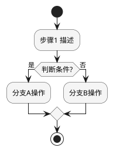
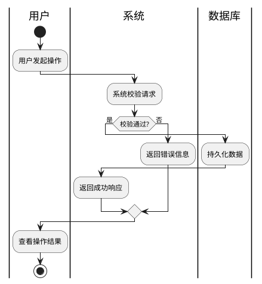

# Skill: Functional List Refinement（功能列表梳理）

## 技能概述

**输入**：用例文档 + 功能场景文档 + IR 约束文档  
**输出**：`{功能名}功能列表.md`（必选）+ `{功能名}FMEA.md`（高风险功能必选）  
**核心价值**：将用例中的业务意图转化为可实现、可测试、可追溯的功能清单，并评估对现有系统功能的影响

---

## 执行流程总览

```
[输入] 用例文档 + 功能场景文档 + IR 约束
    │
    ▼
【Step 1】读取与理解用例
    │  提取主流程 / 备选流程 / 异常流程 / DFX属性
    ▼
【Step 2】功能拆解（新增 vs 修改）
    │  每个功能绑定来源场景；每个场景控制 1-3 个功能
    ▼
【Step 3】活动图分析（复杂流程必须）
    │  PlantUML 泳道图，覆盖全流程分支
    ▼
【Step 4】影响分析
    │  新增需求/场景对现有功能的增/删/改影响
    ▼
【Step 5】NFR/DFX 提取
    │  从上游文档聚合非功能需求
    ▼
【Step 6】高风险功能识别 → FMEA 分析
    │  判断是否需要 FMEA，若需要则输出 FMEA 文档
    ▼
[输出] 功能列表.md  +  （可选）FMEA.md
```

---

## Input Context

Before beginning analysis, scan all available context sources in the current workspace. Do not assume fixed file locations — look for:

- **Use case document** (required): contains main flow, alternative flows, exception flows, DFX attributes
- **Scenario document** (required): used to bind each function back to its originating scenario
- **IR / Requirement document** (supplementary): for extracting constraints and non-functional requirements
- **Existing functional documentation** (if present): for impact analysis against current system functions

---

## Step 1：读取与理解用例

**目标**：全面解析用例文档，建立分析基础。

从每个用例中提取以下内容：

| 提取项 | 说明 |
|--------|------|
| 主流程 | 成功路径，将映射为核心功能 |
| 备选流程 | 可选路径，将映射为分支/可选功能 |
| 异常流程 | 失败处理，将映射为容错/降级功能 |
| 业务规则 | 将转化为功能规则约束 |
| DFX 属性 | 性能、安全、可靠、隐私指标，进入 NFR 汇总 |

> **检查点**：若用例缺少 DFX 属性定义，使用微确认问题向用户确认，不得自行假设。

---

## Step 2：功能拆解

**目标**：将用例流程拆解为粒度合适的功能点，明确每个功能是「新增」还是「修改」，并绑定来源场景。

### 场景绑定规则

**每个功能必须关联到其来源场景**，在功能描述中标注 `来源场景：[场景名称]`。

**每个场景对应的功能数量上限为 3 个**。若分析结果超过 3 个，必须在继续前与用户确认（见「场景功能数量超限确认」对话模式）。

### 粒度控制原则

```
❌ 太粗：整个模块作为一个功能（如「用户管理」）
✅ 合适：单一职责、独立可实现、独立可测试（如「用户登录认证」）
❌ 太细：每个字段校验都是一个功能
```

### 用例到功能的映射规则

```
用例主流程   → 核心功能（Must 优先）
用例备选流程 → 可选/分支功能（Should / Could）
用例异常流程 → 容错/降级功能（Must / Should）
```

### 新增 vs 修改的判断标准

- **新增功能**：现有系统中完全不存在对应实现，需要全新开发
- **修改功能**：现有功能需调整行为、规则或数据结构

### 工作草稿格式

```markdown
## 场景到功能映射草稿

- 场景「用户登录」→ F001（新增：登录认证）、F002（新增：登录失败处理）
- 场景「权限管理」→ F003（新增：角色配置）⚠️ 是否还需拆分？待确认

## 初步优先级（MoSCoW）
- Must: F001, F002
- Should: F003

## 待确认问题
- [ ] 场景「X」初步识别出 4 个功能，是否需要拆分场景或合并功能？
```

完成草稿后，使用**功能确认对话**与用户同步（见「与用户协作模式」章节）。

---

## Step 3：活动图分析（复杂流程必须）

**触发条件**（满足任一即需绘制）：
- 流程包含 3 个以上判断分支
- 涉及多个角色/系统交互
- 存在多条异常处理路径
- 流程中有并发或等待节点

**绘制原则**：
- 使用 PlantUML 语法
- 多角色场景必须使用泳道（swimlane）
- 必须覆盖：主流程 + 所有备选流程 + 所有异常流程
- 活动图嵌入功能列表文档的「功能分析思路」章节

### 基础活动图模板



### 泳道活动图模板（多角色）



---

## Step 4：影响分析

**目标**：分析新增需求和场景对现有系统功能的影响，这是本阶段的核心交付价值。

影响分析需回答：**引入这批新功能后，现有系统中哪些功能需要随之变动？**

### 影响类型

| 影响类型 | 说明 | 典型场景 |
|---------|------|---------|
| **增** | 现有功能需新增字段、接口、数据表或行为 | 用户表新增锁定状态字段 |
| **改** | 现有功能的逻辑、规则或数据结构需要调整 | 日志模块增加新的事件类型 |
| **删** | 现有功能的某些能力需要移除 | 废弃旧的认证方式 |

### 影响分析执行要点

- 对每一个新增或修改的功能，逐一检查对现有功能的连锁影响
- 影响描述需具体：说明影响哪个功能、影响什么、如何影响
- 发现影响时，主动通知用户确认（见「影响分析确认」对话模式）

> **重要**：若无现有系统文档，如实告知用户，并根据对话中掌握的背景信息进行合理推断，同时标注为「推断，待确认」。

---

## Step 5：NFR/DFX 提取

### 来源扫描

从所有可用上游文档中提取非功能需求：

| 来源类型 | 标注方式 |
|---------|---------|
| IR 约束文档 | 标注为 `IR 约束` |
| 场景文档 | 标注为 `场景需求` |
| 用例 DFX 属性 | 标注为 `UC DFX` |

### DFX 分类

| 类别 | 关注指标 |
|------|---------|
| 性能 | 响应时间、吞吐量、并发数 |
| 安全 | 认证等级、加密标准、权限控制 |
| 可靠 | 可用性、故障恢复、数据完整性 |
| 隐私 | 数据脱敏、访问审计、合规性 |

### 整合规则（strictest-metric）

- 数值型指标：取最严格值（响应时间取最小，可用性取最大）
- 枚举型指标：取最高标准（AES-256 优于 AES-128）
- 冲突时优先级：`IR 约束 > 场景需求 > UC DFX`

---

## Step 6：高风险功能识别与 FMEA 分析

### 高风险功能识别标准

满足以下任一条件，该功能需进行 FMEA 分析：

| 风险类型 | 典型场景 |
|---------|---------|
| 业务关键路径 | 支付、订单提交、数据迁移 |
| 不可逆操作 | 数据删除、账号注销、资金转移 |
| 外部依赖 | 第三方 API、硬件接口 |
| 并发敏感 | 库存扣减、余额变更 |
| 安全敏感 | 认证、授权、敏感数据处理 |

### FMEA 分析执行步骤

**步骤 1**：列举该功能所有可能的失效模式（"什么会出错？"）  
**步骤 2**：分析每种失效模式的影响后果（"出错后会怎样？"）  
**步骤 3**：评估严重度（S）和发生概率（O）  
**步骤 4**：计算风险等级 = S × O

```
低风险：S × O ≤ 6
中风险：7 ≤ S × O ≤ 15
高风险：S × O ≥ 16
```

**步骤 5**：针对中/高风险条目提出具体建议措施

详细评级标准和输出格式见 `references/fmea-template.md`。

---

## 与用户协作模式

### 场景功能数量超限确认（Step 2，超过 3 个时触发）

```
"场景「[场景名称]」初步识别出 [N] 个功能点：
- F00X [功能名]
- F00Y [功能名]
- ...

超过了建议上限（1-3 个）。请确认：
1. 是否需要将该场景拆分为多个更细粒度的场景？
2. 或者合并其中几个功能为一个功能？
3. 或者确认保留 [N] 个，继续分析？"
```

### 功能确认对话（Step 2 完成后触发）

```
"我从用例/场景中提取了 X 个功能点，请确认：

【新增功能】
- F001 用户登录认证（Must）来源场景：用户登录
  验证用户身份，创建会话
- F002 登录失败处理（Must）来源场景：用户登录
  记录失败次数，超限锁定账号

【修改功能】
- F010 用户管理（Should）来源场景：权限管理
  需增加账号锁定状态字段

确认项：
1. 功能拆分粒度是否合理？
2. 是否有遗漏的功能？
3. 优先级（MoSCoW）是否准确？"
```

### 影响分析确认（发现现有功能影响时触发）

```
"新功能「登录失败处理」会影响以下现有功能：
- 用户管理（改）：需增加账号锁定状态字段
- 日志记录（改）：需新增登录失败事件类型

请确认：
1. 以上影响分析是否准确？
2. 是否需要评估版本兼容性或调整现有功能设计？"
```

### 微确认问题（发现信息缺失时触发）

```
"用例的「性能」DFX 属性未提供量化指标。
请提供具体数值（如响应时间 < 200ms），或确认暂不设定。"
```

```
"功能 F-NNN 与 F-MMM 的职责存在重叠：[具体描述]。
请确认拆分方式，或说明归属。"
```

---

## 输出文件规范

### 主输出：`{功能名}功能列表.md`

文档结构（详细模板见 `references/functional-list-template.md`）：

1. 功能分析思路与结果总结（含活动图、场景到功能映射）
2. 功能描述（每个功能：来源场景 / 内容 / 规则 / 约束 / 影响分析 / 优先级）
3. NFR/DFX 汇总表

### 辅助输出：`{功能名}FMEA.md`（仅高风险功能）

格式见 `references/fmea-template.md`。

---

## 质量检查清单

**功能完整性**
- [ ] 所有用例均已映射到功能，新增/修改标注清晰
- [ ] 每个功能标注了来源场景
- [ ] 每个场景对应功能数量 ≤ 3，或已获用户确认
- [ ] 每个功能描述为 1-2 句话，职责单一
- [ ] 每个功能的业务规则已整理
- [ ] 每个功能的约束条件已列出

**流程分析**
- [ ] 复杂用例（3个以上分支）已绘制活动图
- [ ] 活动图覆盖主流程、备选流程、异常流程

**影响分析**
- [ ] 每个新功能的影响分析已填写
- [ ] 影响描述具体（涉及哪个功能、影响什么、如何影响）
- [ ] 已通知用户确认重要影响点

**非功能需求**
- [ ] NFR/DFX 已从所有上游文档提取
- [ ] 同类别指标已按 strictest-metric 规则整合
- [ ] 每条 NFR 已标注来源和受影响的功能编号

**优先级与风险**
- [ ] 所有功能已标注 MoSCoW 优先级
- [ ] 高风险功能已识别并完成 FMEA 分析

---

## 成功标准

| 标准 | 验证方式 |
|------|---------|
| 功能列表完整，覆盖所有用例和场景 | 场景数 vs 功能映射数 |
| 每个功能有明确来源场景 | 逐条检查来源场景标注 |
| 每个场景功能数量合理（≤3 或已确认） | 统计各场景功能数 |
| 影响分析准确，可指导现有功能调整 | 与用户确认影响范围 |
| MoSCoW 优先级合理 | 用户确认 |
| NFR/DFX 汇总完整 | 覆盖所有 DFX 类别 |
| 高风险功能完成 FMEA 分析 | FMEA 文档存在且条目完整 |