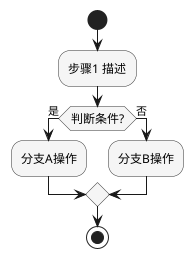
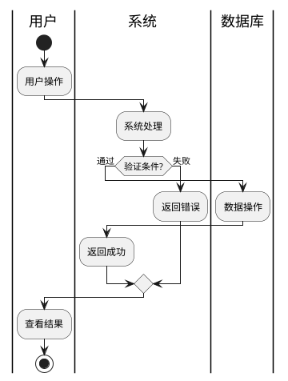

# 功能列表文档模板

## 文档结构

**输出文件：** `{功能名}功能列表.md`

```markdown
# {系统名称} 功能列表

## 功能分析思路与结果总结

[简要描述分析方法：从场景和用例到功能的映射，哪些场景需要新增功能，哪些场景涉及对现有功能的修改]

示例：
- 场景「用户登录」→ 新增功能 F001（登录认证）、F002（登录失败处理）
- 场景「权限管理」→ 修改功能 F005（用户管理），新增功能 F006（角色配置）

[如有复杂流程，在此嵌入活动图]


## 功能描述

### F001 {功能名称}

**来源场景**: [对应的场景名称]

**功能内容**: [1-2 句话描述功能做什么]

**功能规则**: [业务规则，例如：密码必须至少8位，包含字母和数字]

**功能约束**: [约束条件，例如：同一账号每天最多登录失败5次]

**功能影响分析**:

| 被影响功能 | 影响类型 (增/改/删) | 影响描述 |
|-----------|------------------|---------|
| [现有功能名称] | 改 | [具体说明需要做什么改动] |
| [现有功能名称] | 增 | [具体说明需要新增什么] |

**优先级**: Must/Should/Could/Won't (MoSCoW)

### F002 {功能名称}

**来源场景**: [对应的场景名称]

...


## 非功能需求 (NFR/DFX) 汇总

| DFX 类别 | 来源 | 具体要求 | 量化指标 | 影响的功能编号 |
|---------|------|---------|---------|--------------|
| 性能 | IR 约束 / 场景需求 / UC DFX | [具体要求描述] | [量化指标] | F001, F002 |
| 安全 | IR 约束 / 场景需求 / UC DFX | [具体要求描述] | [量化指标] | F001, F003 |
| 可靠 | IR 约束 / 场景需求 / UC DFX | [具体要求描述] | [量化指标] | F002 |
| 隐私 | IR 约束 / 场景需求 / UC DFX | [具体要求描述] | [量化指标] | F001 |

**整合规则**:
1. **来源覆盖**: 从所有上游文档（IR 约束、场景需求、用例 DFX 属性）中提取
2. **指标合并**: 同一 DFX 类别存在多个要求时，采用最严格指标（strictest-metric rule）
3. **功能影响**: 标注受影响的功能编号，确保设计时覆盖

如存在高风险功能，请参阅独立交付物：`{功能名}FMEA.md`
```

---

## 活动图分析模板（PlantUML）

**何时使用活动图：**

- 用例流程复杂，包含多个分支和判断
- 涉及多个系统或角色交互
- 异常处理路径较多

**PlantUML 基础活动图模板：**



**带泳道的活动图模板（多角色协作）：**



---

## 示例：用户登录功能

```markdown
# 用户认证系统 功能列表

## 功能分析思路与结果总结

从场景「用户登录」提取功能：
- 主流程 → 新增功能 F001（登录认证）
- 异常流程 → 新增功能 F002（登录失败处理）

[登录流程活动图]

## 功能描述

### F001 登录认证

**来源场景**: 用户登录

**功能内容**: 验证用户身份，创建登录会话，返回认证结果。

**功能规则**:
- 用户名：4-20位字母、数字或下划线
- 密码：8-20位，必须包含字母和数字
- 连续失败5次锁定账号30分钟

**功能约束**:
- 会话有效期：24小时
- 同一账号同时只能在一个设备登录

**功能影响分析**:

| 被影响功能 | 影响类型 | 影响描述 |
|-----------|---------|---------|
| 用户管理 | 改 | 需增加登录状态字段 |
| 日志记录 | 改 | 需增加登录日志事件类型 |

**优先级**: Must

### F002 登录失败处理

**来源场景**: 用户登录

**功能内容**: 记录登录失败次数，超过阈值锁定账号。

**功能规则**:
- 失败次数累计周期：30分钟
- 锁定时长：30分钟
- 锁定后需管理员解锁或等待自动解锁

**功能约束**:
- 失败记录需持久化存储
- 支持管理员手动解锁

**功能影响分析**:

| 被影响功能 | 影响类型 | 影响描述 |
|-----------|---------|---------|
| 用户管理 | 增 | 需新增账号锁定状态字段及解锁接口 |

**优先级**: Must

---

如存在高风险功能，请参阅独立交付物：`用户认证FMEA.md`
```

---

## 质量检查清单

```
□ 功能分析思路与结果总结清晰，包含场景到功能的映射
□ 每个功能都标注了来源场景
□ 每个场景对应功能数量 ≤ 3，或已获用户确认
□ 每个功能都有清晰的功能内容描述（1-2 句话）
□ 每个功能的业务规则已整理
□ 每个功能的约束条件已列出
□ 功能影响分析表格已填写，影响描述具体
□ 所有功能都已标注 MoSCoW 优先级
□ 复杂用例已使用活动图分析，分支覆盖全面
□ 高风险功能已识别，FMEA 文档已准备
□ NFR/DFX 汇总已填写，所有上游输入已整合
```
