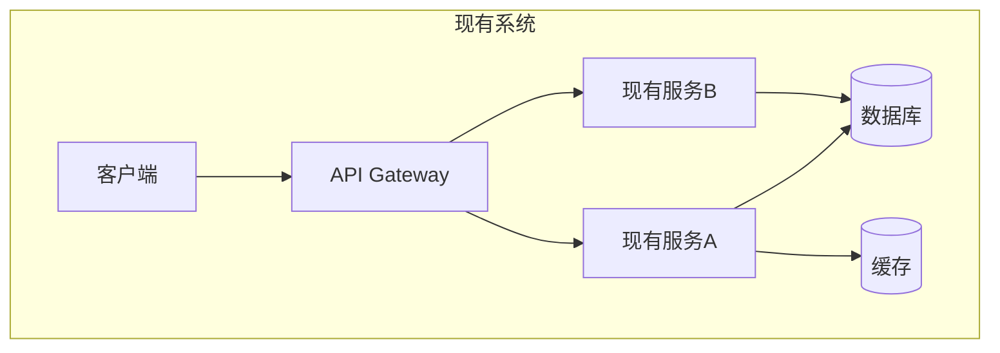
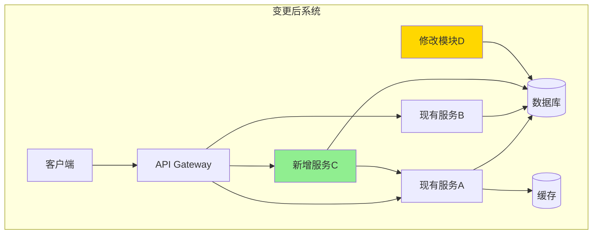
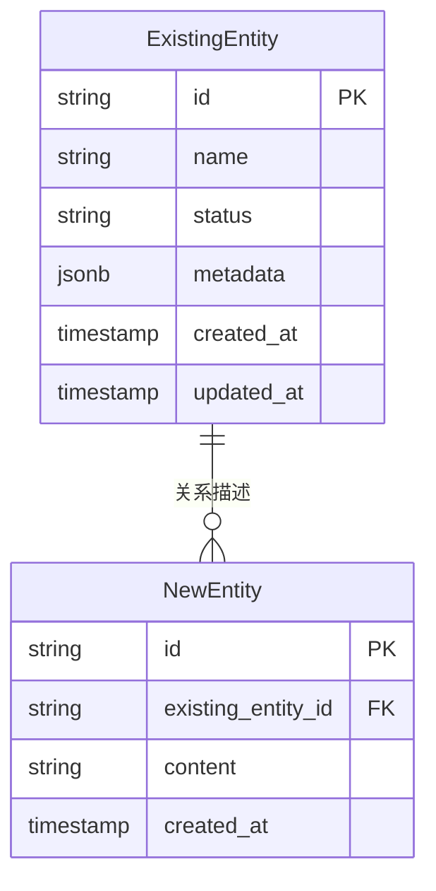
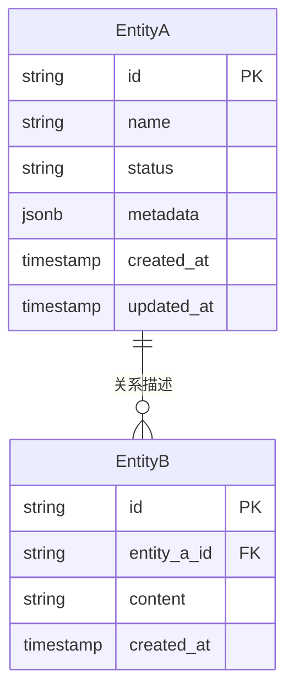

# Phase 2 — 功能与模块设计

## 目标

基于需求分析说明书，完成 SR-AR 分解，定义模块接口和数据实体，产出**需求设计说明书**，为 Phase 3 开发计划和代码实现提供清晰技术蓝图。

---

## 前置：确认设计材料

Phase 2 开始前，**必须确认以下材料是否齐备**。缺少时一次性向用户索取，不要在后续设计过程中反复打断：

```
Phase 2 设计需要以下材料，请补充缺少的部分：

1. 代码库
   - 本项目代码：[路径 / 仓库链接 / 粘贴模块结构]
   - 参考项目代码：[有类似实现可参考时提供]

2. 领域资料（如有）
   - 领域架构分析 / 威胁分析 / 合规要求 / 特殊领域需求

3. 现有系统资料（如有）
   - 场景库 / FMEA 库 / 功能库

4. 设计参考（如有）
   - 业界设计参考 / 现有系统设计说明书 / 模块功能设计说明书
```

**无代码库时**：明确确认"无现有代码库（全新项目）"后，可以不做存量分析，直接设计。

**有代码库时**：在开始 SR-AR 分解前，阅读并理解现有代码的模块划分和关键接口，避免设计方案与现有实现冲突。

---

## 模块分解理解确认（必须）

**在阅读代码库后、开始SR-AR分解前，必须先确认对模块分解的理解是否正确。**

### 确认流程

1. **阅读代码库**：分析代码库结构
2. **识别关键信息**：
   - 模块划分和边界
   - 核心接口和依赖关系
   - 数据流向
   - 技术栈和框架
3. **展示理解结果**：向用户展示识别出的模块结构、依赖关系、关键接口
4. **确认后继续**：只有用户确认理解正确后，才能继续后续步骤

### 理解确认内容

确认时应包含以下信息：

- **模块结构**：识别出的模块及其职责
- **关键依赖**：模块间的依赖关系
- **核心接口**：主要接口及其提供方/消费方

---

## SR-AR 分解原则（核心）

### SR 分解规则

**SR（系统需求）是需求在系统层面的表达**，每个 SR 应对应一个主要场景或功能域：

- **总量控制**：SR 总数一般为 2-6 个，不宜过多
- **场景对应**：每个 SR 必须能对应到需求分析说明书 §3 中的一个主要场景或功能域
- **合并优先**：每新增一个 SR 前，先自问：
  - *"它对应哪个主要场景？"*
  - *"它是否可以合并到现有某个 SR 中？"*
  - 只有确认无法合并时，才新增 SR
- **一 SR 多 AR**：每个 SR 下包含多个 AR，SR 是"目标"，AR 是"实现手段"

### AR 分配规则

**AR（分配需求）是 SR 在具体模块/组件上的落地**，每个 AR 必须：

1. **明确系统元素**：落到具体的模块/组件/服务名（新增 / 扩展现有 / 依赖现有）
2. **列出功能点**：不能只写笼统描述，必须列出该 AR 包含的具体功能点
3. **一 AR 一元素**：每个 AR 只归属于一个系统元素

**AR 数量控制原则**：

- **默认 1-2 个**：每个 SR 默认对应 1-2 个 AR
- **最多 3 个**：单个 SR 的 AR 数量建议不超过 3 个
- **超限确认**：若需要超过 3 个 AR，必须与用户确认拆分理由
- **合理拆分理由**：
  - 归属不同的系统元素（不同模块/服务）
  - 实现技术栈不同（如前端 UI vs 后端 API）
  - 可被不同开发者并行实现且边界清晰
- **不合理拆分**：
  - 功能点多不等于 AR 多
  - AR 是需求分配单元，不是任务拆分单元

#### AR 功能点示例

```
AR-001-01  FeedbackPanel（Dashboard 扩展）
  描述：用户反馈 UI 组件，在故障模式抽取节点提供用户干预入口

  功能点：
  ├── 展示当前节点的中间态结果（故障模式列表）
  ├── 提供"确认"按钮（接受当前结果继续流程）
  ├── 提供"修正"按钮（打开编辑模式修改结果）
  ├── 提供"补充"文本框（输入额外信息）
  └── 提交后触发重新生成流程
```

---

## 输出：需求设计说明书

### 文档结构（章节编号连续）

```
需求设计说明书
├── §1 概要
├── §2 设计目标
│   ├── 2.1 性能目标
│   ├── 2.2 可用性目标
│   └── 2.3 安全目标
├── §3 架构设计
│   ├── 3.1 现有架构
│   ├── 3.2 变更架构
│   ├── 3.3 架构变化说明
│   └── 3.4 领域数据模型
├── §4 SR-AR 分解与追溯
│   ├── 4.1 SR 列表
│   ├── 4.2 AR 分配（含功能点）
│   ├── 4.3 模块接口定义
│   ├── 4.4 依赖矩阵
│   └── 4.5 IR→SR→AR 追溯链验证
├── §5 数据与接口
│   ├── 5.1 核心实体定义
│   ├── 5.2 接口设计规范
│   ├── 5.3 认证授权策略
│   └── 5.4 错误处理
├── §6 约束：修改围栏
└── §7 模块详细设计（按需）
```

---

## 各节写作指南

### §1 概要

| 信息 | 内容 |
|------|------|
| **名称** | [与需求分析说明书一致] |
| **描述** | [设计层面一句话描述] |
| **输入来源** | 需求分析说明书 |
| **项目类型** | 功能增强型需求 / 新功能开发 |

---

### §2 设计目标

目标值直接继承自需求分析说明书 §4 的性能规格，并细化为可测量指标。

#### 2.1 性能目标

| 指标 | 目标值 | 测量条件 | 来源 |
|------|--------|----------|------|
| [关键交互操作] 响应时间 | P95 < [N]ms, P99 < [M]ms | [并发条件] | 需求分析 §4.1 |
| [后台自动化任务] 完成时间 | < [N]s | [数据规模] | 需求分析 §4.1 |
| [检索/查询操作] 响应时间 | < [N]ms | [并发条件] | 需求分析 §4.1 |
| 系统吞吐量 | [N] TPS/QPS | [峰值条件] | 需求分析 §4.2 |

**性能目标分解示例**：

```
系统级目标：查询接口 P95 < 500ms

分解到模块：
┌─────────────────┬──────────┬────────────────────────────┐
│ 模块             │ 时间分配  │ 分解依据                    │
├─────────────────┼──────────┼────────────────────────────┤
│ API Gateway     │ 30ms     │ 认证 + 路由 + 限流          │
│ BusinessService │ 150ms    │ 核心业务逻辑处理             │
│ CacheService    │ 20ms     │ Redis 缓存查询              │
│ Database        │ 100ms    │ 数据库查询（含索引优化）      │
│ 网络传输         │ 50ms     │ 服务间 RPC 调用             │
│ 设计余量         │ 150ms    │ 30% 余量应对峰值波动        │
├─────────────────┼──────────┼────────────────────────────┤
│ 合计             │ 500ms    │ 满足系统级目标               │
└─────────────────┴──────────┴────────────────────────────┘

假设条件：
- 缓存命中率 > 90%
- 数据库已建立索引，查询走索引路径
- 服务部署在同一可用区
```

#### 2.2 可用性目标

| 指标 | 目标值 | 说明 |
|------|--------|------|
| 系统可用性 | ≥ [N]% | 同现有平台 SLA |
| 数据更新生效时间 | < [N]s | 更新后立即可用 |
| 故障恢复时间 (RTO) | < [N]min | 从故障到恢复服务 |
| 数据恢复点 (RPO) | < [N]min | 可恢复的数据时间点 |

#### 2.3 安全目标

| 目标 | 描述 |
|------|------|
| 权限控制 | [具体权限策略] |
| 审计日志 | [哪些操作需要记录，保留多久] |
| 数据安全 | [敏感数据加密/脱敏要求] |

---

### §3 架构设计（重要）

**架构设计是需求设计的核心章节**，必须清晰展示现有架构、变更后的架构、以及变化说明。

#### 3.1 现有架构

**使用 Mermaid 图展示现有系统的模块结构**：



**现有模块说明表**：

| 模块名称 | 职责 | 关键接口 | 技术栈 |
|----------|------|----------|--------|
| [现有模块A] | [职责描述] | [接口列表] | [技术栈] |
| [现有模块B] | [职责描述] | [接口列表] | [技术栈] |

#### 3.2 变更架构

**使用 Mermaid 图展示变更后的系统架构，用不同颜色标注新增/修改的模块**：



**图例说明**：
- 🟢 绿色：新增模块
- 🟡 黄色：修改模块
- ⚪ 白色：无变更模块

#### 3.3 架构变化说明

**使用表格清晰列出架构变化**：

| 变化类型 | 模块名称 | 变化描述 | 影响范围 |
|----------|----------|----------|----------|
| **新增** | [新模块名] | [新增原因和职责] | [依赖哪些现有模块] |
| **修改** | [现有模块名] | [修改内容] | [影响哪些接口/数据] |
| **废弃** | [模块名] | [废弃原因] | [迁移方案] |
| **依赖新增** | [模块名] | [新增对哪个模块的依赖] | [依赖原因] |

**架构变化详细说明**：

```
新增模块：
├── [新模块名]
│   ├── 职责：[核心职责]
│   ├── 新增原因：[为什么需要新增]
│   ├── 依赖：[依赖哪些现有模块]
│   └── 对外接口：[提供哪些新接口]

修改模块：
├── [现有模块名]
│   ├── 修改内容：[具体修改点]
│   ├── 修改原因：[为什么需要修改]
│   ├── 接口变更：[新增/修改/废弃的接口]
│   └── 兼容性：[是否向后兼容，不兼容时的迁移方案]
```

#### 3.4 领域数据模型

使用 Mermaid ER 图描述核心数据模型，并说明是新建表还是扩展现有表：



**数据模型变化说明**：

| 变化类型 | 实体名称 | 变化描述 |
|----------|----------|----------|
| **新增** | [新实体名] | [新建表，字段说明] |
| **扩展** | [现有实体名] | [新增字段：字段名、类型、说明] |
| **修改** | [现有实体名] | [修改字段：原字段 → 新字段] |

---

### §4 SR-AR 分解与追溯

#### 4.1 SR 列表

> 📝 每新增 SR 时，先确认：它对应哪个主要场景？能否合并到现有 SR？

| SR 编号 | SR 名称 | SR 描述 | 对应场景/功能域 | 覆盖功能 |
|---------|---------|---------|----------------|----------|
| SR-001 | [名称] | [该系统需求要实现什么，1-2 句] | [对应 §3 中的主要场景名] | F-01, F-02 |
| SR-002 | [名称] | [描述] | [对应场景名] | F-03, F-04 |

#### 4.2 AR 分配（含功能点）

每个 AR 必须列出具体功能点，不能只写笼统描述：

---

**SR-001：[SR 名称]**

| AR 编号 | AR 名称 | 系统元素 | 操作类型 |
|---------|---------|---------|----------|
| AR-001-01 | [名称] | [模块名] | 新增 / 扩展 / 依赖 |
| AR-001-02 | [名称] | [模块名] | 新增 / 扩展 / 依赖 |

**AR-001-01 详细**：
- **描述**：[该 AR 要实现的核心目标，1-2 句]
- **功能点**：
  - [ ] [具体功能点 1]
  - [ ] [具体功能点 2]
  - [ ] [具体功能点 3]

**AR-001-02 详细**：
- **描述**：[描述]
- **功能点**：
  - [ ] [功能点 1]
  - [ ] [功能点 2]

---

**SR-002：[SR 名称]**

[同上格式]

---

#### 4.3 模块接口定义

> 接口不限于 HTTP API，可以是函数调用、消息队列、文件接口、CLI 命令、SDK 方法等，根据实际技术栈填写。

**接口类型说明**：

| 接口类型 | 适用场景 | 示例 |
|----------|----------|------|
| REST API | Web 服务间通信 | `POST /api/feedback` |
| 函数/方法调用 | 同进程模块间 | `FeedbackService.submit(caseId, content)` |
| 消息队列 | 异步解耦场景 | Topic: `skill.generation.request` |
| CLI 命令 | 命令行工具 | `skill-gen generate --case-id xxx` |
| 文件接口 | 批处理/导入导出 | 读取 `fault_patterns/*.json` |
| SDK 方法 | 库/插件扩展 | `SkillPlugin.onPatternExtracted(callback)` |
| 事件/回调 | UI 组件间 | `EventBus.emit('feedback:submitted', data)` |

**本需求接口清单**：

| 接口编号 | 接口名称 | 类型 | 提供方 | 消费方 | 变更类型 |
|----------|----------|------|--------|--------|----------|
| IF-001 | [接口名] | [类型] | [模块A] | [模块B] | 新增/修改/沿用 |
| IF-002 | [接口名] | [类型] | [模块B] | [模块C] | 新增/修改/沿用 |

**详细接口定义**（每个接口展开）：

```
IF-001  [接口名称]
  类型：[REST / 函数调用 / 消息队列 / ...]
  提供方：[模块名]
  消费方：[模块名]
  变更类型：[新增 / 修改 / 沿用]

  输入：
    - [参数名]：[类型] — [说明]
    - [参数名]：[类型] — [说明]

  输出：
    - [字段名]：[类型] — [说明]

  SLA：
    - 响应时间：P95 < [N]ms, P99 < [M]ms
    - 吞吐量：[N] TPS
    - 可用性：[N]%

  约束：
    - [幂等性要求]
    - [并发安全要求]
    - [错误处理规则]
```

#### 4.4 依赖矩阵

展示各 AR 系统元素之间的依赖关系：

| 模块 | 现有模块A | 现有模块B | 新模块C | 新模块D |
|------|----------|----------|---------|---------|
| 新模块C | 扩展 | — | — | — |
| 新模块D | — | 依赖 | 新增 | — |

标注：`扩展`（修改现有）/ `依赖`（调用现有，不修改）/ `新增`（全新创建）/ `—`（无关系）

#### 4.5 IR→SR→AR 追溯链验证

| IR（功能需求） | SR | AR | 追溯状态 |
|--------------|----|----|----------|
| F-01 [功能名] | SR-001 | AR-001-01, AR-001-02 | ✅ 完整 |
| F-02 [功能名] | SR-001 | AR-001-03 | ✅ 完整 |
| F-03 [功能名] | SR-002 | AR-002-01 | ✅ 完整 |

**自检**：每个 F-xx 在追溯表中都出现，且至少对应一个 AR。

---

### §5 数据与接口

#### 5.1 核心实体定义

使用 Mermaid ER 图描述核心数据模型，并说明是新建表还是扩展现有表：



> **说明**：EntityA 为新建表；EntityB 在现有表基础上新增 `content` 字段。

#### 5.2 接口设计规范

根据实际技术栈填写，不强求 REST 风格：

| 规范 | 说明 |
|------|------|
| 通信协议 | [HTTP/gRPC/消息队列/进程内调用/...] |
| 认证方式 | [复用现有认证机制，如 API Key/Token/无认证] |
| 数据格式 | [JSON/Protobuf/文本/二进制/...] |
| 错误处理 | [遵循现有规范，或新定义错误码体系] |
| 版本策略 | [与现有版本保持一致，或新建版本] |

#### 5.3 认证授权策略

| 资源/接口 | 权限要求 |
|-----------|----------|
| [接口/功能 1] | [角色：普通用户/运维人员/管理员] |
| [接口/功能 2] | [角色] |

#### 5.4 错误处理

| 错误场景 | 错误码/类型 | 处理方式 |
|----------|------------|----------|
| 请求参数错误 | 400 / InvalidParam | [返回字段级错误信息] |
| 未认证 | 401 / Unauthorized | [跳转登录 / 返回错误] |
| 无权限 | 403 / Forbidden | [返回权限不足提示] |
| 资源不存在 | 404 / NotFound | [返回资源描述] |
| 服务超时 | 503 / Timeout | [返回重试建议] |
| 内部错误 | 500 / InternalError | [记录日志，返回通用错误] |

---

### §6 约束：修改围栏

**明确本次开发允许和禁止的代码修改范围**，给开发 Agent 提供清晰边界，防止范围蔓延。

#### 围栏确认流程

在确定修改围栏前，**必须综合以下信息来源**：

**1. 历史文档分析**
- 查看需求分析说明书中的 Out of Scope 部分
- 查看现有系统设计说明书中的模块边界定义
- 查看领域架构分析中的系统边界

**2. 代码库分析**
- 了解现有模块结构
- 识别核心模块和边界模块
- 确认哪些模块是稳定成熟的（不宜修改）
- 确认哪些模块是活跃开发的（可协商修改）

**3. 用户确认**
- 与用户确认围栏范围
- 特别关注模糊地带的归属
- 对于不确定的模块，宁可先问再定

#### 围栏输出格式

用户确认后，以以下格式记录围栏：

```
✅ 允许修改：
  - [模块/文件路径 1]：[修改内容描述，如"新增 feedback 相关路由和处理逻辑"]
  - [模块/文件路径 2]：[修改内容描述]
  - 新增文件位置：[路径，如"src/services/feedback/"]

❌ 禁止修改：
  - [模块/文件路径]：[原因，如"底层生成算法，本需求范围外"]
  - [模块/文件路径]：[原因，如"由其他团队维护"]
  - [模块/文件路径]：[原因，如"现有 API 兼容性，不得破坏"]
```

---

### §7 模块详细设计（按需）

当某个 AR 的实现逻辑较复杂时，在此补充详细设计：

- 模块内部核心处理流程（时序图/流程图）
- 关键算法或逻辑说明
- 与现有代码的集成方式（调用哪个方法、继承哪个类、挂载哪个中间件）

简单需求可省略此节，在 AR 的功能点中直接说明。

---

## 质量自检

### 架构设计
- [ ] 现有架构图已绘制，展示现有模块结构
- [ ] 变更架构图已绘制，用颜色标注新增/修改模块
- [ ] 架构变化说明表完整，列出所有变化类型

### SR-AR 分解
- [ ] 每个 SR 标注了对应的主要场景
- [ ] SR 总数合理（2-6 个），新增前已自问是否可合并
- [ ] 每个 SR 的 AR 数量克制（1-3 个），超过 3 个已与用户确认
- [ ] 每个 AR 列出了具体功能点（非笼统描述）

### 接口设计
- [ ] 接口定义包含输入/输出/SLA/约束（不限 REST 形式）
- [ ] 接口变更类型已标注（新增/修改/沿用）
- [ ] 修改的接口已说明兼容性策略

### 围栏与追溯
- [ ] 修改围栏已参考历史文档和代码库分析
- [ ] 修改围栏已与用户确认
- [ ] 修改围栏明确列出允许和禁止的修改范围
- [ ] IR→SR→AR 追溯链完整，无断链

### 性能目标
- [ ] 设计目标中的性能指标与需求分析说明书一致
- [ ] 性能目标已分解到模块级别
