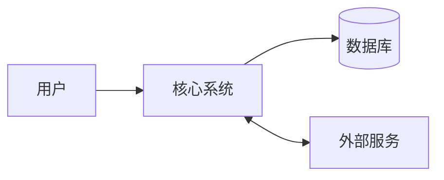
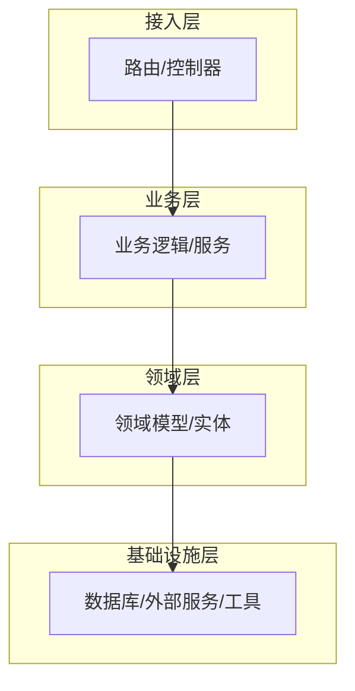
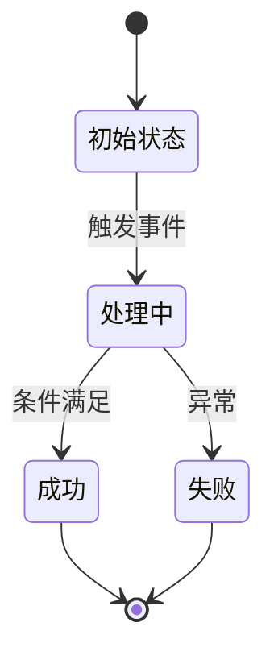
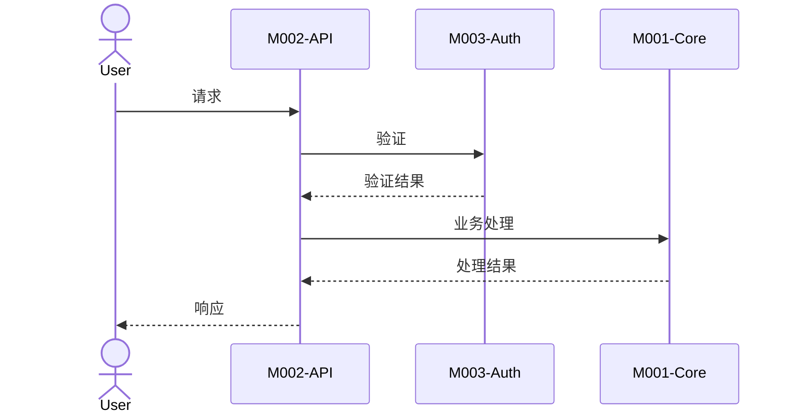

# 系统架构

## 1. 系统边界

### 1.1 系统边界图

<!-- instruction: 展示系统与外部用户、外部系统的交互关系。 -->

### 1.2 外部参与者与外部系统

<!-- rule: 每个外部依赖必须标注集成方式和关键文件。 -->

| 类型 | 名称 | 用途 | 集成方式 | 关键文件 |
|------|------|------|----------|----------|
| 用户/系统/服务 | | | | |

---

## 2. 系统分层

<!-- instruction: 展示系统的层次结构，标注每层的职责边界和约束。 -->

| 层次 | 职责 | 关键组件 | 禁止事项 |
|------|------|----------|----------|
| 接入层 | | | 不得包含业务逻辑 |

---

## 3. 跨切面关注点

<!-- instruction: 描述贯穿多个模块的横切关注点及其统一处理方式。 e.g. 错误处理、日志记录、认证/鉴权、配置管理、数据校验等。 -->

| 关注点 | 实现方式 | 关键文件 | 说明 |
|--------|----------|----------|------|
| 错误处理 | | | |

---

## 4. 核心业务流程

### 4.1 入口点分析

<!-- instruction: 列举程序的所有入口类型（启动入口、请求入口、定时任务入口等）。 -->

| 入口类型 | 入口文件 | 触发方式 | 说明 |
|----------|----------|----------|------|
| 应用启动 | | 命令行/容器启动 | |

### 4.2 状态管理策略

<!-- instruction: 描述各类状态的管理方式及数据流方向（单向/双向）。 -->

| 状态类型 | 管理方式 | 存储位置 | 作用域 | 关键文件 |
|----------|----------|----------|--------|----------|
|  |  |  |  |  |

### 4.3 核心流程

<!-- instruction: 选取最重要的 3-5 个业务流程。
                 每个流程必须包含：触发条件、状态流转、跨模块协作、关键决策点。 -->

#### 流程 1：[流程名称]

**触发条件**：[待填写内容]
**涉及模块**：M001, M002, ...
**关键文件**：[file1:line], [file2:line]

**状态流转**

**跨模块序列图**

<!-- instruction: 按相同格式补充流程 2–5。 -->

#### 流程 2：[流程名称]

...

### 4.4 端到端数据流

<!-- instruction: 展示数据从输入到输出的主要路径及各环节变换。 -->

| 数据流 | 输入 | 输出 | 经过模块 | 变换说明 |
|--------|------|------|----------|----------|
| | | | | |

---

## 5. 扩展性与集成能力

### 5.1 插件/扩展机制

<!-- instruction: 检查是否存在 Hook 注册、插件加载、中间件管道等扩展点。 -->

| 扩展点 | 类型 | 位置 | 说明 |
|--------|------|------|------|
| | Hook/Plugin/Middleware/Event | | |

### 5.2 对外 API 边界

<!-- instruction: 识别对外暴露的接口协议及其文档化程度。 -->

| 协议 | 端点/定义文件 | 文档化程度 | 说明 |
|------|-------------|-----------|------|
| REST/GraphQL/gRPC/WebSocket | | 完整/部分/无 | |

---

## 6. 架构风险与技术债务

### 6.1 系统级风险

| 风险 | 影响范围 | 概率 | 严重度 | 优先级 | 建议措施 |
|------|----------|------|--------|--------|----------|
| | | 高/中/低 | 高/中/低 | P1–P3 | |

### 6.2 技术债务

| 区域 | 债务类型 | 原因 | 严重度 | 偿还建议 |
|------|----------|------|--------|----------|
| | 设计债/代码债/测试债/文档债 | | 严重/中等/轻微 | |

### 6.3 扩展性瓶颈

| 瓶颈点 | 当前限制 | 触发条件 | 突破方案 |
|--------|----------|----------|----------|
| | | | |