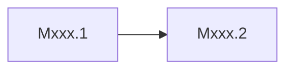
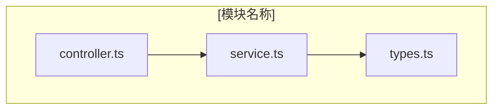
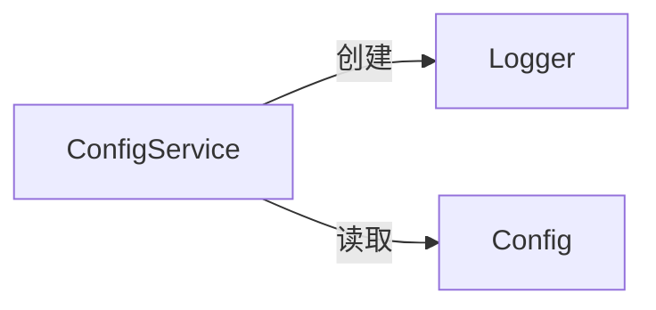
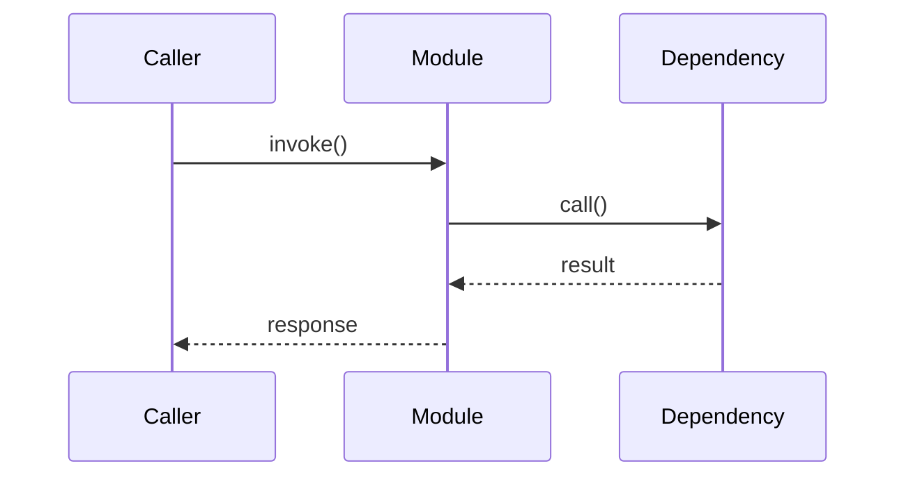

# [Mxxx]-[模块名称]

## 概述

<!-- instruction:
  用 2-3 句话回答以下三个问题：
  1. 这个模块解决什么问题？
  2. 它在系统架构中扮演什么角色？（参照 Architecture.md 的分层）
  3. 如果删除它，系统的哪些能力会丧失？
-->
[待填写内容]

---

## 元数据

| 字段 | 值 |
|------|-----|
| 模块 ID | |
| 路径 | |
| 文件数 | |
| 代码行数 | |
| 主要语言 | |
| 所属层 | |
| 父模块 | 无 / [Mxxx] |
| 依赖于 | [Myyy], [Mzzz] |
| 被依赖于 | [Maaa] |

---

## 子模块

<!--
  instruction: 仅当本模块包含子模块时保留此章节，否则删除整个章节。
  rule: 子模块使用与本文档相同的模板，存放在同名目录下。
        例：M001 的子模块存放于 references/modules/M001/M001.1-xxx.md
-->

| ID | 名称 | 职责 | 文档链接 |
|----|------|------|----------|
| [Mxxx.1] | | | [详情](./Mxxx/Mxxx.1-yyy.md) |
| [Mxxx.2] | | | [详情](./Mxxx/Mxxx.2-zzz.md) |

### 子模块依赖关系



---

## 文件结构

<!-- instruction:
  Mermaid 图展示模块内文件之间的依赖关系（谁 import 谁），而非目录层级。
  表格按依赖顺序排列：被依赖最多的文件排在前面。
-->



| 文件 | 职责 | 行数 | 主要导出 |
|------|------|------|----------|
| | | | |

---

## 功能树

<!-- instruction:
  展示 File → Class/Function → Method 的层次结构。
  标注每个节点的类型（fn / class / method / const / type）和一句话描述。
  只列出公开导出和重要的内部函数，不要列举所有私有辅助函数。
-->

<!--
  example:
  M001-Core (核心基础设施)
  ├── config/
  │   └── loader.ts
  │       ├── fn: loadConfig(path: string): Config — 从文件加载配置
  │       └── fn: validateConfig(config: Config): boolean — 校验配置完整性
  └── utils/
      └── helpers.ts
          └── class: DateHelper — 日期工具类
              ├── method: format(date, pattern) — 格式化日期
              └── method: parse(str) — 解析日期字符串
-->

```text
[待填写内容]
```

### 功能清单

| 名称 | 类型 | 文件 | 行号 | 描述 |
|------|------|------|------|------|
| | fn/class/method/const/type | | L42 | |

### 职责边界

**做什么**
- [待填写内容]

**不做什么**
- [待填写内容]

---

## 公共接口契约

<!-- instruction:
  本节是其他模块与此模块交互的唯一参考。
  修改此处接口必须同步检查所有"被依赖于"模块。
  完整性要求：grep -r "export" {module_path} 的结果必须全部在此节中出现。
-->

### 接口关系图

<!-- instruction: 展示本模块导出的类/函数/类型之间的关系。 -->



### 类型定义

<!-- rule: 签名必须与源码一致，标注文件路径和行号。 -->

```typescript
// [File: src/core/types.ts:15]
export interface Config {
  port: number       // 服务端口
  debug: boolean     // 调试模式
}
```

| 类型名 | 字段/方法 | 类型 | 描述 | 位置 |
|--------|-----------|------|------|------|
| | | | | path:line |

### 导出函数

#### `functionName()`

```typescript
// [File: src/core/index.ts:28]
export function functionName(param: Type): ReturnType
```

| 参数 | 类型 | 必需 | 描述 |
|------|------|------|------|
| | | | |

- **返回**：`ReturnType` — [具体描述，不能只写"返回结果"]
- **抛出**：`ErrorType` — [触发条件]

**使用示例**：

```typescript
import { functionName } from '@/core'
const result = functionName(param)
```

### 导出类

#### `ClassName`

| 方法 | 签名 | 描述 | 位置 |
|------|------|------|------|
| | | | path:line |

---

## 内部实现

<!-- instruction:
  本节描述实现细节。修改内部实现不需要通知依赖方，但需要更新此文档。
  重点关注：为什么这样实现，而非仅仅描述代码做了什么。
-->

### 核心内部逻辑

| 函数/类 | 文件 | 行号 | 用途 |
|---------|------|------|------|
| | | | |

### 设计模式

<!-- rule: 每个模式必须有代码证据（文件:行号），不能只写"使用了 XX 模式"。
     说明：为什么选择此模式，解决了什么问题。 -->

| 模式 | 使用位置 | 使用原因 | 代码证据 |
|------|----------|----------|----------|
| | | | path:line |

### 关键算法 / 策略

<!-- instruction: 如有复杂算法或业务策略，说明核心思路、边界条件和复杂度。 -->

| 算法/策略 | 用途 | 复杂度 | 文件 |
|-----------|------|--------|------|
| | | | |

---

## 关键流程

<!-- instruction:
  列出本模块内 1-3 条最重要的执行流程。
  每条流程包含三个视图：调用链（快速定位）、时序图（交互顺序）、步骤表（详细说明）。
-->

### 流程 1：[流程名称]

**调用链**

<!-- rule: 每个节点标注 文件:行号。 -->

```text
entry.ts:10 → validate.ts:25 → process.ts:42 → store.ts:18
```

**时序图**



**步骤详解**

| 步骤 | 说明 | 文件位置 |
|------|------|----------|
| 1 | [待填写内容] | path:line |
| 2 | [待填写内容] | path:line |

---

## 依赖

### 内部依赖（项目内其他模块）

| 模块 | 使用的接口 | 调用位置 |
|------|-----------|----------|
| | | path:line |

### 外部依赖（第三方包）

| 包名 | 版本 | 用途 | 可替代性 |
|------|------|------|----------|
| | | | 高/中/低 |

---

## 代码质量与风险

### 代码坏味道

| 问题 | 类型 | 文件 | 严重度 | 建议 |
|------|------|------|--------|------|
| | 过大类/过长函数/重复代码/硬编码/过度耦合 | path:line | 高/中/低 | |

### 潜在风险

| 风险 | 触发条件 | 影响 | 文件 | 建议 |
|------|----------|------|------|------|
| | | | path:line | |

### 测试覆盖

| 测试类型 | 覆盖情况 | 测试文件 | 说明 |
|----------|----------|----------|------|
| 单元测试 | 有/无/部分 | | |
| 集成测试 | 有/无/部分 | | |

---

## 开发指南

### 洞察

[待填写内容]

### 扩展指南

<!-- instruction: 说明如何按照现有模式向此模块添加新功能。
     例如："添加新的 API 端点需要：1) 在 routes/ 下创建路由文件 2) 在 handlers/ 下创建处理器 3) …" -->

### 风格与约定

<!-- instruction: 记录此模块特有的编码约定（超出项目级约定的部分）。
     例如：命名规则、错误处理方式、日志格式等。 -->

### 设计哲学

<!-- instruction: 记录此模块的设计原则和关键权衡决策。
     例如："选择事件驱动而非直接调用，因为 ___" -->

### 修改检查清单

<!-- instruction: 列出修改此模块时必须检查的事项。基于实际依赖关系和代码结构生成。 -->

- [ ] [待填写内容]