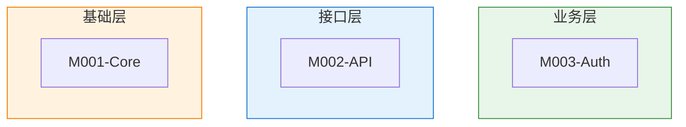
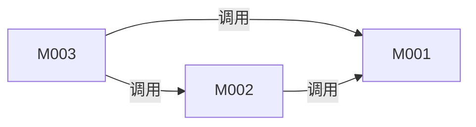

# [项目名称] 模块总览

## 模块划分说明

<!-- instruction: 一段话说明模块划分的依据（按业务域 / 按技术层 / 按功能职责），
                 以及与 architecture.md 中分层的对应关系。 -->

[待填写内容]

---

## 模块层次树

<!-- instruction: 用树形结构展示所有模块（含嵌套），每个模块标注 ID 和一句话职责。 -->

```text
[项目名称]
├── M001-[名称]          # [一句话职责]
│   ├── M001.1-[名称]    # [一句话职责]
│   └── M001.2-[名称]    # [一句话职责]
├── M002-[名称]          # [一句话职责]
└── M003-[名称]          # [一句话职责]
```

---

## 模块清单

<!-- rule: 嵌套模块使用缩进 ID 表示层级（M001 → M001.1 → M001.1.1）。 -->

| ID | 名称 | 职责 | 路径 | 所属层 | 文档链接 |
|----|------|------|------|--------|----------|
| M001 | | | | | [详情](modules/M001-xxx/M001-xxx.md) |
| M001.1 | | | | | [详情](modules/M001-xxx/M001.1-yyy.md) |
| M002 | | | | | [详情](modules/M002-xxx.md) |

---

## 模块分层视图

<!-- instruction: 纯分层视图，仅展示模块归属层次，不画依赖箭头。 -->



---

## 模块依赖

<!-- instruction: 箭头语义：A --> B 表示 A 依赖 B（A 调用 B 的接口）。 -->
<!-- rule: 此处只展示一级模块间依赖；子模块依赖在各自的 module-detail 中描述。 -->



### 依赖矩阵

<!-- instruction: 行 = 调用方，列 = 被调用方，✓ 表示存在依赖。用于快速识别耦合热点。 -->

| ↓ 调用 \ 被调用 → | M001 | M002 | M003 |
|--------------------|------|------|------|
| M001 | — | | |
| M002 | | — | |
| M003 | | | — |

### 外部依赖映射

| 模块 | 外部包/服务 | 版本 | 用途 | 风险 |
|------|-------------|------|------|------|
| | | | | |

### 耦合热点分析

| 模块 | 被依赖次数 | 风险等级 | 说明 |
|------|-----------|----------|------|
| | | | |

---

## 通信模式

<!-- instruction: 分析模块间的通信方式，同一项目可能混合多种模式。模式包括直接函数调用、事件驱动、消息队列、HTTP/RPC、共享状态等。 -->

| 模式 | 使用场景 | 涉及模块 | 实现方式 | 关键文件 |
|------|----------|----------|----------|----------|
| 直接函数调用 | | | import + 函数调用 | |