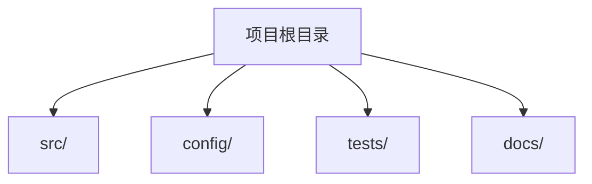

# [项目名称] 概览

## 快速摘要

<!-- instruction: 2-3 句话说明项目是什么、面向谁、解决什么问题。 -->

[待填写内容]

---

## 核心技术栈

<!-- rule: 版本号必须来自锁文件或配置文件（package.json、go.mod、pyproject.toml 等），
           无法确认的版本标注"待确认"。 -->
<!-- instruction: 类型包括 语言、框架、数据库、包管理、构建工具等。 -->

| 类别 | 名称 | 版本 | 用途 |
|------|------|------|------|
| 语言 | | | |

---

## 目录结构

<!-- instruction: 分析顶级目录的命名约定，区分源代码、配置、测试和构建产物。
                 下方 Mermaid 图需替换为实际目录结构。 -->



| 目录 | 用途 | 关键文件 |
|------|------|----------|
| | | |

---

## 快速开始

### 前置条件

<!-- instruction: 列出运行项目所需的前置条件（语言版本、系统依赖等）。 -->

- [待填写内容]

### 安装

<!-- rule: 安装命令必须可在配置文件中找到依据。 -->

```bash
[待填写内容]
```

### 运行

```bash
[待填写内容]
```

### 测试

```bash
[待填写内容]
```

---

## 环境变量

<!-- rule: 每个变量须标注来源文件（如 .env.example、config.ts）。 -->

| 变量名 | 用途 | 默认值 | 必需 | 来源文件 |
|--------|------|--------|------|----------|
| | | | | |

---

## 部署

<!-- instruction: 识别 Dockerfile、CI/CD 配置、云平台配置等部署相关文件。 -->

| 部署方式 | 配置文件 | 说明 |
|----------|----------|------|
| | | |