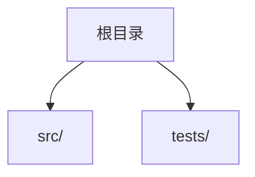
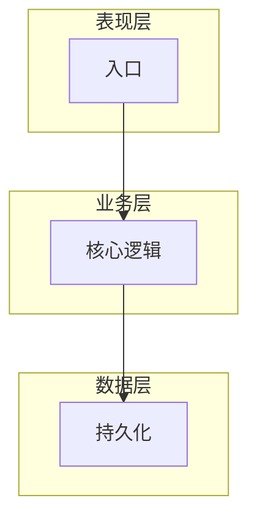
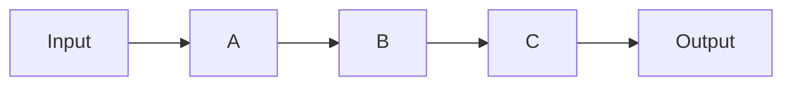

# Stage 1: 项目概览分析

## 阶段定义

**核心目标：** 通过工具驱动的探索 + 精准的用户对齐，生成反映项目**真实设计意图**的基础文档。

**输出文件：** Overview.md、Architecture.md、Guides.md、Principles.md

---

## 执行步骤（严格按编号顺序，不得跳步）

### 步骤 1：GitNexus 初始化

**这是第一步，在任何探索或提问之前执行。**

```bash
cd <project-path>
npx gitnexus analyze .
```

- ✅ 成功：记录节点数、边数、集群数，后续所有分析优先使用 GitNexus
- ❌ 失败：记录失败原因，后续使用文件系统工具（find/grep）替代，并在文档中注明

---

### 步骤 2：全面项目探索（并行执行，不等待对方完成）

**同时发起以下所有探索——目标是建立完整的项目认知，为后续提问做好准备。**

#### 2A：结构与技术栈探索

```bash
# 目录结构
find <project-path> -maxdepth 3 -type d
# 技术栈（根据项目类型选择）
cat package.json / go.mod / requirements.txt / Cargo.toml / pom.xml
# 现有文档
cat README.md / docs/ 目录
# 配置文件
ls .env* *.yaml *.toml *.json（根目录）
```

#### 2B：GitNexus 核心分析

```bash
# 项目规模
npx gitnexus cypher "MATCH (n) RETURN count(n) AS total" --repo <repo>

# 最核心的执行流程（步骤最多 = 最复杂的路径）
npx gitnexus cypher "MATCH (p:Process) RETURN p.heuristicLabel, p.stepCount ORDER BY p.stepCount DESC LIMIT 8" --repo <repo>

# 最核心的文件（被最多文件依赖）
npx gitnexus cypher "MATCH (f:File)<-[:CodeRelation {type: 'IMPORTS'}]-(g:File) RETURN f.name, count(g) AS deps ORDER BY deps DESC LIMIT 10" --repo <repo>

# 自然模块社区
npx gitnexus cypher "MATCH (c:Community) RETURN c.heuristicLabel, c.symbolCount ORDER BY c.symbolCount DESC LIMIT 12" --repo <repo>

# 入口点与初始化
npx gitnexus query "project entry point and initialization" --repo <repo>

# 核心业务流程
npx gitnexus query "main business logic flow" --repo <repo>
```

#### 2C：架构模式探索

```bash
# 公共 API（导出函数）
npx gitnexus cypher "MATCH (n:Function) WHERE n.isExported = true RETURN n.name, n.filePath LIMIT 25" --repo <repo>

# 模块间依赖强度
npx gitnexus cypher "MATCH (a)-[:CodeRelation {type: 'CALLS'}]->(b) WHERE a.filePath <> b.filePath WITH a.filePath AS from, b.filePath AS to, count(*) AS n ORDER BY n DESC LIMIT 10 RETURN from, to, n" --repo <repo>

# 核心数据流
npx gitnexus query "data flow and processing pipeline" --repo <repo>
```

**探索完成后，整理你的认知：**

- 项目整体架构风格是什么？（分层/微服务/事件驱动/...）
- 核心数据流路径是什么？
- 最重要的模块/文件是哪些？
- 你对架构有哪些不确定的地方？

---

### 步骤 3：第一性原则——与用户对齐（基于探索结果提问）

**这一步的目的：** 确认你的技术理解是否正确，并获取无法从代码中推断的隐性知识。**不要问与开发无关的问题（如技能名称、文档用途等）。**

向用户呈现以下内容（根据步骤 2 的探索结果填入具体内容）：

---

**我完成了初步探索，需要你确认以下几点：**

**1. 架构理解确认**

我识别到以下架构特征，请确认是否正确：

- **整体架构风格**：{你的判断，如：三层架构 / 事件驱动 / ...}（依据：{具体目录/文件}）
- **核心层次**：

  | 层次 | 我的理解 | 核心文件 |
  |------|----------|----------|
  | {layer} | {description} | {files} |

- **主数据流**：

  ```
  {你识别的主要数据流路径}
  ```

- **我不确定的地方**：{列出 1-3 个具体的架构疑问}

以上理解是否正确？哪里有偏差？

**2. 重点区域确认**

基于代码分析，我认为以下是项目最关键的部分：

- {核心模块1}：{原因}
- {核心模块2}：{原因}

是否还有我遗漏的重点？文档是否需要特别深入某个领域？

**3. 开发最佳实践（隐性知识）**

以下问题无法从代码中推断，需要你直接告诉我：

- **新增功能的正确流程**：当需要添加一个新功能时，标准步骤是什么？需要修改哪些文件？有什么必须经过的环节？
- **红线规则**：有没有"绝对不能这样做"的规则？（如：不能绕过某层、不能直接操作数据库等）
- **踩过的坑**：有没有外人一定会踩、但文档里没有写的坑？

**4. 开发纲领核心原则**

我从代码中检测到以下模式，请告诉我哪些是**有意为之的原则**，哪些只是习惯：

| 检测到的模式 | 出现位置 | 是核心原则吗？ |
|-------------|----------|---------------|
| {pattern_1} | {files}  | ❓ |
| {pattern_2} | {files}  | ❓ |
| {pattern_3} | {files}  | ❓ |

有没有我没检测到、但非常重要的设计原则？

---

**等待用户回答后再进行步骤 4。** 根据回答调整对架构的理解，记录所有隐性知识。

---

### 步骤 4：生成 Overview.md 和 Guides.md

基于步骤 2 的探索结果直接生成，相对客观，无需额外交互。

生成后自检：

- [ ] 技术栈版本是否来自配置文件（不是推测）？
- [ ] 入口点命令是否真实可执行？
- [ ] 目录说明是否与实际用途一致？

---

### 步骤 5：生成 Architecture.md

基于步骤 2 探索 + 步骤 3 用户确认的信息生成。此文档必须体现用户纠正后的架构理解，不能只反映代码表面结构。

---

### 步骤 6：生成 Principles.md

基于步骤 3 用户提供的隐性知识 + 步骤 2 识别的代码模式共同生成。

生成后向用户确认：

```
根据你的回答，我生成了开发纲领草稿。请重点检查：
- 原则描述是否准确传达了你的意图？
- 有没有遗漏的重要规则？
- 有没有表述不准确的地方？
```

---

### 步骤 7：委派 Subagent 验证（不得跳过）

```
任务：验证 Stage 1 四份文档的完整性和准确性

需要验证的文件：Overview.md, Architecture.md, Guides.md, Principles.md
项目路径：{project-path}

检查清单：
1. Overview：技术栈版本是否与配置文件一致？
2. Overview：入口点命令是否真实可执行？
3. Architecture：层次划分是否与实际目录结构匹配？
4. Architecture：数据流是否与实际调用链一致（抽查 2-3 个流程）？
5. Architecture：设计模式是否有代码证据（引用具体文件行号）？
6. Guides：安装/运行命令是否在 README 或 Makefile 中有依据？
7. Principles：记录的原则是否能在代码中找到对应实践？
8. 所有文件：是否有绝对路径？是否有 YAML Front Matter？

输出：✅ 已验证 | ❌ 问题：{具体描述} [File: {path}:{line}] | ⚠️ 建议用户确认：{说明}
```

收到验证结果后：展示给用户 → 修正 ❌ 项 → 将 ⚠️ 项单独列出让用户决策 → 确认后进入 Stage 2

---

## 完成检查清单

- [ ] GitNexus 已初始化（成功或已告知失败原因）
- [ ] 步骤 2 的探索任务并行完成
- [ ] 步骤 3 的用户对齐已完成（架构确认 + 重点区域 + 最佳实践 + 纲领原则）
- [ ] Architecture.md 体现了用户纠正后的理解
- [ ] Principles.md 包含用户提供的隐性知识
- [ ] 所有文件包含 YAML Front Matter
- [ ] Subagent 验证已执行并展示给用户

---

## 输出模板

### Overview.md

```markdown
---
title: {项目名称} 概览
version: 1.0
last_updated: YYYY-MM-DD
type: project-overview
project: {project_name}
---

# {项目名称} 概览

## 快速摘要
[2-3句话：项目是什么、谁使用、为什么存在]

## 项目元数据
| 字段 | 值 |
|------|-----|
| 名称 | {name} |
| 版本 | {version} |
| 主要语言 | {language} |
| 框架 | {framework} |

## 技术栈
| 框架/库 | 版本 | 用途 | 必要性 |
|---------|------|------|--------|

## 目录结构


| 目录 | 用途 | 关键文件 |
|------|------|----------|

## 入口点

- 文件: `{entry_file}`
- 命令: `{run_command}`

```

### Architecture.md

```markdown
---
title: {项目名称} 架构
version: 1.0
last_updated: YYYY-MM-DD
type: system-architecture
project: {project_name}
---

# {项目名称} 系统架构

## 架构风格与设计哲学
[核心设计决策：为什么采用这种架构？解决了什么问题？取舍了什么？]

## 系统层次


| 层次 | 职责 | 关键组件 | 不该做的事 |
|------|------|----------|-----------|

## 设计模式

| 模式 | 使用位置 | 使用原因 | 关键文件 |
|------|----------|----------|----------|

## 关键数据流



## 关键架构决策

| 决策 | 选择了什么 | 为什么 | 放弃了什么 |
|------|-----------|--------|-----------|

```

### Guides.md

```markdown
---
title: {项目名称} 操作指南
version: 1.0
last_updated: YYYY-MM-DD
type: operational-guides
project: {project_name}
---

## 快速开始
### 前置条件
- {条件，含版本要求}

### 安装
```bash
{install_command}
```

### 运行

```bash
{run_command}
```

## 环境变量

| 变量 | 必需 | 默认值 | 描述 |
|------|------|--------|------|

## 故障排除

| 问题 | 原因 | 解决方案 |
|------|------|----------|

```

### Principles.md

```markdown
---
title: {项目名称} 开发纲领
version: 1.0
last_updated: YYYY-MM-DD
type: development-principles
project: {project_name}
---

> 当代码与本文档冲突时，以代码为准，并更新本文档。

## 核心设计哲学
[一段话：这个项目的核心价值观是什么？在什么上面不妥协？]

## 命名约定
| 元素 | 约定 | 正确示例 | 错误示例 |
|------|------|----------|----------|

## 关键架构原则
### 原则：{名称}
- **含义**：{具体说明}
- **如何应用**：{具体操作}
- **违反示例**：{反面案例}

## 新增功能的正确流程
1. {步骤1 — 含需要修改的文件类型}
2. {步骤2}
3. {验证方式}

## 红线规则（绝对禁止）
- ❌ **{规则}**：因为 {原因}

## 优先级规则（价值冲突时）
1. {最高优先级} — 因为 {原因}
2. {次优先级}
3. {最低优先级}

## 工具偏好
| 场景 | 强制使用 | 禁止使用 | 原因 |
|------|----------|----------|------|
```
