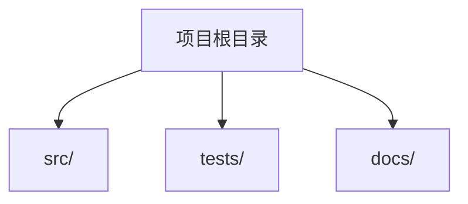
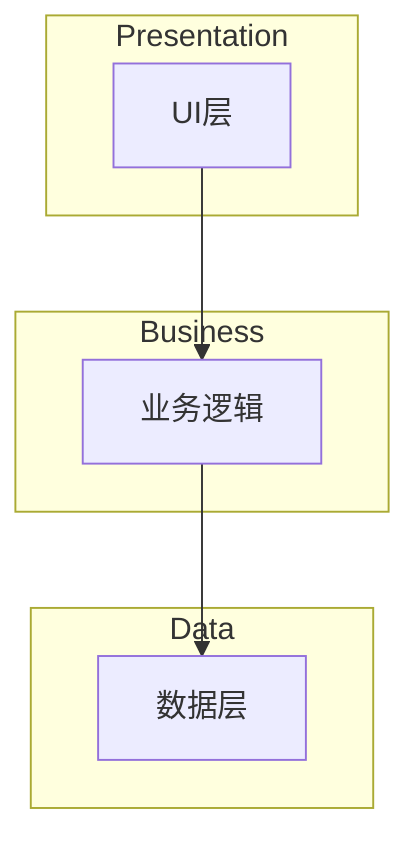
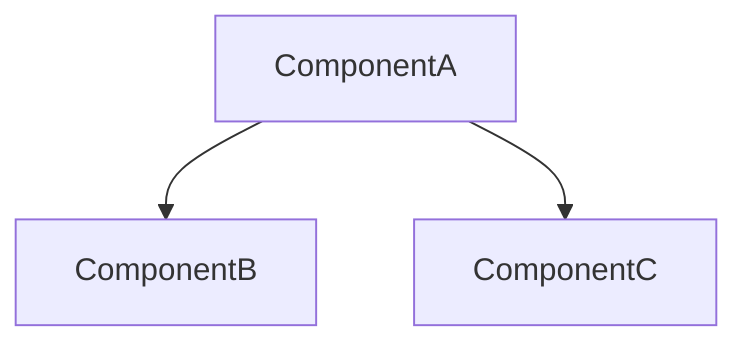
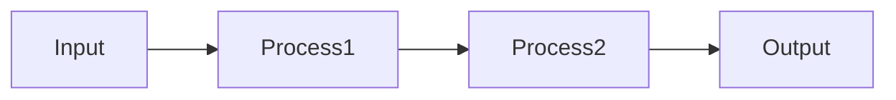

# Stage 1: 项目概览分析

## 阶段定义

**核心目标：** 建立项目的基础认知，生成项目概览、系统架构、操作指南和开发纲领。

**输入依赖：**

- 用户提供的目标项目绝对路径

**输出文件：**

- `Overview.md` — 项目概览
- `Architecture.md` — 系统架构
- `Guides.md` — 操作指南
- `Principles.md` — 开发纲领

---

## 执行流程

### 1.1 收集项目信息

向用户确认：

- **目标项目路径**：项目的绝对路径
- **项目领域**：项目的业务领域和用途（可选）
- **Skill名称**：最终生成的技能名称

### 1.2 初始化 GitNexus

**尽可能使用 GitNexus** 进行深度分析：

```bash
npx gitnexus analyze <project-path>
npx gitnexus status  # 验证索引成功
```

**注意**：GitNexus 提供更强大的代码分析能力，应优先使用。

### 1.3 并行探索

**必须并行委派**，同时发起以下任务：

| 探索任务 | 目标 | 输出 |
|----------|------|------|
| 目录结构扫描 | 获取完整的目录树和文件分布 | 目录树、各目录用途说明 |
| 技术栈识别 | 分析 package.json、配置文件等 | 语言、框架、依赖列表 |
| 入口点定位 | 找到主要入口文件和启动流程 | 主入口、其他入口 |
| 文档扫描 | 读取 README、docs/ 等 | 现有文档摘要 |
| 配置分析 | 分析配置文件 | 配置文件清单 |

**委派方式：** 使用后台任务同时发起多个探索。

### 1.4 综合分析结果

收集探索结果，综合分析：

1. **项目基本信息**：名称、描述、类型、规模
2. **技术栈识别**：语言、框架、依赖、版本
3. **目录结构分析**：目录组织、用途说明、关键文件
4. **入口点定位**：主入口、其他入口、启动流程
5. **配置文件分析**：配置文件清单和用途

---

## 输出 1: Overview.md

### 必需章节

```markdown
---
title: {项目名称} 概览
version: 1.0
last_updated: YYYY-MM-DD
type: project-overview
---

# {项目名称} 概览

## 快速摘要
[2-3句话描述项目是什么、谁使用、为什么存在]

## 项目元数据
| 字段 | 值 |
|------|-----|
| 名称 | {name} |
| 版本 | {version} |
| 主要语言 | {language} |
| 框架 | {framework} |

## 技术栈

### 语言
| 语言 | 版本 | 用途 |
|------|------|------|
| {lang} | {version} | {purpose} |

### 框架与库
| 框架 | 版本 | 用途 |
|------|------|------|
| {framework} | {version} | {purpose} |

### 开发工具
| 工具 | 用途 |
|------|------|
| {tool} | {purpose} |

## 目录结构



### 目录说明

| 目录 | 用途 | 关键文件 |
|------|------|----------|
| src/ | 源代码 | {files} |
| tests/ | 测试代码 | {files} |

## 入口点

### 主入口

- 文件: `{entry_file}`
- 命令: `{run_command}`
- 描述: {描述}

### 其他入口

| 入口 | 命令 | 用途 |
|------|------|------|
| {entry} | {command} | {purpose} |

## 配置文件

| 文件 | 用途 | 格式 |
|------|------|------|
| {file} | {purpose} | {format} |

```

---

## 输出 2: Architecture.md

### 必需章节

```markdown
---
title: {项目名称} 架构
version: 1.0
last_updated: YYYY-MM-DD
type: system-architecture
---

# {项目名称} 系统架构

## 架构概述
[系统设计哲学的高层描述]

## 系统层次



### 层次说明

| 层次 | 职责 | 关键组件 |
|------|------|----------|
| {layer} | {responsibility} | {components} |

## 设计模式

### 模式: {模式名称}

- **用途**: {使用位置}
- **原因**: {为什么使用}
- **文件**: {相关文件}

## 核心组件



| 组件 | 职责 | 依赖 |
|------|------|------|
| {component} | {responsibility} | {dependencies} |

## 数据流



## 外部集成

| 服务 | 协议 | 用途 | 文件 |
|------|------|------|------|
| {service} | {protocol} | {purpose} | {files} |

```

---

## 输出 3: Guides.md

### 必需章节

```markdown
---
title: {项目名称} 操作指南
version: 1.0
last_updated: YYYY-MM-DD
type: operational-guides
---

# {项目名称} 操作指南

## 快速开始

### 前置条件
- {条件1}
- {条件2}

### 安装
```bash
{install_command}
```

### 运行

```bash
{run_command}
```

## 开发环境

### 环境设置

```bash
{setup_commands}
```

## 构建与部署

### 构建

```bash
{build_command}
```

### 部署

```bash
{deploy_command}
```

## 测试

### 运行所有测试

```bash
{test_command}
```

### 运行特定测试

```bash
{specific_test_command}
```

## 配置

### 环境变量

| 变量 | 必需 | 默认值 | 描述 |
|------|------|--------|------|
| {var} | {yes/no} | {default} | {description} |

### 配置文件

| 文件 | 格式 | 用途 |
|------|------|------|
| {file} | {format} | {purpose} |

## 常见任务

### 任务: {任务名称}

```bash
{commands}
```

## 故障排除

### 问题: {问题描述}

**解决方案**: {solution}

```

---

## 输出 4: Principles.md

### 需要用户交互

**在生成此文件前，必须与用户交互确认开发纲领。**

#### 交互内容

1. **分析代码模式**：识别项目中已有的设计模式和约定
2. **向用户呈现发现**：
   ```

   根据代码分析，我发现了以下设计模式和约定：

   **检测到的模式：**

   1. {pattern} — 用于 {位置}
   2. {pattern} — 用于 {位置}

   **检测到的约定：**

- {convention}
- {convention}

   **问题：**

   1. 这些模式是有意的吗？应该记录为原则吗？
   2. 有哪些不成文的规则新开发者应该知道？
   3. 冲突时应该优先考虑什么？
   4. 有哪些"永远不要这样做"的规则？
   5. 新增功能/模块时应该遵循什么流程？
   6. 项目对工具/框架有什么偏好？（如包管理器、测试框架等）

   ```

1. **综合用户回答**：基于用户回答生成 Principles.md

#### 输出模板

```markdown
---
title: {项目名称} 开发纲领
version: 1.0
last_updated: YYYY-MM-DD
type: development-principles
---

# {项目名称} 开发纲领

> 本文档定义了项目的设计哲学和编码标准。
> 贡献时请遵循这些原则以保持一致性。

## 核心哲学

{项目的设计方法}

## 编码标准

### 语言规范
- {语言}: {规范}

### 命名约定
| 元素 | 约定 | 示例 |
|------|------|------|
| {element} | {convention} | {example} |

### 代码组织
- {原则}

## 设计决策

### 决策: {决策名称}
- **选择**: {选择}
- **原因**: {原因}
- **反模式**: {要避免的}

## 架构原则

### 原则: {名称}
- **描述**: {含义}
- **示例**: {如何应用}
- **反示例**: {要避免的}

## 新增功能时

1. {步骤1}
2. {步骤2}
3. {步骤3}

## 重构时

1. {步骤1}
2. {步骤2}
3. {步骤3}

## 优先级规则

冲突时按以下顺序：
1. {最高优先级}
2. {次优先级}
3. {最低优先级}
```

---

## 架构验证（Subagent）

生成 Architecture.md 后，**必须委派验证任务**：

**任务内容：**

- 验证所有主要组件是否已识别
- 检查层次描述是否与实际代码组织匹配
- 确认设计模式是否正确识别
- 检查是否有遗漏的关键组件
- 验证数据流是否与实际实现匹配

---

## 完成检查清单

- [ ] Overview.md 生成，包含所有章节
- [ ] Architecture.md 生成，包含 Mermaid 图表
- [ ] Guides.md 生成，包含所有命令
- [ ] Principles.md 与用户确认后生成
- [ ] Architecture 已由 subagent 验证
- [ ] 所有路径使用相对路径
- [ ] 所有 Mermaid 图表有效
- [ ] 所有文件包含 YAML Front Matter

## 反模式

**禁止：**

- 跳过任何分析维度
- 未分析实际源代码就生成输出
- 使用绝对路径
- 忽略配置文件分析
- 未与用户确认就生成 Principles.md

**应该：**

- 系统性地分析所有维度
- 生成人类可读的文档
- 建立清晰的目录结构说明
- 记录框架特定的模式和约定
- 与用户确认开发哲学和偏好
