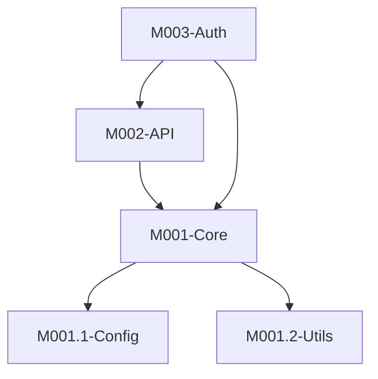
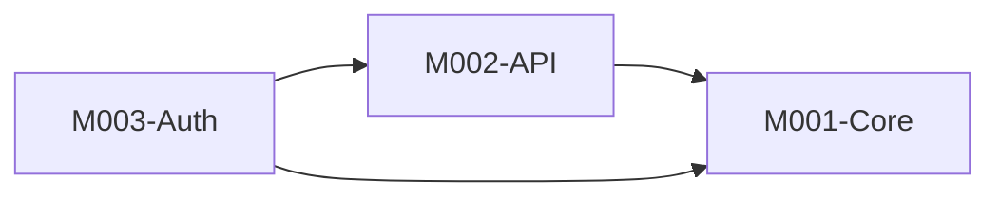

# Stage 2: 模块分析

## 阶段定义

**核心目标：** 将项目分解为逻辑模块，定义层次结构、依赖关系和接口。

**输入依赖：**
- `Architecture.md` (阶段1)
- `Overview.md` (阶段1)

**输出文件：**
- `Modules.md` — 模块分析

---

## 执行流程

### 2.1 模块发现

**并行执行以下探索：**

| 任务 | 方法 | 目标 |
|------|------|------|
| 目录边界分析 | 文件系统扫描 | 按目录划分潜在模块 |
| 导入图分析 | 代码分析 | 发现模块间依赖关系 |
| 接口发现 | 导出符号扫描 | 识别公共API |

**如果 GitNexus 已索引：**

```bash
# 查找所有功能集群
gitnexus cypher "MATCH (c:Community) RETURN c.heuristicLabel, c.size ORDER BY c.size DESC"

# 查找模块边界
gitnexus cypher "MATCH (f:File)-[:MEMBER_OF]->(c:Community) RETURN c.heuristicLabel, collect(f.name) LIMIT 20"
```

### 2.2 模块粒度确认

**必须与用户确认模块粒度。**

向用户呈现发现：

```
根据分析，发现了以下潜在的模块边界：

**选项A: 粗粒度** ({N}个模块)
| ID | 名称 | 描述 | 文件数 |
|----|------|------|--------|
| M001 | {name} | {description} | {count} |

**选项B: 细粒度** ({M}个模块)
| ID | 名称 | 描述 | 文件数 |
|----|------|------|--------|
| M001 | {name} | {description} | {count} |
| M001.1 | {name} | {description} | {count} |

**建议**: 选项{X}，因为{原因}

请选择您偏好的粒度，或告诉我需要调整什么。
```

### 2.3 模块编号

遵循命名规则：
- 顶级模块: `M{NNN}-{PascalCaseName}`
- 嵌套模块: `M{NNN}.{NN}-{SubName}`
- 最大嵌套深度: 3层

---

## 输出: Modules.md

### 必需章节

```markdown
---
title: {项目名称} 模块分析
version: 1.0
last_updated: YYYY-MM-DD
type: module-analysis
---

# {项目名称} 模块分析

## 模块层次



## 模块清单

| ID | 名称 | 职责 | 路径 | 文件数 |
|----|------|------|------|--------|
| M001 | Core | {responsibility} | `src/core/` | 15 |
| M001.1 | Config | {responsibility} | `src/core/config/` | 5 |
| M002 | API | {responsibility} | `src/api/` | 20 |
| M003 | Auth | {responsibility} | `src/auth/` | 10 |

## 模块依赖



### 依赖矩阵

| 模块 | 依赖于 | 被依赖 |
|------|--------|--------|
| M001-Core | - | M002, M003 |
| M002-API | M001 | M003 |
| M003-Auth | M001, M002 | - |

## 模块接口

### M001-Core

| 接口 | 类型 | 描述 | 文件 |
|------|------|------|------|
| `loadConfig()` | Function | 加载配置 | `src/core/config/loader.ts:15` |
| `Logger` | Class | 日志工具 | `src/core/logger.ts:10` |

### M002-API

| 接口 | 类型 | 描述 | 文件 |
|------|------|------|------|
| `createRouter()` | Function | 创建路由 | `src/api/router.ts:25` |

## 模块间数据流


### 关键数据路径

1. **认证流程**
   ```
   Request → M002.Routes → M003.AuthService → M004.Database → Response
   ```

## 模块详情链接

| 模块 | 详细分析 |
|------|----------|
| M001-Core | [M001-Core.md](modules/M001-Core.md) |
| M002-API | [M002-API.md](modules/M002-API.md) |

## 循环依赖

| 循环 | 严重程度 | 建议 |
|------|----------|------|
| {cycle} | {high/medium/low} | {recommendation} |

*无循环依赖* ✓
```

---

## 完成检查清单

- [ ] 所有模块已识别并编号
- [ ] 模块层次图已包含
- [ ] 模块依赖图已包含
- [ ] 每个模块的职责已清晰说明
- [ ] 每个模块的公共接口已列出
- [ ] 模块间数据流已记录
- [ ] 循环依赖已识别（如有）
- [ ] 用户已确认粒度
- [ ] 链接到详细模块文件已准备
- [ ] YAML Front Matter 已添加
- [ ] 所有路径使用相对路径
