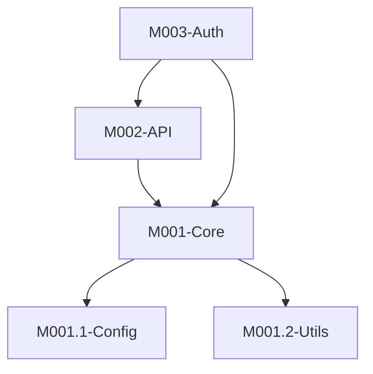
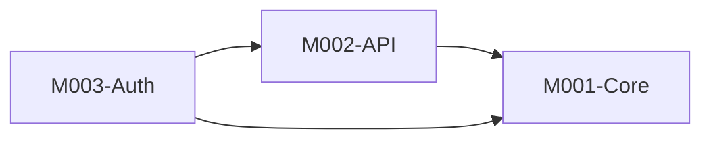

# Stage 2: 模块分析

## 阶段定义

**核心目标：** 将项目分解为逻辑模块，定义层次结构、依赖关系和接口。
目标不是生成一个"看起来合理"的模块图，而是生成一个**开发者实际认可的、能指导开发决策的**模块划分。

**核心原则：代码优先**

- 代码是唯一的事实来源，README/文档可能过时或错误
- 所有分析结论必须有代码证据支撑
- GitNexus 是导航工具，必须结合实际代码阅读

**输入依赖：**

- `Overview.md` (阶段1)
- `Architecture.md` (阶段1)

**输出文件：**

- `Modules.md` — 模块分析

---

## 执行流程

### 2.1 模块发现（GitNexus 导航 + 代码深度阅读）

**两阶段方法：先用 GitNexus 定位，再用代码深度阅读补充细节。**

#### 阶段 A：GitNexus 导航定位

**如果 GitNexus 已索引（必须使用，作为导航起点）：**

```bash
# 发现功能聚类（模块自然边界的最直接依据）
npx gitnexus cypher "MATCH (c:Community) RETURN c.heuristicLabel, c.symbolCount ORDER BY c.symbolCount DESC LIMIT 15" --repo <repo>

# 查看符号归属社区（Function/Class 属于哪个 Community）
npx gitnexus cypher "MATCH (f)-[:CodeRelation {type: 'MEMBER_OF'}]->(c:Community) RETURN c.heuristicLabel, collect(f.name) LIMIT 20" --repo <repo>

# 发现核心文件（被最多文件依赖 = 基础设施层）
npx gitnexus cypher "MATCH (f:File)<-[:CodeRelation {type: 'IMPORTS'}]-(g:File) RETURN f.name, count(g) AS deps ORDER BY deps DESC LIMIT 10" --repo <repo>

# 跨文件调用热图（模块间依赖强度，指导边界划分）
npx gitnexus cypher "MATCH (a)-[:CodeRelation {type: 'CALLS'}]->(b) WHERE a.filePath <> b.filePath WITH a.filePath AS from, b.filePath AS to, count(*) AS n ORDER BY n DESC LIMIT 15 RETURN from, to, n" --repo <repo>

# 发现循环依赖（循环依赖说明边界划错了）
npx gitnexus cypher "MATCH path=(a:File)-[:CodeRelation*2..5]->(a) WHERE ALL(r IN relationships(path) WHERE r.type = 'IMPORTS') RETURN path LIMIT 10" --repo <repo>
```

**⚠️ 此时你只有"模块候选列表"和"节点关系图"，但缺乏实现细节。继续下一阶段。**

#### 阶段 B：代码深度阅读（核心步骤，不可跳过）

**GitNexus 只提供节点索引和关系，细节很少。要深入了解代码库，必须阅读实际代码。**

**必须并行委派 subagent 执行以下任务：**

| 任务 | 目标 |
|------|------|
| 目录边界分析 | 理解每个目录的职责边界，识别潜在模块划分 |
| 导入图分析 | 理解模块间的依赖关系和依赖方向 |
| 接口发现 | 发现每个模块对外暴露的公共接口 |

**详细任务说明：**

1. **目录边界分析**
   - 每个目录的职责是什么？
   - 目录间是否有清晰的边界？
   - 是否有职责重叠或边界模糊的目录？

2. **导入图分析**
   - 模块间如何依赖？
   - 依赖方向是否合理（单向？循环？）
   - 是否有过度耦合的模块？

3. **接口发现**
   - 每个模块对外暴露哪些接口？
   - 接口是否稳定？是否遵循契约？
   - 是否有"隐式接口"（约定而非代码）？

**阅读目标：**

- 模块职责理解：这个模块具体做什么？GitNexus 只告诉你"有这些符号"，不会告诉你"为什么存在"
- 接口契约细节：模块导出了哪些接口？参数类型是什么？返回值是什么？
- 内部实现逻辑：核心算法、数据处理流程、状态管理方式
- 模块间交互细节：调用时传递什么数据？有什么副作用？错误如何处理？
- 隐藏的设计决策：为什么这样设计？有什么权衡？GitNexus 检测不到这些

#### 阶段 C：依赖关系深入理解

**GitNexus 告诉你"A 调用 B"，但不会告诉你"为什么调用"、"传递什么数据"、"有什么副作用"。**

```
对于每对有依赖关系的模块 (A → B)：
  Read: A 中调用 B 的文件
  理解：调用场景、数据传递、错误处理、性能考量
```

---

### 2.2 生成候选模块方案

基于探索结果，生成 **至少两种** 粒度方案，然后进行第一性原则推理：

**自问：**

- 这个边界是代码本身的自然边界，还是我强加的？
- 如果一个模块有超过 30 个文件，它可能需要拆分
- 如果一个模块只有 1-2 个文件，它可能不需要独立成模块
- 循环依赖指示边界画错了，不是正常现象

---

### 2.3 模块粒度确认（必须与用户交互）

**绝不跳过这个步骤。** 模块边界是主观决策，代码无法告诉我们正确答案。

向用户呈现：

```
根据分析，我发现了以下潜在模块边界：

**选项A：粗粒度**（{N} 个模块，平均 {X} 个文件/模块）

```mermaid
graph TD
    {mermaid_diagram_A}
```

| ID | 名称 | 包含内容 | 文件数 |
|----|------|----------|--------|
| M001 | {name} | {description} | {count} |

**选项B：细粒度**（{M} 个模块，平均 {Y} 个文件/模块）

```mermaid
graph TD
    {mermaid_diagram_B}
```

| ID | 名称 | 包含内容 | 文件数 |
|----|------|----------|--------|
| M001 | {name} | {description} | {count} |
| M001.1 | {name} | {description} | {count} |

**我的判断**：推荐选项 {X}，原因是：

- {原因1：结合项目规模和目的}
- {原因2：结合发现的自然边界}

**有一些我拿不准的地方需要你确认：**

1. {uncertain_point_1，例如：X 和 Y 是否应该合并？它们共享大量状态}
2. {uncertain_point_2，例如：Z 模块的职责描述是否准确？}

请选择你偏好的粒度，或告诉我需要调整什么。

```

等待用户确认后再继续。

---

### 2.4 模块编号与命名

```

顶级模块：M{NNN}-{PascalCaseName}
嵌套模块：M{NNN}.{NN}-{SubName}
最大嵌套深度：3 层

```

命名原则：
- 名称应描述**职责**，而不是技术实现（`UserAuth` 优于 `JwtHandler`）
- 避免过于宽泛的名称（`Utils` 不是好的模块名）
- 避免与技术栈重叠（不要叫 `Express` 或 `Redis`）

---

## 输出: Modules.md

```markdown
---
title: {项目名称} 模块分析
version: 1.0
last_updated: YYYY-MM-DD
type: module-analysis
project: {project_name}
---

# {项目名称} 模块分析

## 模块划分说明

[1段话：说明为什么这样划分模块，与架构层次的对应关系，以及主要依据]

## 模块层次



## 模块清单

| ID | 名称 | 职责（一句话） | 路径 | 文件数 | 层次 |
|----|------|--------------|------|--------|------|
| M001 | Core | {responsibility} | `src/core/` | 15 | 基础层 |
| M002 | API | {responsibility} | `src/api/` | 20 | 接口层 |
| M003 | Auth | {responsibility} | `src/auth/` | 10 | 业务层 |

## 模块依赖



### 依赖矩阵

| 模块 | 依赖于 | 被依赖于 | 层次级别 |
|------|--------|----------|----------|
| M001-Core | — | M002, M003 | 0（基础） |
| M002-API | M001 | M003 | 1 |
| M003-Auth | M001, M002 | — | 2 |

## 模块公共接口

### M001-Core

| 接口 | 类型 | 描述 | 文件 |
|------|------|------|------|
| `loadConfig()` | Function | 加载并验证配置 | `src/core/config/loader.ts:15` |
| `Logger` | Class | 结构化日志工具 | `src/core/logger.ts:10` |

### M002-API

[同上格式]

## 模块间数据流

### 主流程


### 关键数据路径

1. **认证流程**

   ```
   HTTP Request → M002.Router → M003.AuthMiddleware → M003.TokenValidator → M001.Database → Response
   ```

   关键文件：`{file1}` → `{file2}` → `{file3}`

2. **{其他重要流程}**

   ```
   {path}
   ```

## 循环依赖分析

| 循环 | 严重程度 | 原因分析 | 建议 |
|------|----------|----------|------|
| {cycle} | 高/中/低 | {why} | {suggestion} |

*无循环依赖* ✓ / *发现 {N} 个循环依赖，见上表*

## 模块详情索引

| 模块 | 详细分析 | 分析状态 |
|------|----------|----------|
| M001-Core | [M001-Core.md](modules/M001-Core.md) | 待生成（Stage 3） |
| M002-API | [M002-API.md](modules/M002-API.md) | 待生成（Stage 3） |

```

---

## Stage 2 Subagent 验证（完成后必须执行）

生成 Modules.md 后，委派 subagent 执行验证：

```

验证任务：Stage 2 模块分析完整性和准确性检查

需要验证的文件：Modules.md
项目路径：{project-path}
Architecture.md 路径：{path}

检查清单：

1. 模块边界：每个模块的文件是否真实存在于声明的路径？
2. 依赖关系：抽查 3 个依赖关系，在代码中是否有 import 证据？
3. 接口完整性：每个模块列出的公共接口，是否真实被导出？
4. 遗漏检查：项目中是否有未被任何模块覆盖的重要目录/文件？
5. 数据流验证：主流程的关键文件引用是否正确？
6. 循环依赖：GitNexus 查询结果是否与文档记录一致？
7. 与 Architecture.md 一致性：模块层次是否与架构层次对应？
8. **关键检查**：模块职责描述是否基于代码深度阅读（不是仅凭 GitNexus）？
9. **关键检查**：模块间交互细节是否有代码证据？

输出格式：
✅ {项目} — 已验证（附证据）
❌ {项目} — 问题：{具体描述} [File: {path}:{line}]
⚠️ {项目} — 无法确认，建议用户验证：{说明}

```

收到验证报告后展示给用户，修正问题后进入 Stage 3。

---

## 完成检查清单

- [ ] 模块目的已与用户对齐（粗粒度 vs 细粒度）
- [ ] GitNexus 社区分析已使用（或已说明为何未使用）
- [ ] **阶段 B 代码深度阅读已执行（核心步骤，不可跳过）**
- [ ] **阶段 C 依赖关系深入理解已执行**
- [ ] 已向用户呈现至少两种粒度方案
- [ ] 用户已确认模块粒度
- [ ] 所有模块已编号（M{NNN} 格式）
- [ ] 依赖矩阵已包含
- [ ] 循环依赖已检查并记录
- [ ] 关键数据路径有文件引用
- [ ] YAML Front Matter 已添加
- [ ] Subagent 验证已执行并结果已展示给用户
