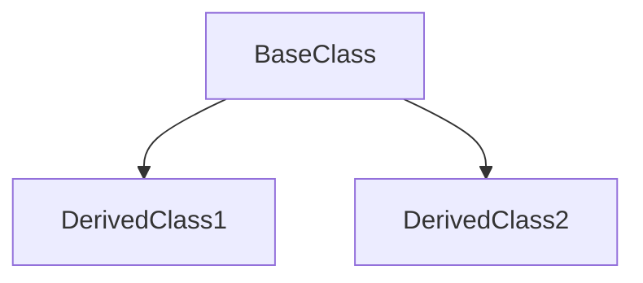

# Stage 3: 详细模块分析

## 阶段定义

**核心目标：** 深入分析阶段2确认的每个模块，生成可作为开发参考的模块详情文件。
每个文件必须达到的标准：**一个新开发者读完后，能独立修改该模块，不需要问别人。**

**核心原则：代码优先**

- 代码是唯一的事实来源，README/文档可能过时或错误
- 所有分析结论必须有代码证据支撑
- GitNexus 是导航工具，必须结合实际代码阅读

**输入依赖：**

- `Modules.md` (阶段2，必须已通过用户确认)
- `Architecture.md` (阶段1)

**输出目录：**

- `references/modules/` — 每个模块一个文件

---

## 执行流程

### 3.0 第一性原则：评估分析深度需求

**不是所有模块都需要同等深度的分析。** 在开始前，根据以下标准分级：

| 优先级 | 标准 | 分析深度 |
|--------|------|----------|
| 🔴 高 | 被最多模块依赖 / 包含核心业务逻辑 / 经常修改 | 完整分析，含所有函数签名 |
| 🟡 中 | 适度依赖 / 专门领域逻辑 | 标准分析，重点接口 |
| 🟢 低 | 工具类 / 配置 / 很少修改 | 简化分析，接口契约为主 |

**若模块数量 > 8，先与用户确认是否全部详细分析，还是优先高优先级模块。**

---

## 阶段 A：并行生成模块文档

### 3.1 并行模块分析（核心约束）

**对每个模块并行委派一个 subagent 进行深入分析。**

对于 N 个模块，同时发起 N 个 subagent 任务：

```
[并行] Subagent 1: 深入分析 M001-Core，生成 M001-Core.md
[并行] Subagent 2: 深入分析 M002-API，生成 M002-API.md
[并行] Subagent 3: 深入分析 M003-Auth，生成 M003-Auth.md
...（不等待任何一个完成）
```

**禁止：**

- ❌ 完成模块1分析，再开始模块2
- ❌ 因为某个模块"更重要"而串行化
- ❌ 自己完成所有模块分析（上下文过载）

---

### 3.2 每个 Subagent 的任务描述

向每个 subagent 发送的任务描述：

```
任务：深入分析模块 {ModuleID}-{ModuleName} 并生成模块详情文件

项目路径：{project-path}
模块路径：{module_path}
优先级：{高/中/低}
依赖于：{dependencies}（需要理解其接口）
被依赖于：{dependents}（需要理解什么依赖我）
输出文件：references/modules/{ModuleID}-{ModuleName}.md

核心原则：代码优先
- 代码是唯一的事实来源
- 所有分析结论必须有代码证据支撑
- GitNexus 是导航工具，必须结合实际代码阅读

执行步骤：

**步骤 1：GitNexus 导航（可选，如果可用）**

使用 GitNexus 快速定位模块内的关键符号和调用关系。

**步骤 2：代码深度阅读（核心步骤，不可跳过）**

阅读模块内所有文件，完成以下分析：

1. **公开接口与依赖分析**
   - 识别所有对外暴露的函数、类、类型、常量
   - 记录完整签名、参数类型、返回类型
   - 分析外部依赖（第三方库/框架）和内部依赖（项目内其他模块）

2. **内部实现分析**
   - 追踪模块内文件间的函数调用，识别关键执行路径
   - 分析数据流：入站（数据来源）→ 处理（数据变换）→ 出站（数据去向）
   - 识别使用的设计模式，引用具体代码位置作为证据

**步骤 3：生成模块详情文件**

按照模板格式生成 {ModuleID}-{ModuleName}.md，确保：
- 所有公开接口已列出
- 代码引用有行号
- 设计模式有代码证据
- 数据流有具体文件引用链
- 无绝对路径
- 每个结论都要有代码证据
```

---

### 3.3 分析质量要求

**每个模块文件必须满足：**

| 要求 | 验证方式 |
|------|----------|
| 所有 export 已列出 | `grep -r "export" {module_path}` 与文档对比 |
| 代码引用有行号 | 检查是否包含 `:{line}` 格式 |
| 设计模式有代码证据 | 不能只写"使用了工厂模式"，要写"见 {file}:{line}" |
| 数据流有具体文件链 | 不是"A调用B"，是"A.ts:45 调用 B.ts:23 的 methodName" |
| 无绝对路径 | grep 检查 |

---

## 输出: 模块详情文件

### 文件命名

```

references/modules/{ModuleID}-{ModuleName}.md

```

### 完整模板

```markdown
---
title: {ModuleID} {ModuleName} 分析
version: 1.0
last_updated: YYYY-MM-DD
type: module-detail
module_id: {ModuleID}
project: {project_name}
priority: high | medium | low
---

# {ModuleID} {ModuleName}

## 概述

[2-3句话：这个模块解决什么问题？为什么存在？如果没有它会怎样？]

## 元数据

| 字段 | 值 |
|------|-----|
| 模块ID | {ModuleID} |
| 路径 | `{module_path}` |
| 文件数 | {file_count} |
| 主要语言 | {language} |
| 优先级 | 高/中/低 |
| 依赖于 | {dependencies} |
| 被依赖于 | {dependents} |
| 设计模式 | {patterns} |

## 文件结构

```mermaid
graph TD
    subgraph {ModuleID}-{ModuleName}
        file1[file1.ts\n主要入口]
        file2[file2.ts\n核心逻辑]
        file3[file3.ts\n工具函数]
    end
    file1 --> file2
    file2 --> file3
```

| 文件 | 职责 | 行数 | 主要导出 |
|------|------|------|----------|
| `{file}` | {purpose} | {lines} | `{exports}` |

---

## 功能树

> 模块功能的层次分解，展示 File → Class/Function → Method 的完整结构

```
{ModuleID}-{ModuleName} ({模块职责一句话})
├── 📁 {subdir1}/
│   ├── 📄 {file1}.ts
│   │   ├── fn: {functionName}() - {简短描述}
│   │   │   └── 参数: {params}
│   │   │   └── 返回: {returnType}
│   │   └── fn: {functionName2}() - {简短描述}
│   └── 📄 {file2}.ts
│       └── class: {ClassName} - {简短描述}
│           ├── method: {method1}() - {简短描述}
│           ├── method: {method2}() - {简短描述}
│           └── property: {prop} - {类型}
├── 📁 {subdir2}/
│   └── 📄 {file3}.ts
│       └── interface: {InterfaceName} - {简短描述}
│           ├── {field1}: {type}
│           └── {field2}: {type}
└── 📄 index.ts (模块入口)
    └── export * from './{subdir1}'
```

### 功能清单

| 功能 | 类型 | 文件 | 行号 | 描述 |
|------|------|------|------|------|
| `{name}` | Function | `{file}` | {line} | {description} |
| `{name}` | Class | `{file}` | {line} | {description} |
| `{name}` | Interface | `{file}` | {line} | {description} |

---

## 公共接口契约

> 本节是其他模块与此模块交互的唯一参考。改变这里的接口需要同步更新依赖模块。

### 接口关系图（erDiagram）

```mermaid
erDiagram
    {INTERFACE_A} ||--o{ {INTERFACE_B} : contains
    {INTERFACE_A} ||--|| {INTERFACE_C} : references
    
    {INTERFACE_A} {
        {type} {field} "{description}"
        {type} {field} "{description}"
    }
    
    {INTERFACE_B} {
        {type} {field} "{description}"
    }
    
    {INTERFACE_C} {
        {type} {field} "{description}"
    }
```

### 接口 / 类型定义

```typescript
// [File: {path}:{line}]
export interface {InterfaceName} {
  {field}: {type}  // {description}
  {method}({params}): {ReturnType}
}
```

| 接口/类型 | 字段/方法 | 类型 | 描述 | 文件 |
|-----------|-----------|------|------|------|
| `{InterfaceName}` | `{field}` | `{type}` | {description} | `{path}:{line}` |

### 导出函数

#### `{functionName}()`

```typescript
// [File: {path}:{line}]
export function {functionName}({params}): {ReturnType}
```

| 参数 | 类型 | 必需 | 描述 |
|------|------|------|------|
| {name} | {type} | 是/否 | {description} |

**返回**：{具体描述，不是"返回结果"}
**抛出**：`{ErrorType}` — 当 {condition} 时

**使用示例**：

```typescript
// 典型使用方式
const result = {functionName}({example_args});
```

### 导出类

#### `{ClassName}`

```typescript
// [Class: {ClassName} in File: {path}:{start}-{end}]
```

| 方法 | 签名 | 描述 | 行号 |
|------|------|------|------|
| `{method}()` | `{signature}` | {description} | {line} |

**类关系图**：

```mermaid
classDiagram
    class {ClassName} {
        +{property}: {type}
        +{method}(): {returnType}
    }
    
    {ClassName} --> {DependencyClass} : uses
```

## 内部实现

> 本节描述实现细节。修改内部实现不需要更新依赖模块，但需要更新此文档。

### 类层次（如有）



### 关键内部函数

| 函数 | 文件 | 行号 | 用途 |
|------|------|------|------|
| `{name}()` | `{file}` | {line} | {purpose} |

### 设计模式

#### {模式名称}

- **使用位置**：[File: `{path}`:{line}]
- **使用原因**：{为什么这里用这个模式}
- **结构**：

```mermaid
{pattern_specific_diagram}
```

## 数据流

### 模块内部流程


### 入站数据（来自其他模块）

| 来源模块 | 数据/调用 | 触发条件 | 接收位置 |
|----------|---------|----------|----------|
| {module} | {data/call} | {when} | [File: `{path}`:{line}] |

### 出站数据（到其他模块）

| 目标模块 | 数据/调用 | 触发条件 | 发起位置 |
|----------|---------|----------|----------|
| {module} | {data/call} | {when} | [File: `{path}`:{line}] |

## 依赖

### 内部依赖（项目内其他模块）

| 模块 | 使用的接口 | 文件 |
|------|------------|------|
| {module} | `{interface}` | [File: `{path}`:{line}] |

### 外部依赖（npm/pip/cargo 包）

| 包名 | 版本 | 用途 | 为什么选这个包 |
|------|------|------|----------------|
| {package} | {version} | {purpose} | {rationale} |

## 关键执行路径

### 路径：{名称（如"用户认证"）}

```
{step1_file}:{line} → {step2_file}:{line} → {step3_file}:{line}
```

1. `{step1}`：[File: `{path}`:{line}]
2. `{step2}`：[File: `{path}`:{line}]
3. `{step3}`：[File: `{path}`:{line}]

## 注意事项与坑

- ⚠️ **{注意点}**：{说明，包含背景原因}
- 💡 **{优化机会}**：{建议}

```

---

## 阶段 B：并行验证模块文档质量

> **核心原则：生成与验证分离，隔离上下文**
>
> 阶段 A 的所有生成任务完成后，再启动阶段 B 的验证任务。
> 验证 subagent 使用全新的上下文，不继承生成阶段的记忆，确保客观性。

### 3.4 等待所有生成任务完成

在启动验证之前，确认：

```

✅ 所有模块文档已生成（references/modules/ 下有对应文件）
✅ 生成 subagent 已全部完成
✅ 文件内容可读取

```

### 3.5 并行委派验证 Subagent

**对每个模块并行委派一个独立的验证 subagent。**

**关键：验证 subagent 不继承生成 subagent 的上下文，从头开始验证。**

对于 N 个模块，同时发起 N 个验证 subagent 任务：

```

[并行] Critic Subagent 1: 验证 M001-Core.md 的完整性和准确性
[并行] Critic Subagent 2: 验证 M002-API.md 的完整性和准确性
[并行] Critic Subagent 3: 验证 M003-Auth.md 的完整性和准确性
...（不等待任何一个完成）

```

**验证 Subagent 任务描述：**

```

验证任务：模块详情文档质量检查

目标文件：references/modules/{ModuleID}-{ModuleName}.md
项目路径：{project-path}
Modules.md 路径：{path}

验证原则：

- 你是一个独立的审查者，不继承任何生成上下文
- 从零开始验证，所有结论必须有代码证据
- 不要假设文档是正确的，要亲自验证

检查清单：

1. 接口完整性：模块中所有公开接口是否都在文档中列出？
   - 执行：grep -r "export" {module_path}
   - 对比：文档列出的接口 vs 实际导出的接口

2. 签名准确性：文档中的函数签名是否与代码一致？
   - 抽查：至少 3 个函数
   - 验证：参数类型、返回类型、可选参数标记

3. 行号有效性：引用的行号是否指向正确的代码？
   - 抽查：至少 3 个行号引用
   - 验证：行号处的代码与文档描述是否匹配

4. 依赖准确性：列出的依赖是否真实存在？
   - 检查：import/use/require 语句
   - 验证：依赖的模块/包是否真实被使用

5. 设计模式：声称使用了某模式，代码中是否有证据？
   - 验证：找到模式的具体实现位置
   - 检查：模式结构是否完整

6. 数据流：关键路径的文件引用是否正确？
   - 追踪：文档描述的调用链
   - 验证：每个步骤是否真实存在

7. 模块一致性：与 Modules.md 中的描述是否一致？
   - 对比：职责描述、依赖关系、接口列表

8. **关键检查**：分析是否基于实际代码阅读？
   - 验证：文档中的细节是否来自代码，而非推测

输出格式：

## {ModuleID}-{ModuleName} 验证报告

### ✅ 通过项

- {item}：{evidence}

### ❌ 严重问题（必须修正）

- {item}：{description} [File: `{path}`:{line}]

### ⚠️ 轻微问题（建议修正）

- {item}：{description}

### 📋 总结

- 通过项：{N}/{M}
- 严重问题：{N} 个
- 轻微问题：{N} 个
- 建议：{继续/修正后继续}

```

### 3.6 汇总验证结果

所有验证 subagent 完成后，汇总结果：

```

## Stage 3 验证汇总

| 模块 | 通过项 | 严重问题 | 轻微问题 | 状态 |
|------|--------|----------|----------|------|
| M001-Core | 8/8 | 0 | 0 | ✅ 通过 |
| M002-API | 7/8 | 1 | 0 | ❌ 需修正 |
| M003-Auth | 8/8 | 0 | 2 | ⚠️ 建议修正 |

总计：{通过模块数} / {总模块数} 通过
严重问题：{N} 个（必须修正）
轻微问题：{N} 个（用户决策）

```

### 3.7 处理验证结果

1. **展示给用户**：完整的验证汇总报告
2. **修正严重问题**：行号错误、接口遗漏、不存在的依赖
3. **用户决策轻微问题**：由用户决定是否修正
4. **确认后进入 Stage 4**

---

## 完成检查清单

### 阶段 A：生成
- [ ] 已评估模块优先级并决定分析深度
- [ ] 模块数量 > 8 时已与用户确认范围
- [ ] 所有模块并行委派（不是串行）
- [ ] **代码深度阅读已执行（核心步骤，不可跳过）**
- [ ] 每个模块文件：所有公开接口已列出
- [ ] 每个模块文件：代码引用有行号
- [ ] 每个模块文件：设计模式有代码证据
- [ ] 每个模块文件：数据流有具体文件引用链
- [ ] 无绝对路径
- [ ] 所有文件包含 YAML Front Matter

### 阶段 B：验证
- [ ] 所有生成任务已完成后再启动验证
- [ ] 验证 subagent 并行委派（不是串行）
- [ ] 验证 subagent 不继承生成上下文（隔离原则）
- [ ] 验证结果汇总表已生成
- [ ] 验证结果已展示给用户
- [ ] 严重问题已修正
- [ ] 轻微问题已由用户决策
