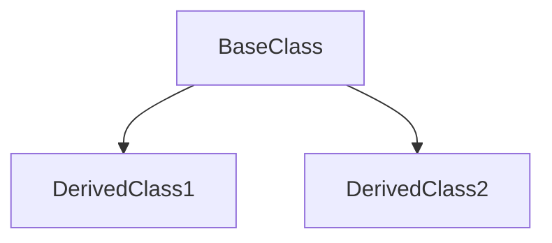

# Stage 3: 详细模块分析

## 阶段定义

**核心目标：** 深入分析阶段2中识别的每个模块，生成单独的模块详情文件。

**输入依赖：**
- `Modules.md` (阶段2)
- `Architecture.md` (阶段1)

**输出目录：**
- `references/modules/` — 每个模块一个文件

---

## 执行流程

### 3.1 并行模块分析（关键）

**必须使用并行委派。** 每个模块分配一个独立的分析任务。

对于 N 个模块，同时发起 N 个任务：

```
任务 1: 分析模块 M001-Core
任务 2: 分析模块 M002-API
任务 3: 分析模块 M003-Auth
...
```

### 3.2 分析任务提示模板

每个委派任务应包含：

**任务描述：**
- 分析模块 `{ModuleID}-{ModuleName}`
- 路径: `{module_path}`

**必须完成：**
1. 读取模块目录中的所有文件
2. 识别所有类、函数、接口
3. 映射 文件 → 类 → 函数 层次结构
4. 记录模块内的数据流
5. 识别使用的设计模式
6. 记录公共接口契约
7. 列出关键文件及其用途

**必须不：**
- 跳过任何文件
- 使用绝对路径
- 省略数据流文档

**上下文：**
- 项目: {project_name}
- 依赖: {dependencies}
- 被依赖: {dependents}

### 3.3 GitNexus 辅助分析（可选）

如果 GitNexus 已索引，可以辅助分析：

```bash
# 查找涉及模块的执行流
npx gitnexus query "{ModuleName} execution flow" --repo <repo>

# 获取入口点上下文
npx gitnexus context {MainClass} --repo <repo>

# 检查更改影响
npx gitnexus impact {ExportedSymbol} --direction upstream --repo <repo>
```

### 3.4 结果收集

所有任务完成后：
1. 验证所有模块文件已生成
2. 检查跨模块引用的一致性
3. 确保 YAML Front Matter 存在

---

## 输出: 模块详情文件

### 文件命名

```
references/modules/{ModuleID}-{ModuleName}.md
```

示例：
- `M001-Core.md`
- `M001.1-Config.md`
- `M002-API.md`

### 模板

```markdown
---
title: {ModuleID} {ModuleName} 分析
version: 1.0
last_updated: YYYY-MM-DD
type: module-detail
module_id: {ModuleID}
---

# {ModuleID} {ModuleName}

## 概述

[1-2段描述模块的目的和职责]

## 元数据

| 字段 | 值 |
|------|-----|
| 模块ID | {ModuleID} |
| 名称 | {ModuleName} |
| 路径 | `{module_path}` |
| 文件数 | {file_count} |
| 主要语言 | {language} |
| 设计模式 | {patterns} |

## 文件结构

```mermaid
graph TD
    subgraph {ModuleID}
        file1[file1.ts]
        file2[file2.ts]
        file3[file3.ts]
    end
    file1 --> file2
    file2 --> file3
```

| 文件 | 用途 | 行数 | 主要导出 |
|------|------|------|----------|
| `{file}` | {purpose} | {lines} | {exports} |

## 类层次



### {ClassName}

- **文件**: [File: `{path}`:{line}]
- **继承**: {parent}
- **实现**: {interfaces}
- **目的**: {purpose}

#### 属性

| 属性 | 类型 | 描述 |
|------|------|------|
| {name} | {type} | {description} |

#### 方法

| 方法 | 返回类型 | 描述 | 行号 |
|------|----------|------|------|
| `{method}()` | {type} | {description} | {line} |

## 函数目录

### 公共函数

| 函数 | 文件 | 行号 | 签名 | 描述 |
|------|------|------|------|------|
| `{name}()` | `{file}` | {line} | `{signature}` | {description} |

### 内部函数

| 函数 | 文件 | 行号 | 用途 |
|------|------|------|------|
| `{name}()` | `{file}` | {line} | {purpose} |

## 设计模式

### {模式名称}

- **文件**: {files}
- **用途**: {为什么使用}
- **结构**:

```mermaid
{pattern diagram}
```

## 数据流

### 内部数据流


### 入站（来自其他模块）


### 出站（到其他模块）


## 接口契约

### 导出接口: {InterfaceName}

```typescript
// File: {file}:{line}
export interface {InterfaceName} {
  {method}: {signature}
}
```

**使用示例**:
```typescript
{example code}
```

### 导出函数: {FunctionName}

```typescript
// File: {file}:{line}
export function {FunctionName}({params}): {ReturnType}
```

**参数**:
| 参数 | 类型 | 必需 | 描述 |
|------|------|------|------|
| {name} | {type} | {yes/no} | {description} |

**返回**: {description}

**抛出**: {error types}

## 依赖

### 内部依赖（项目内）
| 模块 | 使用的接口 | 文件 |
|------|------------|------|
| {module} | {interface} | {file} |

### 外部依赖（npm/pip/cargo）
| 包名 | 版本 | 用途 |
|------|------|------|
| {package} | {version} | {purpose} |

## 关键路径

### 路径: {名称}
1. {step1}
2. {step2}
3. {step3}

**文件**: {file1} → {file2} → {file3}

## 备注

- {重要观察}
- {注意事项}
- {改进建议}
```

---

## 完成检查清单

- [ ] 所有模块在 `references/modules/` 目录中有详细文件
- [ ] 每个文件有正确的 YAML Front Matter
- [ ] 文件 → 类 → 函数 层次结构已记录
- [ ] 设计模式已识别并记录
- [ ] 数据流（入站/出站）已记录
- [ ] 接口契约包含签名
- [ ] 依赖已列出（内部 + 外部）
- [ ] Mermaid 图表包含结构和流程
- [ ] 所有路径使用相对路径
- [ ] 跨模块引用一致
