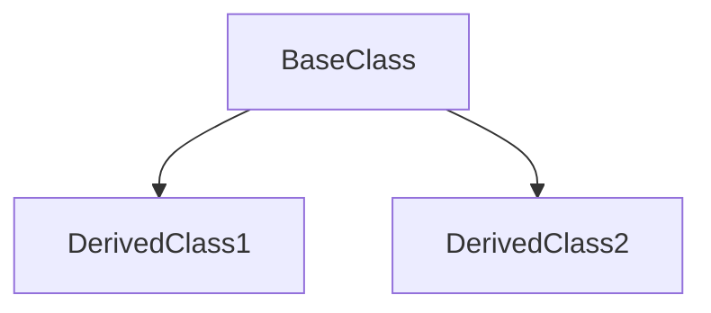

# Stage 3: 详细模块分析

## 阶段定义

**核心目标：** 深入分析阶段2确认的每个模块，生成可作为开发参考的模块详情文件。
每个文件必须达到的标准：**一个新开发者读完后，能独立修改该模块，不需要问别人。**

**输入依赖：**

- `Modules.md` (阶段2，必须已通过用户确认)
- `Architecture.md` (阶段1)

**输出目录：**

- `references/modules/` — 每个模块一个文件

---

## 执行流程

### 3.0 第一性原则：评估分析深度需求

**不是所有模块都需要同等深度的分析。** 在开始前，根据以下标准分级：

| 优先级 | 标准 | 分析深度 |
|--------|------|----------|
| 🔴 高 | 被最多模块依赖 / 包含核心业务逻辑 / 经常修改 | 完整分析，含所有函数签名 |
| 🟡 中 | 适度依赖 / 专门领域逻辑 | 标准分析，重点接口 |
| 🟢 低 | 工具类 / 配置 / 很少修改 | 简化分析，接口契约为主 |

**若模块数量 > 8，先与用户确认是否全部详细分析，还是优先高优先级模块。**

---

### 3.1 并行模块分析（核心约束）

**必须并行委派。** 串行分析是严重的效率问题。

对于 N 个模块，同时发起 N 个任务：

```
[并行] 任务 1: 分析 M001-Core
[并行] 任务 2: 分析 M002-API
[并行] 任务 3: 分析 M003-Auth
...（不等待任何一个完成）
```

**禁止：**

- ❌ 完成任务1，再开始任务2
- ❌ 因为某个模块"更重要"而串行化
- ❌ 自己完成所有模块分析（上下文过载）

---

### 3.2 每个分析任务的标准提示

向每个 subagent 发送的任务描述：

```
任务：详细分析模块 {ModuleID}-{ModuleName}

项目路径：{project-path}
模块路径：{module_path}
优先级：{高/中/低}
依赖于：{dependencies}（需要理解其接口）
被依赖于：{dependents}（需要理解什么依赖我）

必须完成（不可跳过）：
1. 读取模块目录中的【所有】文件（不要抽样）
2. 识别所有公开（export）的类、函数、接口、类型
3. 对于每个公开接口：记录完整签名、参数类型、返回类型、抛出的异常
4. 记录模块内部的文件间调用关系（不是全部，只是关键路径）
5. 识别使用的设计模式（必须有代码证据，不能猜测）
6. 记录模块内数据流（入站 → 处理 → 出站）
7. 列出外部依赖（npm/pip 包）和内部依赖（其他模块）

GitNexus 辅助（如果已索引，必须使用，优先于手动读文件）：

```bash
# 搜索该模块的核心逻辑执行流
npx gitnexus query "{ModuleName} core logic flow" --repo <repo>
npx gitnexus query "{ModuleName} data processing" --content --repo <repo>

# 获取主要类/函数的 360° 视图（调用者 + 被调用者 + 定义位置）
npx gitnexus context {主要类名} --repo <repo>
npx gitnexus context {主要类名} --file {module_path}/index.ts --repo <repo>  # 有同名时指定文件

# 分析导出函数的影响范围（用于理解接口契约的重要性）
npx gitnexus impact {主要导出函数} --direction upstream --repo <repo>

# 查看模块所有导出（不遗漏公共接口）
npx gitnexus cypher "MATCH (n:Function) WHERE n.isExported = true AND n.filePath CONTAINS '{module_path}' RETURN n.name, n.filePath, n.startLine" --repo <repo>

# 查看模块内部调用关系
npx gitnexus cypher "MATCH (a)-[:CodeRelation {type: 'CALLS'}]->(b) WHERE a.filePath CONTAINS '{module_path}' AND b.filePath CONTAINS '{module_path}' RETURN a.name AS caller, b.name AS callee LIMIT 20" --repo <repo>
```

输出格式：

- 严格遵循 Stage3-Detailed.md 中的模板
- 所有路径使用相对路径
- 所有代码引用包含行号
- 不要包含绝对路径

```

---

### 3.3 分析质量要求

**每个模块文件必须满足：**

| 要求 | 验证方式 |
|------|----------|
| 所有 export 已列出 | `grep -r "export" {module_path}` 与文档对比 |
| 代码引用有行号 | 检查是否包含 `:{line}` 格式 |
| 设计模式有代码证据 | 不能只写"使用了工厂模式"，要写"见 {file}:{line}" |
| 数据流有具体文件链 | 不是"A调用B"，是"A.ts:45 调用 B.ts:23 的 methodName" |
| 无绝对路径 | grep 检查 |

---

## 输出: 模块详情文件

### 文件命名

```

references/modules/{ModuleID}-{ModuleName}.md

```

### 完整模板

```markdown
---
title: {ModuleID} {ModuleName} 分析
version: 1.0
last_updated: YYYY-MM-DD
type: module-detail
module_id: {ModuleID}
project: {project_name}
priority: high | medium | low
---

# {ModuleID} {ModuleName}

## 概述

[2-3句话：这个模块解决什么问题？为什么存在？如果没有它会怎样？]

## 元数据

| 字段 | 值 |
|------|-----|
| 模块ID | {ModuleID} |
| 路径 | `{module_path}` |
| 文件数 | {file_count} |
| 主要语言 | {language} |
| 优先级 | 高/中/低 |
| 依赖于 | {dependencies} |
| 被依赖于 | {dependents} |
| 设计模式 | {patterns} |

## 文件结构

```mermaid
graph TD
    subgraph {ModuleID}-{ModuleName}
        file1[file1.ts\n主要入口]
        file2[file2.ts\n核心逻辑]
        file3[file3.ts\n工具函数]
    end
    file1 --> file2
    file2 --> file3
```

| 文件 | 职责 | 行数 | 主要导出 |
|------|------|------|----------|
| `{file}` | {purpose} | {lines} | `{exports}` |

## 公共接口契约

> 本节是其他模块与此模块交互的唯一参考。改变这里的接口需要同步更新依赖模块。

### 接口 / 类型定义

```typescript
// [File: {path}:{line}]
export interface {InterfaceName} {
  {field}: {type}  // {description}
  {method}({params}): {ReturnType}
}
```

### 导出函数

#### `{functionName}()`

```typescript
// [File: {path}:{line}]
export function {functionName}({params}): {ReturnType}
```

| 参数 | 类型 | 必需 | 描述 |
|------|------|------|------|
| {name} | {type} | 是/否 | {description} |

**返回**：{具体描述，不是"返回结果"}
**抛出**：`{ErrorType}` — 当 {condition} 时

**使用示例**：

```typescript
// 典型使用方式
const result = {functionName}({example_args});
```

### 导出类

#### `{ClassName}`

```typescript
// [Class: {ClassName} in File: {path}:{start}-{end}]
```

| 方法 | 签名 | 描述 | 行号 |
|------|------|------|------|
| `{method}()` | `{signature}` | {description} | {line} |

## 内部实现

> 本节描述实现细节。修改内部实现不需要更新依赖模块，但需要更新此文档。

### 类层次（如有）



### 关键内部函数

| 函数 | 文件 | 行号 | 用途 |
|------|------|------|------|
| `{name}()` | `{file}` | {line} | {purpose} |

### 设计模式

#### {模式名称}

- **使用位置**：[File: `{path}`:{line}]
- **使用原因**：{为什么这里用这个模式}
- **结构**：

```mermaid
{pattern_specific_diagram}
```

## 数据流

### 模块内部流程


### 入站数据（来自其他模块）

| 来源模块 | 数据/调用 | 触发条件 | 接收位置 |
|----------|---------|----------|----------|
| {module} | {data/call} | {when} | [File: `{path}`:{line}] |

### 出站数据（到其他模块）

| 目标模块 | 数据/调用 | 触发条件 | 发起位置 |
|----------|---------|----------|----------|
| {module} | {data/call} | {when} | [File: `{path}`:{line}] |

## 依赖

### 内部依赖（项目内其他模块）

| 模块 | 使用的接口 | 文件 |
|------|------------|------|
| {module} | `{interface}` | [File: `{path}`:{line}] |

### 外部依赖（npm/pip/cargo 包）

| 包名 | 版本 | 用途 | 为什么选这个包 |
|------|------|------|----------------|
| {package} | {version} | {purpose} | {rationale} |

## 关键执行路径

### 路径：{名称（如"用户认证"）}

```
{step1_file}:{line} → {step2_file}:{line} → {step3_file}:{line}
```

1. `{step1}`：[File: `{path}`:{line}]
2. `{step2}`：[File: `{path}`:{line}]
3. `{step3}`：[File: `{path}`:{line}]

## 注意事项与坑

- ⚠️ **{注意点}**：{说明，包含背景原因}
- 💡 **{优化机会}**：{建议}

```

---

## Stage 3 Subagent 验证（完成后必须执行）

所有模块文件生成后，委派 **独立的** subagent 执行交叉验证：

```

验证任务：Stage 3 模块详情完整性和准确性检查

需要验证的文件：references/modules/ 下的所有文件
项目路径：{project-path}
Modules.md 路径：{path}

抽样策略（不需要验证全部，但要覆盖）：

- 所有高优先级模块：完整验证
- 中优先级模块：验证接口契约和依赖
- 低优先级模块：验证文件路径正确性

检查清单（每个模块）：

1. 接口完整性：模块中所有 export 是否都在文档中列出？
   （运行 grep -r "export " {module_path} 并对比）
2. 签名准确性：文档中的函数签名是否与代码一致？（抽查3个）
3. 行号有效性：引用的行号是否指向正确的代码？（抽查3个）
4. 依赖准确性：列出的依赖是否真实存在 import/require？
5. 设计模式：声称使用了某模式，代码中是否有证据？
6. 数据流：关键路径的文件引用是否正确？
7. 模块一致性：与 Modules.md 中的描述是否一致？

输出格式：
按模块组织：

## M001-Core

✅ 接口完整性 — 5/5 exports 已文档化
❌ 行号准确性 — validateUser() 文档说 line 45，实际在 line 52 [File: src/auth/validator.ts]
⚠️ 设计模式 — 声称使用了"观察者模式"，但未找到明确证据

## M002-API

...

最终：{通过模块数} / {总模块数} 通过
严重问题：{N} 个（需要修正后才能继续）
轻微问题：{N} 个（建议修正）

```

收到验证报告后：
1. 展示给用户
2. 修正所有严重问题（行号错误、接口遗漏、不存在的依赖）
3. 轻微问题由用户决策
4. 确认后进入 Stage 4

---

## 完成检查清单

- [ ] 已评估模块优先级并决定分析深度
- [ ] 模块数量 > 8 时已与用户确认范围
- [ ] 所有模块并行委派（不是串行）
- [ ] GitNexus 查询已在每个模块分析中使用（或已说明原因）
- [ ] 每个模块文件：所有 export 已列出
- [ ] 每个模块文件：代码引用有行号
- [ ] 每个模块文件：设计模式有代码证据
- [ ] 每个模块文件：数据流有具体文件引用链
- [ ] 无绝对路径
- [ ] 所有文件包含 YAML Front Matter
- [ ] Subagent 交叉验证已执行
- [ ] 验证结果已展示给用户
- [ ] 严重问题已修正
