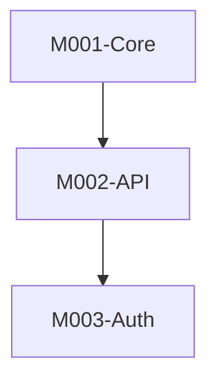

# Stage 4: SKILL.md 和洞察生成

## 阶段定义

**核心目标：** 使用 skill-creator 方法论生成最终的 SKILL.md，并创建 Insights.md 包含对项目的观察。

**输入依赖：**
- `Overview.md` (阶段1)
- `Architecture.md` (阶段1)
- `Guides.md` (阶段1)
- `Principles.md` (阶段1)
- `Modules.md` (阶段2)
- `modules/*.md` (阶段3)

**输出文件：**
- `SKILL.md` — 主技能文件
- `Insights.md` — LLM洞察

---

## 执行流程

### 4.1 生成 SKILL.md

**使用 skill-creator 方法论。**

#### 前置知识

阅读所有输入文件后，遵循以下原则：

1. **Frontmatter 必需字段**: `name` 和 `description`
   - `name`: skill名称（与目录名一致）
   - `description`: 触发条件，包含"Use when"和"Triggers"

2. **Body 原则**:
   - 简洁、面向操作的说明
   - 保持在 500 行以内
   - Progressive Disclosure：引用详细文档，不重复内容
   - 只包含 Claude 还不知道的信息

3. **结构要素**:
   - 何时使用此 skill（在 description 中，不在 body 中）
   - 快速参考（最重要的信息）
   - 导航到详细参考文档
   - 冲突解决优先级

#### 优先级规则

当文档与代码冲突时：
1. **代码是事实来源** — 优先遵循代码
2. **Principles.md** — 遵循已建立的模式
3. **Architecture.md** — 维护系统完整性
4. **Guides.md** — 遵循操作最佳实践

#### 输出模板

```markdown
---
name: {project-name}
description: |
  Development skill for {project_name} — {一句话描述}.
  Use when: (1) Understanding {project_name} architecture, (2) Implementing features in {project_name},
  (3) Debugging {project_name} issues, (4) Following {project_name} coding standards.
  Triggers: "{project_name}", "{project_keywords}", "working on {project_name}",
  "开发{project_name}", "{project_name}项目"
---

# {Project Name} Development Skill

为 {project_name} 提供开发指导 — {一行描述}。

## 快速开始

{项目主要入口点和运行方式}

```bash
{run_command}
```

## 架构概览

{一段摘要，链接到详细文档}

关键组件:
- **{Component1}**: {purpose} → [详情](references/modules/M001-{Component1}.md)
- **{Component2}**: {purpose} → [详情](references/modules/M002-{Component2}.md)

## 何时读什么

| 任务 | 阅读 |
|------|------|
| 了解项目 | [Overview](references/Overview.md) |
| 系统设计 | [Architecture](references/Architecture.md) |
| 模块结构 | [Modules](references/Modules.md) |
| 部署/配置 | [Guides](references/Guides.md) |
| 编码规范 | [Principles](references/Principles.md) |
| 深入分析 | [Module Detail](references/modules/M{id}-{name}.md) |

## 开发原则

{最重要的 3-5 个原则}

1. {principle}
2. {principle}
3. {principle}

## 模块地图



| 模块 | 用途 | 关键文件 |
|------|------|----------|
| M001-Core | {purpose} | `{path}` |

## 常见任务

### 添加新功能

1. {step 1}
2. {step 2}
3. {step 3}

### 修复 Bug

1. {step 1}
2. {step 2}
3. {step 3}

## GitNexus CLI

此项目可通过 GitNexus 进行深度代码分析（可选）：

```bash
# 索引项目
npx gitnexus analyze <project-path>

# 按概念查找代码
npx gitnexus query "auth validation" --repo {repo}

# 获取符号的 360° 视图
npx gitnexus context validateUser --repo {repo}

# 更改前检查影响
npx gitnexus impact FunctionName --direction upstream --repo {repo}
```

## 参考文件

- [Overview](references/Overview.md) — 项目概览
- [Architecture](references/Architecture.md) — 系统设计
- [Modules](references/Modules.md) — 模块分析
- [Guides](references/Guides.md) — 操作指南
- [Principles](references/Principles.md) — 编码规范
- [Insights](references/Insights.md) — 洞察

## 冲突解决优先级

文档与代码冲突时：
1. **代码是事实来源** — 优先遵循代码
2. **Principles** — 遵循已建立的模式
3. **Architecture** — 维护系统完整性
4. **Guides** — 遵循操作最佳实践
```

---

### 4.2 生成 Insights.md

#### 目的

LLM 对项目的观察 — 模式、潜在问题、建议。

#### 输出模板

```markdown
---
title: {项目名称} 洞察
version: 1.0
last_updated: YYYY-MM-DD
type: llm-insights
---

# {项目名称} 洞察

> 这些观察基于自动代码分析，突出模式、潜在问题和建议。

## 代码质量观察

### 正面模式 ✓

- **{pattern}**: {observation}
  - 文件: {files}

### 改进领域

- **{area}**: {observation}
  - 建议: {suggestion}
  - 文件: {files}

## 架构观察

### 优势

1. {strength}

### 潜在关注点

1. {concern}
   - 风险: {risk level}
   - 缓解: {suggestion}

## 技术债务指标

| 指标 | 严重度 | 文件 | 建议 |
|------|--------|------|------|
| {indicator} | {low/med/high} | {files} | {suggestion} |

## 模式分析

### 检测到的模式

| 模式 | 用途 | 置信度 | 文件 |
|------|------|--------|------|
| {pattern} | {description} | {high/med/low} | {files} |

### 缺失的模式

| 模式 | 会受益于 | 建议 |
|------|----------|------|
| {pattern} | {why} | {suggestion} |

## 推荐摘要

| 优先级 | 建议 | 影响 |
|--------|------|------|
| 高 | {recommendation} | {impact} |
| 中 | {recommendation} | {impact} |
| 低 | {recommendation} | {impact} |
```

---

## 验证

### SKILL.md 验证

- [ ] Frontmatter 包含 `name` 和 `description`
- [ ] `description` 包含触发条件
- [ ] Body 少于 500 行
- [ ] 所有引用链接有效
- [ ] 无绝对路径
- [ ] 开发原则已说明
- [ ] 冲突解决优先级已定义

### Insights.md 验证

- [ ] 观察具体（有文件引用）
- [ ] 建议可操作
- [ ] 风险等级已分配

## 完成检查清单

- [ ] SKILL.md 已按 skill-creator 指南生成
- [ ] SKILL.md 有正确的 frontmatter
- [ ] 所有引用链接指向现有文件
- [ ] 开发原则已清晰说明
- [ ] 模块地图已包含
- [ ] GitNexus CLI 用法已文档化
- [ ] Insights.md 已生成
- [ ] 所有输出已验证
