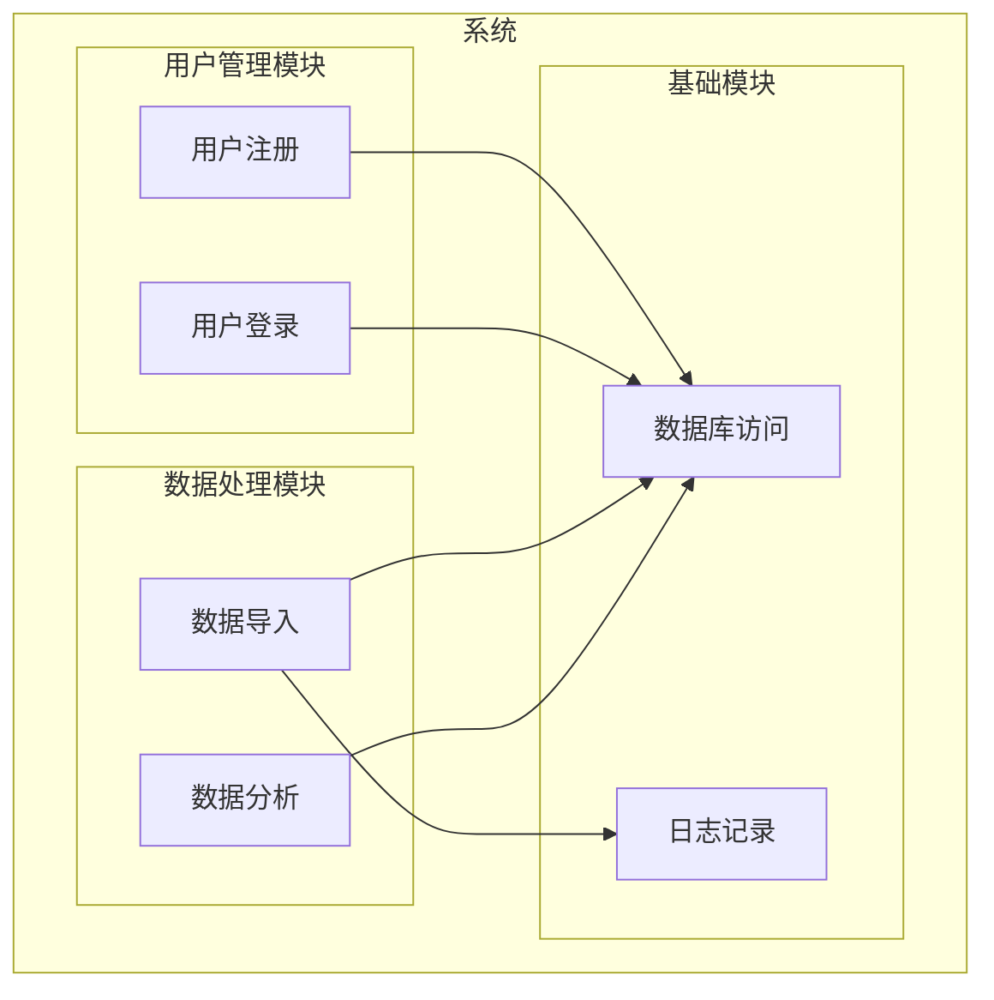

# defectCheckAndPatch Reference

## Current Phase: Defect Check and Patch

### 阶段定义

**执行者：** HAnalysis  
**核心目标：** 检查分析完整性，修补前几个阶段的输出，生成最终报告。

**输入依赖：**
- `./.hyper-designer/projectAnalysis/project-overview.md`（阶段1输出）
- `./.hyper-designer/projectAnalysis/function-tree.md`（阶段2输出）
- `./.hyper-designer/projectAnalysis/module-relationships.md`（阶段2输出）
- `./.hyper-designer/projectAnalysis/interface-contracts.md`（阶段3输出）
- `./.hyper-designer/projectAnalysis/data-flow.md`（阶段3输出）

---

### 1. 执行流程

#### 1.1 加载所有前3阶段输出

读取所有前3阶段的输出文件，建立完整的分析上下文。

#### 1.2 执行完整性检查

检查每个输出文件是否包含所有必需的内容：

| 检查项 | 检查内容 |
|--------|----------|
| 项目概览 | 基本信息、技术栈、目录结构、入口点 |
| 功能树 | 功能层次、功能依赖、功能到模块映射 |
| 模块关系 | 模块清单、模块依赖、模块接口 |
| 接口契约 | API清单、函数签名、参数说明、错误契约 |
| 数据流 | 数据模型、数据流图、数据转换、数据存储 |

#### 1.3 执行一致性检查

检查不同文件之间的内容是否一致：

| 检查项 | 检查内容 |
|--------|----------|
| 功能-模块映射 | 功能树中的模块引用是否与模块关系一致 |
| 接口-实现对应 | 接口契约中的模块引用是否与模块关系一致 |
| 数据流-接口对应 | 数据流中的接口引用是否与接口契约一致 |
| 依赖关系一致 | 不同文件中的依赖关系是否一致 |

#### 1.4 识别缺陷

**缺陷类型：**

| 类型 | 说明 | 严重性 |
|------|------|--------|
| 缺失组件 | 功能树或模块关系中缺少应有的条目 | HIGH |
| 缺失文件 | 引用的文件在代码库中不存在 | MEDIUM |
| 缺失API | 代码中存在的API没有在接口契约中记录 | HIGH |
| 缺失图表 | 缺少必要的Mermaid图表 | MEDIUM |
| 名称不一致 | 同一实体在不同文件中名称不同 | HIGH |
| 依赖不一致 | 依赖关系在不同文件中描述不同 | HIGH |
| 图表错误 | Mermaid图表语法错误 | MEDIUM |
| 引用无效 | 代码引用指向不存在的文件 | MEDIUM |

#### 1.5 修补输出

**修补策略：**

1. **直接修补**：在原文件中添加缺失内容
2. **交叉引用修补**：确保不同文件之间的引用一致
3. **图表修补**：补充缺失的图表或修复错误的图表

**修补记录：**
- 记录每个修补操作
- 说明修补原因
- 标记修补位置

#### 1.6 生成最终报告

---

### 2. 检查维度

#### 维度 1：完整性检查

**目的**：验证所有必需内容都已分析和记录。

**检查项：**
- [ ] 项目概览包含所有5个维度
- [ ] 功能树包含层次结构和依赖关系
- [ ] 模块关系包含清单和依赖
- [ ] 接口契约包含API清单和签名
- [ ] 数据流包含数据模型和流图

#### 维度 2：一致性检查

**目的**：验证不同文件之间的内容一致。

**检查项：**
- [ ] 功能到模块映射一致
- [ ] 接口到模块对应一致
- [ ] 数据流与接口对应一致
- [ ] 依赖关系描述一致

#### 维度 3：质量检查

**目的**：验证输出文件的质量。

**检查项：**
- [ ] YAML Front Matter 格式正确
- [ ] Mermaid 图表语法正确
- [ ] 代码引用有效
- [ ] 文档格式规范

---

### 3. 修补机制

#### 3.1 修补流程

```mermaid
graph TD
  start[开始修补] --> load[加载所有输出]
  load --> completeness[完整性检查]
  load --> consistency[一致性检查]
  load --> quality[质量检查]
  
  completeness --> defects[识别缺陷]
  consistency --> defects
  quality --> defects
  
  defects --> patch[执行修补]
  patch --> verify[验证修补]
  verify --> report[生成报告]
  report --> end[结束]
```

#### 3.2 修补规则

1. **最小修补原则**：只修补必要的内容，不改变原有结构
2. **一致性原则**：确保修补后的内容与原有内容一致
3. **可追溯原则**：记录所有修补操作

#### 3.3 修补示例

**场景：功能树中缺少某个功能**

修补操作：
1. 在功能树的功能说明表格中添加新行
2. 更新功能层次图
3. 在最终报告中记录此修补

**场景：模块关系与接口契约不一致**

修补操作：
1. 确定正确的模块名称
2. 更新接口契约中的模块引用
3. 在最终报告中记录此修补

---

### 4. 输出文件规格

#### 4.1 analysis-report.md — 最终分析报告

**路径**：`./.hyper-designer/projectAnalysis/analysis-report.md`

**必需章节结构：**

```markdown
---
title: 最终分析报告
version: 1.0
last_updated: YYYY-MM-DD
type: analysis-report
sections:
  - summary
  - completeness_check
  - consistency_check
  - defects_found
  - patches_applied
  - final_status
  - architecture_diagram
---

# 最终分析报告

## 分析摘要

- 项目名称: {name}
- 分析时间: {time}
- 分析阶段: 4
- 总体状态: {status}

## 完整性检查

### 检查结果

| 检查项 | 状态 | 描述 |
|--------|------|------|
| 项目概览 | ✅/❌ | {description} |
| 功能树 | ✅/❌ | {description} |
| 模块关系 | ✅/❌ | {description} |
| 接口契约 | ✅/❌ | {description} |
| 数据流 | ✅/❌ | {description} |

### 缺失项

| 缺失项 | 严重性 | 描述 |
|--------|--------|------|
| {item} | {severity} | {description} |

## 一致性检查

### 检查结果

| 检查项 | 状态 | 描述 |
|--------|------|------|
| 功能-模块映射 | ✅/❌ | {description} |
| 接口-实现对应 | ✅/❌ | {description} |
| 数据流-接口对应 | ✅/❌ | {description} |

### 不一致项

| 不一致项 | 严重性 | 描述 |
|----------|--------|------|
| {item} | {severity} | {description} |

## 发现的缺陷

| 缺陷ID | 缺陷类型 | 严重性 | 描述 | 影响范围 |
|--------|----------|--------|------|----------|
| D001 | {type} | {severity} | {description} | {scope} |

## 修补说明

### 修补的文件

| 文件 | 修补内容 | 修补原因 |
|------|----------|----------|
| {file} | {content} | {reason} |

### 修补详情

#### 缺陷: {defect_id}

- **问题**: {problem}
- **修补**: {patch}
- **验证**: {verification}

## 最终状态

- 修补完成: {completed}
- 剩余缺陷: {remaining}
- 建议: {suggestion}

## 完整的项目架构图



## AI开发参考

### 快速定位

- **查找功能实现**: 参考 `function-tree.md` 中的功能到模块映射
- **了解模块依赖**: 参考 `module-relationships.md` 中的模块依赖图
- **调用API**: 参考 `interface-contracts.md` 中的API清单
- **追踪数据流**: 参考 `data-flow.md` 中的数据流图

### 新增功能指南

1. 在 `function-tree.md` 中添加新功能条目
2. 在 `module-relationships.md` 中更新模块关系
3. 在 `interface-contracts.md` 中添加新接口
4. 在 `data-flow.md` 中更新数据流
```

---

### 5. 完成检查清单

在完成 Stage 4 之前，验证：

- [ ] 所有前3阶段输出已读取
- [ ] 完整性检查已执行并记录结果
- [ ] 一致性检查已执行并记录结果
- [ ] 所有缺陷已识别并记录
- [ ] 所有可修补的缺陷已修补
- [ ] 修补操作已记录在最终报告中
- [ ] `analysis-report.md` 已生成，包含YAML Front Matter
- [ ] 完整的项目架构图已包含
- [ ] AI开发参考指南已包含

---

### 6. 反模式

**禁止：**
- 跳过完整性或一致性检查
- 不记录修补操作
- 修补后不验证
- 遗留HIGH严重性缺陷不报告

**应该：**
- 系统性地执行所有检查
- 详细记录每个缺陷和修补
- 修补后验证一致性
- 在最终报告中提供清晰的状态总结
