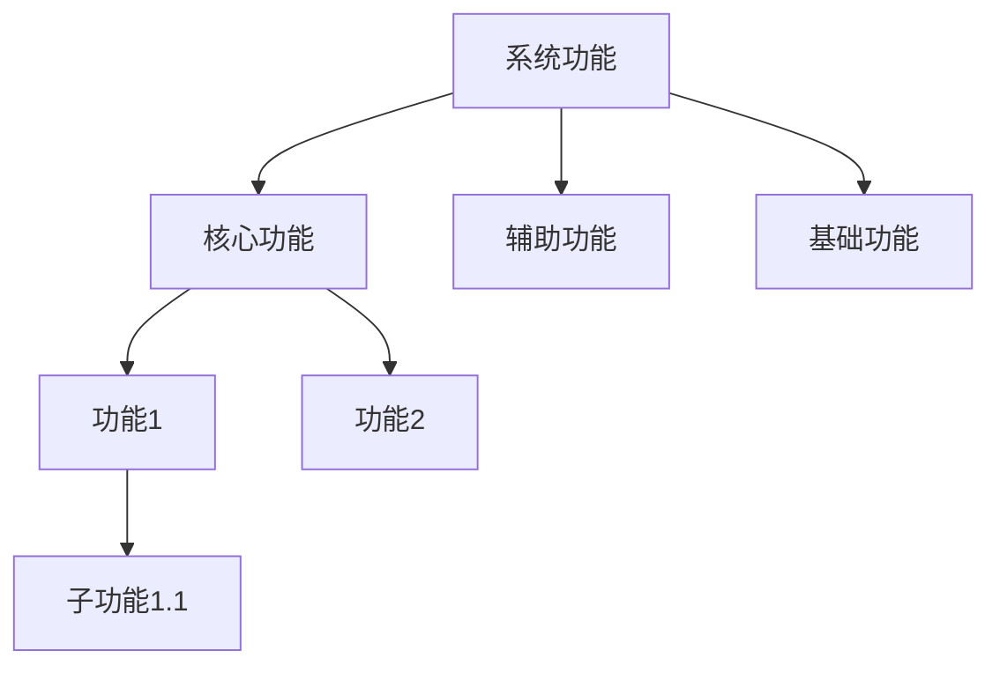

# functionTreeAndModule Reference

## Current Phase: Function Tree and Module

### 阶段定义

**执行者：** HAnalysis  
**核心目标：** 建立功能树，分析模块关系。

**输入依赖：**
- `./.hyper-designer/projectAnalysis/project-overview.md`（阶段1输出）

---

### 1. 执行流程

#### 1.1 加载项目概览

从 `project-overview.md` 读取项目信息，了解：
- 项目类型和技术栈
- 目录结构和组织方式
- 入口点和配置文件

**关键约束：**
- `project-overview.md` 是项目基础的唯一事实来源
- 禁止重新扫描项目目录来发现信息
- 使用项目概览中的信息指导功能和模块发现

#### 1.2 建立功能树

**功能识别规则：**

| 规则 | 说明 |
|------|------|
| **入口点追踪** | 从主入口开始，识别主要功能流程 |
| **API分析** | 从API定义中识别对外提供的功能 |
| **配置分析** | 从配置文件中识别功能开关 |
| **测试分析** | 从测试用例中识别系统功能 |

**功能分类：**
- **核心功能**：系统的主要业务功能
- **辅助功能**：支持核心功能的辅助功能
- **基础功能**：系统运行所需的基础功能

**功能依赖分析：**
- 调用依赖：一个功能调用另一个功能
- 数据依赖：一个功能的输出是另一个功能的输入
- 时序依赖：一个功能必须在另一个功能之后执行

#### 1.3 分析模块关系

**模块识别规则：**

| 规则 | 说明 |
|------|------|
| **目录边界** | 基于目录结构识别模块边界 |
| **职责聚合** | 将相关功能聚合到同一模块 |
| **接口边界** | 以公开接口为模块边界 |
| **依赖隔离** | 低耦合的代码应分为不同模块 |

**模块依赖分析：**
- 直接依赖：模块A直接调用模块B
- 间接依赖：模块A通过模块C调用模块B
- 循环依赖：模块A和模块B互相依赖（需标记警告）

#### 1.4 生成输出文件

---

### 2. 功能树维度

#### 维度 1：功能层次结构

**目的**：理解功能的组织方式和层次关系。

**分析重点：**
- 功能的父子关系
- 功能的粒度层次
- 功能的职责边界

**必需输出：**
- 功能层次图（Mermaid `graph TD`）
- 功能说明表格

#### 维度 2：功能依赖关系

**目的**：理解功能之间的依赖关系。

**分析重点：**
- 功能调用关系
- 功能数据依赖
- 功能时序依赖

**必需输出：**
- 功能依赖图（Mermaid `graph LR`）
- 依赖说明表格

#### 维度 3：功能到模块映射

**目的**：理解功能如何映射到实现模块。

**分析重点：**
- 功能的实现位置
- 功能与模块的对应关系
- 跨模块功能的实现方式

**必需输出：**
- 功能到模块映射表格

---

### 3. 模块关系维度

#### 维度 1：模块清单

**目的**：识别和分类项目中的所有模块。

**必需输出：**
- 模块清单表格

#### 维度 2：模块依赖关系

**目的**：理解模块之间的依赖关系。

**必需输出：**
- 模块依赖图（Mermaid `graph LR`）
- 依赖说明表格

#### 维度 3：模块接口清单

**目的**：记录模块对外提供的接口。

**必需输出：**
- 模块接口表格

#### 维度 4：模块间数据流

**目的**：理解模块之间的数据流动。

**必需输出：**
- 模块间数据流图（Mermaid `graph LR`）

---

### 4. 输出文件规格

#### 4.1 function-tree.md — 功能树

**路径**：`./.hyper-designer/projectAnalysis/function-tree.md`

**必需章节结构：**

```markdown
---
title: 功能树
version: 1.0
last_updated: YYYY-MM-DD
type: function-tree
sections:
  - function_hierarchy
  - function_dependencies
  - function_to_module_mapping
---

# 功能树

## 功能层次结构



### 功能说明
| 功能ID | 功能名称 | 功能类型 | 描述 | 父功能 | 子功能 |
|--------|----------|----------|------|--------|--------|
| F001 | {name} | {type} | {description} | {parent} | {children} |

## 功能依赖关系


### 依赖说明
| 功能 | 依赖功能 | 依赖类型 | 描述 |
|------|----------|----------|------|
| {function} | {dependency} | {type} | {description} |

## 功能到模块映射

| 功能ID | 功能名称 | 模块ID | 模块名称 | 文件路径 |
|--------|----------|--------|----------|----------|
| F001 | {function} | M001 | {module} | {path} |
```

#### 4.2 module-relationships.md — 模块关系

**路径**：`./.hyper-designer/projectAnalysis/module-relationships.md`

**必需章节结构：**

```markdown
---
title: 模块关系
version: 1.0
last_updated: YYYY-MM-DD
type: module-relationships
sections:
  - module_list
  - module_dependencies
  - module_interfaces
  - data_flow
---

# 模块关系

## 模块清单

| 模块ID | 模块名称 | 描述 | 路径 | 类型 |
|--------|----------|------|------|------|
| M001 | {name} | {description} | {path} | {type} |

## 模块依赖关系


### 依赖说明
| 模块 | 依赖模块 | 依赖类型 | 描述 |
|------|----------|----------|------|
| {module} | {dependency} | {type} | {description} |

## 模块接口清单

| 模块ID | 接口名称 | 接口类型 | 描述 |
|--------|----------|----------|------|
| M001 | {interface} | {type} | {description} |

## 模块间数据流


```

---

### 5. 完成检查清单

在完成 Stage 2 之前，验证：

- [ ] 已读取 `project-overview.md` 作为项目基础
- [ ] 功能树已建立，包含层次结构和依赖关系
- [ ] 模块关系已分析，包含依赖和接口
- [ ] `function-tree.md` 已生成，包含YAML Front Matter
- [ ] `module-relationships.md` 已生成，包含YAML Front Matter
- [ ] 功能到模块映射已建立
- [ ] Mermaid 图表已包含且有效
- [ ] 所有交叉引用已验证

---

### 6. 反模式

**禁止：**
- 在 Stage 2 期间重新扫描项目目录
- 跳过功能依赖分析
- 忽略循环依赖标记
- 功能和模块边界模糊

**应该：**
- 将 `project-overview.md` 视为事实来源
- 系统性地分析功能和模块
- 标记所有依赖关系
- 在声明 Stage 2 完成前验证所有输出文件
