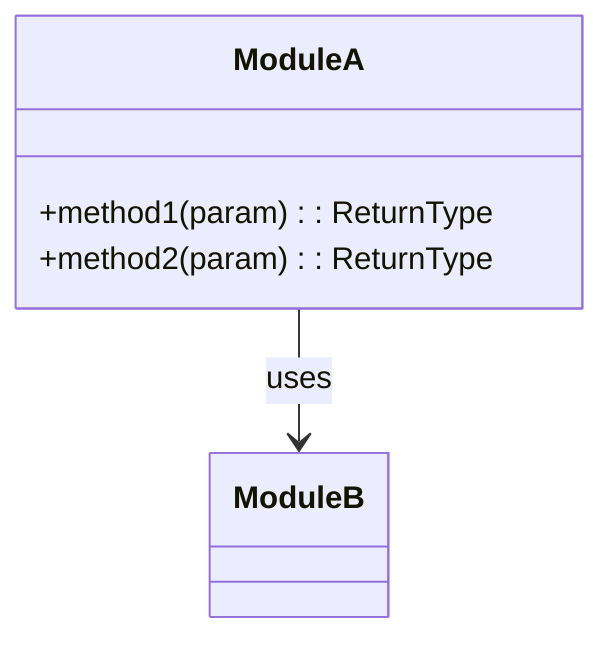
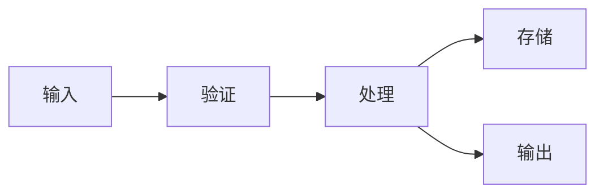

# interfaceAndDataFlow Reference

## Current Phase: Interface and Data Flow

### 阶段定义

**执行者：** HAnalysis  
**核心目标：** 分析接口契约和数据流。

**输入依赖：**
- `./.hyper-designer/projectAnalysis/function-tree.md`（阶段2输出）
- `./.hyper-designer/projectAnalysis/module-relationships.md`（阶段2输出）

---

### 1. 执行流程

#### 1.1 加载功能树和模块关系

从阶段2的输出读取信息：
- 功能树：了解功能分类和依赖
- 模块关系：了解模块清单和接口

**关键约束：**
- `function-tree.md` 和 `module-relationships.md` 是唯一事实来源
- 禁止重新扫描项目目录来发现接口
- 使用模块关系中的接口清单指导详细分析

#### 1.2 并行探索（推荐委派）

本阶段的探索任务适合并行委派给 subagent：

| 探索任务 | 目标 |
|----------|------|
| API接口分析 | 分析路由定义、控制器、函数签名 |
| 数据模型分析 | 识别实体定义、数据结构 |
| 数据流追踪 | 追踪数据从输入到存储的路径 |

**委派示例：**
- 任务1：分析路由文件，提取所有 REST API 端点和签名
- 任务2：扫描类型定义文件，识别数据模型和实体
- 任务3：追踪数据处理流程，建立数据流图

**并行执行：** 同时发起上述任务，继续处理其他非重叠工作。

#### 1.3 分析接口契约

**接口识别规则：**

| 接口类型 | 识别方式 |
|----------|----------|
| **REST API** | HTTP端点、路由定义、控制器 |
| **Library API** | 公开导出的函数、类、接口 |
| **Event API** | 事件发射器、消息队列 |
| **RPC API** | gRPC服务、Thrift服务 |

**接口分析维度：**
- 输入参数和验证规则
- 返回类型和错误处理
- 调用示例和使用场景

#### 1.4 分析数据流

**数据流分析维度：**
- 数据模型定义
- 数据转换过程
- 数据存储位置
- 数据流动路径

#### 1.5 综合并生成输出

收集 subagent 的探索结果，综合分析并生成：
- 接口契约文档
- 数据流文档

---

### 2. 接口契约维度

#### 维度 1：API 清单

**目的**：记录项目中的所有API接口。

**分析重点：**
- REST端点和路由
- 函数签名和参数
- 返回值和异常

**必需输出：**
- API清单表格
- 函数签名表格

#### 维度 2：参数说明

**目的**：详细说明每个接口的参数。

**分析重点：**
- 参数类型和约束
- 必需/可选参数
- 默认值和验证规则

**必需输出：**
- 参数说明表格

#### 维度 3：错误契约

**目的**：记录接口的错误处理方式。

**分析重点：**
- 错误码定义
- 错误消息格式
- 错误处理建议

**必需输出：**
- 错误契约表格

---

### 3. 数据流维度

#### 维度 1：数据模型

**目的**：记录系统中的数据模型定义。

**分析重点：**
- 实体定义
- 数据结构
- 类型定义

**必需输出：**
- 数据模型表格

#### 维度 2：数据流图

**目的**：展示数据在系统中的流动过程。

**分析重点：**
- 数据输入点
- 数据处理过程
- 数据输出点

**必需输出：**
- 数据流图（Mermaid `graph LR`）
- 数据流说明表格

#### 维度 3：数据转换

**目的**：记录数据在处理过程中的转换。

**分析重点：**
- 数据格式转换
- 数据映射关系
- 数据验证规则

**必需输出：**
- 数据转换表格

#### 维度 4：数据存储

**目的**：记录数据的持久化方式。

**分析重点：**
- 数据库表/集合
- 文件存储
- 缓存策略

**必需输出：**
- 数据存储表格

---

### 4. 输出文件规格

#### 4.1 interface-contracts.md — 接口契约

**路径**：`./.hyper-designer/projectAnalysis/interface-contracts.md`

**必需章节结构：**

```markdown
---
title: 接口契约
version: 1.0
last_updated: YYYY-MM-DD
type: interface-contracts
sections:
  - api_catalog
  - function_signatures
  - parameter_details
  - error_contracts
---

# 接口契约

## API 清单

| API ID | API 名称 | 类型 | 模块 | 路径 | 签名 |
|--------|----------|------|------|------|------|
| A001 | {name} | {type} | {module} | {path} | {signature} |

## 函数签名

### 模块: {module_name}

| 函数名 | 参数 | 返回值 | 异常 | 描述 |
|--------|------|--------|------|------|
| {function} | {params} | {return} | {exceptions} | {description} |

### 接口图



## 参数说明

| 函数 | 参数名 | 类型 | 必需 | 默认值 | 描述 |
|------|--------|------|------|--------|------|
| {function} | {param} | {type} | {required} | {default} | {description} |

## 错误契约

| 错误码 | 错误名称 | 描述 | 处理建议 |
|--------|----------|------|----------|
| E001 | {name} | {description} | {suggestion} |
```

#### 4.2 data-flow.md — 数据流

**路径**：`./.hyper-designer/projectAnalysis/data-flow.md`

**必需章节结构：**

```markdown
---
title: 数据流
version: 1.0
last_updated: YYYY-MM-DD
type: data-flow
sections:
  - data_models
  - data_flow_diagrams
  - data_transformations
  - data_storage
---

# 数据流

## 数据模型

| 模型ID | 模型名称 | 字段 | 描述 |
|--------|----------|------|------|
| D001 | {name} | {fields} | {description} |

## 数据流图



### 数据流说明
| 来源 | 目标 | 数据 | 描述 |
|------|------|------|------|
| {source} | {target} | {data} | {description} |

## 数据转换

| 转换ID | 输入 | 输出 | 描述 |
|--------|------|------|------|
| T001 | {input} | {output} | {description} |

## 数据存储

| 存储ID | 类型 | 位置 | 描述 |
|--------|------|------|------|
| S001 | {type} | {location} | {description} |
```

---

### 5. 完成检查清单

在完成 Stage 3 之前，验证：

- [ ] 已读取 `function-tree.md` 和 `module-relationships.md`
- [ ] 接口契约已分析，包含API清单和函数签名
- [ ] 数据流已分析，包含数据模型和流图
- [ ] `interface-contracts.md` 已生成，包含YAML Front Matter
- [ ] `data-flow.md` 已生成，包含YAML Front Matter
- [ ] Mermaid 图表已包含且有效
- [ ] 接口到模块映射已建立
- [ ] 所有交叉引用已验证

---

### 6. 反模式

**禁止：**
- 在 Stage 3 期间重新扫描项目目录
- 跳过接口参数分析
- 忽略错误契约
- 数据流图过于简化

**应该：**
- 将阶段2输出视为事实来源
- 系统性地分析所有接口
- 详细记录数据转换过程
- 在声明 Stage 3 完成前验证所有输出文件
