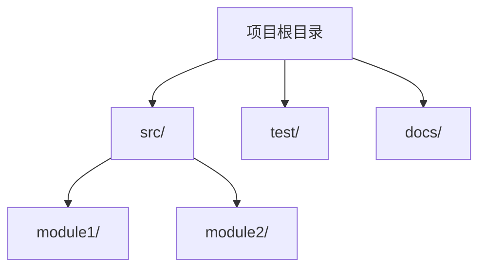

# projectOverview Reference

## Current Phase: Project Overview

### 阶段定义

**执行者：** HAnalysis  
**核心目标：** 建立项目的基础认知，生成项目概览和目录结构。

**输入依赖：**

- 用户提供的目标项目绝对路径

---

### 1. 执行流程

#### 1.1 建立分析上下文

采用系统架构师身份，向用户收集目标项目信息：

- **目标项目路径**：项目的绝对路径
- **项目领域**：项目的业务领域和用途
- **分析范围**：分析整个代码库还是特定模块

#### 1.2 扫描分析边界

在深入分析之前，确定分析范围：

**排除目录：**

- `node_modules/`, `.git/`, `dist/`, `build/`, `coverage/`, `.next/`, `.nuxt/`

**排除文件模式：**

- `*.min.js`, `*.min.css`, `*.map`, `*.lock`, `package-lock.json`, `yarn.lock`

#### 1.3 并行探索（推荐委派）

本阶段的探索任务适合并行委派给 subagent：

| 探索任务 | 目标 |
|----------|------|
| 目录结构扫描 | 获取完整的目录树和文件分布 |
| 技术栈识别 | 分析 package.json、配置文件等 |
| 入口点定位 | 找到主要入口文件和启动流程 |

**委派示例：**

- 任务1：扫描目录结构，返回目录树和各目录用途
- 任务2：分析依赖文件，识别技术栈和框架
- 任务3：定位入口点，理解启动流程

**并行执行：** 同时发起上述任务，不要串行等待。

#### 1.4 综合分析结果

收集 subagent 的探索结果，综合分析5个维度：

1. **项目基本信息**：名称、描述、类型
2. **技术栈识别**：语言、框架、依赖
3. **目录结构分析**：目录组织、用途说明
4. **入口点定位**：主入口、其他入口
5. **配置文件分析**：配置文件清单和用途

#### 1.4 生成输出文件

---

### 2. 输出文件规格

#### 2.1 project-overview.md — 项目概览

**路径**：`./.hyper-designer/projectAnalysis/project-overview.md`

**必需章节结构：**

```markdown
---
title: 项目概览
version: 1.0
last_updated: YYYY-MM-DD
type: project-overview
sections:
  - basic_info
  - tech_stack
  - directory_structure
  - entry_points
  - configuration
---

# 项目概览

## 基本信息
- 项目名称: {name}
- 项目描述: {description}
- 主要语言: {language}
- 项目类型: {type}
- 项目规模: {规模描述}

## 技术栈

### 语言
| 语言 | 版本 | 用途 |
|------|------|------|
| {language} | {version} | {purpose} |

### 框架
| 框架 | 版本 | 用途 |
|------|------|------|
| {framework} | {version} | {purpose} |

### 主要依赖
| 名称 | 版本 | 用途 |
|------|------|------|
| {dep} | {version} | {purpose} |

## 目录结构



### 目录说明

| 目录 | 用途 | 关键文件 |
|------|------|----------|
| src/ | 源代码目录 | {key_files} |
| test/ | 测试代码目录 | {key_files} |

## 入口点

### 主入口

- 文件: {entry_file}
- 函数: {entry_function}
- 描述: {description}

### 其他入口

| 文件 | 函数 | 描述 |
|------|------|------|
| {file} | {function} | {description} |

## 配置文件

| 文件 | 用途 |
|------|------|
| {config_file} | {purpose} |

```

---

### 3. 完成检查清单

在完成 Stage 1 之前，验证：

- [ ] 目标项目路径已确认且可访问
- [ ] 分析边界已明确定义（排除/包含）
- [ ] 所有5个维度已分析并记录
- [ ] `project-overview.md` 已生成，包含YAML Front Matter
- [ ] Mermaid 目录结构图已包含且有效
- [ ] 代码引用使用相对路径
- [ ] 所有 Markdown 文件格式正确，可读性强

---

### 4. 反模式

**禁止：**
- 跳过任何分析维度
- 未分析实际源代码就生成输出
- 使用绝对路径
- 忽略配置文件分析

**应该：**
- 系统性地分析所有5个维度
- 生成人类可读的 Markdown 报告
- 建立清晰的目录结构说明
- 记录框架特定的模式和约定
- 在声明 Stage 1 完成前验证输出文件
