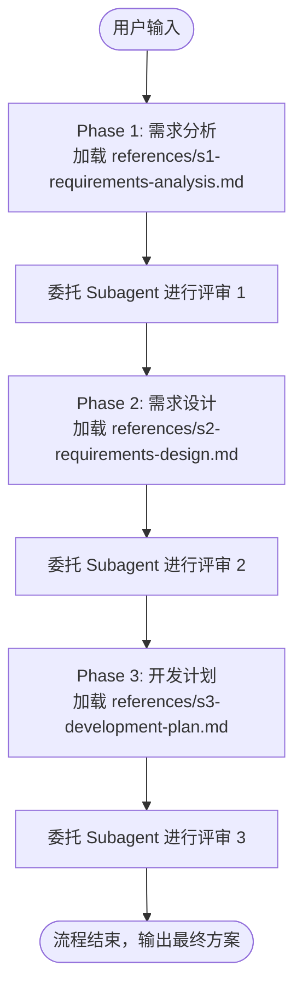
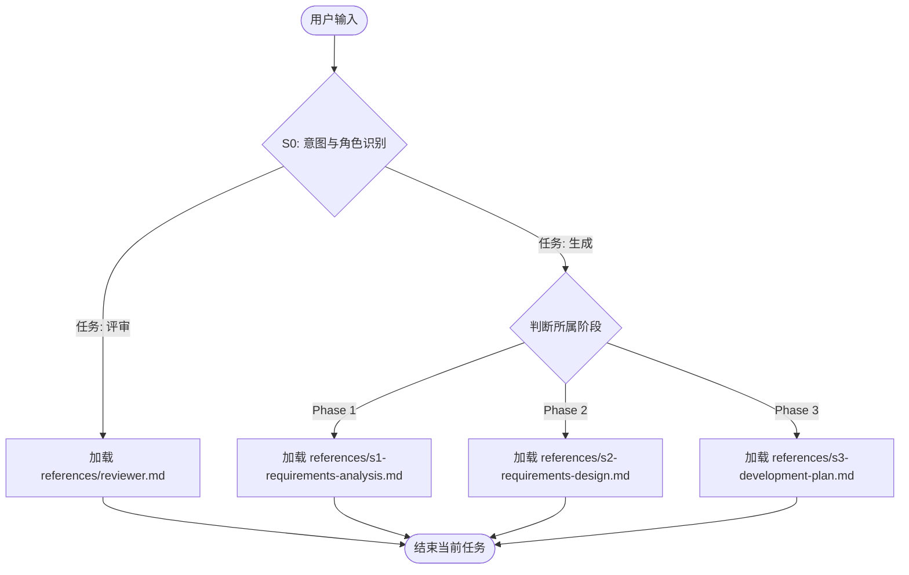

# Requirements Designer

三步轻量化软件设计工作流。专为中小型新功能开发或现有功能增强量身打造，确保需求可落地、架构无技术债。

### 阶段定义

| 阶段 | 名称 | 简介 |
|:---:|:---:|:---|
| **Phase 1** | 需求分析 | 深入理解需求本质，通过苏格拉底式对话澄清目标、用户、场景、边界与约束，识别真实诉求与隐含前提。核心在于：**明确“要做什么、为谁而做，以及做到什么程度”**。 |
| **Phase 2** | 需求设计 | 将初始需求逐层拆解为 **SR（系统需求）→ AR（分配需求）**，明确需求如何融入现有系统；梳理项目的黄金原则、工程约束与实现风格；细化模块、功能、文件层面的增删改及其依赖关系与接口设计，避免引入技术债。同时完成新需求的功能设计、设计模式选型与DFx设计。核心在于：**将需求转化为可落地、可集成、可演进的系统方案**。 |
| **Phase 3** | SDD 开发计划 | 基于设计说明书，结合耦合关系与依赖顺序，将AR进一步拆解为具体开发任务、实施步骤与验收标准，形成可直接交付给开发 Agent 执行的开发计划。核心在于：**把系统设计转化为可执行、可验证、可交付的实施清单**。 |

---

## 执行协议 (Execution Protocols)

本 Skill 支持两种运行协议，每次调用**仅能选择其中一种**执行。

### 1. Pipeline Protocol (全链路端到端模式)
适用于用户要求完整经历“需求->设计->计划”全流程的场景。
- **机制**：严格按 P1 -> P2 -> P3 顺序执行。
- **强制约束**：每个阶段生成产出物后，**必须暂停当前生成任务**，委托评审 Subagent 进行交叉 Review。Review 通过后方可进入下一阶段。

### 2. Router Protocol (单点路由模式)
适用于明确仅需执行某一特定阶段任务（生成或评审）的场景。
- **机制**：解析用户意图，精准路由至对应阶段，按需加载单点资源。
- **强制约束**：该模式下单次对话仅执行单阶段、单任务，严禁擅自跨阶段生成。

---

## 阶段执行指令 (Execution Steps)

### S0 意图识别 (Router/Orchestrator)
- **分析判断**：当前用户是要**生成**某个阶段的产出物？还是对已有产出物进行**评审**？亦或是要完整执行 **Pipeline 工作流**？
- **动作执行**：根据判断结果，严格遵循对应的 Protocol 和进入后续的 S1~S4 步骤。

### S1 需求分析 (Phase 1)
- **[!! 强制前置动作 !!]**：必须读取并遵循 `references/s1-requirements-analysis.md` 中的规范。若读取失败，立即停止并报错。
- **输出交付物**：需求分析说明书

### S2 需求设计 (Phase 2)
- **[!! 强制前置动作 !!]**：必须读取并遵循 `references/s2-requirements-design.md` 中的规范。若读取失败，立即停止并报错。
- **输出交付物**：需求设计说明书

### S3 开发计划 (Phase 3)
- **[!! 强制前置动作 !!]**：必须读取并遵循 `references/s3-development-plan.md` 中的规范。若读取失败，立即停止并报错。
- **输出交付物**：开发计划

### S4 评审 (Review)
- **角色隔离原则**：当前作为“设计师”主干 Agent 时，**禁止**读取评审参考文件，必须委派（Delegate）评审员 Subagent 执行此动作。
- **[!! 强制前置动作 !!]**：承担评审任务的 Agent 必须读取并遵循 `references/reviewer.md`。若读取失败，立即停止并报错。
- **输出交付物**：打分结果与具体的改进意见。