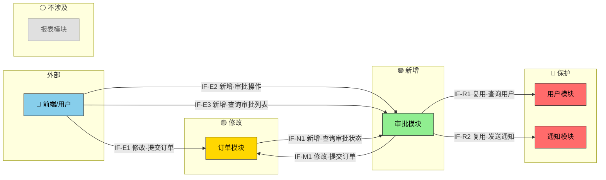
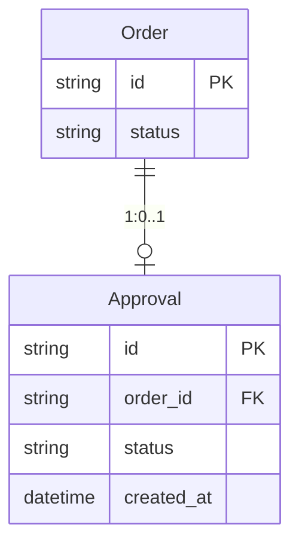

## §1 概要

| 信息 | 内容 |
|------|------|
| **名称** | [与需求分析说明书一致] |
| **描述** | [设计层面一句话描述] |
| **输入来源** | 需求分析说明书 [路径/版本] |
| **项目类型** | 功能增强 / 新功能 / 重构 |

---

## §2 设计目标

### 2.1 性能目标

| 指标 | 目标值 | 测量条件 | 来源 |
|------|--------|----------|------|
| [关键操作] 响应时间 | P95 < [N]ms | [并发条件] | 需求分析 §x |
| [后台任务] 完成时间 | < [N]s | [数据规模] | 需求分析 §x |

**模块分解**：

```
系统级目标：[目标描述] P95 < [N]ms

| 模块 | 时间分配 | 分解依据 |
|------|--------|------|
| [模块A] | [N]ms | [承担的处理环节] |

假设条件：
- [假设1]
- [假设2]
```

### 2.2 可用性目标

| 指标 | 目标值 | 说明 |
|------|--------|------|
| 可用性 | ≥ [N]% | [说明] |
| RTO | < [N]min | [说明] |
| RPO | < [N]min | [说明] |

---

## §3 架构设计

### 3.1 架构变更总览



> 🔵外部用户 🟢新增 🟡修改 🔴保护（涉及该模块配合，但禁止修改） ⚪不涉及
>
> - 🔴 保护 = 图中**有箭头指向它**（被新增/修改模块调用），但本迭代**冻结代码与接口**。
> - ⚪ 不涉及 = 图中**无任何箭头**，与本次变更完全无关，仅为上下文展示系统全貌。
>

---

### 3.2 模块变更明细

| 状态 | 模块 | 变更描述 | 约束 |
|------|------|----------|------|
| 🟢 新增 | 审批模块 | 新增审批流引擎 | — |
| 🟡 修改 | 订单模块 | 提交接口增加审批拦截 | 仅改提交流程，查询/退款不动 |
| 🔴 保护 | 用户模块 | 被审批模块复用 `GET /users/{id}`，不允许修改 | 跨团队共用，本迭代保护 |
| 🔴 保护 | 通知模块 | 被审批模块复用 `POST /notify/send`，不允许修改 | 公共基础服务，本迭代保护 |
| ⚪ 不涉及 | 报表模块 | 无任何接口关联 | — |

---

### 3.3 接入关系与模块接口变更

#### 3.3.1 内部接口 — 新模块消费老系统

| 编号 | 变更类型 | 接口名称 | 提供方 | 用途 | 备注 |
|------|----------|----------|--------|------|------|
| IF-R1 | ⚪ 复用 | `GET /users/{id}` | 用户模块 | 获取审批人信息 | 无需改动 |
| IF-R2 | ⚪ 复用 | `POST /notify/send` | 通知模块 | 审批结果通知 | 无需改动 |
| IF-M1 | 🟡 修改 | `POST /orders/submit` | 订单模块 | 提交前插入审批校验 | 需改签名，见下方定义 |

#### 3.3.2 内部接口 — 老系统消费新模块

| 编号 | 变更类型 | 接口名称 | 消费方 | 用途 | 备注 |
|------|----------|----------|--------|------|------|
| IF-N1 | 🟢 新增 | `GET /approvals/{id}` | 订单模块 | 订单详情页展示审批状态 | — |
| IF-N2 | 🟢 新增 | `POST /approvals` | 订单模块 | 提交时发起审批 | — |

#### 3.3.3 外部接口 — 用户/前端 → 系统

| 编号 | 变更类型 | 接口名称 | 提供方 | 触发方 | 用途 | 备注 |
|------|----------|----------|--------|--------|------|------|
| IF-E1 | 🟡 修改 | `POST /orders/submit` | 订单模块 | 用户（前端） | 用户提交订单，新增审批拦截 | 页面增加审批状态提示 |
| IF-E2 | 🟢 新增 | `POST /approvals/{id}/decide` | 审批模块 | 审批人（前端） | 审批人通过/驳回 | 需鉴权：仅指定审批人可操作 |
| IF-E3 | 🟢 新增 | `GET /approvals?assignee={uid}` | 审批模块 | 审批人（前端） | 查询待办审批列表 | 支持分页、状态筛选 |

---

### 3.4 接口定义（仅新增/修改）

```
IF-M1  提交订单（修改·内部）
  类型：REST    提供方：订单模块    消费方：审批模块
  变更内容：
    - 原签名：POST /orders/submit  body: { orderId }
    - 新签名：POST /orders/submit  body: { orderId, approvalId? }
    - 变更点：新增可选参数 approvalId，已审批则跳过拦截
  向后兼容：是（approvalId 可选，旧调用方不受影响）
  SLA：P95 < 200ms
```

```
IF-N1  查询审批状态（新增）
  类型：REST    提供方：审批模块    消费方：订单模块
  输入：approvalId: string — 审批单ID
  输出：{ status: enum(pending|approved|rejected), updatedAt: datetime }
  SLA：P95 < 100ms
  约束：幂等，支持轮询
```

---

### 3.5 技术债与兼容性风险

| 风险项 | 涉及接口 | 描述 | 缓解措施 |
|--------|----------|------|----------|
| 旧版客户端未传 approvalId | IF-M1 | 旧调用方无审批流程 | approvalId 可选，灰度期双通道并行 |
| 审批模块不可用 | IF-N2 | 订单提交被阻塞 | 降级开关：审批模块超时则自动放行 |

---

### 3.6 数据模型变更



| 变更类型 | 实体 | 变更描述 | 兼容性 |
|----------|------|----------|--------|
| 🟢 新增 | Approval | 审批单（id, order_id, status, created_at） | 无影响 |
| ⚪ 不涉及 | Order | 不新增字段，通过 Approval 关联查询 | — |

---

### 3.7 功能树变更

```
订单系统
├── 订单管理
│   ├── 订单查询
│   └── 🟡 订单提交（修改：增加审批拦截）
├── 用户管理（保护）
├── 通知服务
└── 🟢 审批管理（新增）
    ├── 发起审批
    ├── 审批处理
    └── 审批状态查询
```

| 变更类型 | 功能节点 | 父节点 | 说明 | 对应需求 |
|----------|----------|--------|------|----------|
| 🟢 新增 | 审批管理 | 订单系统 | 新增审批流引擎 | SR-001 |
| 🟡 修改 | 订单提交 | 订单管理 | 提交前增加审批校验 | SR-002 |

---

## §4 设计模式

### 4.1 现有模式识别

| 设计模式 | 使用位置 | 说明 |
|----------|---------|------|
| [如 Strategy] | [模块/类名] | [如何使用] |

### 4.2 新增模式选型

| 设计模式 | 应用位置 | 选型理由 | 与现有模式一致性 |
|----------|---------|----------|-----------------|
| [如 Adapter] | [修改模块Y] | [对接保护模块旧接口] | [一致性说明] |

**复杂模式展开**（按需）：

```
模式：[模式名称]
应用位置：[模块/类]
问题：[要解决的具体问题]
结构：
  ├── [角色1]：[对应类/接口]
  ├── [角色2]：[对应类/接口]
  └── [角色3]：[对应类/接口]
约束：[注意事项]
```

---

## §5 SR-AR 分解与追溯

### 5.1 SR 列表

| SR 编号 | 名称 | 描述 | 对应场景 | 覆盖功能 |
|---------|------|------|----------|----------|
| SR-001 | [名称] | [1-2 句描述] | [场景名] | F-01, F-02 |

### 5.2 AR 分配

---

**SR-001：[SR 名称]**

| AR 编号 | 名称 | 系统元素 | 操作类型 |
|---------|------|---------|----------|
| AR-001-01 | [名称] | [模块名] | 新增/扩展/依赖 |

**AR-001-01 详细**：

- **描述**：[核心目标，1-2 句]
- **功能点**：
  - [ ] [功能点 1]
  - [ ] [功能点 2]

---

### 5.3 依赖矩阵

| 模块 | 现有模块A | 现有模块B | 新模块X |
|------|----------|----------|---------|
| 新模块X | 扩展 | — | — |
| 新模块Y | — | 依赖 | 新增 |

标注：`扩展`=修改现有 / `依赖`=调用不修改 / `新增`=全新创建 / `—`=无关系

---

## §6 DFx 设计

### 6.1 安全性 (Security)

| 维度 | 涉及模块 | 措施 |
|------|----------|------|
| 认证 | [模块] | [如：复用现有 JWT / 新增 API Key] |
| 授权 | [模块] | [如：RBAC 角色-权限映射] |
| 数据保护 | [模块] | [如：敏感字段加密、传输 TLS] |
| 审计 | [模块] | [如：关键操作审计日志] |
| 输入校验 | [模块] | [如：参数白名单、注入防护] |

**权限矩阵**（如适用）：

| 资源/接口 | 角色A | 角色B | 角色C |
|-----------|-------|-------|-------|
| [接口1] | ✅ 读写 | ✅ 只读 | ❌ |

### 6.2 易用性 (Usability)

| 维度 | 涉及模块 | 措施 |
|------|----------|------|
| 错误提示 | [模块] | [用户友好信息，含操作建议] |
| 降级方案 | [模块] | [外部服务不可用时的降级行为] |
| 操作反馈 | [模块] | [长耗时操作进度提示] |

**错误处理规范**：

| 错误场景 | 错误码 | 用户侧展示 | 系统侧处理 |
|----------|--------|-----------|-----------|
| 参数校验失败 | 400 | [字段级提示] | WARN 日志 |
| 权限不足 | 403 | [联系管理员] | 审计日志 |
| 服务超时 | 503 | [稍后重试] | ERROR 日志+告警 |
| 内部错误 | 500 | [通用错误页] | ERROR+堆栈 |

### 6.3 可测试性 (Testability)

| 维度 | 涉及模块 | 措施 |
|------|----------|------|
| 依赖注入 | [模块] | [外部依赖通过接口注入，便于 Mock] |
| Mock 边界 | [模块] | [在 X 层提供 Mock 实现] |
| 可观测性 | [模块] | [关键路径日志/指标/链路追踪] |

**测试策略**：

| 层级 | 覆盖范围 | 关注点 |
|------|----------|--------|
| 单元测试 | [模块内部逻辑] | [核心算法、边界条件] |
| 集成测试 | [模块间接口] | [接口契约、数据一致性] |
| E2E 测试 | [端到端场景] | [主成功路径、关键失败路径] |

### 6.4 可扩展性 (Extensibility)

| 维度 | 涉及模块 | 措施 |
|------|----------|------|
| 扩展点 | [模块] | [预留插件接口/Hook] |
| 配置化 | [模块] | [业务规则可配置调整] |
| 版本演进 | [模块] | [接口版本化 v1/v2 并存] |

**已规划扩展点**：

```
├── [扩展点1]
│   ├── 位置：[模块/接口]
│   ├── 方式：[继承/实现接口/注册回调/配置]
│   └── 场景：[未来可能的扩展]
```

---

## §7 模块详细设计（按需）

**设计文档非代码**：关键设计描述与mermaid图示。

当 AR 实现逻辑较复杂时补充：核心处理流程（时序图/流程图）、关键算法、与现有代码集成方式、状态机设计。简单需求可省略。
