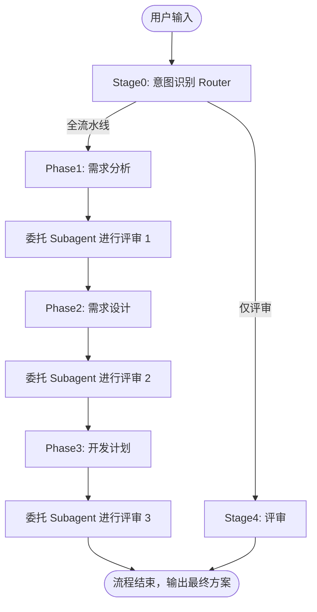

# Requirements Designer

三步轻量化软件设计工作流。专为中小型新功能开发或现有功能增强量身打造，确保需求可落地、架构无技术债。

## 阶段定义

| 阶段 | 名称 | 简介 |
|:---:|:---:|:---|
| **Phase1** | 需求分析 | 深入理解需求本质，通过苏格拉底式对话澄清目标、用户、场景、边界与约束，识别真实诉求与隐含前提。核心在于：**明确"要做什么、为谁而做，以及做到什么程度"**。 |
| **Phase2** | 需求设计 | 将初始需求逐层拆解为 **SR（系统需求）→ AR（分配需求）**，明确需求如何融入现有系统；梳理项目的黄金原则、工程约束与实现风格；细化模块、功能、文件层面的增删改及其依赖关系与接口设计，避免引入技术债。同时完成新需求的功能设计、设计模式选型与DFx设计。核心在于：**将需求转化为可落地、可集成、可演进的系统方案**。 |
| **Phase3** | SDD 开发计划 | 基于设计说明书，结合耦合关系与依赖顺序，将AR进一步拆解为具体开发任务、实施步骤与验收标准，形成可直接交付给开发 Agent 执行的开发计划。核心在于：**把系统设计转化为可执行、可验证、可交付的实施清单**。 |

---

## 执行协议 (Execution Protocols)

本 Skill 通过 **Stage0 意图识别** 路由到不同的执行路径（全流水线 / 仅评审），每次调用**仅能选择一种**执行。

### 1. Pipeline Protocol (全链路端到端模式)

适用于用户希望完整经历 **“需求分析 → 需求设计 → 开发计划”** 全流程的场景。

**执行机制**：必须严格按照 **Phase1 → Review1 → Phase2 → Review2 → Phase3 → Review3** 的顺序推进，禁止跳阶段、并行生成或跨阶段提前产出。

**阶段前置条件**：进入每个阶段前，必须先加载并遵循该阶段对应的参考文档；若参考文档读取失败，立即停止流程并向用户报告错误。

#### Review

**委托评审提示词**：

```text
当前位于 requirements-designer 的 {当前阶段名称} 阶段。
请对产出物 {产出物文件绝对路径} 进行评审。
评审标准请加载并参考 {references/reviewer.md 绝对路径} 中的相关章节。
```

**评审结果处理规则**：

- **通过**：可直接进入下一阶段；
- **条件通过**：必须先根据评审意见完成修订，再进入下一阶段；
- **不通过**：禁止进入下一阶段，必须返回当前阶段修改。

**修改循环约束**：

- 每个阶段最多允许 **3 次审核**；
- 若超过 3 次仍未通过，必须暂停流程并请求用户介入，协助澄清需求、放宽约束或调整目标。

#### Pipeline 执行流程



#### [Phase1] 需求分析

- 输入：用户需求描述
- 加载：references/s1-requirements-analysis.md for 需求分析阶段的方法论和步骤规范
- 输出：需求分析说明书
- 门禁：委托Subagent审核

#### [Phase2] 需求设计

- 输入：需求分析说明书
- 加载：references/s2-requirements-design.md for 需求设计阶段的方法论和步骤规范
- 输出：需求设计说明书
- 门禁：委托Subagent审核

#### [Phase3] SDD 开发计划

- 输入：需求分析说明书 & 需求设计说明书
- 加载：references/s3-development-plan.md for 开发计划阶段的方法论和步骤规范
- 输出：开发计划
- 门禁：委托Subagent审核

---

## 阶段执行指令 (Execution Steps)

### [Stage0] 意图识别 (Router)

- **分析判断**：当前用户是要**生成**某个阶段的产出物？还是对已有产出物进行**评审**？亦或是要完整执行 **Pipeline 工作流**？
- **动作执行**：根据判断结果，严格遵循对应的 Protocol 和进入后续的 Stage1~Stage4 步骤。

### [Stage1] 需求分析 (Phase1)

- **[!! 强制前置动作 !!]**：必须读取并遵循 `references/s1-requirements-analysis.md` 中的规范（缺少规范会导致产出物不符合质量标准）。若读取失败，立即停止并报错。
- **输出交付物**：需求分析说明书

### [Stage2] 需求设计 (Phase2)

- **[!! 强制前置动作 !!]**：必须读取并遵循 `references/s2-requirements-design.md` 中的规范（缺少规范会导致产出物不符合质量标准）。若读取失败，立即停止并报错。
- **输出交付物**：需求设计说明书

### [Stage3] 开发计划 (Phase3)

- **[!! 强制前置动作 !!]**：必须读取并遵循 `references/s3-development-plan.md` 中的规范（缺少规范会导致产出物不符合质量标准）。若读取失败，立即停止并报错。
- **输出交付物**：开发计划

### [Stage4] 评审 (Review)

- **角色隔离原则**：当前作为"设计师"主干 Agent 时，**禁止**读取评审参考文件（防止评审标准影响设计思路，确保评审独立性），必须委派（Delegate）评审员 Subagent 执行此动作。
- **[!! 强制前置动作 !!]**：承担评审任务的 Agent 必须读取并遵循 `references/reviewer.md`（评审标准是质量保证的基础）。若读取失败，立即停止并报错。
- **输出交付物**：打分结果与具体的改进意见。
