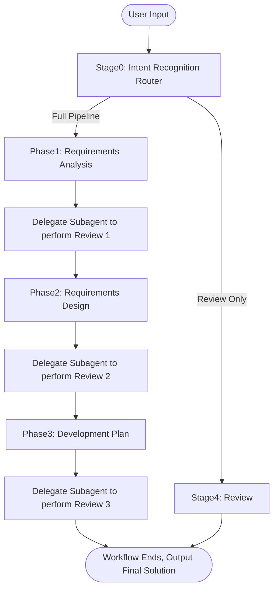

# Requirements Designer

A lightweight three-step software design workflow. Tailored for small-to-medium-sized new feature development or enhancement of existing functionality, ensuring requirements are implementable and the architecture remains free of technical debt.

## Phase Definitions

| Phase | Name | Description |
|:---:|:---:|:---|
| **Phase1** | Requirements Analysis | Deeply understand the essence of the requirement through Socratic dialogue, clarify goals, users, scenarios, boundaries, and constraints, and identify the real intent and implicit assumptions. The core is to: **make clear "what to build, for whom, and to what extent"**. |
| **Phase2** | Requirements Design | Gradually decompose the initial requirement into **SR (System Requirements) → AR (Allocated Requirements)**, clarify how the requirement integrates into the existing system; sort out the project’s golden rules, engineering constraints, and implementation style; refine changes at the module, function, and file level, including additions, deletions, modifications, dependencies, and interface design, so as to avoid introducing technical debt. Also complete functional design for new requirements, design pattern selection, and DFx design. The core is to: **transform requirements into a system solution that is implementable, integrable, and evolvable**. |
| **Phase3** | SDD Development Plan | Based on the design specification, further decompose AR into concrete development tasks, implementation steps, and acceptance criteria according to coupling relationships and dependency order, forming a development plan that can be directly handed over to a development Agent for execution. The core is to: **translate the system design into an executable, verifiable, and deliverable implementation checklist**. |

---

## Execution Protocols

This Skill routes to different execution paths (full pipeline / single domain) through **Stage0 Intent Recognition**, and **only one** execution mode may be selected per invocation.

### 1. Pipeline Protocol (End-to-End Full Workflow Mode)

Applicable when the user wants to go through the complete process of **“requirements analysis → requirements design → development plan”**.

**Execution mechanism**: Must strictly proceed in the order of **Phase1.1 → Review1.2 → Phase2.1 → Review2.2 → Phase3.1 → Review3.2**. Skipping phases, parallel generation, or producing outputs for later phases in advance is prohibited.

**Phase prerequisites**: Before entering each phase, the corresponding reference document for that phase must first be loaded and followed. If the reference document cannot be read, the workflow must stop immediately and report the error to the user.

#### Pipeline Execution Flow

#### [Phase1] Requirements Analysis

- Input: user requirement description
- Load: `references/phase1-requirements-analysis.md` for the methodology and procedural规范 of the requirements analysis phase
- Output: requirements analysis specification
- Gate: must be reviewed by a delegated Subagent

#### [Phase2] Requirements Design

- Input: requirements analysis specification
- Load: `references/phase2-requirements-design.md` for the methodology and procedural规范 of the requirements design phase
- Output: requirements design specification
- Gate: must be reviewed by a delegated Subagent

#### [Phase3] SDD Development Plan

- Input: requirements analysis specification & requirements design specification
- Load: `references/phase3-development-plan.md` for the methodology and procedural规范 of the development planning phase
- Output: development plan
- Gate: must be reviewed by a delegated Subagent

#### Review

**Role isolation principle**: If you are the "designer" main Agent, you are **prohibited** from reading the review reference file (to prevent review criteria from influencing design thinking and to ensure review independence). You must delegate this action to a reviewer Subagent.

**Load Reference**:
- **Load SKILL**: Load `adt-design-req-design` skill - NEVER execute work without loading the skill first
- **Reference**: Read `adt-design-req-design/references/reviewer.md` for review 

**Review result handling rules**:

- **Pass**: may directly proceed to the next phase;
- **Conditional Pass**: revisions must first be completed according to the review comments before proceeding to the next phase;
- **Fail**: proceeding to the next phase is prohibited; the current phase must be revised first.

**Revision loop constraints**:

- Each phase may undergo review at most **3 times**;
- If the phase still does not pass after 3 attempts, the workflow must be paused and user intervention requested to help clarify requirements, relax constraints, or adjust goals.

### 2. Router Protocol (Single-Phase Execution Mode)

Applicable when the user wants to directly enter a specific phase (for example, requirements design only).

**Prerequisite**: If the user directly specifies a phase, the model must check whether the outputs of preceding phases have already been completed. If not, execution must be refused and the missing prerequisites must be explained to the user.

**Single phase**: The user may directly enter any one of Phase1, Phase2, Phase3, or Review:
- Enter Phase1: must read and follow the execution specification in `references/phase1-requirements-analysis.md`, and output a requirements analysis specification;
- Enter Phase2: must read and follow the execution specification in `references/phase2-requirements-design.md`, and output a requirements design specification;
- Enter Phase3: must read and follow the execution specification in `references/phase3-development-plan.md`, and output a development plan;
- Enter Review: must read and follow the review criteria in `references/reviewer.md`, and review the specified phase output.

**REFERENCE constraint**: No matter which phase is entered, the corresponding reference document for that phase **must** be loaded and followed first. If the reference document cannot be read, the workflow must stop immediately and report the error to the user.

## Execution Steps

- **Intent recognition**: Is the current user asking to **generate** the output of a phase? Or to **review** an existing output? Or to execute the complete **Pipeline workflow**?
- **Action execution**: Execute the corresponding Pipeline or Router protocol according to the user’s intent.
