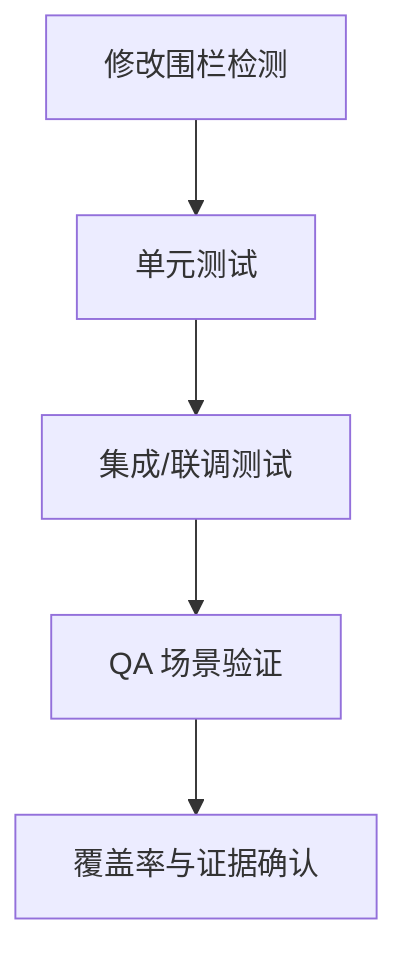

## 开发计划模板

<!-- instruction: Keep the document structure unchanged unless the input clearly requires adjustments. Fill placeholders like [ ... ] with concrete project-specific content. Do not output instruction comments in the final document. -->

````markdown
## §1 概要

| 项目 | 内容 |
|------|------|
| **需求来源** | [Requirements analysis document name/path] |
| **设计来源** | [Requirements design document name/path] |
| **项目类型** | [Brand New Project / Incremental Project] |
| **任务总数** | [N development tasks] |
| **预估工作量** | [N person-days / N person-weeks] |
| **里程碑** | [e.g. M1: Coding complete / M2: Integration complete / M3: Acceptance complete] |

<!-- instruction: Use 2-3 sentences to summarize development scope, core work and delivery targets. -->
**本次开发摘要**：[Description]

---

## §2 执行前准备

### 2.1 环境与依赖确认

<!-- instruction: Only keep pre-items that would block development; can adjust based on actual project. -->

```text
□ 已创建开发分支：feature/[Requirement name]-[Date]
□ 已确认关键依赖与版本
□ 已确认数据库/配置/外部服务访问权限（如有）
□ 已确认其他必要前置条件
```

### 2.2 代码阅读清单

<!-- instruction: List key code that must be read before modification, e.g. module entry, data model, permission, error handling. -->

```text
□ [File/Directory path 1]：了解 [Responsibility]
□ [File/Directory path 2]：了解 [Responsibility]
□ [File/Directory path 3]：了解 [Responsibility]
```

### 2.3 修改围栏提醒

<!-- instruction: From design document; only keep three boundary categories: "Prohibit Modification / Allow Modification / Conditional Modification". -->

```text
⚠️ 禁止修改：
- [Path]（原因：[Description]）

✅ 允许修改：
- [Path]（范围：[Description]）

🟡 条件修改：
- [Path]（条件：[Description]）
```

---

## §3 开发任务列表

<!-- instruction: Task numbering format can be T-{milestone number}{sequence:02d}; each task only keeps implementation and acceptance required information. -->

### 里程碑 M1：[Name]（目标日期：[Date]）

#### 任务 T-101：[Task name]

| 项目 | 内容 |
|------|------|
| **对应 AR** | [AR number / name] |
| **系统元素** | [Module name]（新增 / 扩展） |
| **复杂度** | [quick / medium / deep / integration] |
| **依赖任务** | [None / T-xxx] |

<!-- instruction: Use 1-2 sentences from implementer perspective to explain what this task does. -->
**任务描述**：[Description]

**修改文件**：

| 文件路径 | 修改类型 | 修改说明 |
|----------|----------|----------|
| `[Path]` | [新增/修改/删除] | [Description] |

**功能点**：
- [ ] [Functional point 1]
- [ ] [Functional point 2]

**实现要点**：
1. [Key step 1]
2. [Key step 2]

**测试与验收**：
- [ ] 已补充单元测试
- [ ] 已覆盖正常路径
- [ ] 已覆盖异常路径
- [ ] 已按需覆盖边界条件
- [ ] 已完成必要 Mock
- [ ] 已执行测试命令并通过

**QA 场景**：

```text
场景：[T-101-01 Scenario name]
- 类型：[正常 / 异常 / 边界]
- 前置条件：[Description]
- 步骤：[Operations and assertions]
- 验收命令：[Command]
- 证据：[evidence/xxx.log]
```

**完成标准**：
- [ ] 功能点完成
- [ ] 测试通过
- [ ] QA 场景通过
- [ ] 覆盖率达标

---

### 里程碑 M2：[Name]（目标日期：[Date]）

<!-- instruction: Continue listing tasks in same format as M1; if many tasks, can only expand key tasks, rest can be simplified. -->

---

### 里程碑 M3：[Name]（目标日期：[Date]）

<!-- instruction: Continue listing tasks in same format as M1. -->

---

## §4 任务依赖与执行顺序

**依赖关系**：

```text
[关键路径]
T-101 → T-102 → T-103

[可并行]
T-201 ─┐
T-202 ─┴→ T-203
```

**并行建议**：
- [T-xxx and T-xxx] 可并行
- [T-xxx] 依赖 [T-xxx]

**关键路径**：[T-xxx → T-xxx → T-xxx]

---

## §5 测试计划

### 5.1 测试要求

| 项目 | 要求 |
|------|------|
| 测试框架 | [Vitest / Jest / Mocha] |
| 测试文件命名 | `{name}.test.ts` / `{name}.spec.ts` |
| 覆盖率要求 | 行覆盖率 > 80%，分支覆盖率 > 70% |

### 5.2 测试清单

<!-- instruction: Can organize by task, module or scenario; no need to split similar information into too many tables. -->

| 对象 | 测试类型 | 场景 | 验收命令 |
|------|----------|------|----------|
| [T-101 / Module name] | [单元 / 集成 / E2E] | [主路径 / 异常路径 / 边界] | `[Command]` |

### 5.3 回归范围

| 模块/范围 | 测试命令 | 通过标准 |
|-----------|----------|----------|
| [Existing module] | `[Command]` | [All original test cases pass] |

---

## §6 验收标准

### 6.1 验收流程



### 6.2 验收命令

```bash
# 1. 修改围栏检测
git diff --name-only main...HEAD

# 2. 单元测试
npm test

# 3. 覆盖率
npm run test:coverage

# 4. 集成测试
npm run test:integration
```

### 6.3 通过标准

- [ ] 修改围栏检测通过
- [ ] 所有关键任务功能完成
- [ ] 单元测试通过
- [ ] 集成测试通过
- [ ] QA 场景通过
- [ ] 覆盖率达标
- [ ] 回归无新增失败
- [ ] 证据文件已保存

### 6.4 失败处理

```text
1. 记录失败信息
2. 判断是实现问题、测试问题还是设计偏差
3. 修复后重跑相关命令
4. 更新 evidence/ 证据
```

---

## §7 风险与注意事项

### 7.1 风险清单

| 风险 | 影响 | 缓解措施 |
|------|------|----------|
| [Technical/Dependency risk] | [High/Medium/Low] | [Measure] |

### 7.2 编码注意

```text
- 命名、目录结构、注释风格与现有代码保持一致
- 优先处理边界条件、权限控制、异常路径
- 与设计不符时先暂停并反馈，不自行偏离设计
```

---

## §8 给开发 Agent 的执行说明

**开始前必读**：
1. 阅读 §2.3 修改围栏
2. 阅读 §2.2 关键代码
3. 确认 §2.1 前置条件满足

**执行规范**：
- 测试先行，按 TDD 执行
- 按依赖顺序开发，不跳过前置任务
- 每完成一个任务即执行对应测试
- 与设计不符时先暂停报告
- 输出证据保存到 `evidence/`

**完成标志**：
- [ ] 修改围栏检测通过
- [ ] 所有任务完成
- [ ] 测试通过
- [ ] QA 场景通过
- [ ] 覆盖率达标
- [ ] 回归通过
- [ ] 证据已保存
````