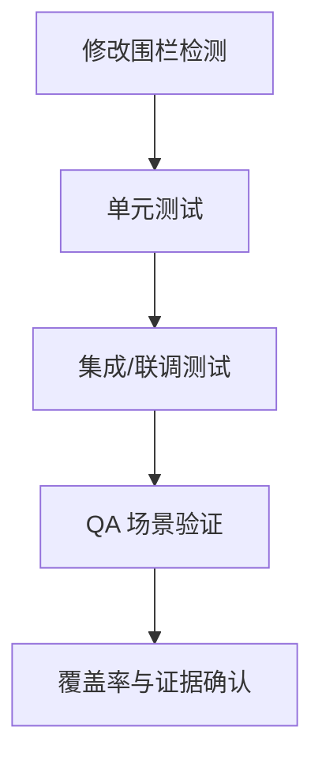

## 开发计划模板

<!-- instruction: Keep the document structure unchanged unless the input clearly requires adjustments. Fill placeholders like [ ... ] with concrete project-specific content. Do not output instruction comments in the final document. -->

````markdown
## §1 概要

| 项目 | 内容 |
|------|------|
| **需求来源** | [需求分析说明书名称/路径] |
| **设计来源** | [需求设计说明书名称/路径] |
| **项目类型** | [全新项目 / 增量项目] |
| **任务总数** | [N 个开发任务] |
| **预估工作量** | [N 人日 / N 人周] |
| **里程碑** | [如 M1: 编码完成 / M2: 联调完成 / M3: 验收完成] |

<!-- instruction: 用 2-3 句话概述本次开发范围、核心工作和交付目标。 -->
**本次开发摘要**：[描述]

---

## §2 执行前准备

### 2.1 环境与依赖确认

<!-- instruction: 仅保留会阻塞开发的前置项；可按项目实际增减。 -->

```text
□ 已创建开发分支：feature/[需求名]-[日期]
□ 已确认关键依赖与版本
□ 已确认数据库/配置/外部服务访问权限（如有）
□ 已确认其他必要前置条件
```

### 2.2 代码阅读清单

<!-- instruction: 列出修改前必须阅读的关键代码，如模块入口、数据模型、权限、错误处理。 -->

```text
□ [文件/目录路径 1]：了解 [职责]
□ [文件/目录路径 2]：了解 [职责]
□ [文件/目录路径 3]：了解 [职责]
```

### 2.3 修改围栏提醒

<!-- instruction: 来自设计说明书；仅保留“禁止修改 / 允许修改 / 条件修改”三类边界。 -->

```text
⚠️ 禁止修改：
- [路径]（原因：[说明]）

✅ 允许修改：
- [路径]（范围：[说明]）

🟡 条件修改：
- [路径]（条件：[说明]）
```

---

## §3 开发任务列表

<!-- instruction: 任务编号格式可如 T-{里程碑编号}{序号:02d}；每个任务只保留实现和验收所需信息。 -->

### 里程碑 M1：[名称]（目标日期：[日期]）

#### 任务 T-101：[任务名称]

| 项目 | 内容 |
|------|------|
| **对应 AR** | [AR 编号 / 名称] |
| **系统元素** | [模块名]（新增 / 扩展） |
| **复杂度** | [quick / medium / deep / integration] |
| **依赖任务** | [无 / T-xxx] |

<!-- instruction: 用 1-2 句话从实现者视角说明本任务做什么。 -->
**任务描述**：[描述]

**修改文件**：

| 文件路径 | 修改类型 | 修改说明 |
|----------|----------|----------|
| `[路径]` | [新增/修改/删除] | [说明] |

**功能点**：
- [ ] [功能点 1]
- [ ] [功能点 2]

**实现要点**：
1. [关键步骤 1]
2. [关键步骤 2]

**测试与验收**：
- [ ] 已补充单元测试
- [ ] 已覆盖正常路径
- [ ] 已覆盖异常路径
- [ ] 已按需覆盖边界条件
- [ ] 已完成必要 Mock
- [ ] 已执行测试命令并通过

**QA 场景**：

```text
场景：[T-101-01 场景名]
- 类型：[正常 / 异常 / 边界]
- 前置条件：[说明]
- 步骤：[操作与断言]
- 验收命令：[命令]
- 证据：[evidence/xxx.log]
```

**完成标准**：
- [ ] 功能点完成
- [ ] 测试通过
- [ ] QA 场景通过
- [ ] 覆盖率达标

---

### 里程碑 M2：[名称]（目标日期：[日期]）

<!-- instruction: 按与 M1 相同格式继续列任务；如任务较多，可只展开关键任务，其余简写。 -->

---

### 里程碑 M3：[名称]（目标日期：[日期]）

<!-- instruction: 按与 M1 相同格式继续列任务。 -->

---

## §4 任务依赖与执行顺序

**依赖关系**：

```text
[关键路径]
T-101 → T-102 → T-103

[可并行]
T-201 ─┐
T-202 ─┴→ T-203
```

**并行建议**：
- [T-xxx 和 T-xxx] 可并行
- [T-xxx] 依赖 [T-xxx]

**关键路径**：[T-xxx → T-xxx → T-xxx]

---

## §5 测试计划

### 5.1 测试要求

| 项目 | 要求 |
|------|------|
| 测试框架 | [Vitest / Jest / Mocha] |
| 测试文件命名 | `{name}.test.ts` / `{name}.spec.ts` |
| 覆盖率要求 | 行覆盖率 > 80%，分支覆盖率 > 70% |

### 5.2 测试清单

<!-- instruction: 可按任务、模块或场景组织；无需把同类信息拆成过多表格。 -->

| 对象 | 测试类型 | 场景 | 验收命令 |
|------|----------|------|----------|
| [T-101 / 模块名] | [单元 / 集成 / E2E] | [主路径 / 异常路径 / 边界] | `[命令]` |

### 5.3 回归范围

| 模块/范围 | 测试命令 | 通过标准 |
|-----------|----------|----------|
| [现有模块] | `[命令]` | [原有用例全部通过] |

---

## §6 验收标准

### 6.1 验收流程



### 6.2 验收命令

```bash
# 1. 修改围栏检测
git diff --name-only main...HEAD

# 2. 单元测试
npm test

# 3. 覆盖率
npm run test:coverage

# 4. 集成测试
npm run test:integration
```

### 6.3 通过标准

- [ ] 修改围栏检测通过
- [ ] 所有关键任务功能完成
- [ ] 单元测试通过
- [ ] 集成测试通过
- [ ] QA 场景通过
- [ ] 覆盖率达标
- [ ] 回归无新增失败
- [ ] 证据文件已保存

### 6.4 失败处理

```text
1. 记录失败信息
2. 判断是实现问题、测试问题还是设计偏差
3. 修复后重跑相关命令
4. 更新 evidence/ 证据
```

---

## §7 风险与注意事项

### 7.1 风险清单

| 风险 | 影响 | 缓解措施 |
|------|------|----------|
| [技术/依赖风险] | [高/中/低] | [措施] |

### 7.2 编码注意

```text
- 命名、目录结构、注释风格与现有代码保持一致
- 优先处理边界条件、权限控制、异常路径
- 与设计不符时先暂停并反馈，不自行偏离设计
```

---

## §8 给开发 Agent 的执行说明

**开始前必读**：
1. 阅读 §2.3 修改围栏
2. 阅读 §2.2 关键代码
3. 确认 §2.1 前置条件满足

**执行规范**：
- 测试先行，按 TDD 执行
- 按依赖顺序开发，不跳过前置任务
- 每完成一个任务即执行对应测试
- 与设计不符时先暂停报告
- 输出证据保存到 `evidence/`

**完成标志**：
- [ ] 修改围栏检测通过
- [ ] 所有任务完成
- [ ] 测试通过
- [ ] QA 场景通过
- [ ] 覆盖率达标
- [ ] 回归通过
- [ ] 证据已保存
````