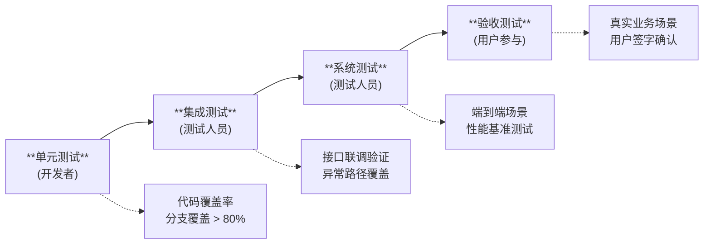

## 需求分析文档模板

````markdown

## §1 概要

| 信息 | 内容 |
|------|------|
| **名称** | [系统名称 - 子功能名称] |
| **描述** | [一句话说明要做什么] |
| **输入来源** | [GitHub Issue #N / 产品需求 / 口述] |
| **项目类型** | 功能增强型需求 / 新功能开发 |

---

## §2 项目背景与 5W2H 分析

### 2.1 项目背景

**需求价值**（1-2 句）：该需求为业务带来的核心价值，说明"为什么值得做"。追溯到业务根源，避免泛泛而谈（❌"提升用户体验"→ ✅"将故障发现时间从 15 分钟缩短至实时"）。

**需求描述**（1-2 句）：需求的本质和范围，说明"要做什么"。

### 2.2 5W2H 分析

每项限 1-2 句，聚焦核心信息，**避免抽象描述**：

| 维度 | 说明要点 | 常见错误 |
|------|---------|---------|
| **What** | 核心功能内容，具体可验证 | ❌"支持用户交互" → ✅"在故障模式抽取节点增加用户确认/修正入口" |
| **Why** | 追溯到业务根源和痛点 | ❌"提高效率" → ✅"现有自动生成准确率不足，需人工干预提升质量" |
| **Who** | 主要使用者 + 管理者，涵盖所有关键角色 | 不要遗漏管理员角色 |
| **When** | 使用时机和触发条件 | |
| **Where** | 物理环境、技术平台、系统上下文 | |
| **How** | 用户核心操作流程 | |
| **How Much** | 规模预估、开发资源投入（人月） | 需包含人力和时间 |

---

## §3 业务功能与场景

### 3.1 功能性需求

| 需求编号 | 需求类别 | 需求名称 | 需求描述 | 优先级 |
|----------|----------|----------|----------|--------|
| FR-001 | [功能] | [名称] | [2-3 句描述核心行为和用户价值，说明包含哪些子能力] | **P0 - Must Have** |
| FR-002 | [功能] | [名称] | [描述] | **P1 - Should Have** |
| FR-003 | [功能] | [名称] | [描述] | **P2 - Nice to Have** |
| ... | ... | ... | ... | ... |

### 3.2 非功能性需求  

> **需求类别说明**：
> **可用性**：系统持续提供服务的能力
> **可靠性**：系统在故障/异常条件下正确运行的能力
> **可服务**：系统易于监控、诊断和运维的能力
> **安全性**：数据保护、访问控制与合规
> **性能**：系统响应速度与吞吐能力
> **可扩展性**：系统应对规模增长的能力
> **兼容性**：与外部系统/终端/协议的适配能力

| 需求编号 | 需求类别 | 需求名称 | 需求描述 | 优先级 |
|----------|----------|----------|----------|--------|
| NFR-001 | 性能 | [名称] | [2-3 句描述，含可量化的验收标准] | **P0 - Must Have** |
| NFR-002 | 安全性 | [名称] | [描述] | **P0 - Must Have** |
| NFR-003 | 可用性 | [名称] | [描述] | **P1 - Should Have** |
| ... | ... | ... | ... | ... |

### 3.3 业务规则与约束

> **用于定义需求中涉及的校验逻辑、计算公式、触发条件、约束规则等。**

### 3.3 主成功场景

用具名角色（如"运维人员张三"）描述最典型的端到端操作流：

```
[角色] 遇到 [触发事件]
→ [角色] 执行 [操作A]
→ 系统 [响应B]
→ [角色] 查看 / 确认 / 修正
→ 系统 [根据输入生成结果C]
→ [角色] 完成目标
→ 系统记录 [后续影响/知识沉淀]
```

### 3.4 场景列表

> **场景定义**：
> **业务场景**：直接产生业务价值的核心操作
> **操作场景**：日常使用的辅助操作（搜索、筛选、导出等）
> **维护场景**：管理员配置和运维操作
> **制造场景**：系统批量生成或处理内容

| 类型 | 定义 | 场景编号 | 场景名称 | 简要说明 |
|------|------|----------|----------|----------|
| **业务场景** | 直接产生业务价值的核心操作 | S-B01 | [场景名] | [一句话说明触发条件与预期结果] |
| **操作场景** | 日常使用的辅助操作（搜索、筛选、导出等） | S-O01 | [场景名] | [说明] |
| **维护场景** | 管理员配置和运维操作 | S-M01 | [场景名] | [说明] |
| ... | ... | ... | ... | ... |

---

## §4 性能规格

**性能规格是需求分析的核心内容之一**，必须在需求阶段明确量化指标，为后续设计和验收提供依据。

---

## §5 验收方法

### 5.1 验收标准

| 验收项 | 验收标准 | 验收方法 | 优先级 |
|--------|----------|----------|--------|
| [功能验收] | [可量化标准，含基线说明] | [具体测试方法] | P0 |
| [性能验收] | [响应时间/吞吐量指标] | [性能测试工具和方法] | P0 |
| [安全验收] | [安全测试通过条件] | [安全测试方法] | P0 |

**验收标准写作要点**：
- 标准必须**可量化**（有数字、有基线、有测试方法）
- P0 验收项阻断发布，P1/P2 可延期
- 性能验收必须包含 P95/P99 分位值

### 5.2 验收流程



**各阶段验收内容**：

| 阶段 | 验收内容 | 通过标准 | 负责人 |
|------|----------|----------|--------|
| 单元测试 | 各模块功能正确性 | 覆盖率 > 80%，全部通过 | 开发者 |
| 集成测试 | 模块间接口正确性 | 接口契约验证通过 | 测试人员 |
| 系统测试 | 端到端场景 + 性能 | 所有 P0 场景通过，性能达标 | 测试人员 |
| 验收测试 | 真实业务场景验证 | 用户确认功能满足需求 | 用户 + 产品 |
| ... | ... | ... | ... |

### 5.3 测试场景

**每个 P0 功能必须定义至少 2 个测试场景：正常路径 + 异常路径**

| 场景编号 | 场景名称 | 场景类型 | 前置条件 | 操作步骤 | 预期结果 |
|----------|----------|----------|----------|----------|----------|
| TC-001 | [正常路径场景] | 正常 | [初始状态] | 1. [步骤1]<br>2. [步骤2]<br>3. [步骤3] | [可观测的预期结果] |
| TC-002 | [异常路径场景] | 异常 | [异常初始状态] | 1. [触发异常条件] | [优雅失败 + 错误提示] |
| TC-003 | [边界条件场景] | 边界 | [边界状态] | 1. [边界操作] | [正确处理边界情况] |
| ... | ... | ... | ... | ... | ... |

### 5.4 交付物定义

| 交付物 | 描述 | 验收标准 |
|--------|------|----------|
| 代码实现 | 功能代码 + 单元测试 | 代码审查通过，测试覆盖率 > 80% |
| 测试报告 | 功能测试 + 性能测试 | 所有 P0 测试场景通过 |
| 用户手册 | 操作说明（如有） | 用户确认可用 |
| ... | ... | ... |

---

## §6 约束

### 6.1 技术约束

| 约束类型 | 约束描述 | 影响范围 |
|----------|----------|----------|
| **技术栈** | 需与现有 [系统名] 技术栈兼容 | [影响的模块] |
| **接口协议** | [接口约束描述] | [影响的接口] |
| **数据格式** | [统一 schema / 数据类型要求] | [影响的数据流] |
| **框架版本** | [框架版本约束] | [影响的依赖] |
| ... | ... | ... |

### 6.2 合规与安全要求

| 要求 | 描述 | 验证方法 |
|------|------|----------|
| **权限控制** | [哪些操作需要什么权限] | 权限矩阵测试 |
| **审计日志** | [哪些操作需要记录审计日志] | 日志审计 |
| **数据安全** | [敏感数据的存储/传输要求] | 安全扫描 |
| **合规要求** | [如 GDPR、等保等] | 合规检查清单 |
| ... | ... | ... |

````