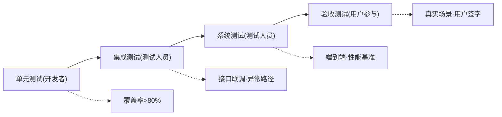

## 需求分析文档模板

<!-- instruction: Keep the document structure unchanged unless the input clearly requires adjustments. Fill placeholders like [ ... ] with concrete project-specific content. Do not output instruction comments in the final document. -->

````markdown
## §1 概要

| 信息 | 内容 |
|------|------|
| **名称** | [系统名称 - 子功能名称] |
| **描述** | [一句话说明要做什么] |
| **输入来源** | [GitHub Issue #N / 产品需求 / 口述] |
| **项目类型** | [功能增强型需求 / 新功能开发] |

---

## §2 项目背景与 5W2H 分析

### 2.1 项目背景

<!-- instruction: 用 1-2 句说明需求价值，强调“为什么值得做”，尽量追溯到业务根因。 -->
<!-- example: ✅“将故障发现时间从 15 分钟缩短至实时” ❌“提升用户体验” -->
**需求价值**：[该需求为业务带来的核心价值]

<!-- instruction: 用 1-2 句说明需求描述，强调“要做什么”，点明本质和边界。 -->
**需求描述**：[需求的本质和范围]

### 2.2 5W2H 分析

<!-- instruction: 每项建议控制在 1-2 句内，尽量具体、可验证，避免空泛表述。 -->

| 维度 | 内容 |
|------|------|
| **What** | [核心功能内容，具体可验证] |
| **Why** | [追溯到业务根源和痛点] |
| **Who** | [主要使用者 + 管理者] |
| **When** | [使用时机和触发条件] |
| **Where** | [物理环境、技术平台、系统上下文] |
| **How** | [用户核心操作流程] |
| **How Much** | [规模预估、开发资源投入，如人力和时间] |

---

## §3 业务功能与场景

### 3.1 功能性需求

<!-- instruction: 可按 P0 / P1 / P2 分层描述核心功能；如核心主流程可归为 P0，提升效率的辅助能力可归为 P1，体验优化项可归为 P2。 -->
<!-- instruction: 每条需求描述可用 2-3 句概述核心行为、用户价值，以及包含的子能力。 -->

| 需求编号 | 需求类别 | 需求名称 | 需求描述 | 优先级 |
|----------|----------|----------|----------|--------|
| FR-001 | [功能] | [名称] | [描述] | **P0 - Must Have** |

### 3.2 非功能性需求

<!-- instruction: 可从可用性、可靠性、可服务、安全性、性能、可扩展性、兼容性等角度补充。 -->
<!-- instruction: 描述中建议包含可量化的验收口径，如响应时间、可用率、错误率、恢复时长等。 -->

| 需求编号 | 需求类别 | 需求名称 | 需求描述 | 优先级 |
|----------|----------|----------|----------|--------|
| NFR-001 | [类别] | [名称] | [描述，含可量化验收标准] | [优先级] |

### 3.3 业务规则与约束

<!-- instruction: 可描述校验逻辑、计算公式、状态流转、触发条件、前置约束、互斥关系等规则。 -->
<!-- instruction: 如存在“仅管理员可操作”“超过阈值自动告警”“字段不可为空”等，也可在此补充。 -->

[业务规则与约束内容]

### 3.4 主成功场景

<!-- instruction: 建议使用具名角色，如“运维人员张三”“审核员李四”，描述最典型的端到端成功路径。 -->

```text
[角色] 遇到 [触发事件]
→ [角色] 执行 [操作A]
→ 系统 [响应B]
→ [角色] 查看 / 确认 / 修正
→ 系统 [根据输入生成结果C]
→ [角色] 完成目标
→ 系统记录 [后续影响/知识沉淀]
```

### 3.5 场景列表

<!-- instruction: 可按业务场景、操作场景、维护场景分类整理。 -->
<!-- instruction: 业务场景通常指产生直接业务价值的核心操作；操作场景可如搜索、筛选、导出；维护场景可如参数配置、权限管理、运维处理。 -->

| 类型 | 场景编号 | 场景名称 | 简要说明 |
|------|----------|----------|----------|
| 业务场景 | S-B01 | [场景名] | [触发条件与预期结果] |

---

## §4 性能规格

<!-- instruction: 需求阶段应尽量明确量化指标，为后续设计、测试和验收提供依据。 -->
<!-- rule: 如暂无基线或目标数据，建议明确“待压测确认”或“待业务侧补充”，避免虚构指标。 -->

[性能规格内容]

---

## §5 验收方法

### 5.1 验收标准

<!-- instruction: 可分别从功能、性能、安全、稳定性、兼容性等角度定义验收项。 -->
<!-- instruction: 建议优先明确 P0 阻断项；如为性能验收，可补充分位值口径，如 P95 / P99。 -->
<!-- rule: 验收标准尽量可量化、可测试、可复现；如无法量化，也建议给出明确判断条件。 -->

| 验收项 | 验收标准 | 验收方法 | 优先级 |
|--------|----------|----------|--------|
| [功能验收] | [可量化标准] | [具体测试方法] | P0 |

### 5.2 验收流程



| 阶段 | 验收内容 | 通过标准 | 负责人 |
|------|----------|----------|--------|
| 单元测试 | 各模块功能正确性 | 覆盖率 > 80%，全部通过 | 开发者 |

### 5.3 测试场景

<!-- instruction: 可为关键功能补充正常路径、异常路径、边界条件等测试场景。 -->
<!-- instruction: 如某功能为 P0，通常至少覆盖成功执行和失败处理两类场景；必要时再补充边界值或权限场景。 -->

| 场景编号 | 场景名称 | 场景类型 | 前置条件 | 操作步骤 | 预期结果 |
|----------|----------|----------|----------|----------|----------|
| TC-001 | [场景名称] | [正常/异常/边界] | [初始状态] | [操作步骤] | [预期结果] |

### 5.4 交付物定义

<!-- instruction: 可列出本需求最终需要交付的内容，如代码实现、测试报告、部署说明、用户手册、监控配置等。 -->
<!-- instruction: 如某些交付物并非必须，也可按项目实际情况删减或补充。 -->

| 交付物 | 描述 | 验收标准 |
|--------|------|----------|
| 代码实现 | [如功能代码、配置变更、单元测试等] | [如代码审查通过] |

---

## §6 约束

### 6.1 技术约束

<!-- instruction: 可补充会影响方案设计或开发实现的技术边界，如技术栈限制、接口协议、数据格式、部署环境、版本依赖等。 -->
<!-- instruction: 如某项约束仅影响部分模块，也可在影响范围中说明。 -->

| 约束类型 | 约束描述 | 影响范围 |
|----------|----------|----------|
| 技术栈 | [约束描述] | [影响的模块] |

### 6.2 合规与安全要求

<!-- instruction: 可从权限控制、审计日志、数据安全、隐私保护、合规要求等方面整理。 -->
<!-- instruction: 如涉及敏感数据、角色隔离、操作留痕、加密传输等，也可在此补充验证方式。 -->

| 要求 | 描述 | 验证方法 |
|------|------|----------|
| 权限控制 | [描述] | [验证方法] |

## §7 附录

<!-- instruction: 可补充信息。如无特别需求可忽略。 -->

[附录内容]

````