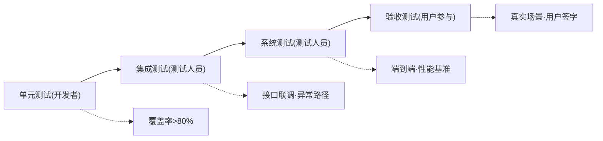

## 需求分析文档模板

<!-- instruction: Keep the document structure unchanged unless the input clearly requires adjustments. Fill placeholders like [ ... ] with concrete project-specific content. Do not output instruction comments in the final document. -->

````markdown
## §1 概要

| 信息 | 内容 |
|------|------|
| **名称** | [System Name - Sub-feature Name] |
| **描述** | [One sentence describing what to do] |
| **输入来源** | [GitHub Issue #N / Product Requirement / Oral] |
| **项目类型** | [Feature Enhancement / New Feature Development] |

---

## §2 项目背景与 5W2H 分析

### 2.1 项目背景

<!-- instruction: Use 1-2 sentences to explain requirement value, emphasize "why it is worth doing", and trace back to business root causes whenever possible. -->
<!-- example: ✅"Reduce fault discovery time from 15 minutes to real-time" ❌"Improve user experience" -->
**需求价值**：[Core value this requirement brings to business]

<!-- instruction: Use 1-2 sentences to explain requirement description, emphasize "what to do", point out essence and boundaries. -->
**需求描述**：[Essence and scope of the requirement]

### 2.2 5W2H 分析

<!-- instruction: Each item should be controlled within 1-2 sentences, try to be specific and verifiable, avoid vague expressions. -->

| 维度 | 内容 |
|------|------|
| **What** | [Core functional content, specific and verifiable] |
| **Why** | [Trace back to business root causes and pain points] |
| **Who** | [Primary users + Administrators] |
| **When** | [Usage timing and trigger conditions] |
| **Where** | [Physical environment, technical platform, system context] |
| **How** | [User's core operation flow] |
| **How Much** | [Scale estimation, development resource investment, e.g. manpower and time] |

---

## §3 业务功能与场景

### 3.1 功能性需求

<!-- instruction: Can describe core functions by P0 / P1 / P2 levels; core main flow can be P0, efficiency-enhancing auxiliary capabilities can be P1, experience optimization items can be P2. -->
<!-- instruction: Each requirement description can use 2-3 sentences to summarize core behavior, user value, and included sub-capabilities. -->

| 需求编号 | 需求类别 | 需求名称 | 需求描述 | 优先级 |
|----------|----------|----------|----------|--------|
| FR-001 | [Function] | [Name] | [Description] | **P0 - Must Have** |

### 3.2 非功能性需求

<!-- instruction: Can supplement from availability, reliability, serviceability, security, performance, scalability, compatibility perspectives. -->
<!-- instruction: Description should include quantifiable acceptance criteria, e.g. response time, availability rate, error rate, recovery time, etc. -->

| 需求编号 | 需求类别 | 需求名称 | 需求描述 | 优先级 |
|----------|----------|----------|----------|--------|
| NFR-001 | [Category] | [Name] | [Description, including quantifiable acceptance criteria] | [Priority] |

### 3.3 业务规则与约束

<!-- instruction: Can describe validation logic, calculation formulas, state transitions, trigger conditions, preconditions, mutual exclusivity rules, etc. -->
<!-- instruction: If there are rules like "only administrators can operate", "automatic alert when exceeding threshold", "field cannot be empty", they can also be added here. -->

[Business rules and constraints content]

### 3.4 主成功场景

<!-- instruction: Recommend using named roles, e.g. "Operator Zhang San", "Reviewer Li Si", to describe the most typical end-to-end success path. -->

```text
[Role] 遇到 [Trigger Event]
→ [Role] 执行 [Action A]
→ 系统 [Response B]
→ [Role] 查看 / 确认 / 修正
→ 系统 [Generate Result C based on input]
→ [Role] 完成目标
→ 系统记录 [Subsequent impact/knowledge accumulation]
```

### 3.5 场景列表

<!-- instruction: Can organize by business scenarios, operation scenarios, maintenance scenarios. -->
<!-- instruction: Business scenarios usually refer to core operations that produce direct business value; operation scenarios can be search, filter, export; maintenance scenarios can be parameter configuration, permission management, operations handling. -->

| 类型 | 场景编号 | 场景名称 | 简要说明 |
|------|----------|----------|----------|
| 业务场景 | S-B01 | [Scenario Name] | [Trigger conditions and expected results] |

---

## §4 性能规格

<!-- instruction: Requirement phase should clarify quantifiable indicators as much as possible, to provide basis for subsequent design, testing and acceptance. -->
<!-- rule: If no baseline or target data available, recommend clarifying "awaiting load test confirmation" or "awaiting business side supplement", avoid fabricating indicators. -->

[Performance specification content]

---

## §5 验收方法

### 5.1 验收标准

<!-- instruction: Can define acceptance items from functionality, performance, security, stability, compatibility perspectives. -->
<!-- instruction: Recommend prioritizing P0 blocking items; for performance acceptance, can supplement percentile criteria, e.g. P95 / P99. -->
<!-- rule: Acceptance criteria should be quantifiable, testable, reproducible; if cannot quantify, recommend providing clear judgment conditions. -->

| 验收项 | 验收标准 | 验收方法 | 优先级 |
|--------|----------|----------|--------|
| [Functional acceptance] | [Quantifiable criteria] | [Specific test method] | P0 |

### 5.2 验收流程



| 阶段 | 验收内容 | 通过标准 | 负责人 |
|------|----------|----------|--------|
| 单元测试 | 各模块功能正确性 | 覆盖率 > 80%，全部通过 | 开发者 |

### 5.3 测试场景

<!-- instruction: Can supplement normal path, abnormal path, boundary condition test scenarios for key functions. -->
<!-- instruction: If a function is P0, usually at least cover successful execution and failure handling scenarios; supplement boundary values or permission scenarios if necessary. -->

| 场景编号 | 场景名称 | 场景类型 | 前置条件 | 操作步骤 | 预期结果 |
|----------|----------|----------|----------|----------|----------|
| TC-001 | [Scenario Name] | [Normal/Abnormal/Boundary] | [Initial State] | [Operation Steps] | [Expected Result] |

### 5.4 交付物定义

<!-- instruction: Can list final deliverables for this requirement, e.g. code implementation, test report, deployment instructions, user manual, monitoring configuration, etc. -->
<!-- instruction: If certain deliverables are not mandatory, can also reduce or supplement based on actual project situation. -->

| 交付物 | 描述 | 验收标准 |
|--------|------|----------|
| 代码实现 | [e.g. functional code, config changes, unit tests, etc.] | [e.g. code review passed] |

---

## §6 约束

### 6.1 技术约束

<!-- instruction: Can supplement technical boundaries that affect solution design or development implementation, e.g. tech stack limitations, interface protocols, data formats, deployment environments, version dependencies, etc. -->
<!-- instruction: If a constraint only affects certain modules, can also explain in scope of impact. -->

| 约束类型 | 约束描述 | 影响范围 |
|----------|----------|----------|
| 技术栈 | [Constraint Description] | [Affected Modules] |

### 6.2 合规与安全要求

<!-- instruction: Can organize from permission control, audit logs, data security, privacy protection, compliance requirements perspectives. -->
<!-- instruction: If involving sensitive data, role isolation, operation trail, encrypted transmission, can also supplement verification methods here. -->

| 要求 | 描述 | 验证方法 |
|------|------|----------|
| 权限控制 | [Description] | [Verification method] |

## §7 附录

<!-- instruction: Can supplement information. If no special requirements, can ignore. -->

[Appendix content]

````