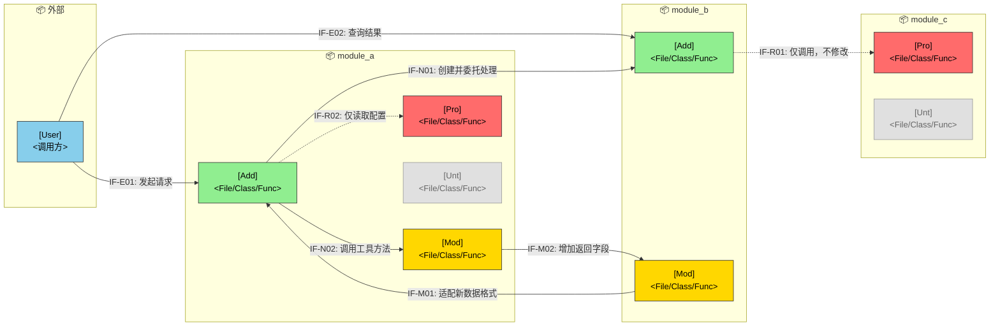

## 需求设计文档模板

<!-- instruction: Keep the document structure unchanged unless the input clearly requires adjustments. Fill placeholders like [ ... ] with concrete project-specific content. Do not output instruction comments in the final document. -->

````markdown
## §1 概要

| 信息 | 内容 |
|------|------|
| **名称** | [与需求分析说明书一致] |
| **描述** | [设计层面一句话描述] |
| **输入来源** | 需求分析说明书 [路径/版本] |
| **项目类型** | [功能增强 / 新功能 / 重构] |

---

## §2 设计目标

### 2.1 性能目标

| 指标 | 目标值 | 测量条件 | 来源 |
|------|--------|----------|------|
| [关键操作] 响应时间 | P95 < [N]ms | [并发条件] | 需求分析 §x |
| [后台任务] 完成时间 | < [N]s | [数据规模] | 需求分析 §x |

<!-- instruction: 将系统级性能目标分解到模块或链路节点，补充分解依据与假设条件；如暂无明确数据，可标记待确认，避免虚构。 -->

**模块分解**：

```text
系统级目标：[目标描述] P95 < [N]ms

| 模块/链路节点 | 时间分配 | 分解依据 |
|--------------|----------|----------|
| [模块A] | [N]ms | [承担的处理环节] |

假设条件：
- [假设1]
- [假设2]
```

### 2.2 可用性目标

| 指标 | 目标值 | 说明 |
|------|--------|------|
| 可用性 | ≥ [N]% | [说明] |
| RTO | < [N]min | [说明] |
| RPO | < [N]min | [说明] |

---

## §3 架构设计

### 3.1 架构变更总览

<!-- instruction: 图例——🔵外部用户 🟢新增 🟡修改 🔴保护（有调用但本迭代不允许修改代码） ⚪不涉及（与本次变更无关，需明确防误改的代码）。 -->
<!-- instruction: 接口命名格式 IF-{类型}{序号}，类型可如 E=外部、N=新增内部、M=修改内部、R=复用内部。 -->
<!-- example: 可用一张 mermaid 图表达“谁调用谁、哪些模块新增/修改/保护”。 -->



---

### 3.2 模块变更明细

<!-- instruction: 仅列出本次设计真正相关的模块，控制在“足够说明影响范围”的粒度即可，无需把所有无关模块都铺开。 -->
<!-- instruction: 可按新增、修改、保护、不涉及四类描述模块状态；如保护或不涉及较多，可合并描述以减少冗余。 -->

| 状态 | 模块 | 变更描述 | 约束 |
|------|------|----------|------|
| [🟢 新增 / 🟡 修改 / 🔴 保护 / ⚪ 不涉及] | [模块名] | [本次变更或关系说明] | [如仅允许改某流程、禁止改接口签名等] |

---

### 3.3 接入关系与模块接口变更

<!-- instruction: 可按“新模块消费老系统”“老系统消费新模块”“外部调用系统”三个视角整理；如某一类不存在，可省略对应小节。 -->

#### 3.3.1 内部接口 — 新模块消费老系统

| 编号 | 变更类型 | 接口名称 | 提供方 | 用途 | 备注 |
|------|----------|----------|--------|------|------|
| IF-R1 | [复用/修改] | [接口名] | [模块] | [用途] | [备注] |

#### 3.3.2 内部接口 — 老系统消费新模块

| 编号 | 变更类型 | 接口名称 | 消费方 | 用途 | 备注 |
|------|----------|----------|--------|------|------|
| IF-N1 | [新增/修改] | [接口名] | [模块] | [用途] | [备注] |

#### 3.3.3 外部接口 — 用户/前端 → 系统

| 编号 | 变更类型 | 接口名称 | 提供方 | 触发方 | 用途 | 备注 |
|------|----------|----------|--------|--------|------|------|
| IF-E1 | [新增/修改] | [接口名] | [模块] | [用户/前端/外部系统] | [用途] | [备注] |

---

### 3.4 接口定义（仅新增/修改）

<!-- instruction: 对每个新增或修改接口，说明签名、输入输出、SLA、兼容性、幂等性或权限约束等关键信息。 -->
<!-- instruction: 仅保留设计决策相关内容，无需展开为完整 API 文档。 -->

```text
IF-[编号]  [接口名称]
  类型：[REST / RPC / MQ / Event]
  提供方：[模块]
  消费方：[模块/角色]

  输入：[关键字段、约束、是否必填]
  输出：[返回结构或关键结果]

  变更内容：[新增内容或与旧版本相比的变化]
  向后兼容：[是/否 + 说明]
  SLA：[如 P95 < N ms]
  约束：[如幂等、鉴权、分页、限流、重试要求]
```

---

### 3.5 功能影响列表

<!-- instruction: 可用树形结构或列表说明功能节点变化，重点体现“改了哪些功能、对应哪些需求”。 -->
<!-- instruction: 如影响范围很小，也可仅保留表格，不必强制补充树。 -->

```text
[系统/模块名称]
├── [功能域A]
│   └── [受影响功能点]
└── [功能域B]
    └── [新增或修改功能点]
```

| 变更类型 | 功能节点 | 变更点 | 对应需求 |
|----------|----------|--------|----------|
| [新增/修改/删除] | [功能节点] | [变更说明] | [SR 编号] |

---

### 3.6 技术债与兼容性风险

| 风险项 | 涉及接口/模块 | 描述 | 缓解措施 |
|--------|---------------|------|----------|
| [风险名称] | [接口或模块] | [风险说明] | [规避或缓解方案] |

---

## §4 设计模式

### 4.1 现有模式识别

| 设计模式 | 使用位置 | 说明 |
|----------|---------|------|
| [模式名] | [模块/类名] | [如何使用] |

### 4.2 新增模式选型

| 设计模式 | 应用位置 | 选型理由 | 与现有模式一致性 |
|----------|---------|----------|-----------------|
| [模式名] | [模块] | [理由] | [一致性说明] |

<!-- instruction: 如模式较复杂，可补充其解决的问题、角色分工、边界与限制；简单场景可不展开。 -->

```text
模式：[模式名称]
应用位置：[模块/类]
问题：[要解决的具体问题]
结构：
  ├── [角色1]：[对应类/接口]
  ├── [角色2]：[对应类/接口]
  └── [角色3]：[对应类/接口]
约束：[注意事项]
```

---

## §5 SR-AR 分解与追溯

### 5.1 SR 列表

| SR 编号 | 名称 | 描述 | 对应场景 | 覆盖功能 |
|---------|------|------|----------|----------|
| SR-001 | [名称] | [1-2 句描述] | [场景名] | F-01, F-02 |

### 5.2 AR 分配

---

**SR-001：[SR 名称]**

| AR 编号 | 名称 | 系统元素 | 操作类型 |
|---------|------|---------|----------|
| AR-001-01 | [名称] | [模块名] | 新增/扩展/依赖 |

**AR-001-01 详细**：

- **描述**：[核心目标，1-2 句]
- **功能点**：
  - [ ] [功能点 1]
  - [ ] [功能点 2]

---

### 5.3 依赖矩阵

<!-- instruction: 标注说明——扩展=修改现有；依赖=调用但不修改；新增=全新创建；—=无关系。 -->

| 模块 | 现有模块A | 现有模块B | 新模块X |
|------|----------|----------|---------|
| 新模块X | 扩展 | — | — |
| 新模块Y | — | 依赖 | 新增 |

---

## §6 DFx 设计

<!-- instruction: 仅保留对本次方案有实际设计价值的质量属性，不必为了完整性机械填写。 -->
<!-- instruction: 建议按“设计关注点 + 方案决策 + 影响范围/取舍”方式描述，避免标题和内容重复。 -->

### 6.1 可用性 / 可靠性

<!-- instruction: 可关注如容错降级、超时与重试、熔断隔离、幂等、一致性、监控告警、故障恢复等。 -->

| 设计关注点 | 方案决策 | 影响范围 / 取舍 |
|------------|----------|-----------------|
| [如下游超时] | [如超时 300ms + 最多重试 1 次 + 熔断降级] | [影响哪些链路，以及可能带来的取舍] |

**故障场景预案**：

| 故障场景 | 系统表现 | 应对策略 | 恢复判断 |
|----------|----------|----------|----------|
| [故障场景] | [用户或系统侧可见现象] | [降级/切换/回滚/补偿] | [恢复标准或恢复方式] |

### 6.2 安全性

<!-- instruction: 可关注如身份认证、权限控制、输入校验、敏感数据保护、审计留痕、接口防刷等。 -->

| 设计关注点 | 方案决策 | 验证方式 |
|------------|----------|----------|
| [如接口鉴权] | [如基于角色权限校验 + 操作审计] | [如安全测试 / 权限用例验证] |

### 6.3 易用性

<!-- instruction: 可关注如错误提示、操作反馈、空状态、失败重试引导、兼容旧使用方式等。 -->

| 设计关注点 | 方案决策 | 用户收益 |
|------------|----------|----------|
| [如提交失败提示] | [如区分参数错误/权限不足/系统异常并给出建议] | [降低误操作或排障成本] |

### 6.4 可扩展性

<!-- instruction: 可关注如扩展点设计、配置化、插件化、版本演进、协议兼容、规则外置等。 -->

| 设计关注点 | 方案决策 | 后续扩展方式 |
|------------|----------|--------------|
| [如规则变化频繁] | [如规则配置化、接口保留扩展字段] | [未来如何新增能力而少改代码] |

### 6.5 可测试性

<!-- instruction: 可关注如依赖注入、Mock 边界、测试数据构造、日志与指标观测、可回放能力等。 -->

| 设计关注点 | 方案决策 | 测试收益 |
|------------|----------|----------|
| [如外部依赖难测] | [如通过接口抽象 + Mock Server 隔离] | [便于单测/集成测试稳定执行] |

---

## §7 模块详细设计（按需）

<!-- instruction: 当 AR 实现逻辑较复杂时，可补充核心处理流程、关键算法、状态机、与现有代码集成方式等；简单需求可省略。 -->
<!-- rule: 设计文档应聚焦设计决策与结构表达，可用 mermaid 或伪结构说明，不写实现代码。 -->

[模块详细设计内容]

````