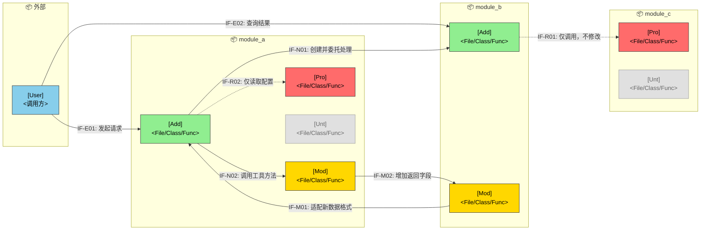

## 需求设计文档模板

<!-- instruction: Keep the document structure unchanged unless the input clearly requires adjustments. Fill placeholders like [ ... ] with concrete project-specific content. Do not output instruction comments in the final document. -->

````markdown
## §1 概要

| 信息 | 内容 |
|------|------|
| **名称** | [Consistent with Requirements Analysis Document] |
| **描述** | [One sentence description from design perspective] |
| **输入来源** | 需求分析说明书 [Path/Version] |
| **项目类型** | [Feature Enhancement / New Feature / Refactoring] |

---

## §2 设计目标

### 2.1 性能目标

| 指标 | 目标值 | 测量条件 | 来源 |
|------|--------|----------|------|
| [Key operation] 响应时间 | P95 < [N]ms | [Concurrency condition] | 需求分析 §x |
| [Background task] 完成时间 | < [N]s | [Data scale] | 需求分析 §x |

<!-- instruction: Decompose system-level performance targets to modules or link nodes, supplement decomposition basis and assumptions; if no clear data available, can mark as pending confirmation, avoid fabricating. -->

**模块分解**：

```text
系统级目标：[Target description] P95 < [N]ms

| 模块/链路节点 | 时间分配 | 分解依据 |
|--------------|----------|----------|
| [Module A] | [N]ms | [Processing stage assumed] |

假设条件：
- [Assumption 1]
- [Assumption 2]
```

### 2.2 可用性目标

| 指标 | 目标值 | 说明 |
|------|--------|------|
| 可用性 | ≥ [N]% | [Description] |
| RTO | < [N]min | [Description] |
| RPO | < [N]min | [Description] |

---

## §3 架构设计

### 3.1 架构变更总览

<!-- instruction: Legend—🔵External User 🟢New 🟡Modified 🔴Protected (has calls but not allowed to modify code in this iteration) ⚪Not Involved (unrelated to this change, need to explicitly prevent accidental modification). -->
<!-- instruction: Interface naming format IF-{Type}{Number}, types can be E=External, N=New Internal, M=Modified Internal, R=Reuse Internal. -->
<!-- example: Can use one mermaid diagram to express "who calls whom, which modules are added/modified/protected". -->



---

### 3.2 模块变更明细

<!-- instruction: Only list modules truly relevant to this design, control granularity to "sufficient to explain impact scope", no need to spread out all unrelated modules. -->
<!-- instruction: Can describe module status by four categories: New, Modified, Protected, Not Involved; if many Protected or Not Involved, can merge descriptions to reduce redundancy. -->

| 状态 | 模块 | 变更描述 | 约束 |
|------|------|----------|------|
| [🟢 新增 / 🟡 修改 / 🔴 保护 / ⚪ 不涉及] | [Module name] | [Change description or relationship] | [e.g. only allow modifying certain flow, prohibit changing interface signature, etc.] |

---

### 3.3 接入关系与模块接口变更

<!-- instruction: Can organize by three perspectives: "New module consumes old system", "Old system consumes new module", "External calls system"; if a category doesn't exist, can omit corresponding subsection. -->

#### 3.3.1 内部接口 — 新模块消费老系统

| 编号 | 变更类型 | 接口名称 | 提供方 | 用途 | 备注 |
|------|----------|----------|--------|------|------|
| IF-R1 | [Reuse/Modify] | [Interface Name] | [Module] | [Purpose] | [Note] |

#### 3.3.2 内部接口 — 老系统消费新模块

| 编号 | 变更类型 | 接口名称 | 消费方 | 用途 | 备注 |
|------|----------|----------|--------|------|------|
| IF-N1 | [New/Modify] | [Interface Name] | [Module] | [Purpose] | [Note] |

#### 3.3.3 外部接口 — 用户/前端 → 系统

| 编号 | 变更类型 | 接口名称 | 提供方 | 触发方 | 用途 | 备注 |
|------|----------|----------|--------|--------|------|------|
| IF-E1 | [New/Modify] | [Interface Name] | [Module] | [User/Frontend/External System] | [Purpose] | [Note] |

---

### 3.4 接口定义（仅新增/修改）

<!-- instruction: For each new or modified interface, explain signature, input/output, SLA, compatibility, idempotency or permission constraints and other key information. -->
<!-- instruction: Only keep design decision related content, no need to expand into full API documentation. -->

```text
IF-[Number]  [Interface name]
  类型：[REST / RPC / MQ / Event]
  提供方：[Module]
  消费方：[Module/Role]

  输入：[Key fields, constraints, required or not]
  输出：[Return structure or key result]

  变更内容：[New content or changes compared to old version]
  向后兼容：[Yes/No + Description]
  SLA：[e.g. P95 < N ms]
  约束：[e.g. idempotency, authentication, pagination, rate limiting, retry requirements]
```

---

### 3.5 功能影响列表

<!-- instruction: Can use tree structure or list to explain functional node changes, focus on showing "what functions changed, corresponding to which requirements". -->
<!-- instruction: If impact scope is small, can only keep the table, don't need to force supplement tree. -->

```text
[System/Module name]
├── [Functional domain A]
│   └── [Affected functional point]
└── [Functional domain B]
    └── [New or modified functional point]
```

| 变更类型 | 功能节点 | 变更点 | 对应需求 |
|----------|----------|--------|----------|
| [新增/修改/删除] | [Functional node] | [Change description] | [SR number] |

---

### 3.6 技术债与兼容性风险

| 风险项 | 涉及接口/模块 | 描述 | 缓解措施 |
|--------|---------------|------|----------|
| [Risk name] | [Interface or module] | [Risk description] | [Avoidance or mitigation plan] |

---

## §4 设计模式

### 4.1 现有模式识别

| 设计模式 | 使用位置 | 说明 |
|----------|---------|------|
| [Pattern name] | [Module/Class name] | [How to use] |

### 4.2 新增模式选型

| 设计模式 | 应用位置 | 选型理由 | 与现有模式一致性 |
|----------|---------|----------|-----------------|
| [Pattern name] | [Module] | [Reason] | [Consistency description] |

<!-- instruction: If pattern is complex, can supplement the problem it solves, role responsibilities, boundaries and limitations; simple scenarios don't need to expand. -->

```text
模式：[Pattern name]
应用位置：[Module/Class]
问题：[Specific problem to solve]
结构：
  ├── [Role 1]：[Corresponding class/interface]
  ├── [Role 2]：[Corresponding class/interface]
  └── [Role 3]：[Corresponding class/interface]
约束：[Notes]
```

---

## §5 SR-AR 分解与追溯

### 5.1 SR 列表

| SR 编号 | 名称 | 描述 | 对应场景 | 覆盖功能 |
|---------|------|------|----------|----------|
| SR-001 | [Name] | [1-2 sentence description] | [Scenario name] | F-01, F-02 |

### 5.2 AR 分配

---

**SR-001：[SR name]**

| AR 编号 | 名称 | 系统元素 | 操作类型 |
|---------|------|---------|----------|
| AR-001-01 | [Name] | [Module name] | 新增/扩展/依赖 |

**AR-001-01 详细**：

- **描述**：[Core objective, 1-2 sentences]
- **功能点**：
  - [ ] [Functional point 1]
  - [ ] [Functional point 2]

---

### 5.3 依赖矩阵

<!-- instruction: Annotation—Extension=modify existing; Dependency=call but not modify; New=create brand new; —=no relationship. -->

| 模块 | 现有模块A | 现有模块B | 新模块X |
|------|----------|----------|---------|
| 新模块X | 扩展 | — | — |
| 新模块Y | — | 依赖 | 新增 |

---

## §6 DFx 设计

<!-- instruction: Only keep quality attributes with actual design value for this solution, don't mechanically fill for completeness. -->
<!-- instruction: Recommend describing by "design concern + solution decision + impact scope/trade-offs" format, avoid title and content repetition. -->

### 6.1 可用性 / 可靠性

<!-- instruction: Can focus on fault tolerance degradation, timeout and retry, circuit breaker isolation, idempotency, consistency, monitoring alerts, failure recovery, etc. -->

| 设计关注点 | 方案决策 | 影响范围 / 取舍 |
|------------|----------|-----------------|
| [e.g. downstream timeout] | [e.g. timeout 300ms + max retry 1 time + circuit breaker degradation] | [Affected links and trade-offs] |

**故障场景预案**：

| 故障场景 | 系统表现 | 应对策略 | 恢复判断 |
|----------|----------|----------|----------|
| [Failure scenario] | [User or system-side visible phenomenon] | [Degradation/Switch/Rollback/Compensation] | [Recovery criteria or method] |

### 6.2 安全性

<!-- instruction: Can focus on identity authentication, permission control, input validation, sensitive data protection, audit trail, interface anti-abuse, etc. -->

| 设计关注点 | 方案决策 | 验证方式 |
|------------|----------|----------|
| [e.g. interface authentication] | [e.g. role-based permission check + operation audit] | [e.g. security test / permission use case verification] |

### 6.3 易用性

<!-- instruction: Can focus on error prompts, operation feedback, empty state, failure retry guidance, compatibility with old usage patterns, etc. -->

| 设计关注点 | 方案决策 | 用户收益 |
|------------|----------|----------|
| [e.g. submission failure prompt] | [e.g. distinguish param error/permission insufficient/system exception and provide suggestions] | [Reduce misoperation or troubleshooting cost] |

### 6.4 可扩展性

<!-- instruction: Can focus on extension point design, configuration, pluginization, version evolution, protocol compatibility, rule externalization, etc. -->

| 设计关注点 | 方案决策 | 后续扩展方式 |
|------------|----------|--------------|
| [e.g. rules change frequently] | [e.g. rule configuration, interface reserved extension fields] | [How to add capabilities in future with minimal code changes] |

### 6.5 可测试性

<!-- instruction: Can focus on dependency injection, Mock boundaries, test data construction, logs and metrics observation, replay capability, etc. -->

| 设计关注点 | 方案决策 | 测试收益 |
|------------|----------|----------|
| [e.g. external dependency hard to test] | [e.g. interface abstraction + Mock Server isolation] | [Enable stable unit/integration test execution] |

---

## §7 模块详细设计（按需）

<!-- instruction: When AR implementation logic is complex, can supplement core processing flow, key algorithms, state machine, integration with existing code, etc.; simple requirements can omit. -->
<!-- rule: Design document should focus on design decisions and structure expression, can use mermaid or pseudo-structure explanation, don't write implementation code. -->

[Module detailed design content]

````