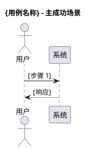
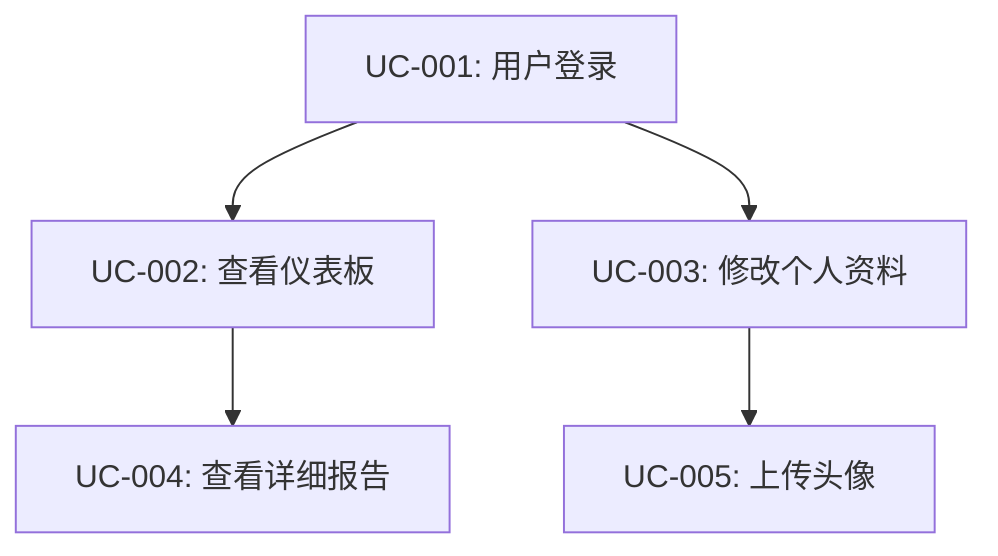
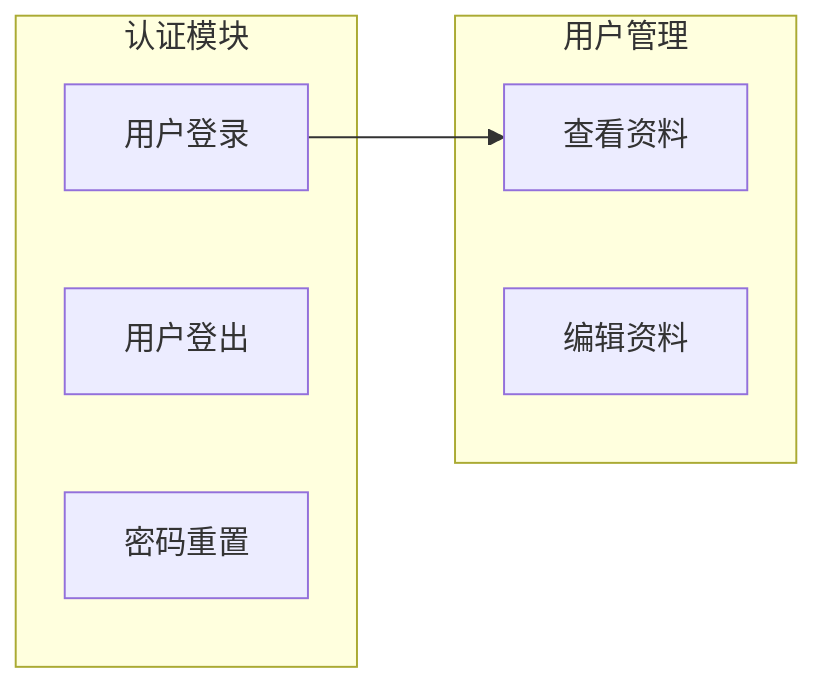

# Use Case Analysis Skill

## Core Responsibility

Elaborate high-level business scenarios into executable detailed use case specifications.

## Workflow

### Input Processing

Scan all available context sources in the current workspace — do not assume fixed file locations. Look for:

- **Scenario document** (required): any file describing functional scenarios, including participants, trigger conditions, preconditions, main flow, alternative flows, exception flows, postconditions, and business rules
- **Existing use case library** (if present): any prior use case definitions to avoid duplication and maintain consistent numbering
- **IR / Requirement document** (supplementary): for cross-referencing functional requirements to ensure full coverage

### Use Case Identification

Each scenario may contain one or more use cases:

- **Main flow** → primary use case
- **Alternative flow** → alternative use case or use case variant
- **Exception flow** → exception handling use case

### Use Case Granularity

```
Too coarse:  An entire business process as a single use case
Just right:  Single goal, clear input/output, independently testable
Too fine:    Every UI interaction is its own use case
```

## Output Format

Generate a `{功能名}用例.md` file (or a contextually appropriate name consistent with the project):

```markdown
# {功能名}用例

## 汇总总结

[确认关联的场景及涉及的用例列表]

## 用例描述

### 用例 1: {用例名称}

| 简要说明 | Actor | 前置条件 | 最小保证 | 成功保证 | 触发事件 | 主成功场景 | 扩展场景 | DFX 属性 |
|---------|-------|---------|---------|---------|---------|-----------|---------|---------|
| [一句话描述] | [角色] | [条件列表] | [最低保证] | [成功保证] | [触发事件] | 1. [步骤1]<br>2. [步骤2]<br>3. [步骤3] | [扩展描述] | 性能: <Xms<br>安全: [要求]<br>可用性: [要求] |



### 用例 2: {用例名称}

...

## 数据字典和附加描述

[关键数据项定义，如字段类型、约束、示例值等]

## 是否影响架构

是/否 [如果"是"，简要解释影响点]
```

## Use Case Discovery Techniques

### Extracting Use Cases from Scenarios

```
1. "这个场景中，用户的核心目标是什么？" → 主用例
2. "达成这个目标有几种路径？" → 识别备选用例
3. "每条路径的输入和输出是什么？" → 定义用例边界
```

### Elaborating Use Case Specifications

```
4. "什么情况下这个用例会失败？" → 识别异常流程
5. "用例成功和失败后，系统状态有什么不同？" → 定义后置条件
6. "这个用例依赖哪些其他用例？" → 建立依赖关系
```

### Validating Use Case Completeness

```
7. "这个用例的输入从哪里来？" → 确认数据来源
8. "这个用例的输出被谁使用？" → 确认数据流向
9. "如何验证这个用例正确实现了？" → 定义验收标准
```

## Scenario-to-Use-Case Mapping

```
场景参与者     → 用例参与者 (Actor)
场景触发条件   → 用例触发事件 (Trigger)
场景前置条件   → 用例前置条件 (Preconditions)
场景主流程     → 用例主成功场景 (Main Success Scenario)
场景备选流程   → 用例扩展场景 (Extensions)
场景异常流程   → 用例异常流程 (Exception Flows)
场景后置条件   → 用例成功保证/最小保证 (Success/Minimal Guarantees)
场景业务规则   → 用例业务规则
```

## Use Case Completeness Checklist

### Table Content
- [ ] Each use case has all 9 columns filled completely
- [ ] Main success scenario steps are clear and executable
- [ ] Extensions cover the primary variants
- [ ] DFX attributes include quantified metrics

### Flow Completeness
- [ ] Main flow steps are clear and executable
- [ ] Every branch has a defined return point or end state
- [ ] Exception flows are covered

### Quality Standards
- [ ] Business rules are explicit and unambiguous
- [ ] DFX attributes are quantified (not vague like "fast" or "high availability")
- [ ] PlantUML diagram accurately reflects the main success scenario

## Use Case Numbering Convention

**Recommended scheme:**

```
UC-[ModuleCode]-[Sequence]
Examples:
- UC-AUTH-001: 用户登录
- UC-AUTH-002: 用户登出
- UC-USER-001: 查看用户资料
- UC-USER-002: 编辑用户资料
```

**Principles:**
- Maintain consistency across the project
- Support easy reference and traceability
- Reserve numbering ranges (e.g., 001–099 for core features, 100–199 for admin features)

## Common Pitfalls

| Pitfall | Signal | Strategy |
|---------|--------|----------|
| **Use case too complex** | A single use case contains multiple business goals | Split into independent use cases |
| **Use case too thin** | Only describes UI actions with no business logic | Focus on the business goal, not the interface interaction |
| **Vague table content** | A column is filled with "TBD" or left blank | Fill with concrete examples |
| **Missing extensions** | Only the happy path is described | Systematically add extension scenarios |
| **DFX without metrics** | "性能快"、"高可用" | Convert to specific, quantifiable standards |
| **Duplicate use cases** | Multiple use cases describe the same function | Merge or clearly articulate the difference |

## Use Case Relationship Diagrams

**Dependency visualization** — use Mermaid to show use case dependencies:



**Use case grouping:**



## Draft Management

**Working draft structure:**

```markdown
# 用例分析工作草稿

## 场景到用例映射
### 场景S-001 → 用例
- UC-001: [用例名] - 状态：草稿/完成
- UC-002: [用例名] - 状态：草稿/完成

## 用例列表（持续更新）
### 核心用例（高优先级）
- UC-001: [用例名] - [简述] - 状态：草稿/完成
### 辅助用例（中优先级）
- UC-010: ...
### 管理用例（低优先级）
- UC-020: ...

## 用例依赖关系
- UC-001 → UC-002, UC-003 (前置)
- UC-004 ← UC-002 (后续)
- UC-005 || UC-006 (可并发)

## 识别的问题
- [ ] 问题1：UC-003的输入格式不明确
- [ ] 问题2：UC-007与UC-008存在功能重叠

## 用户反馈记录
### Q: [关于用例X的问题]
A: [用户回答]
推导：[调整UC-00X的...]
```

## Interaction Tips

**Use case specification dialogue prompts:**

```
1. "让我们明确一下，当用户[执行动作]时，需要提供哪些信息？"
2. "系统处理后，应该返回什么结果？格式是怎样的？"
3. "如果[异常情况]发生，系统应该如何响应？用户能做什么？"
4. "如何判断这个用例成功实现了？有什么具体的标准？"
```

**Data dictionary refinement techniques:**

```
- 使用具体例子："比如用户输入邮箱 'user@example.com'..."
- 展示JSON格式："返回的数据结构是这样的：{...}"
- 明确约束："密码必须包含8-20个字符，至少一个大写字母..."
```

## Handling Difficult Situations

**Situation 1: Data dictionary hard to define**
- Start from the simplest case
- Use an existing API or system as a reference
- Construct example data with the user
- Iterate; don't aim for perfection on the first pass

**Situation 2: Extensions hard to enumerate**
- Focus on high-frequency and high-impact scenarios
- Categorize: input validation errors, permission errors, business rule violations, system errors
- Reference industry-standard error codes
- Maintain a "pending scenarios" list

**Situation 3: Use case boundaries unclear**
- Apply single-responsibility: one use case, one goal
- Identify clear pre- and postconditions
- If a use case is too large, consider splitting
- If a use case is too small, consider merging

## Reference Files

- Detailed use case analysis workflow: see [references/use-case-workflow.md](references/use-case-workflow.md)
- DFX attribute guidelines: see [references/dfx-guidelines.md](references/dfx-guidelines.md)
- Use case template examples: see [references/use-case-template.md](references/use-case-template.md)

## Success Criteria

**Signs this phase is complete:**

1. All scenarios have been mapped to use cases
2. Every use case table is complete and unambiguous
3. Every use case has a corresponding PlantUML main success scenario diagram
4. Data dictionary covers all key data items
5. Architectural impact assessment is complete
6. Use case dependency relationships are clear
7. No outstanding high-priority issues
8. User has confirmed use cases accurately reflect requirements
9. Passed HCritic review

**Signals ready to proceed to next phase:**
- Use cases cover all functional requirements and scenarios
- Use case specifications are detailed enough to serve as a development basis
- No blocking issues remain
- Document quality has passed review