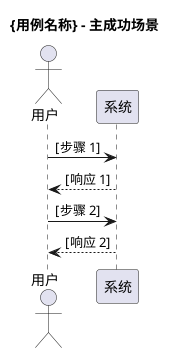
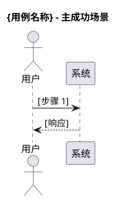
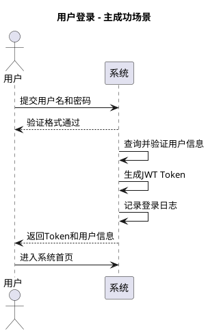

# 用例模板

本文档提供新格式的用例模板，供参考使用。

## 文档结构模板

```markdown
# {功能名}用例

## 汇总总结

[确认关联的场景及涉及的用例列表。例如：本文档基于 `{功能名}场景.md`，涵盖以下用例：]

- UC-XXX-001: [用例名称] — [一句话描述]
- UC-XXX-002: [用例名称] — [一句话描述]

## 用例描述

### 用例 1: {用例名称}

| 简要说明 | Actor | 前置条件 | 最小保证 | 成功保证 | 触发事件 | 主成功场景 | 扩展场景 | DFX 属性 |
|---------|-------|---------|---------|---------|---------|-----------|---------|---------|
| [一句话描述目的和价值] | [主要角色] | [执行前必须满足的条件] | [无论成功与否系统保证的最低条件] | [成功完成后系统保证的条件] | [启动用例的动作或事件] | 1. [步骤1]<br>2. [步骤2]<br>3. [步骤3]<br>4. [步骤4] | [扩展1: 条件→处理]<br>[扩展2: 条件→处理] | 性能: P95 < Xms<br>安全: [要求]<br>可用性: [要求]<br>可靠性: [要求] |



### 用例 2: {用例名称}

| 简要说明 | Actor | 前置条件 | 最小保证 | 成功保证 | 触发事件 | 主成功场景 | 扩展场景 | DFX 属性 |
|---------|-------|---------|---------|---------|---------|-----------|---------|---------|
| ... | ... | ... | ... | ... | ... | ... | ... | ... |



## 数据字典和附加描述

### 关键数据项

| 字段名 | 类型 | 约束 | 示例值 | 说明 |
|-------|------|------|-------|------|
| [字段1] | String | 必填，4-20字符 | "example" | [字段说明] |
| [字段2] | Integer | 可选，> 0 | 100 | [字段说明] |
| [字段3] | Boolean | 必填 | true | [字段说明] |

### 附加描述
[补充说明，如业务规则、依赖关系、特殊处理逻辑等]

## 是否影响架构
否

[或者：是 — 需要引入 [组件/服务/机制]，原因是 [简要解释]]
```

## 示例: 用户登录

```markdown
# 用户认证用例

## 汇总总结

本文档基于 `用户认证场景.md`，涵盖以下用例：

- UC-AUTH-001: 用户登录 — 用户通过用户名和密码验证身份，获得系统访问权限
- UC-AUTH-002: 用户登出 — 用户主动结束会话，清除访问凭证

## 用例描述

### 用例 1: 用户登录

| 简要说明 | Actor | 前置条件 | 最小保证 | 成功保证 | 触发事件 | 主成功场景 | 扩展场景 | DFX 属性 |
|---------|-------|---------|---------|---------|---------|-----------|---------|---------|
| 用户通过用户名和密码验证身份，获得系统访问权限 | 普通用户 | 1. 用户已注册账号<br>2. 账号状态正常<br>3. 系统服务运行中 | 1. 登录尝试被记录<br>2. 账号安全策略被执行 | 1. 用户身份验证通过<br>2. 生成有效会话凭证<br>3. 记录登录日志 | 用户点击"登录"按钮或提交登录表单 | 1. 用户输入用户名和密码<br>2. 系统验证输入格式<br>3. 系统查询并验证用户信息<br>4. 系统生成JWT Token<br>5. 系统记录登录日志<br>6. 系统返回Token和用户信息<br>7. 用户进入系统首页 | 记住我: 生成长效Token (30天)<br>MFA: 发送验证码→用户输入→验证通过后继续<br>异地登录: 发送安全提醒邮件 | 性能: P95 < 500ms<br>安全: bcrypt加密，5次失败锁定15分钟，HTTPS/TLS 1.3<br>可用性: 99.9%<br>可靠性: 登录日志持久化 |



## 数据字典和附加描述

### 关键数据项

| 字段名 | 类型 | 约束 | 示例值 | 说明 |
|-------|------|------|-------|------|
| username | String | 必填，4-20字符，字母数字下划线 | "john_doe123" | 用户账号名 |
| password | String | 必填，8-20字符 | "********" | 用户密码（传输加密） |
| rememberMe | Boolean | 可选 | true | 是否生成长效Token |
| token | String (JWT) | 系统生成 | "eyJhbGci..." | 访问凭证，有效期24小时 |
| refreshToken | String (UUID) | 系统生成 | "550e8400-..." | 刷新凭证，有效期7天 |

### 附加描述
- 业务规则：连续5次登录失败锁定账号15分钟
- 业务规则：Token有效期24小时，RefreshToken有效期7天
- 依赖关系：前置用例 UC-AUTH-003 (用户注册)，后续用例 UC-USER-001 (查看个人信息)

## 是否影响架构
否
```

## 模板使用说明

1. **复制模板**: 复制整个文档结构作为起点
2. **填写汇总**: 先列出所有用例，再逐一详细描述
3. **填写表格**: 按列填入具体内容，主成功场景用 `<br>` 分隔步骤
4. **绘制图表**: PlantUML 图反映主成功场景的核心交互步骤
5. **数据字典**: 列出关键字段定义，无复杂数据结构时可简写
6. **架构影响**: 明确是/否，"是"则简要说明影响点

## 常见错误避免

1. ❌ 主成功场景步骤过于详细（UI操作级别）
2. ❌ DFX属性使用模糊描述如"快速"、"高可用"
3. ❌ 数据字典遗漏关键字段
4. ❌ PlantUML图与主成功场景步骤不一致
5. ✅ 保持用户视角，描述业务目标
6. ✅ DFX属性提供量化指标
7. ✅ PlantUML图简洁清晰，反映核心流程
