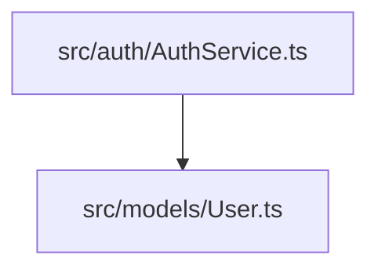
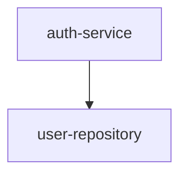

## Project Analysis 工作流

本工作流由 **HAnalysis** 执行，严格遵循线性执行顺序。每个阶段必须按照 `Single-Stage Processing Pipeline` 执行后方可进入下一阶段。

**执行链条：**
`systemAnalysis` → `componentAnalysis` → `missingCoverageCheck`

---

## 术语表

| 术语 | 定义 |
|------|------|
| **目标项目 (Target Project)** | 被分析的外部项目（在阶段1提供路径） |
| **分析根目录 (Analysis Root)** | 目标项目中的 `.hyper-designer/projectAnalysis/` 目录 |
| **组件 (Component)** | 具有清晰职责边界的代码逻辑单元（在阶段1自动发现） |
| **覆盖率 (Coverage)** | 源代码在所有维度上被文档化和分析的程度 |
| **维度 (Dimension)** | 分析的特定视角或方面（架构5维度、组件4维度） |

---

## 输出文件约定（纯 Markdown）

所有分析工件以纯 Markdown 格式输出，无需 JSON 清单文件。阶段间通过 Markdown 文件交换数据。

### 输出目录结构

```
.hyper-designer/projectAnalysis/
├── architecture.md              # 系统架构分析（5维度 + Mermaid图表）
├── components-manifest.md       # 组件清单（Markdown表格）
├── api-catalog.md               # API目录
├── source-overview.md           # 源码概览
├── components/                  # 组件分析目录
│   └── {componentSlug}.md       # 每个组件的4维度分析
├── component-analysis-summary.md # 组件分析汇总报告
└── coverage-report.md           # 覆盖率检查报告（含判定、严重性、修复建议）
```

### Markdown 驱动的交接

所有阶段通过 `.md` 文件交换数据。下游阶段不得重新扫描源代码，必须使用上游阶段生成的 Markdown 文件作为唯一事实来源。各文件的用途：

- `components-manifest.md`：阶段2的唯一事实来源，包含所有待分析组件列表
- `architecture.md`：阶段3的系统级参照基准
- `components/{componentSlug}.md`：阶段3的组件级分析输入

---

## 架构分析维度定义（5维度）

系统级分析（`architecture.md`）必须涵盖以下5个架构维度。

### 1. Structure（结构）

**目的**：理解代码库的整体组织和布局。

**分析重点**：
- 目录结构和组织模式
- 模块边界和关注点分离
- 分层架构（API层、业务层、数据层、UI层、中间件层、工具层）
- 包/模块组成
- 物理结构与逻辑结构的对齐

**必需输出**：
- 目录树可视化（Mermaid `graph TD`）
- 分层架构图（Mermaid `graph LR`）
- 模块职责矩阵
- 识别的结构模式（如 MVC、Clean Architecture、Hexagonal）

### 2. Dependencies（依赖关系）

**目的**：映射模块、组件和外部库之间的关系网络。

**分析重点**：
- 内部依赖（模块间、组件间）
- 外部依赖（第三方库、框架）
- 依赖方向和循环依赖
- 耦合级别（紧耦合 vs 松耦合）
- 依赖注入模式

**必需输出**：
- 依赖图（Mermaid `graph TD`）
- 依赖矩阵
- 循环依赖报告（如有）
- 外部依赖清单
- 耦合分析

### 3. Data Flow（数据流）

**目的**：追踪数据从输入到存储再返回的完整路径。

**分析重点**：
- 入口点（API端点、事件处理器、CLI命令）
- 数据转换步骤
- 验证和清洗点
- 数据库操作和查询
- 缓存策略
- 异步处理模式

**必需输出**：
- 数据流图（Mermaid `sequenceDiagram` / `graph LR`）
- 关键路径分析
- 数据转换管道文档
- 数据库交互模式
- 缓存策略文档

### 4. State Management（状态管理）

**目的**：理解系统如何在请求和组件之间管理和持久化状态。

**分析重点**：
- 内存状态模式（单例、全局变量、缓存）
- 数据库状态（模式、模型、迁移）
- 会话管理
- 分布式状态（Redis、消息队列）
- 状态同步机制
- 不可变 vs 可变状态模式

**必需输出**：
- 状态模型图（Mermaid `classDiagram` / `stateDiagram` / `erDiagram`）
- 数据库模式文档
- 状态生命周期文档
- 并发控制机制
- 状态持久化策略

### 5. Patterns and Anti-Patterns（模式与反模式）

**目的**：识别正在使用的架构模式和可能导致问题的反模式。

**分析重点**：
- 设计模式（Singleton、Factory、Observer、Strategy 等）
- 架构模式（MVC、MVP、MVVM、Clean Architecture 等）
- 反模式（God Objects、Spaghetti Code、Magic Numbers 等）
- 代码异味（Long Methods、Large Classes、Duplicated Code 等）
- SOLID 原则遵从度
- DRY（Don't Repeat Yourself）违规
- YAGNI（You Aren't Gonna Need It）违规

**必需输出**：
- 模式清单及位置
- 反模式目录（含严重性评级）
- SOLID 原则评估
- 代码质量指标
- 重构建议

### 维度交叉关系

各维度相互关联：
- **结构**影响**依赖关系**（组织方式影响耦合）
- **依赖关系**影响**数据流**（耦合影响流模式）
- **数据流**影响**状态管理**（流决定状态变更）
- **状态管理**影响**模式**（状态复杂度影响模式选择）
- **模式**影响**结构**（模式指导组织方式）

分析应识别这些关系并记录维度之间如何相互强化或冲突。

---

## 组件分析维度定义（4维度）

组件级分析（`components/{componentSlug}.md`）必须涵盖以下4个维度。每个组件独立分析。

### 1. Responsibility（职责）

**目的**：定义组件做什么及其单一职责。

**分析重点**：
- 主要用途和业务逻辑
- 范围边界（哪些在范围内、哪些不在）
- 职责内聚度
- 单一职责原则（SRP）遵从度
- 封装的业务规则
- 副作用和外部交互

**必需输出**：
- 职责声明（1-2句话）
- 范围内功能列表
- 范围外排除项
- 职责内聚度评分
- 业务规则清单

### 2. Interfaces（接口）

**目的**：记录所有公开契约和通信边界。

**分析重点**：
- 公开API表面（函数、方法、类）
- 输入参数和验证
- 返回类型和错误处理
- 事件发射（如适用）
- 对其他组件的依赖
- 协议规范（HTTP、RPC、基于事件）

**必需输出**：
- 接口清单表格
- 输入/输出规格
- 错误契约文档
- 依赖列表（含耦合级别）
- 接口图（Mermaid `classDiagram`）
- 用法示例

### 3. Data and State（数据与状态）

**目的**：理解组件内的数据结构、状态管理和持久化。

**分析重点**：
- 内部数据结构（类、类型、模式）
- 状态变量及其生命周期
- 数据转换逻辑
- 持久化机制（如有）
- 状态变更模式
- 不可变 vs 可变数据
- 线程安全考量

**必需输出**：
- 数据模型文档
- 状态变量清单
- 组件内数据流（Mermaid `graph LR`）
- 持久化策略（如适用）
- 状态变更模式
- 数据验证规则

### 4. Positioning（定位）

**目的**：将组件置于更广泛的系统上下文中，识别其架构角色。

**分析重点**：
- 层归属（API层、业务层、数据层、UI层、中间件层、工具层）
- 子域或有界上下文映射
- 调用层次中的位置（上游/下游）
- 部署边界
- 扩展特性
- 关键性级别（核心 vs 辅助）
- 与业务能力的关系

**必需输出**：
- 层分类
- 子域映射
- 上游/下游依赖
- 部署单元规格
- 扩展特性
- 关键性评估
- 业务能力映射

### 组件 IOP 摘要表

每个组件分析必须包含一个摘要表：

| 维度 | 描述 |
|------|------|
| **Input（输入）** | 外部依赖、API参数、事件订阅 |
| **Output（输出）** | 公开API、发射的事件、数据转换 |
| **Position（定位）** | 层、子域、调用层次位置、部署单元 |

### 组件粒度指南

组件分析应尊重阶段1确定的粒度：
- **过细**：文件级分析（避免——组件过多）
- **过粗**：整个项目作为一个组件（避免——丢失结构）
- **恰到好处**：具有清晰职责边界的逻辑单元

---

## Mermaid 图表约定

所有分析工件中的图表必须遵循以下约定。

### 支持的图表类型

| 类型 | 用途 | 适用阶段 |
|------|------|----------|
| `graph TD` | 层次结构、目录结构、依赖树 | 全部 |
| `graph LR` | 流程、管道、交互 | 全部 |
| `sequenceDiagram` | 请求-响应流、调用序列 | 全部 |
| `classDiagram` | 数据模型、类结构、接口 | 全部 |
| `stateDiagram` | 状态机、生命周期 | 全部 |
| `erDiagram` | 数据库模式、实体关系 | 全部 |
| `gantt` | 时间线、流程 | 可选 |
| `pie` | 统计、分布 | 可选 |

### 图表命名规则

每个图表必须有描述性标题：

````markdown
```mermaid
graph TD
    title 系统架构概览
    ...
```
````

### 节点命名约定

**文件和模块**：使用相对于目标项目根目录的完整路径：
````markdown

````

**组件**：使用 `components-manifest.md` 中的组件 slug：
````markdown

````

**层级**：使用标准层级名称：
````markdown

````

### 边类型

| 边类型 | 样式 | 含义 |
|--------|------|------|
| 直接依赖 | `-->` | 标准依赖 |
| 弱依赖 | `-.->` | 可选或间接 |
| 双向 | `<-->` | 循环依赖（警告） |
| 数据流 | `==>` | 数据移动 |
| 控制流 | `-->` | 执行顺序 |

### 图表大小限制

- 最大节点数：50
- 最大边数：100
- 最大嵌套深度：5层

超出限制时拆分为多个图表并编号。

### 图表放置位置

**在 `architecture.md` 中**：将图表放在相关维度章节内。

**在 `components/{componentSlug}.md` 中**：将图表放在相关维度章节内。

### 图表维护要求

所有图表必须包含更新提醒：

```markdown
> **更新提醒**：此图表反映 [日期] 时的架构。当代码结构变更时，请更新此图表以保持准确性。
```

---

## 代码引用规则

所有分析工件必须使用标准化引用格式引用源代码。

### 引用格式

**行内引用**（引用特定文件或代码元素）：
```
[File: 相对路径/文件.ts:行范围]
```

**块引用**（描述较大的代码块或多个文件）：
```markdown
**实现：**

- 认证逻辑: [File: src/auth/AuthService.ts]
- 用户模型: [File: src/models/User.ts]
- 路由配置: [File: src/api/routes.ts]
```

**函数/类引用**（引用特定函数或类）：
```
[Function: 函数名 in File: 相对路径/文件.ts:行范围]
[Class: 类名 in File: 相对路径/文件.ts:行范围]
```

### 引用规则

1. **使用相对路径**：始终使用相对于目标项目根目录的路径
   - 正确：`src/auth/AuthService.ts`
   - 错误：`/home/user/project/src/auth/AuthService.ts`
   - 错误：`AuthService.ts`（模糊）

2. **包含行范围**：行内引用必须包含行范围
   - 正确：`[File: src/auth/AuthService.ts:45-78]`
   - 错误：`[File: src/auth/AuthService.ts]`（过于宽泛）

3. **精确引用**：引用最小的相关单元
   - 正确：`[Function: validateToken in File: src/auth/AuthService.ts:45-78]`
   - 错误：`[File: src/auth/AuthService.ts]`（过于宽泛）

4. **验证存在性**：所有引用必须指向实际存在的文件

5. **避免过度引用**：不要逐行引用——引用有意义的代码单元

6. **分组相关引用**：多个相关引用应分组展示

---

## 阶段定义与执行规范

以下定义涵盖所有3个阶段。Agent在执行对应阶段时，必须严格遵循下述的输入、行动指引与输出规范。

### 阶段 1：systemAnalysis (系统分析)

**执行者：** HAnalysis
**核心目标：** 发现目标项目的架构、组件、API 和源代码结构，生成系统级分析报告和组件清单。

**输入依赖：**

- 用户提供的目标项目路径（在阶段开始时询问）

**执行行动指引：**

1. **建立分析上下文**：首先询问用户目标项目的绝对路径、项目领域和分析范围。
2. **扫描分析边界**：确定排除目录（node_modules, .git, dist等）、包含的语言和框架。
3. **分析5个架构维度**：
    - Structure（结构）：目录结构、模块边界、分层架构
    - Dependencies（依赖关系）：内部/外部依赖、循环依赖、耦合分析
    - Data Flow（数据流）：入口点、数据转换、缓存策略
    - State Management（状态管理）：内存状态、数据库、会话管理
    - Patterns and Anti-Patterns（模式与反模式）：设计模式、反模式、SOLID评估
4. **生成源代码概览**：创建完整的源文件清单，包括语言分布和大小指标。
5. **生成组件清单**：识别所有逻辑组件，定义其边界和依赖关系。
6. **生成输出**：
    - `.hyper-designer/projectAnalysis/architecture.md` - 系统架构分析（含5维度分析和Mermaid图表）
    - `.hyper-designer/projectAnalysis/components-manifest.md` - 组件清单（Markdown表格，含组件slug、路径、描述、层级）
    - `.hyper-designer/projectAnalysis/api-catalog.md` - API目录（Markdown表格，含端点、方法、参数、返回类型）
    - `.hyper-designer/projectAnalysis/source-overview.md` - 源码概览（目录结构、语言分布、文件统计）

**输出交付物：**

| 文件 | 描述 |
|------|------|
| `architecture.md` | 系统架构分析报告（5维度 + Mermaid图表） |
| `components-manifest.md` | 组件清单（阶段2的唯一事实来源） |
| `api-catalog.md` | API目录和组件映射 |
| `source-overview.md` | 源文件清单和统计 |

### 阶段 2：componentAnalysis (组件分析)

**执行者：** HAnalysis
**核心目标：** 基于阶段1的组件清单，并行分析每个组件的4个维度，生成组件级分析报告。

**输入依赖：**

- `.hyper-designer/projectAnalysis/components-manifest.md`（唯一事实来源，不得重新扫描）

**执行行动指引：**

1. **加载组件清单**：从 `components-manifest.md` 读取完整的组件列表。
2. **并行分析组件**：对每个组件执行4个维度的分析：
    - Responsibility（职责）：主要职责、范围边界、SRP遵从
    - Interfaces（接口）：公开API、输入输出、错误处理
    - Data and State（数据与状态）：数据结构、状态变量、持久化
    - Positioning（定位）：层级归属、子域映射、调用层次
3. **生成组件输出**：为每个组件生成：
    - `.hyper-designer/projectAnalysis/components/{componentSlug}.md` - 包含4维度分析、IOP摘要表、Mermaid图表
4. **生成汇总报告**：验证清单与实际输出的一致性，聚合质量指标。
    - `.hyper-designer/projectAnalysis/component-analysis-summary.md` - 汇总所有组件的分析结果

**输出交付物：**

| 文件 | 描述 |
|------|------|
| `components/{componentSlug}.md` | 每个组件的4维度分析报告 |
| `component-analysis-summary.md` | 所有组件分析的汇总报告 |

### 阶段 3：missingCoverageCheck (缺失覆盖率检查)

**执行者：** HAnalysis
**核心目标：** 严格验证所有维度的覆盖率，识别缺失的分析内容，生成诊断报告。

**输入依赖：**

- `.hyper-designer/projectAnalysis/architecture.md`
- `.hyper-designer/projectAnalysis/components-manifest.md`
- `.hyper-designer/projectAnalysis/components/{componentSlug}.md`（所有组件）
- `.hyper-designer/projectAnalysis/api-catalog.md`
- `.hyper-designer/projectAnalysis/source-overview.md`

**执行行动指引：**

1. **加载所有 Markdown 文件**：读取阶段1和阶段2生成的所有 `.md` 文件。
2. **执行7类严格检查**：
    - 缺失组件（清单中引用但未定义分析）
    - 缺失文件（引用但不存在的源文件）
    - 缺失文件夹（预期目录结构缺失）
    - API识别遗漏（代码中使用但未记录在 `api-catalog.md`）
    - Mermaid覆盖不足（关键图表缺失或不完整）
    - 跨引用损坏（Markdown文件间无效链接）
    - 系统/组件不一致（系统规格与组件分析不匹配）
3. **生成诊断报告**：
    - `.hyper-designer/projectAnalysis/coverage-report.md` - 包含结构化判定、严重性评级、受影响工件列表、修复建议

**输出交付物：**

| 文件 | 描述 |
|------|------|
| `coverage-report.md` | 覆盖率检查报告（含判定、严重性、修复建议） |

---

## 工作流特性说明

### 非阻塞验证模式

本工作流使用报告和测试验证而非质量门阻塞。阶段3的缺失覆盖率检查是诊断工具，不会阻止工作流推进。检查结果用于：

- 生成覆盖率报告供人工审查
- 在测试套件中进行自动化断言
- 指导后续迭代和改进工作

### Markdown 驱动的交接

所有阶段通过 `.md` 文件交换数据。下游阶段不得重新扫描源代码，必须使用上游阶段生成的 Markdown 文件作为唯一事实来源。这种方式的优势：

- 人类可读且可编辑
- 无需额外的解析工具
- 支持版本控制和差异比较
- 天然支持增量更新

### 增量分析支持

所有工件支持恢复/重新运行，通过在重新生成前检查现有 Markdown 文件。如果文件已存在且有效，可以跳过该部分的分析，直接使用现有结果。
