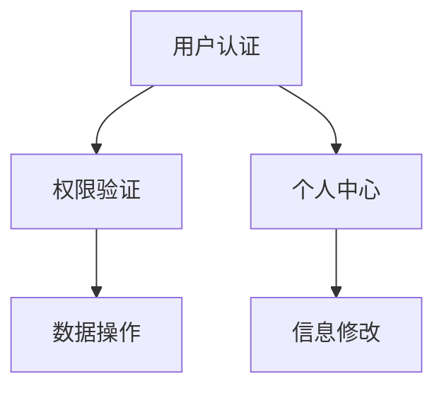

# Skill: Functional List Refinement (功能列表梳理)

## 技能用途

基于用例文档进行技术功能拆解，区分前后端职责，识别隐性需求，评估复杂度，分析功能间依赖与影响。

## 何时加载此技能

- 当workflow状态为 `functionalRefinement`
- 当需要从用例中提取技术功能列表时
- 当需要分析功能对现有系统的影响时
- 当需要进行前后端功能职责划分时

## 核心指导原则

### 1. 功能提取方法论

**从用例到功能的映射：**

```
用例主流程     → 核心功能
用例输入验证   → 校验功能（前后端分离）
用例业务规则   → 业务逻辑功能
用例异常处理   → 容错/降级功能
用例非功能需求 → 性能/安全/监控功能
```

**功能粒度控制：**

```
太粗：整个模块作为一个功能
合适：单一职责、独立可实现、独立可测试、可独立部署
太细：每个字段验证都是一个功能
```

**技术栈分层原则：**

- **前端**：UI渲染、用户交互、表单校验（格式级）、状态管理
- **后端**：业务逻辑、数据校验（业务级）、权限控制、流程编排
- **数据库**：数据持久化、事务管理、索引优化
- **第三方服务**：外部API调用、消息推送、支付/文件存储等

### 2. 功能列表输出格式

**输出文件：** `{功能名}功能列表.md`

**文档结构：**

```markdown
# {系统名称} 功能列表

## 1. 功能分析思路与结果总结

### 1.1 分析思路
1. **用例拆解**：从用例主流程、备选流程、异常流程中提取功能点
2. **技术分层**：按前端/后端/数据库/第三方服务进行职责划分
3. **隐性需求识别**：补充业务未明确但技术必需的功能（幂等、日志、监控等）
4. **影响分析**：评估新功能对现有功能的依赖和影响
5. **复杂度评估**：基于实现难度、技术风险、依赖关系综合评估

### 1.2 结果总结
- **总功能数**：X个
- **前端功能**：Y个
- **后端功能**：Z个
- **数据库功能**：W个
- **第三方服务**：V个

## 2. 功能拆解清单

| 功能点名称 | 归属 | 功能描述 | 隐性需求 | 复杂度预估 |
|-----------|------|---------|---------|-----------|
| 用户登录表单 | 前端 | 登录页面UI渲染，表单输入，前端格式校验 | 表单防重复提交、加载状态管理、错误友好提示 | 低 |
| 用户认证接口 | 后端 | 验证用户凭证，生成会话令牌，返回用户信息 | 密码加密存储、登录失败锁定、登录日志审计、Token过期策略 | 中 |
| 会话数据存储 | 数据库 | 存储用户会话信息，支持会话过期自动清理 | 索引优化、定时清理任务 | 低 |

### 2.1 核心功能组

#### F-001: [功能点名称]

| 属性 | 内容 |
|------|------|
| **功能点名称** | 用户登录认证 |
| **归属** | 后端 |
| **功能描述** | 验证用户账号密码，生成JWT令牌，管理用户会话状态。包含密码比对、账号状态检查、登录失败处理等业务逻辑。 |
| **隐性需求** | 1. 密码必须bcrypt加密存储<br>2. 连续5次登录失败锁定账号15分钟<br>3. 所有登录操作记录审计日志<br>4. Token需设置合理过期时间(2小时)<br>5. 支持Token刷新机制<br>6. 异地登录检测与提醒 |
| **复杂度预估** | 中 |
| **来源用例** | UC-001 用户登录 |
| **依赖功能** | 用户数据查询(F-002)、日志记录(F-010) |
| **影响功能** | 所有需要认证的功能 |
| **数据校验职责** | 前端：格式校验(邮箱格式、密码长度)<br>后端：业务校验(账号是否存在、密码是否正确、账号是否被锁定) |
| **异步处理** | 登录日志异步写入 |
| **验收标准** | 1. 正确账号密码返回有效Token<br>2. 错误密码记录失败次数<br>3. 锁定账号拒绝登录并提示<br>4. Token过期后自动跳转登录 |

### 2.2 辅助功能组
...

### 2.3 管理功能组
...

## 3. 功能依赖与影响分析

### 3.1 功能依赖关系图


### 3.2 功能影响矩阵

| 新功能 | 影响现有功能 | 影响类型 | 影响程度 | 应对措施 |
|--------|-------------|---------|---------|---------|
| 新支付流程 | 订单管理 | 接口变更 | 高 | 订单状态机同步更新 |
| 新用户等级 | 积分系统 | 数据关联 | 中 | 增加等级字段，历史数据迁移 |

### 3.3 数据库变更影响

| 表名 | 变更类型 | 影响功能 | 迁移策略 |
|------|---------|---------|---------|
| users | 新增字段 | 用户管理、认证 | 默认值填充 |
| orders | 修改索引 | 订单查询 | 重建索引 |

## 4. 技术职责划分说明

### 4.1 数据校验职责边界

| 校验类型 | 前端职责 | 后端职责 |
|---------|---------|---------|
| 格式校验 | 邮箱格式、手机号格式、必填项 | 重复校验（二次确认） |
| 业务校验 | - | 账号是否存在、余额是否充足、权限是否足够 |
| 安全校验 | 基础XSS过滤 | SQL注入防护、CSRF防护、完整XSS过滤 |

### 4.2 异步处理功能清单

| 功能点 | 触发条件 | 处理方式 | 失败策略 |
|--------|---------|---------|---------|
| 发送通知 | 订单完成 | 消息队列 | 重试3次后告警 |
| 生成报表 | 定时任务 | 异步任务 | 人工介入 |
| 数据同步 | 数据变更 | 事件驱动 | 补偿机制 |

## 5. 复杂度评估标准

### 5.1 评估维度

| 维度 | 低(1-3分) | 中(4-6分) | 高(7-10分) |
|------|----------|----------|-----------|
| 实现难度 | 标准CRUD | 涉及业务规则 | 复杂算法/架构设计 |
| 技术风险 | 成熟方案 | 有参考案例 | 新技术/不确定性高 |
| 依赖关系 | 独立实现 | 2-3个依赖 | 复杂依赖网络 |
| 测试难度 | 单测覆盖 | 集成测试 | 需专项测试方案 |

### 5.2 复杂度总分计算

```
总分 = 实现难度 + 技术风险 + 依赖关系 + 测试难度

低复杂度：总分 ≤ 12
中复杂度：13 ≤ 总分 ≤ 20  
高复杂度：总分 ≥ 21
```

## 6. 隐性需求检查清单

### 6.1 必做隐性需求（不被业务提及但技术必需）

| 类别 | 检查项 | 适用场景 |
|------|--------|---------|
| 幂等性 | 接口是否需幂等控制 | 支付、提交、更新操作 |
| 日志 | 操作日志是否需记录 | 所有写操作 |
| 监控 | 关键指标是否需监控 | 核心业务流程 |
| 限流 | 接口是否需限流保护 | 公开接口、高频调用 |
| 降级 | 失败时是否有降级方案 | 依赖外部服务的功能 |
| 缓存 | 是否需缓存提升性能 | 高频查询、数据不常变 |
| 并发 | 是否需考虑并发控制 | 库存、余额等关键数据 |
| 备份 | 关键数据是否需备份 | 用户数据、订单数据 |

### 6.2 安全隐性需求

| 检查项 | 说明 | 优先级 |
|--------|------|--------|
| 输入验证 | 所有用户输入服务端必须二次验证 | P0 |
| 输出编码 | 防止XSS，所有输出需编码 | P0 |
| 权限校验 | 每个接口必须验证用户权限 | P0 |
| 敏感数据加密 | 密码、身份证号等必须加密存储 | P0 |
| SQL注入防护 | 使用参数化查询或ORM | P0 |
| CSRF防护 | 状态变更操作需CSRF Token | P1 |
| 敏感操作审计 | 删除、修改权限等操作需记录 | P1 |

## 7. 实战工作流程

### 7.1 功能分析五步法

```
步骤1: 读取用例文档
  ↓ 提取主流程、备选流程、异常流程
步骤2: 功能拆解  
  ↓ 将每个流程拆解为技术功能点
步骤3: 职责划分
  ↓ 区分前端/后端/数据库/第三方服务
步骤4: 隐性需求补充
  ↓ 添加幂等、日志、监控等技术必需功能
步骤5: 影响分析
  ↓ 分析功能间依赖，评估对现有系统影响
```

### 7.2 与用户协作模式

**功能确认对话：**

```
"我从用例中提取了X个功能点，按前后端划分如下：

【前端功能】
- 用户登录表单（低复杂度）
- 登录状态管理（中复杂度）

【后端功能】
- 用户认证接口（中复杂度）
- 会话管理服务（低复杂度）

请确认：
1. 功能拆分是否合理？
2. 复杂度评估是否准确？
3. 是否遗漏了重要功能？"
```

**隐性需求确认：**

```
"对于'用户登录'功能，我识别出以下隐性需求：
- 连续5次登录失败需锁定账号（安全措施）
- 所有登录操作需记录审计日志（合规要求）
- 需支持Token刷新机制（用户体验）

这些是否都需要实现？"
```

**影响分析确认：**

```
"新功能'会员等级'会影响现有功能：
- 积分系统：需增加等级字段（中影响）
- 用户画像：需关联等级数据（低影响）

是否需要调整现有功能设计？"
```

### 7.3 草稿管理模板

```markdown
# 功能列表梳理工作草稿

## 用例到功能映射
- UC-001 用户登录 → F-001(前端表单), F-002(后端认证)
- UC-002 商品浏览 → F-003(前端列表), F-004(后端查询)

## 技术职责划分讨论
- F-002 认证逻辑：确认放在后端，前端只做展示
- F-003 数据校验：前端格式校验，后端业务校验

## 隐性需求识别
- F-002 认证：
  - [x] 密码加密存储
  - [x] 登录失败锁定
  - [x] 操作日志记录
  - [x] Token过期策略

## 影响分析
- 新增F-005 用户等级：
  - 影响：用户表结构变更
  - 影响：积分计算逻辑
  - 应对：数据库迁移脚本

## 复杂度评估复核
- F-006 支付接口：初评中 → 复评高（涉及第三方对接）

## 待确认问题
- [ ] F-007 的消息推送用同步还是异步？
- [ ] F-008 的文件上传大小限制多少？
```

## 8. 质量检查清单

### 8.1 功能列表质量检查

```
□ 所有用例都已映射到功能
□ 功能按前端/后端/数据库/第三方服务正确分类
□ 每个功能都有清晰的隐性需求说明
□ 数据校验职责划分明确
□ 异步处理功能已识别
□ 复杂度评估有依据
□ 功能依赖关系清晰
□ 对现有功能的影响已分析
```

### 8.2 隐性需求检查

```
□ 所有写操作考虑幂等性
□ 所有关键操作考虑日志记录
□ 所有接口考虑安全校验
□ 所有外部调用考虑降级方案
□ 所有敏感数据考虑加密
□ 所有定时任务考虑失败重试
```

## 9. 成功标准

**该阶段成功的标志：**

1. ✅ 功能列表完整，覆盖所有用例
2. ✅ 前后端职责划分清晰合理
3. ✅ 隐性需求识别充分
4. ✅ 复杂度评估客观有据
5. ✅ 功能间依赖关系明确
6. ✅ 对现有系统影响已评估
7. ✅ 文档结构清晰、内容完整
8. ✅ 用户确认功能列表和技术方案
9. ✅ 通过HCritic审查

**准备进入下一阶段的信号：**

- 功能列表可作为开发任务拆分的基础
- 技术方案已明确前后端接口和数据结构
- 隐性需求已纳入开发计划
- 影响评估可指导现有功能调整
- 无阻塞性技术问题
