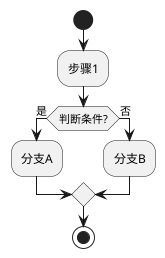
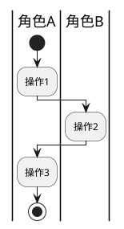

# Skill: Functional List Refinement (功能列表梳理)

## 技能用途

基于用例文档进行功能拆解，分析功能业务规则与约束，评估功能对现有系统的影响，产出结构化功能列表。

## 何时加载此技能

- 当workflow状态为 `functionalRefinement`
- 当需要从用例中提取功能列表时
- 当需要分析功能对现有系统的影响时
- 当需要进行功能优先级排列时

## 核心指导原则

### 1. 功能提取方法论

**从用例到功能的映射：**

```
用例主流程     → 核心功能
用例备选流程   → 可选功能/分支功能
用例异常处理   → 容错/降级功能
用例业务规则   → 功能规则约束
用例非功能需求 → 性能/安全约束
```

**功能粒度控制：**

```
太粗：整个模块作为一个功能
合适：单一职责、独立可实现、独立可测试
太细：每个字段验证都是一个功能
```

**新增 vs 修改功能识别：**

- **新增功能**：用例描述的全新业务能力，现有系统中不存在对应实现
- **修改功能**：用例描述的业务变化，需要调整现有功能的行为或规则

### 2. 功能列表输出格式

**主要输出文件：** `{功能名}功能列表.md`

参见 `references/functional-list-template.md` 了解功能列表模板格式。

**辅助输出文件（仅高风险功能需要）：** `{功能名}FMEA.md`

参见 `references/fmea-template.md` 了解FMEA模板格式。

### 3. 活动图分析（PlantUML）

**何时必须使用活动图：**
- 用例流程复杂，包含多个分支和判断
- 涉及多个系统或角色交互
- 需要清晰展示业务流程流转
- 异常处理路径较多

**活动图分析原则：**
- 使用 PlantUML 语法绘制
- 复杂流程必须使用泳道区分角色/系统
- 覆盖主流程、备选流程、异常流程
- 活动图嵌入功能列表文档的功能分析思路部分

**PlantUML 活动图基本语法：**



**泳道活动图（多角色协作）：**



### 4. NFR/DFX 提取方法论

**NFR 来源定义：**

NFR（非功能需求）和 DFX（Design for X）属性从多个上游文档提取：
- **IR 约束**：初始需求分析中的非功能约束（如性能要求、安全标准）
- **场景需求**：场景分析中的非功能需求（如可扩展性、可维护性）
- **用例 DFX 属性**：用例规格中的 DFX 属性章节（性能、安全、可靠、隐私）

**提取算法：**

```
步骤 1: 扫描所有上游文档（IR、场景、用例）
步骤 2: 提取每个 DFX 类别的指标
  - 性能：响应时间、吞吐量、并发数
  - 安全：认证等级、加密标准、权限控制
  - 可靠：可用性、故障恢复、数据完整性
  - 隐私：数据脱敏、访问审计、合规性
步骤 3: 按类别聚合，应用 strictest-metric 规则
```

**整合规则（strictest-metric）：**

当多个用例或上游文档对同一 DFX 类别提出不同指标时：
- **数值型**：取最严格值（如响应时间取最小值，可用性取最大值）
- **枚举型**：取最高标准（如加密标准取 AES-256 而非 AES-128）
- **冲突解决**：优先级为 IR 约束 > 场景需求 > 用例 DFX 属性

**输出格式：**

NFR/DFX 汇总表应包含：
| DFX 类别 | 指标名称 | 指标值 | 来源 | 说明 |
|---------|---------|--------|------|------|
| 性能 | 响应时间 | ≤ 200ms | UC-003 DFX | 查询接口 |
| 安全 | 加密标准 | AES-256 | IR 约束 | 全局要求 |

**来源归属要求：**

每个 NFR 指标必须标注来源：
- `IR 约束`：从需求信息.md 提取
- `场景需求`：从功能场景.md 提取
- `UC-NNN DFX`：从具体用例的 DFX 属性章节提取

### 5. SR 映射方法论

**SR ID 格式：**

系统需求编号采用格式：`SR-NNN`
- NNN：三位数字，从 001 开始递增
- 示例：SR-001, SR-002, SR-003

**SR 映射原则：**

从功能到系统需求的映射必须支持可追溯性：

```
UC-NNN → F-NNN → SR-NNN

用例编号 → 功能编号 → 系统需求编号
```

**映射表格式：**

| 功能编号 | 功能名称 | SR 编号 | SR 描述 | 关联用例 |
|---------|---------|---------|---------|---------|
| F-001 | 用户登录认证 | SR-001 | 实现用户身份验证 | UC-001 |
| F-002 | 登录状态管理 | SR-002 | 管理用户会话状态 | UC-001 |

**可追溯性检查：**

```
□ 每个功能至少映射一个 SR
□ 每个映射到 SR 的功能都有关联的用例
□ SR 编号不重复、不遗漏
□ SR 描述独立完整，可被 HEngineer 分解为 AR
```

## 实战工作流程

### 功能分析四步法

```
步骤1: 读取用例文档
  ↓ 提取主流程、备选流程、异常流程
步骤2: 功能拆解
  ↓ 将每个流程拆解为功能点，识别新增/修改功能
步骤3: 规则与约束梳理
  ↓ 为每个功能整理业务规则和约束条件
步骤4: 影响分析
  ↓ 填写功能影响分析表格，评估对现有功能的影响
步骤5: NFR/DFX 提取与 SR 映射
  ↓ 从上游文档提取 NFR，为每个功能分配 SR 编号，建立可追溯链
```

### 与用户协作模式

**功能确认对话：**

```
"我从用例中提取了X个功能点：

【新增功能】
- F001 用户登录认证（Must）
- F002 登录状态管理（Must）

【修改功能】
- F005 用户管理（需增加角色字段）（Should）

请确认：
1. 功能拆分是否合理？
2. 是否有遗漏的功能？
3. 优先级是否准确？"
```

**影响分析确认：**

```
"新功能'会员等级'会影响现有功能：
- 积分系统（改）：需增加等级字段
- 用户画像（改）：需关联等级数据

是否需要调整现有功能设计？"

### 微确认问题 (ask_user)

提示：当 functionalRefinement 过程中发现上游输入不完整时，使用 ask_user 工具向用户提出微确认问题。不要猜测缺失信息，明确询问。

```
"用例 {UC-NNN} 的 {DFX 类别} 属性未提供量化指标。请提供具体指标（如响应时间 <200ms）或确认暂不设定："
```

```
"功能 {F-NNN} 的职责边界不清晰：{具体描述}。请确认其应归属的模块或拆分方式："
```

```
"用例 {UC-NNN} 未包含 DFX 属性定义。是否需要补充？影响范围：{related functions}。"
```

```
"功能 {F-NNN} 与 {F-MMM} 存在优先级冲突：{details}。请确认最终优先级排序："
```

```
"功能列表分析发现以下功能缺少对应用例：{function list}。是否需要回退到用例分析阶段补充？"
```

### 草稿管理模板

```markdown
# 功能列表梳理工作草稿

## 用例到功能映射
- UC-001 用户登录 → F001（新增：登录认证）
- UC-002 商品浏览 → F002（新增：商品查询）

## 功能影响识别
- F001 登录认证：影响 F010（会话管理，改），F011（日志记录，改）
- F002 商品查询：无影响现有功能

## 优先级排列 (MoSCoW)
- Must: F001, F002
- Should: F003
- Could: F004
- Won't: F005

## 待确认问题
- [ ] F003 的业务规则边界是否完整？
- [ ] 影响现有功能时，是否需要版本兼容？
```

## 质量检查清单

```
□ 所有用例都已映射到功能（新增/修改标注清晰）
□ 每个功能都有清晰的功能内容描述（1-2句话）
□ 每个功能的业务规则已整理
□ 每个功能的约束条件已列出
□ 功能影响分析表格已填写
□ 所有功能都已标注MoSCoW优先级
□ 复杂用例已使用活动图分析（PlantUML）
□ 活动图流程完整，覆盖主流程、备选流程、异常流程
□ 每个功能已分配 SR 编号，SR 映射表完整
□ NFR/DFX 汇总已从用例 DFX 属性中提取并整合
□ 高风险功能已识别，准备FMEA分析
```

## 成功标准

**该阶段成功的标志：**

1. ✅ 功能列表完整，覆盖所有用例
2. ✅ 每个功能有清晰的业务规则和约束
3. ✅ 功能影响分析到位
4. ✅ MoSCoW优先级设置合理
5. ✅ 文档结构清晰、内容完整
6. ✅ 用户确认功能列表
7. ✅ 通过HCritic审查
8. ✅ NFR/DFX 汇总完整，覆盖所有用例的 DFX 属性
9. ✅ SR 映射表完整，支持下游 SR-AR 分解

**准备进入下一阶段的信号：**

- 功能列表可作为开发任务拆分的基础
- 业务规则和约束已明确
- 影响评估可指导现有功能调整
- 高风险功能已完成FMEA分析
- 高风险功能已完成FMEA分析
- NFR/DFX 汇总完整，已按 strictest-metric 整合
- SR 映射表完整，支持下游 SR-AR 分解
- 无阻塞性业务问题
